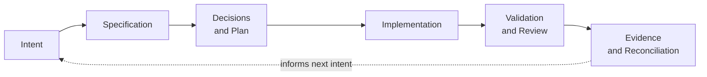
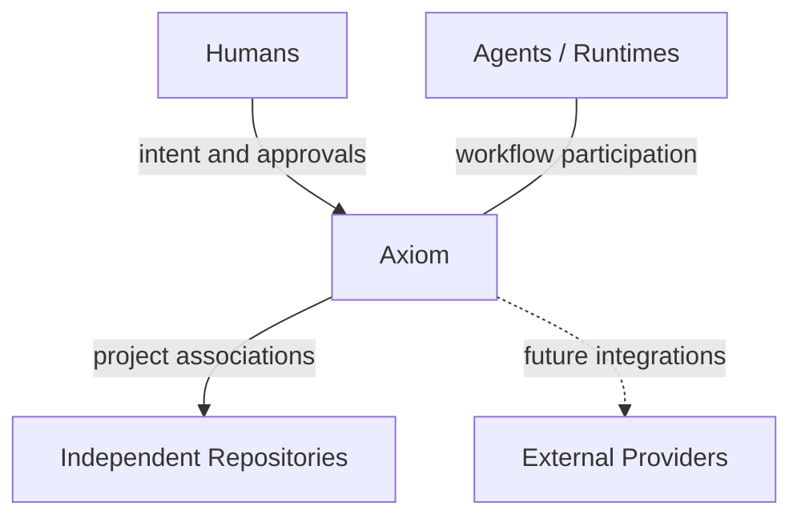

<p align="center">
  
</p>

<h1 align="center">Axiom</h1>

<p align="center"><strong>Keep intent, decisions, code, and evidence connected.</strong></p>

<p align="center">
  <a href="LICENSE"></a>
  <a href="go.mod"></a>
  <a href="https://github.com/rgomids/axiom/commits/main/"></a>
  <a href="https://github.com/rgomids/axiom/stargazers"></a>
</p>

Axiom is being built to connect software intent, architecture, implementation, and validation across human and AI work.

**Early development.** Explore the Codex harness and tested Go foundations today. Lingo, the planned local CLI, is not yet available.

<p align="center">
  <a href="#explore-axiom">Explore Axiom</a> ·
  <a href="docs/architecture/README.md">Architecture</a> ·
  <a href="docs/specifications/README.md">Specifications</a> ·
  <a href="#documentation">Documentation</a>
</p>

## What is Axiom?

AI agents help write code, but its rationale often stays in prompts, chats, and disconnected documents. Each handoff risks losing what was intended, decided, or verified.

Axiom aims to preserve those connections for developers and teams working across agents, repositories, and sessions.

Technically, it defines the domain, policies, and workflows for a development control plane. This repository exercises that approach through a Codex harness and Go implementation.

## Why Axiom?

- **Intent gets lost.** Specifications record outcomes, constraints, and acceptance criteria before code.
- **Context fragments.** A Project can relate independent repositories without treating any one repository as the whole project.
- **Decisions drift from implementation.** Plans and architecture decisions provide durable references for humans and agents.
- **Completion claims lack proof.** Validation and Evidence make results inspectable and reproducible.

Spec-Driven Development (SDD) connects the reason for a change to its implementation and acceptance evidence.

## Project status

**Available in this repository:**

- Codex-first harness: context, policies, skills, templates, and validation scripts.
- Go implementation of Project rules, application contracts, portable manifests, and local installation records, with tests.
- Versioned Specifications, architecture decisions, and implementation Evidence.

**Not available yet:** Lingo CLI, filesystem persistence, runtime adapters, and orchestration. There is no complete deployable application or implemented provider integration.

See the [roadmap](docs/product/roadmap.md) for direction and [Specifications](docs/specifications/README.md) for detailed scope and approval state.

## How Axiom works

Each step leaves context the next step can use:



Implementation happens through bounded Executions. Human approval gates material choices; Evidence supports acceptance and reconciles documentation with results. Today, humans and the harness conduct this workflow. Automated orchestration remains future work.

## Explore Axiom

Requirements: Git, Bash, standard POSIX utilities, and **Go 1.26 or later** for Go tests. The first Go run may download the dependency pinned in `go.mod`.

```bash
git clone https://github.com/rgomids/axiom.git
cd axiom
./scripts/validate-repository.sh .
go test ./...
```

The validator checks repository and harness structure, runs shell test suites, and scans for sensitive files. Go tests exercise the implemented foundations. No service starts.

Next, choose a path:

- **Explore the workflow:** read [AGENTS.md](AGENTS.md), then browse the [harness skills](.agents/skills/). Codex is needed to operate the harness, not to run the checks above.
- **Follow a feature:** open [Specifications](docs/specifications/README.md) and follow its Specification, Plan, Tasks, and Evidence.
- **Develop locally:** use [Getting Started](docs/development/getting-started.md) and the [command reference](docs/commands.md) for setup, offline validation, and build checks.

## Core concepts

Domain vocabulary; some concepts remain unimplemented.

| Concept | Meaning |
|---|---|
| [Project](docs/decisions/0001-project-is-not-repository.md) | A logical project boundary, distinct from a Repository; it may associate multiple independent repositories. |
| [Specification](docs/specifications/README.md) | Desired behavior, constraints, non-goals, and acceptance evidence. |
| [Architecture / ADR](docs/decisions/README.md) | System boundaries and durable decisions, including rationale, alternatives, and trade-offs. |
| [Execution](docs/architecture/conceptual-model.md#execution-and-proof) | A bounded attempt to perform work under known intent and approvals; its record model remains open. |
| [Evidence](docs/architecture/conceptual-model.md#execution-and-proof) | An inspectable observation supporting a claim: a test result, command outcome, diff, or review. |
| [Authority](docs/product/constitution.md) | Explicit permission and approval boundaries for actions; an AI proposal does not grant permission. |
| [Agent / Runtime](docs/architecture/conceptual-model.md#actors-and-external-boundaries) | An Agent participates in work; a Runtime provides its execution environment and capabilities. |
| [Lingo](docs/decisions/0003-lingo-as-axiom-local-control-plane.md) | The accepted direction for Axiom's local executable control plane; its CLI is not yet implemented. |

## Architecture

Axiom separates project intent and rules from execution tools and external providers. Lingo is intended to conduct local workflows while runtime and provider adapters stay at the boundary.

Simplified system context, showing the intended relationships rather than deployed integrations:



See [Architecture](docs/architecture/README.md), the [conceptual model](docs/architecture/conceptual-model.md), and [provider boundaries](docs/architecture/provider-boundaries.md) for details and open questions.

## Documentation

| Topic | Start here |
|---|---|
| Product | [Product Foundation](docs/product/foundation.md) · [Roadmap](docs/product/roadmap.md) |
| Documentation governance | [Canonical sources, lifecycle, and anti-drift rules](docs/documentation.md) |
| Principles | [Constitution](docs/product/constitution.md) |
| Architecture | [Architecture overview](docs/architecture/README.md) |
| Specifications | [Specifications and implementation evidence](docs/specifications/README.md) |
| Decisions | [Architecture Decision Records](docs/decisions/README.md) |
| Research | [Research index](docs/research/README.md) |
| Development | [Getting Started](docs/development/getting-started.md) · [Commands](docs/commands.md) |
| Community | [Contributing](CONTRIBUTING.md) · [Code of Conduct](CODE_OF_CONDUCT.md) · [Support](SUPPORT.md) |
| History | [Changelog](CHANGELOG.md) |
| Security | [Security policy](SECURITY.md) · [Repository security](docs/security/repository-security.md) |

[Notion discovery](https://app.notion.com/p/3b4e01f22626810791b4f9d016ab5979) provides background. Versioned repository artifacts carry technical decisions and implementation evidence; discovery does not imply approval.

## Repository structure

```text
.agents/       Codex harness: context, policies, skills, and templates
docs/          Product, architecture, specifications, decisions, and research
internal/      Go implementation and tests
scripts/       Repository, security, and architecture checks
experiments/   Bounded research and evaluation evidence
```

## Contributing

Read the [contribution guide](CONTRIBUTING.md) and [Code of Conduct](CODE_OF_CONDUCT.md). Use the [Issue forms](.github/ISSUE_TEMPLATE/) and [Pull Request template](.github/PULL_REQUEST_TEMPLATE.md). Follow the relevant Specification and approved scope, keep changes small, include reproducible validation, and update affected documentation. Material changes require explicit human approval.

Documentation improvements, reproducible bug reports, and reviews of Specifications are useful ways to contribute while the product takes shape.

## Security

Report suspected vulnerabilities privately using [SECURITY.md](SECURITY.md).

## License

Axiom is licensed under the Apache License 2.0 (SPDX: `Apache-2.0`). See [LICENSE](LICENSE) for the full text.
