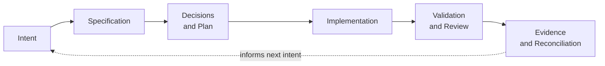
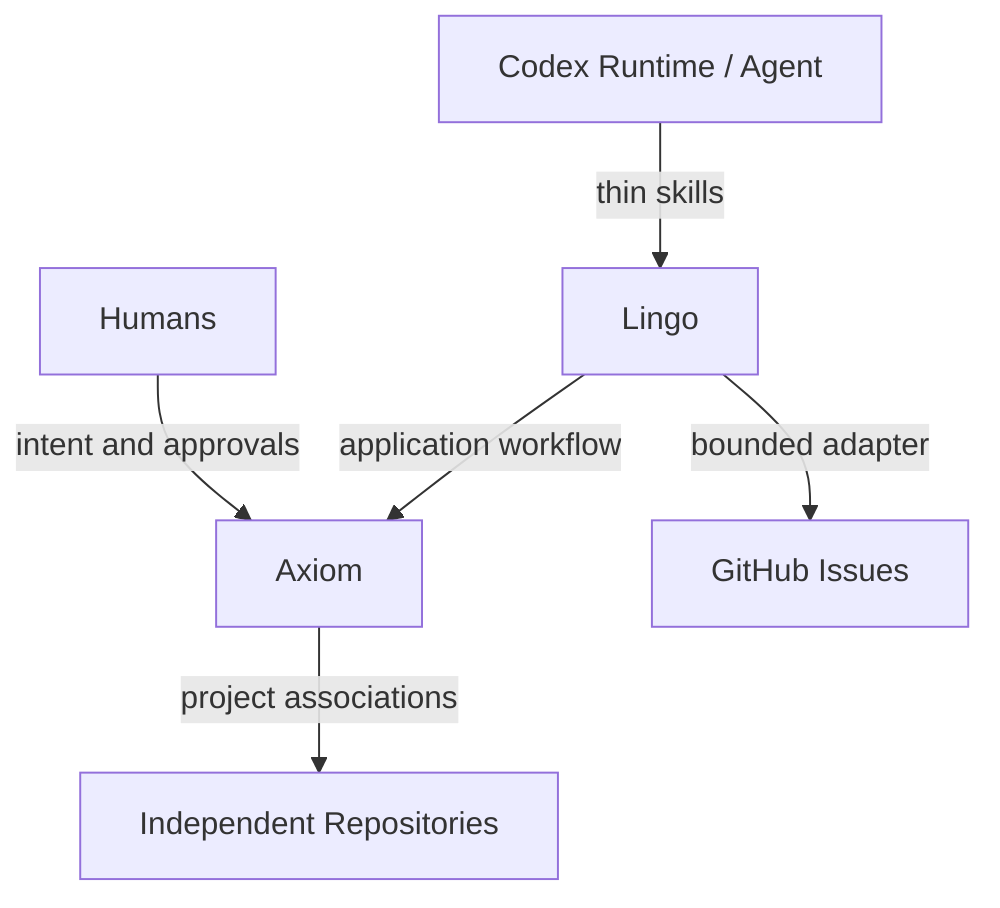

<p align="right">
  <strong>English</strong> | <a href="docs/README.pt-BR.md">Português (Brasil)</a>
</p>

<p align="center">
  
</p>

<h1 align="center">Axiom</h1>

<p align="center"><strong>Keep intent, decisions, code, and evidence connected.</strong></p>

<p align="center">
  <a href="LICENSE"></a>
  <a href="go.mod"></a>
  <a href="https://github.com/rgomids/axiom/commits/main/"></a>
  <a href="https://github.com/rgomids/axiom/stargazers"></a>
</p>

Axiom is a development control plane for keeping software intent,
architecture, implementation, validation, and operational evidence connected
across human and AI work.

## Why Axiom?

- **Intent gets lost.** Specifications preserve outcomes, constraints, and
  acceptance criteria before implementation.
- **Context fragments.** A Project can relate independent repositories without
  treating any one repository as the whole project.
- **Decisions drift from code.** Plans and architecture decisions give humans
  and agents durable references.
- **Completion claims lack proof.** Validation and Evidence make results
  inspectable and reproducible.

Spec-Driven Development connects the reason for a change to its implementation
and acceptance evidence.

## How Axiom works



Implementation proceeds through bounded Executions. Human approval gates
material choices. Evidence supports review and acceptance without replacing
human judgment.

## Project status

Axiom is under active development. This repository currently provides:

- a Codex-first harness with policies, skills, templates, and deterministic
  validation;
- a tested Go implementation of Project rules, portable and machine-local
  state, Codex Runtime installation, GitHub Work Items, and a bounded persistent
  Lingo workflow;
- canonical completion and provenance contracts, bounded detail artifacts, and
  fail-closed local publication and recovery foundations;
- versioned Specifications, architecture decisions, and implementation
  Evidence.

Current limitations include one supported Runtime (Codex), one Work Item
provider (GitHub Issues), and a sequential single-agent workflow. The
[roadmap](docs/product/roadmap.md) describes direction. The
[Specifications index](docs/specifications/README.md) owns detailed scope,
approval, implementation, and acceptance state.

## Explore Axiom

Requirements: Git, Bash, standard POSIX utilities, and Go 1.26 or later. The
first Go command may download the dependency pinned in `go.mod`.

```bash
git clone https://github.com/rgomids/axiom.git
cd axiom
./scripts/install-axiom.sh
export PATH="$HOME/.local/bin:$PATH"
lingo version
lingo first-run
lingo runtime codex install
./scripts/validate-repository.sh .
go test ./...
```

The installer never edits shell profiles. Use the
[Getting Started guide](docs/development/getting-started.md) for setup and the
[command reference](docs/commands.md) for validation, build, archive, and
dogfooding workflows.

## Core concepts

| Concept | Meaning |
|---|---|
| [Project](docs/decisions/0001-project-is-not-repository.md) | A logical project boundary, distinct from a Repository, that may associate multiple independent repositories. |
| [Specification](docs/specifications/README.md) | Desired behavior, constraints, non-goals, and acceptance evidence. |
| [Architecture / ADR](docs/decisions/README.md) | System boundaries and durable decisions with rationale and trade-offs. |
| [Execution](docs/architecture/conceptual-model.md#execution-and-proof) | A bounded attempt under known intent and approvals. |
| [Evidence](docs/architecture/conceptual-model.md#execution-and-proof) | An inspectable observation supporting a claim, such as a test, command result, diff, or review. |
| [Authority](docs/product/constitution.md) | Explicit permission and approval boundaries; a proposal does not grant authority. |
| [Agent / Runtime](docs/architecture/conceptual-model.md#actors-and-external-boundaries) | An Agent participates in work; a Runtime supplies its execution environment and capabilities. |
| [Lingo](docs/decisions/0003-lingo-as-axiom-local-control-plane.md) | Axiom's local executable control plane. |

## Architecture

Axiom separates product intent and domain rules from execution tools and
external providers. Lingo conducts local workflows while Runtime and Provider
adapters remain at the boundary.



See the [architecture overview](docs/architecture/README.md),
[conceptual model](docs/architecture/conceptual-model.md), and
[provider boundaries](docs/architecture/provider-boundaries.md).

## Documentation

| Topic | Start here |
|---|---|
| Product | [Product Foundation](docs/product/foundation.md) · [Roadmap](docs/product/roadmap.md) |
| Governance | [Documentation governance](docs/documentation.md) · [Constitution](docs/product/constitution.md) |
| Architecture | [Architecture overview](docs/architecture/README.md) · [ADRs](docs/decisions/README.md) |
| Delivery | [Specifications and Evidence](docs/specifications/README.md) |
| Research | [Research index](docs/research/README.md) |
| Development | [Getting Started](docs/development/getting-started.md) · [Commands](docs/commands.md) |
| Community | [Contributing](CONTRIBUTING.md) · [Code of Conduct](CODE_OF_CONDUCT.md) · [Support](SUPPORT.md) |
| Security | [Security policy](SECURITY.md) · [Repository security](docs/security/repository-security.md) |
| History | [Changelog](CHANGELOG.md) |

[Notion discovery](https://app.notion.com/p/3b4e01f22626810791b4f9d016ab5979)
provides product discovery and research context. Versioned repository artifacts
own technical contracts, decisions, and implementation evidence. Discovery does
not imply approval.

## Repository structure

```text
.agents/   Codex harness: context, policies, skills, and templates
docs/      Product, architecture, specifications, decisions, and research
internal/  Go implementation and tests
scripts/   Repository, security, release, and validation tooling
```

## Contributing

Read [CONTRIBUTING.md](CONTRIBUTING.md) and the
[Code of Conduct](CODE_OF_CONDUCT.md). Use the repository's Issue forms and
Pull Request template, follow approved scope, keep changes small, include
reproducible validation, and reconcile affected documentation. Material changes
require explicit human approval.

## Security

Report suspected vulnerabilities privately through [SECURITY.md](SECURITY.md).

## License

Axiom is licensed under the Apache License 2.0. See [LICENSE](LICENSE).
