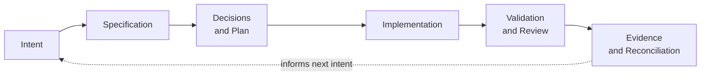
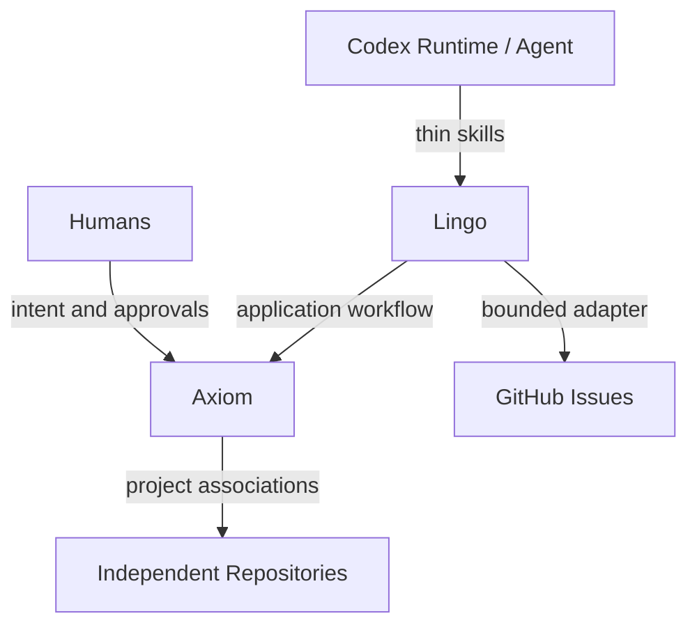

<p align="right">
  <strong>English</strong> | <a href="docs/README.pt-BR.md">Português (Brasil)</a>
</p>

<p align="center">
  
</p>

<h1 align="center">Axiom</h1>

<p align="center"><strong>Keep intent, decisions, code, and evidence connected.</strong></p>

<p align="center">
  <a href="LICENSE"></a>
  <a href="go.mod"></a>
  <a href="https://github.com/rgomids/axiom/commits/main/"></a>
  <a href="https://github.com/rgomids/axiom/stargazers"></a>
</p>

Axiom is a development control plane for keeping software intent,
architecture, implementation, validation, and operational evidence connected
across human and AI work.

## Why Axiom?

- **Intent gets lost.** Specifications preserve outcomes, constraints, and
  acceptance criteria before implementation.
- **Context fragments.** A Project can relate independent repositories without
  treating any one repository as the whole project.
- **Decisions drift from code.** Plans and architecture decisions give humans
  and agents durable references.
- **Completion claims lack proof.** Validation and Evidence make results
  inspectable and reproducible.

Spec-Driven Development connects the reason for a change to its implementation
and acceptance evidence.

## Getting Started

Using Axiom needs no clone, Go toolchain, or build. To work on Axiom itself,
see [Developing Axiom](#developing-axiom).

### 1. Install

On **Linux or macOS**:

```bash
curl -fsSL https://raw.githubusercontent.com/rgomids/axiom/main/scripts/install.sh | sh
```

The installer resolves the latest stable release, downloads the archive for
your host, verifies its SHA-256 checksum before extracting anything, and
installs `axiom` into `$HOME/.local/bin`. It never uses `sudo`, edits shell
profiles, installs Runtimes, or touches credentials.

Installer eligibility on POSIX is based on OS family and architecture: macOS on
arm64, and Linux on amd64 or arm64. The numeric OS version is not an
installation filter. Other hosts are refused before any download. The installer
needs `curl`, `tar`, `bash`, `awk`, `grep`, `mktemp`, and `sha256sum` or
`shasum`. Axiom's maintenance commitment covers vendor-maintained OS versions,
and exact validated environments are recorded as Evidence
([ADR-0015](docs/decisions/0015-installer-host-eligibility-os-family-architecture.md)).

If the final summary shows `PATH setup required`, put the binary directory on `PATH`:

```bash
export PATH="$HOME/.local/bin:$PATH"
```

To install an exact release instead, pass `--version`:

```bash
curl -fsSL https://raw.githubusercontent.com/rgomids/axiom/main/scripts/install.sh | sh -s -- --version v0.1.0
```

On a **Windows client edition, amd64** (Windows Server is not supported), use
64-bit PowerShell 5.1 or later; the numeric Windows version is not an
installation filter. No WSL, Bash, Go toolchain, or administrator privileges are required:

```powershell
Invoke-RestMethod https://raw.githubusercontent.com/rgomids/axiom/main/scripts/install.ps1 | Invoke-Expression
$env:PATH = "$env:LOCALAPPDATA\Axiom\bin;$env:PATH"
```

To install an exact Windows release, use one PowerShell command:

```powershell
& ([scriptblock]::Create((Invoke-RestMethod https://raw.githubusercontent.com/rgomids/axiom/main/scripts/install.ps1))) -Version v0.1.0
```

If you need to inspect or retain the bootstrap before running it, download it
first instead:

```powershell
Invoke-WebRequest https://raw.githubusercontent.com/rgomids/axiom/main/scripts/install.ps1 -OutFile install-axiom.ps1
.\install-axiom.ps1
```

The PowerShell installer verifies the Windows release checksum and installs
`axiom.exe` into `%LOCALAPPDATA%\Axiom\bin`, with its receipt in
`%LOCALAPPDATA%\Axiom\install`. The `PATH` command above affects only the current
terminal; the installer never edits your profile or persistent `PATH`.
Use `-Version` with an exact published tag to pin a release, or `-BinDir` and
`-ReceiptDir` to choose absolute local directories. Re-running upgrades an
Axiom-owned installation; foreign or modified binaries are preserved. Close
running Axiom processes before upgrading. Older releases without a Windows
asset cannot be installed on Windows.

Windows storage must be local NTFS. Network paths, junctions/reparse points and
directories accessible to other untrusted accounts are refused. State defaults
to `%LOCALAPPDATA%\Axiom\state`; Runtime skills stay in the user-global roots
listed below. Organization application-control and PowerShell policies still
apply; the installer does not bypass them. See the
[Windows installation reference](docs/commands.md#windows-native-installation).

### 2. Verify

```bash
axiom version
axiom help
```

`axiom version` reports the installed version and revision; `axiom help` lists
the available commands.

### 3. First run

```bash
axiom first-run
```

`first-run` looks for supported Runtimes by their executables on your `PATH`
and installs or upgrades Axiom's user-global skills for each one it finds. It is
safe to rerun. When no Runtime is found it reports that and exits successfully;
install the Runtime yourself, make sure it is on `PATH`, and run `first-run`
again. It never installs a Runtime, signs you in, reads or changes
credentials, or infers a Project.

| Runtime | Detected by | Skills installed into |
|---|---|---|
| Codex | `codex` on `PATH` | `$HOME/.agents/skills` |
| Claude | `claude` on `PATH` | `<CLAUDE_CONFIG_DIR or ~/.claude>/skills` |

Inspect one integration with `axiom runtime codex status` or
`axiom runtime claude status`.

### 4. Available skills

After `first-run`, these skills are available in each configured Runtime:

| Skill | Use it to |
|---|---|
| `axiom-project-configure` | Configure a Project and its local Repository associations. |
| `axiom-project-list` | List configured Projects from any directory. |
| `axiom-project-show` | Inspect or resolve a configured Project from any directory. |
| `axiom-work-item-create` | Create or select a GitHub-backed Work Item. |
| `axiom-work-item-run` | Start or resume the bounded delivery workflow for a Work Item. |
| `axiom-work-item-status` | Inspect Work Item workflow status and Evidence. |

Invoke them by name:

```text
Codex:  $axiom-project-configure
Claude: /axiom-project-configure
```

Each skill calls the `axiom` CLI, which keeps validation and the authority for
every local or external change.

### 5. First workflow

```text
install Axiom → axiom version → axiom first-run
  → configure a Project → inspect the Project
  → create a Work Item → start and inspect its workflow
```

The same path from the CLI. `project configure` and `work-item create` are
guided: they ask for missing values, preview the exact change, and write nothing
until you answer `yes`.

```bash
# Configure a Project: slug, name, Repository key=absolute-path, provider
axiom project configure

# List configured Projects from any directory
axiom project list

# Inspect it from any directory
axiom project show --selector my-project

# Create a Work Item as a GitHub Issue (uses your authenticated gh CLI)
axiom work-item create --project my-project --repository main \
  --provider-repository owner/repository

# Start the workflow for Issue #123 and check its status
axiom workflow start --project my-project --repository main --number 123
axiom workflow status --project my-project --repository main --number 123
```

Replace `my-project`, `main`, `owner/repository`, and `123` with your own
values. GitHub Issues is currently the only Work Item provider; Axiom uses the
existing [GitHub CLI](https://cli.github.com/) session and never stores its
credential.

### 6. Next steps

- [Command reference](docs/commands.md): every command, including
  [first-run](docs/commands.md#first-run-and-runtime-integrations),
  [installation options](docs/commands.md#install-a-published-release-s9t39),
  [Projects](docs/commands.md#configure-a-project),
  [Work Items](docs/commands.md#github-work-items), and the
  [workflow](docs/commands.md#execute-the-bounded-workflow).
- [Architecture overview](docs/architecture/README.md) and
  [conceptual model](docs/architecture/conceptual-model.md).
- [Specifications](docs/specifications/README.md) for detailed scope and
  acceptance state.
- [Roadmap](docs/product/roadmap.md) for direction.
- [Developing Axiom](#developing-axiom) to build, test, or contribute.

## How Axiom works


```mermaid
flowchart LR
    I["Intent"] --> S["Specification"]
    S --> P["Decisions<br/>and Plan"]
    P --> X["Implementation"]
    X --> V["Validation<br/>and Review"]
    V --> E["Evidence<br/>and Reconciliation"]
    E -. informs next intent .-> I
```

Implementation proceeds through bounded Executions. Human approval gates
material choices. Evidence supports review and acceptance without replacing
human judgment.

## Project status

Axiom is under active development. This repository currently provides:

- a Codex-first harness with policies, skills, templates, and deterministic
  validation;
- a tested Go implementation of Project rules, portable and machine-local
  state, Codex Runtime installation, GitHub Work Items, and a bounded persistent
  Lingo workflow;
- canonical completion and provenance contracts, bounded detail artifacts, and
  fail-closed local publication and recovery foundations;
- versioned Specifications, architecture decisions, and implementation
  Evidence.

Current limitations include two supported Runtime integrations (Codex and
Claude, configured by `axiom first-run`), one Work Item provider (GitHub
Issues), and a sequential single-agent workflow. The
[roadmap](docs/product/roadmap.md) describes direction. The
[Specifications index](docs/specifications/README.md) owns detailed scope,
approval, implementation, and acceptance state.

## Core concepts

| Concept | Meaning |
|---|---|
| [Project](docs/decisions/0001-project-is-not-repository.md) | A logical project boundary, distinct from a Repository, that may associate multiple independent repositories. |
| [Specification](docs/specifications/README.md) | Desired behavior, constraints, non-goals, and acceptance evidence. |
| [Architecture / ADR](docs/decisions/README.md) | System boundaries and durable decisions with rationale and trade-offs. |
| [Execution](docs/architecture/conceptual-model.md#execution-and-proof) | A bounded attempt under known intent and approvals. |
| [Evidence](docs/architecture/conceptual-model.md#execution-and-proof) | An inspectable observation supporting a claim, such as a test, command result, diff, or review. |
| [Authority](docs/product/constitution.md) | Explicit permission and approval boundaries; a proposal does not grant authority. |
| [Agent / Runtime](docs/architecture/conceptual-model.md#actors-and-external-boundaries) | An Agent participates in work; a Runtime supplies its execution environment and capabilities. |
| [Lingo](docs/decisions/0003-lingo-as-axiom-local-control-plane.md) | Axiom's local executable control plane. |

## Architecture

Axiom separates product intent and domain rules from execution tools and
external providers. Lingo conducts local workflows while Runtime and Provider
adapters remain at the boundary.


```mermaid
flowchart TB
    H["Humans"] -->|intent and approvals| A["Axiom"]
    R["Codex Runtime / Agent"] -->|thin skills| L["Lingo"]
    L -->|application workflow| A
    A -->|project associations| G["Independent Repositories"]
    L -->|bounded adapter| P["GitHub Issues"]
```

See the [architecture overview](docs/architecture/README.md),
[conceptual model](docs/architecture/conceptual-model.md), and
[provider boundaries](docs/architecture/provider-boundaries.md).

## Documentation

| Topic | Start here |
|---|---|
| Using Axiom | [Getting Started](#getting-started) · [Command reference](docs/commands.md) |
| Product | [Product Foundation](docs/product/foundation.md) · [Roadmap](docs/product/roadmap.md) |
| Governance | [Documentation governance](docs/documentation.md) · [Constitution](docs/product/constitution.md) |
| Architecture | [Architecture overview](docs/architecture/README.md) · [ADRs](docs/decisions/README.md) |
| Delivery | [Specifications and Evidence](docs/specifications/README.md) |
| Research | [Research index](docs/research/README.md) |
| Development | [Developing Axiom](#developing-axiom) · [Development setup](docs/development/getting-started.md) · [Commands](docs/commands.md) · [Development and release flow](CONTRIBUTING.md#development-flow) |
| Community | [Contributing](CONTRIBUTING.md) · [Code of Conduct](CODE_OF_CONDUCT.md) · [Support](SUPPORT.md) |
| Security | [Security policy](SECURITY.md) · [Repository security](docs/security/repository-security.md) |
| History | [Changelog](CHANGELOG.md) |

[Notion discovery](https://app.notion.com/p/3b4e01f22626810791b4f9d016ab5979)
provides product discovery and research context. Versioned repository artifacts
own technical contracts, decisions, and implementation evidence. Discovery does
not imply approval.

## Developing Axiom

This section is for working on Axiom itself; it is not required to use it.
Requirements: Git, Bash, standard POSIX utilities, and Go 1.26 or later. The
first Go command may download the dependency pinned in `go.mod`.

```bash
git clone https://github.com/rgomids/axiom.git
cd axiom
./scripts/install-axiom.sh
export PATH="$HOME/.local/bin:$PATH"
axiom version
axiom first-run
./scripts/validate-repository.sh .
go test ./...
```

`./scripts/install-axiom.sh` installs a development build from the checkout and
never edits shell profiles. Use the
[development Getting Started guide](docs/development/getting-started.md) for
setup and the [command reference](docs/commands.md) for validation, build,
archive, and dogfooding workflows.

On Windows, build and run directly from PowerShell with Git and Go 1.26+:

```powershell
go build -o .\bin\axiom.exe ./cmd/lingo
.\bin\axiom.exe version
go test ./...
.\scripts\test-windows-install.ps1
```

The Bash repository/release maintenance scripts run in the Linux/macOS CI jobs;
the Windows CI job exercises native Go tests and the PowerShell installer.

## Repository structure

```text
.agents/   Codex harness: context, policies, skills, and templates
docs/      Product, architecture, specifications, decisions, and research
internal/  Go implementation and tests
scripts/   Repository, security, release, and validation tooling
site/      Public landing page published to GitHub Pages
```

## Website

The public landing page is published from `site/` to
<https://rgomids.github.io/axiom/> by `.github/workflows/deploy-landpage.yml`,
which uploads that directory verbatim on every push to `main`.

To work on it locally:

```bash
python3 -m http.server 8000 --directory site
```

Then open <http://localhost:8000/>. The identity assets are loaded from their
canonical location under `docs/assets/` through absolute raw URLs, so they are
never copied into `site/`.

## Contributing

Read [CONTRIBUTING.md](CONTRIBUTING.md) and the
[Code of Conduct](CODE_OF_CONDUCT.md). Use the repository's Issue forms and
Pull Request template, follow approved scope, keep changes small, include
reproducible validation, and reconcile affected documentation. Material changes
require explicit human approval.

## Security

Report suspected vulnerabilities privately through [SECURITY.md](SECURITY.md).

## License

Axiom is licensed under the Apache License 2.0. See [LICENSE](LICENSE).
