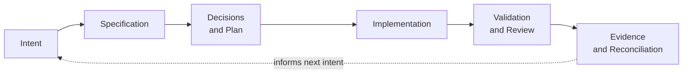
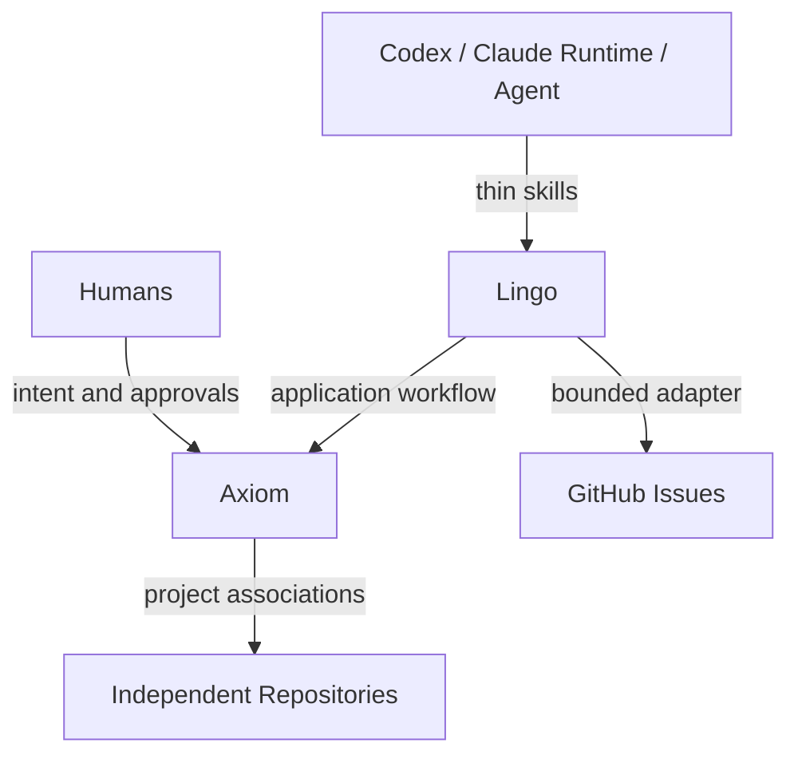

<p align="right">
  <strong>English</strong> | <a href="docs/README.pt-BR.md">Português (Brasil)</a>
</p>

<p align="center">
  
</p>

<h1 align="center">Axiom</h1>

<p align="center"><strong>Keep intent, decisions, code, and evidence connected.</strong></p>

<p align="center">
  <a href="LICENSE"></a>
  <a href="go.mod"></a>
  <a href="https://github.com/rgomids/axiom/commits/main/"></a>
  <a href="https://github.com/rgomids/axiom/stargazers"></a>
</p>

Axiom is a development control plane for keeping software intent,
architecture, implementation, validation, and operational evidence connected
across human and AI work.

## Why Axiom?

- **Intent gets lost.** Specifications preserve outcomes, constraints, and
  acceptance criteria before implementation.
- **Context fragments.** A Project can relate independent repositories without
  treating any one repository as the whole project.
- **Decisions drift from code.** Plans and architecture decisions give humans
  and agents durable references.
- **Completion claims lack proof.** Validation and Evidence make results
  inspectable and reproducible.

Spec-Driven Development connects the reason for a change to its implementation
and acceptance evidence.

## Getting Started

Using Axiom needs no clone, Go toolchain, or build.

### 1. Install

Install the **latest stable release** on **Linux or macOS**:

```bash
curl -fsSL https://raw.githubusercontent.com/rgomids/axiom/main/scripts/install.sh | sh
```

On **Windows** (64-bit PowerShell):

```powershell
& ([scriptblock]::Create((Invoke-RestMethod https://raw.githubusercontent.com/rgomids/axiom/main/scripts/install.ps1)))
```

The Windows bootstrap verifies the installed binary, configures detected Runtime
skills and updates this terminal's PATH and the persistent user PATH. Fresh installs use private profile
storage. If existing standard Runtime directories need permission repair, it
shows the exact changes and asks for approval before applying them. See
[Windows onboarding and recovery](docs/installation.md#windows).

For prerequisites, platforms, PATH, upgrades, and diagnostics, see the
[installation guide](docs/installation.md).

### 2. Verify

```bash
axiom version
axiom help
```

### 3. First run

```bash
axiom first-run
```

This configures Axiom's global skills for Codex and Claude found on `PATH`.
It does not install Runtimes or sign you in. With no Runtime it succeeds;
install one separately and rerun when needed.

### 4. First workflow

Configure a Project, inspect it, create a Work Item, and start its workflow:

```bash
axiom project configure
axiom project list
axiom project show --selector my-project
axiom work-item create --project my-project --repository main \
  --provider-repository owner/repository
axiom workflow start --project my-project --repository main --number 123
axiom workflow status --project my-project --repository main --number 123
```

Replace `my-project`, `main`, `owner/repository`, and `123` with your
configured values and the created Issue number. Configure the GitHub provider
in the Project; Work Item operations require an authenticated
[GitHub CLI](https://cli.github.com/). Guided configuration and creation show a
preview and ask for confirmation before writing.

You can also invoke skills: `$axiom-project` in Codex or
`/axiom-project` in Claude. See [skills and Runtimes](docs/commands.md#first-run-and-runtime-integrations)
and the [command reference](docs/commands.md) for details.

## How Axiom works


```mermaid
flowchart LR
    I["Intent"] --> S["Specification"]
    S --> P["Decisions<br/>and Plan"]
    P --> X["Implementation"]
    X --> V["Validation<br/>and Review"]
    V --> E["Evidence<br/>and Reconciliation"]
    E -. informs next intent .-> I
```

Implementation proceeds through bounded Executions. Human approval gates
material choices. Evidence supports review and acceptance without replacing
human judgment.

## Project status

Axiom is under active development. Published availability and human acceptance
are separate decisions.

- **Latest stable release:** [GitHub Releases](https://github.com/rgomids/axiom/releases/latest).
  The published v0.4.2 baseline includes the capabilities below; the installer
  resolves latest stable automatically.
- **Available today / stable:** checksum-verified Linux, macOS, and Windows
  distribution; guided Project configuration, listing, and resolution;
  GitHub Work Item creation and classification; Codex/Claude bootstrap;
  persistent workflow, Evidence, recovery, and owned-install upgrades.
  This includes foundations for multi-runtime and bounded multi-agent execution
  with an Execution Graph; [S8 Evidence](docs/specifications/004-mvp-v1-baseline/evidence-s8.md)
  records scope and limitations without establishing full MVP human acceptance.
- **On main:** Work Item creation interviews from minimal intent, with
  conversational elaboration through the Runtime skill and plain CLI questions.
  This enhancement is not yet part of the v0.4.2 baseline.
- **Roadmap / upcoming:** additional Runtimes/adapters, dynamic or distributed
  orchestration, and token/cost budget governance require their own
  specification and authority.

See [Changelog](CHANGELOG.md), [Specifications](docs/specifications/README.md),
and [Roadmap](docs/product/roadmap.md) for history, Evidence, acceptance, and direction.

## Core concepts

| Concept | Meaning |
|---|---|
| [Project](docs/decisions/0001-project-is-not-repository.md) | A logical project boundary, distinct from a Repository, that may associate multiple independent repositories. |
| [Specification](docs/specifications/README.md) | Desired behavior, constraints, non-goals, and acceptance evidence. |
| [Architecture / ADR](docs/decisions/README.md) | System boundaries and durable decisions with rationale and trade-offs. |
| [Execution](docs/architecture/conceptual-model.md#execution-and-proof) | A bounded attempt under known intent and approvals. |
| [Evidence](docs/architecture/conceptual-model.md#execution-and-proof) | An inspectable observation supporting a claim, such as a test, command result, diff, or review. |
| [Authority](docs/product/constitution.md) | Explicit permission and approval boundaries; a proposal does not grant authority. |
| [Agent / Runtime](docs/architecture/conceptual-model.md#actors-and-external-boundaries) | An Agent participates in work; a Runtime supplies its execution environment and capabilities. |
| [Lingo](docs/decisions/0003-lingo-as-axiom-local-control-plane.md) | Axiom's local executable control plane. |

## Architecture

Axiom separates product intent and domain rules from execution tools and
external providers. Lingo conducts local workflows while Runtime and Provider
adapters remain at the boundary.


```mermaid
flowchart TB
    H["Humans"] -->|intent and approvals| A["Axiom"]
    R["Codex / Claude Runtime / Agent"] -->|thin skills| L["Lingo"]
    L -->|application workflow| A
    A -->|project associations| G["Independent Repositories"]
    L -->|bounded adapter| P["GitHub Issues"]
```

See the [architecture overview](docs/architecture/README.md),
[conceptual model](docs/architecture/conceptual-model.md), and
[provider boundaries](docs/architecture/provider-boundaries.md).

## Documentation

| Topic | Start here |
|---|---|
| Using Axiom | [Getting Started](#getting-started) · [Installation](docs/installation.md) · [Command reference](docs/commands.md) |
| Product | [Product Foundation](docs/product/foundation.md) · [Roadmap](docs/product/roadmap.md) |
| Governance | [Documentation governance](docs/documentation.md) · [Constitution](docs/product/constitution.md) |
| Architecture | [Architecture overview](docs/architecture/README.md) · [ADRs](docs/decisions/README.md) |
| Delivery | [Specifications and Evidence](docs/specifications/README.md) |
| Research | [Research index](docs/research/README.md) |
| Development | [Developing Axiom](#developing-axiom) · [Development setup](docs/development/getting-started.md) · [Commands](docs/commands.md) · [Development and release flow](CONTRIBUTING.md#development-flow) |
| Community | [Contributing](CONTRIBUTING.md) · [Code of Conduct](CODE_OF_CONDUCT.md) · [Support](SUPPORT.md) |
| Security | [Security policy](SECURITY.md) · [Repository security](docs/security/repository-security.md) |
| History | [Changelog](CHANGELOG.md) |

[GitHub Wiki](https://github.com/rgomids/axiom/wiki) provides public product
documentation, concepts, and user-oriented navigation. Versioned repository
artifacts own technical contracts, decisions, implementation evidence, and
references that must evolve with code. Discovery does not imply approval.

## Developing Axiom

To work on Axiom itself: Git, Bash, standard POSIX utilities, and Go 1.26+.

```bash
git clone https://github.com/rgomids/axiom.git
cd axiom
./scripts/install-axiom.sh
./scripts/validate-repository.sh .
go test ./...
```

The script installs a development build from the checkout. See
[development setup](docs/development/getting-started.md) and the
[command reference](docs/commands.md) for build, Windows, and dogfooding details.

## Website

Explore the [Axiom website](https://rgomids.github.io/axiom/).

## Contributing

Read [CONTRIBUTING.md](CONTRIBUTING.md) and the
[Code of Conduct](CODE_OF_CONDUCT.md). Use the repository's Issue forms and
Pull Request template, follow approved scope, keep changes small, include
reproducible validation, and reconcile affected documentation. Material changes
require explicit human approval.

## Security

Report suspected vulnerabilities privately through [SECURITY.md](SECURITY.md).

## License

Axiom is licensed under the Apache License 2.0. See [LICENSE](LICENSE).
