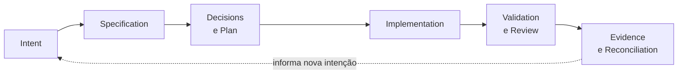
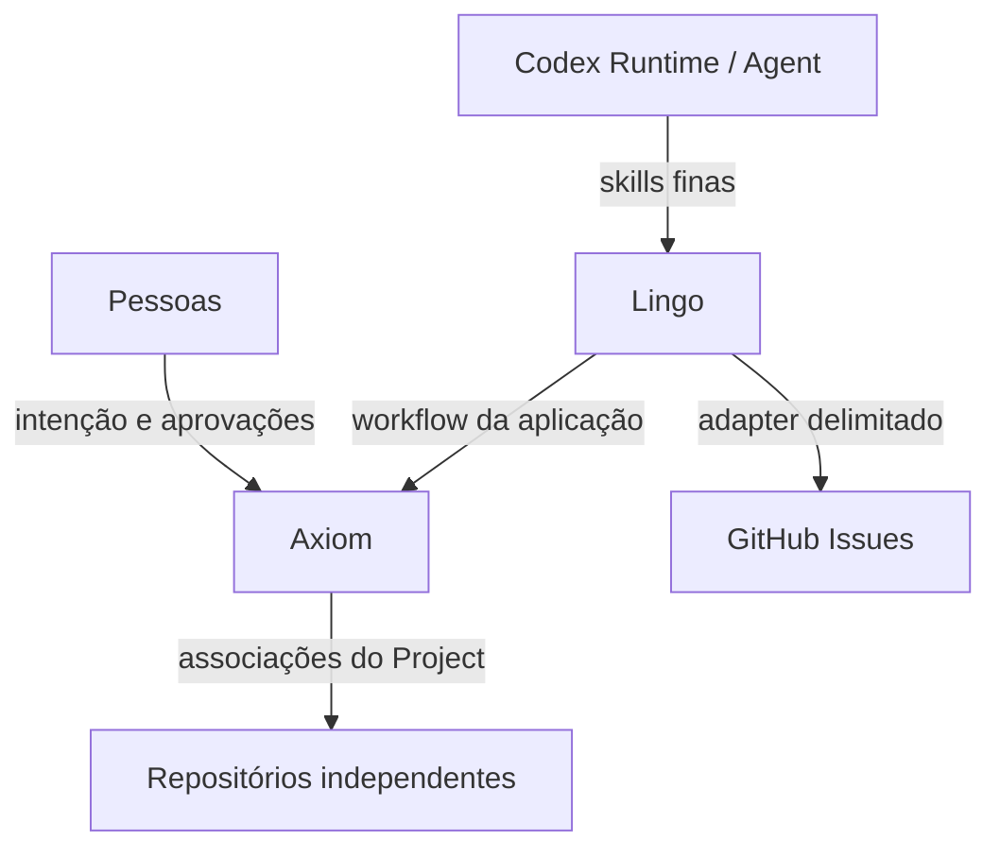

<p align="right">
  <a href="../README.md">English</a> | <strong>Português (Brasil)</strong>
</p>

<p align="center">
  
</p>

<h1 align="center">Axiom</h1>

<p align="center"><strong>Mantenha intenção, decisões, código e evidências conectados.</strong></p>

<p align="center">
  <a href="../LICENSE"></a>
  <a href="../go.mod"></a>
  <a href="https://github.com/rgomids/axiom/commits/main/"></a>
  <a href="https://github.com/rgomids/axiom/stargazers"></a>
</p>

Axiom é um control plane de desenvolvimento que mantém intenção de software,
arquitetura, implementação, validação e evidências operacionais conectadas no
trabalho entre pessoas e IA.

## Por que Axiom?

- **A intenção se perde.** Specifications preservam resultados, restrições e
  critérios de aceite antes da implementação.
- **O contexto se fragmenta.** Um Project pode relacionar repositórios
  independentes sem tratar um deles como o projeto inteiro.
- **As decisões se afastam do código.** Plans e decisões de arquitetura
  fornecem referências duráveis para pessoas e agentes.
- **Declarações de conclusão carecem de provas.** Validação e Evidence tornam os
  resultados inspecionáveis e reproduzíveis.

Spec-Driven Development conecta a razão de uma mudança à implementação e às
evidências de aceite.

## Como o Axiom funciona



A implementação ocorre por Executions delimitadas. Aprovações humanas
controlam escolhas materiais. Evidence apoia revisão e aceite sem substituir o
julgamento humano.

## Estado do projeto

Axiom está em desenvolvimento ativo. Este repositório oferece atualmente:

- um harness Codex-first com policies, skills, templates e validação
  determinística;
- uma implementação Go testada para regras de Project, estado portátil e local,
  instalação do Codex Runtime, GitHub Work Items e um workflow Lingo persistente
  e delimitado;
- contratos canônicos de conclusão e proveniência, detail artifacts limitados e
  fundamentos fail-closed para publicação e recuperação local;
- Specifications, decisões de arquitetura e Evidence de implementação
  versionadas.

As limitações atuais incluem um Runtime suportado (Codex), um Work Item provider
(GitHub Issues) e um workflow sequencial executado por um único agente. O
[roadmap](product/roadmap.md) descreve a direção. O
[índice de Specifications](specifications/README.md) é responsável pelo
estado detalhado de escopo, aprovação, implementação e aceite.

## Explore o Axiom

Requisitos: Git, Bash, utilitários POSIX padrão e Go 1.26 ou posterior. O
primeiro comando Go pode baixar a dependência fixada em `go.mod`.

```bash
git clone https://github.com/rgomids/axiom.git
cd axiom
./scripts/install-axiom.sh
export PATH="$HOME/.local/bin:$PATH"
lingo version
lingo first-run
lingo runtime codex install
./scripts/validate-repository.sh .
go test ./...
```

O instalador nunca edita perfis de shell. Consulte o
[guia Getting Started](development/getting-started.md) para configuração e a
[referência de comandos](commands.md) para validação, build, archives e
fluxos de dogfooding.

## Conceitos centrais

| Conceito | Significado |
|---|---|
| [Project](decisions/0001-project-is-not-repository.md) | Limite lógico de projeto, distinto de Repository, que pode associar vários repositórios independentes. |
| [Specification](specifications/README.md) | Comportamento desejado, restrições, não objetivos e evidências de aceite. |
| [Architecture / ADR](decisions/README.md) | Limites do sistema e decisões duráveis com justificativas e trade-offs. |
| [Execution](architecture/conceptual-model.md#execution-and-proof) | Tentativa delimitada sob intenção e aprovações conhecidas. |
| [Evidence](architecture/conceptual-model.md#execution-and-proof) | Observação inspecionável que sustenta uma afirmação, como teste, resultado de comando, diff ou revisão. |
| [Authority](product/constitution.md) | Limites explícitos de permissão e aprovação; uma proposta não concede authority. |
| [Agent / Runtime](architecture/conceptual-model.md#actors-and-external-boundaries) | Um Agent participa do trabalho; um Runtime fornece seu ambiente e capacidades de execução. |
| [Lingo](decisions/0003-lingo-as-axiom-local-control-plane.md) | Control plane executável local do Axiom. |

## Arquitetura

Axiom separa intenção de produto e regras de domínio das ferramentas de execução
e providers externos. Lingo conduz workflows locais enquanto adapters de Runtime
e Provider permanecem na borda.



Consulte a [visão geral da arquitetura](architecture/README.md), o
[modelo conceitual](architecture/conceptual-model.md) e os
[limites de providers](architecture/provider-boundaries.md).

## Documentação

| Tema | Comece aqui |
|---|---|
| Produto | [Product Foundation](product/foundation.md) · [Roadmap](product/roadmap.md) |
| Governança | [Governança de documentação](documentation.md) · [Constitution](product/constitution.md) |
| Arquitetura | [Visão geral](architecture/README.md) · [ADRs](decisions/README.md) |
| Entrega | [Specifications e Evidence](specifications/README.md) |
| Pesquisa | [Índice de pesquisa](research/README.md) |
| Desenvolvimento | [Getting Started](development/getting-started.md) · [Comandos](commands.md) |
| Site | [Landing page](https://rgomids.github.io/axiom/) · [Desenvolvimento local](#site) · [Evidence de aceitação](product/evidence-landing-page.md) |
| Comunidade | [Contribuição](../CONTRIBUTING.md) · [Código de Conduta](../CODE_OF_CONDUCT.md) · [Suporte](../SUPPORT.md) |
| Segurança | [Política de segurança](../SECURITY.md) · [Segurança do repositório](security/repository-security.md) |
| Histórico | [Changelog](../CHANGELOG.md) |

O [discovery no Notion](https://app.notion.com/p/3b4e01f22626810791b4f9d016ab5979)
fornece contexto de discovery de produto e pesquisa. Artefatos versionados do
repositório são responsáveis por contratos técnicos, decisões e Evidence de
implementação. Discovery não implica aprovação.

## Site

A landing page pública é publicada em <https://rgomids.github.io/axiom/>. Ela é
servida a partir de [`site/`](../site/) pelo
[workflow do Pages](../.github/workflows/deploy-landpage.yml) a cada push em `main`
que altere esses arquivos.

Para servi-la localmente, use qualquer servidor estático:

```bash
python3 -m http.server 8000 --directory site
```

Depois abra <http://localhost:8000>.

Os assets de identidade não são duplicados em `site/`. `docs/assets/` continua
sendo a única localização versionada deles, e a página os carrega pelas URLs
absolutas
`https://raw.githubusercontent.com/rgomids/axiom/main/docs/assets/axiom-logo.png`
e `.../axiom-logo-github.png`, de modo que o servidor local renderiza exatamente o
mesmo que o GitHub Pages. Verificações reproduzíveis:
[`./scripts/validate-landing-page.sh .`](../scripts/validate-landing-page.sh) e a
[Evidence da landing page](product/evidence-landing-page.md).

## Estrutura do repositório

```text
.agents/   Harness Codex: contexto, policies, skills e templates
docs/      Produto, arquitetura, specifications, decisões e pesquisa
internal/  Implementação Go e testes
scripts/   Ferramentas de repositório, segurança, release e validação
site/      Landing page pública publicada no GitHub Pages
```

## Como contribuir

Leia [CONTRIBUTING.md](../CONTRIBUTING.md) e o
[Código de Conduta](../CODE_OF_CONDUCT.md). Use os formulários de Issue e o template
de Pull Request do repositório, siga o escopo aprovado, mantenha mudanças
pequenas, inclua validação reproduzível e reconcilie a documentação afetada.
Mudanças materiais exigem aprovação humana explícita.

## Segurança

Relate suspeitas de vulnerabilidade de forma privada por
[SECURITY.md](../SECURITY.md).

## Licença

Axiom é licenciado sob Apache License 2.0. Consulte [LICENSE](../LICENSE).
