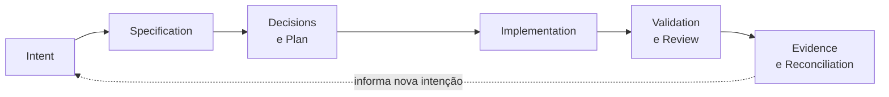
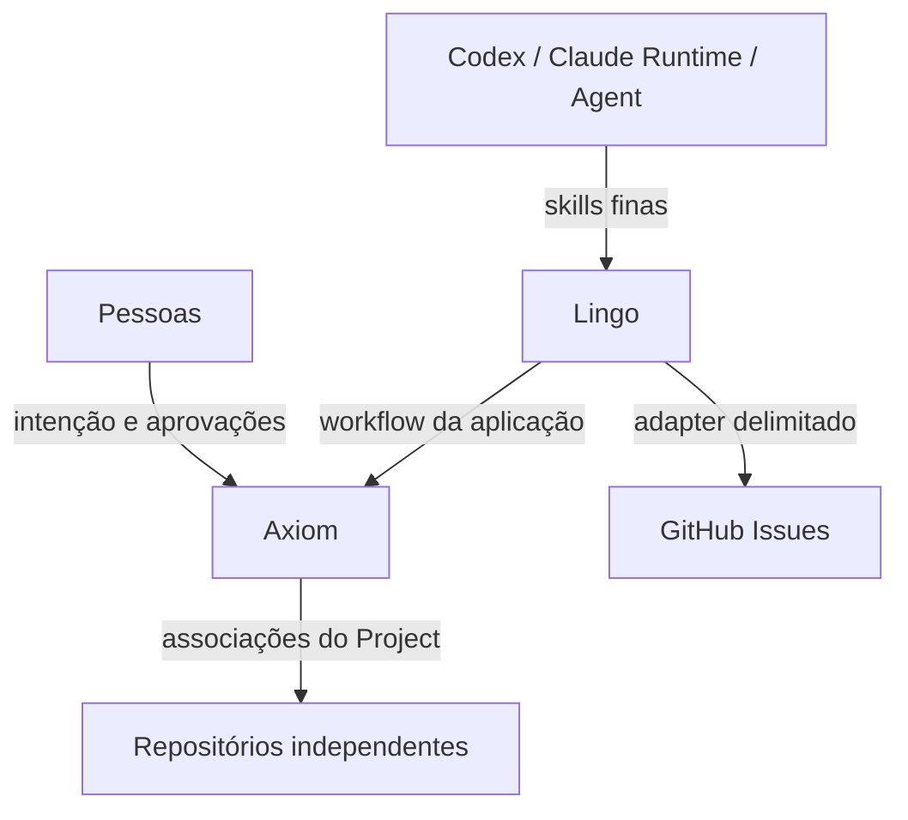

<p align="right">
  <a href="../README.md">English</a> | <strong>Português (Brasil)</strong>
</p>

<p align="center">
  
</p>

<h1 align="center">Axiom</h1>

<p align="center"><strong>Mantenha intenção, decisões, código e evidências conectados.</strong></p>

<p align="center">
  <a href="../LICENSE"></a>
  <a href="../go.mod"></a>
  <a href="https://github.com/rgomids/axiom/commits/main/"></a>
  <a href="https://github.com/rgomids/axiom/stargazers"></a>
</p>

Axiom é um control plane de desenvolvimento que mantém intenção de software,
arquitetura, implementação, validação e evidências operacionais conectadas no
trabalho entre pessoas e IA.

## Por que Axiom?

- **A intenção se perde.** Specifications preservam resultados, restrições e
  critérios de aceite antes da implementação.
- **O contexto se fragmenta.** Um Project pode relacionar repositórios
  independentes sem tratar um deles como o projeto inteiro.
- **As decisões se afastam do código.** Plans e decisões de arquitetura
  fornecem referências duráveis para pessoas e agentes.
- **Declarações de conclusão carecem de provas.** Validação e Evidence tornam os
  resultados inspecionáveis e reproduzíveis.

Spec-Driven Development conecta a razão de uma mudança à implementação e às
evidências de aceite.

## Primeiros passos

Usar o Axiom não exige clone, Go nem build.

### 1. Instale

Instale a **release estável mais recente** no **Linux ou macOS**:

```bash
curl -fsSL https://raw.githubusercontent.com/rgomids/axiom/main/scripts/install.sh | sh
```

No **Windows** (PowerShell 64 bits):

```powershell
& ([scriptblock]::Create((Invoke-RestMethod https://raw.githubusercontent.com/rgomids/axiom/main/scripts/install.ps1)))
```

O bootstrap Windows verifica o binário instalado, configura as skills dos
Runtimes detectados e atualiza o PATH deste terminal e o PATH permanente do usuário. Instalações novas usam
armazenamento privado no perfil. Se diretórios padrão dos Runtimes precisarem
de reparo de permissões, ele mostra as alterações exatas e pede aprovação antes
de aplicá-las. Consulte [onboarding e recuperação no Windows](installation.md#windows).

Pré-requisitos, plataformas, PATH, atualização e diagnóstico:
[guia de instalação](installation.md).

### 2. Verifique

```bash
axiom version
axiom help
```

### 3. Execute o first-run

```bash
axiom first-run
```

Configura as skills globais do Axiom para Codex e Claude encontrados no `PATH`.
Não instala Runtimes nem autentica você. Sem Runtime, termina com sucesso;
instale um separadamente e repita quando necessário.

### 4. Primeiro fluxo

Configure um Project, inspecione-o, crie um Work Item e inicie seu workflow:

```bash
axiom project configure
axiom project list
axiom project show --selector my-project
axiom work-item create --project my-project --repository main \
  --provider-repository owner/repository
axiom workflow start --project my-project --repository main --number 123
axiom workflow status --project my-project --repository main --number 123
```

Substitua `my-project`, `main`, `owner/repository` e `123` pelos valores
configurados e pelo número da Issue criada. Configure o provider GitHub no
Project; operações de Work Item exigem [GitHub CLI](https://cli.github.com/)
autenticado. Os comandos guiados de configuração e criação mostram um preview
e pedem confirmação antes de gravar.

Também é possível usar skills: `$axiom-project-configure` no Codex ou
`/axiom-project-configure` no Claude. Consulte [skills e Runtimes](commands.md#first-run-and-runtime-integrations)
e [referência de comandos](commands.md) para detalhes.

## Como o Axiom funciona


```mermaid
flowchart LR
    I["Intent"] --> S["Specification"]
    S --> P["Decisions<br/>e Plan"]
    P --> X["Implementation"]
    X --> V["Validation<br/>e Review"]
    V --> E["Evidence<br/>e Reconciliation"]
    E -. informa nova intenção .-> I
```

A implementação ocorre por Executions delimitadas. Aprovações humanas
controlam escolhas materiais. Evidence apoia revisão e aceite sem substituir o
julgamento humano.

## Estado do projeto

Axiom está em desenvolvimento ativo. Disponibilidade publicada e aceite humano
são decisões distintas.

- **Release estável mais recente:** [GitHub Releases](https://github.com/rgomids/axiom/releases/latest).
  A baseline publicada v0.4.2 inclui as capacidades abaixo; o instalador resolve
  a latest stable automaticamente.
- **Disponível hoje / stable:** distribuição verificada por checksum para Linux,
  macOS e Windows; configuração guiada, listagem e resolução de Projects;
  criação e classificação de Work Items GitHub; bootstrap Codex/Claude;
  workflow persistente, Evidence, recuperação e upgrades de instalações próprias.
  Inclui fundamentos de multi-runtime e execução multi-agent delimitada com
  Execution Graph; [Evidence S8](specifications/004-mvp-v1-baseline/evidence-s8.md)
  registra escopo e limites, sem estabelecer aceite humano do MVP completo.
- **Na main:** entrevista de criação de Work Item a partir de intenção mínima,
  com elaboração conversacional pela skill de Runtime e perguntas simples no CLI.
  Essa evolução ainda não faz parte da baseline v0.4.2.
- **Roadmap / futuro:** outros Runtimes/adapters, orquestração dinâmica ou
  distribuída e governança de orçamento de tokens/custo exigem especificação
  e autorização próprias.

Consulte [Changelog](../CHANGELOG.md), [Specifications](specifications/README.md)
e [Roadmap](product/roadmap.md) para histórico, Evidence, aceite e direção.

## Conceitos centrais

| Conceito | Significado |
|---|---|
| [Project](decisions/0001-project-is-not-repository.md) | Limite lógico de projeto, distinto de Repository, que pode associar vários repositórios independentes. |
| [Specification](specifications/README.md) | Comportamento desejado, restrições, não objetivos e evidências de aceite. |
| [Architecture / ADR](decisions/README.md) | Limites do sistema e decisões duráveis com justificativas e trade-offs. |
| [Execution](architecture/conceptual-model.md#execution-and-proof) | Tentativa delimitada sob intenção e aprovações conhecidas. |
| [Evidence](architecture/conceptual-model.md#execution-and-proof) | Observação inspecionável que sustenta uma afirmação, como teste, resultado de comando, diff ou revisão. |
| [Authority](product/constitution.md) | Limites explícitos de permissão e aprovação; uma proposta não concede authority. |
| [Agent / Runtime](architecture/conceptual-model.md#actors-and-external-boundaries) | Um Agent participa do trabalho; um Runtime fornece seu ambiente e capacidades de execução. |
| [Lingo](decisions/0003-lingo-as-axiom-local-control-plane.md) | Control plane executável local do Axiom. |

## Arquitetura

Axiom separa intenção de produto e regras de domínio das ferramentas de execução
e providers externos. Lingo conduz workflows locais enquanto adapters de Runtime
e Provider permanecem na borda.


```mermaid
flowchart TB
    H["Pessoas"] -->|intenção e aprovações| A["Axiom"]
    R["Codex / Claude Runtime / Agent"] -->|skills finas| L["Lingo"]
    L -->|workflow da aplicação| A
    A -->|associações do Project| G["Repositórios independentes"]
    L -->|adapter delimitado| P["GitHub Issues"]
```

Consulte a [visão geral da arquitetura](architecture/README.md), o
[modelo conceitual](architecture/conceptual-model.md) e os
[limites de providers](architecture/provider-boundaries.md).

## Documentação

| Tema | Comece aqui |
|---|---|
| Uso do Axiom | [Primeiros passos](#primeiros-passos) · [Instalação](installation.md) · [Referência de comandos](commands.md) |
| Produto | [Product Foundation](product/foundation.md) · [Roadmap](product/roadmap.md) |
| Governança | [Governança de documentação](documentation.md) · [Constitution](product/constitution.md) |
| Arquitetura | [Visão geral](architecture/README.md) · [ADRs](decisions/README.md) |
| Entrega | [Specifications e Evidence](specifications/README.md) |
| Pesquisa | [Índice de pesquisa](research/README.md) |
| Desenvolvimento | [Desenvolvimento do Axiom](#desenvolvimento-do-axiom) · [Setup de desenvolvimento](development/getting-started.md) · [Comandos](commands.md) · [Fluxo de desenvolvimento e release](../CONTRIBUTING.md#development-flow) |
| Comunidade | [Contribuição](../CONTRIBUTING.md) · [Código de Conduta](../CODE_OF_CONDUCT.md) · [Suporte](../SUPPORT.md) |
| Segurança | [Política de segurança](../SECURITY.md) · [Segurança do repositório](security/repository-security.md) |
| Histórico | [Changelog](../CHANGELOG.md) |

A [GitHub Wiki](https://github.com/rgomids/axiom/wiki) reúne documentação pública
de produto, conceitos e navegação orientada ao usuário. Artefatos versionados
do repositório são responsáveis por contratos técnicos, decisões, Evidence de
implementação e referências que precisam evoluir com o código. Discovery não
implica aprovação.

## Desenvolvimento do Axiom

Para trabalhar no próprio Axiom: Git, Bash, utilitários POSIX e Go 1.26+.

```bash
git clone https://github.com/rgomids/axiom.git
cd axiom
./scripts/install-axiom.sh
./scripts/validate-repository.sh .
go test ./...
```

O script instala um build de desenvolvimento do checkout. Consulte
[setup de desenvolvimento](development/getting-started.md) e
[referência de comandos](commands.md) para build, Windows e dogfooding.

## Site

Conheça também o [site do Axiom](https://rgomids.github.io/axiom/).

## Como contribuir

Leia [CONTRIBUTING.md](../CONTRIBUTING.md) e o
[Código de Conduta](../CODE_OF_CONDUCT.md). Use os formulários de Issue e o template
de Pull Request do repositório, siga o escopo aprovado, mantenha mudanças
pequenas, inclua validação reproduzível e reconcilie a documentação afetada.
Mudanças materiais exigem aprovação humana explícita.

## Segurança

Relate suspeitas de vulnerabilidade de forma privada por
[SECURITY.md](../SECURITY.md).

## Licença

Axiom é licenciado sob Apache License 2.0. Consulte [LICENSE](../LICENSE).
