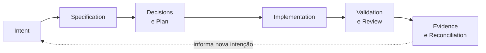
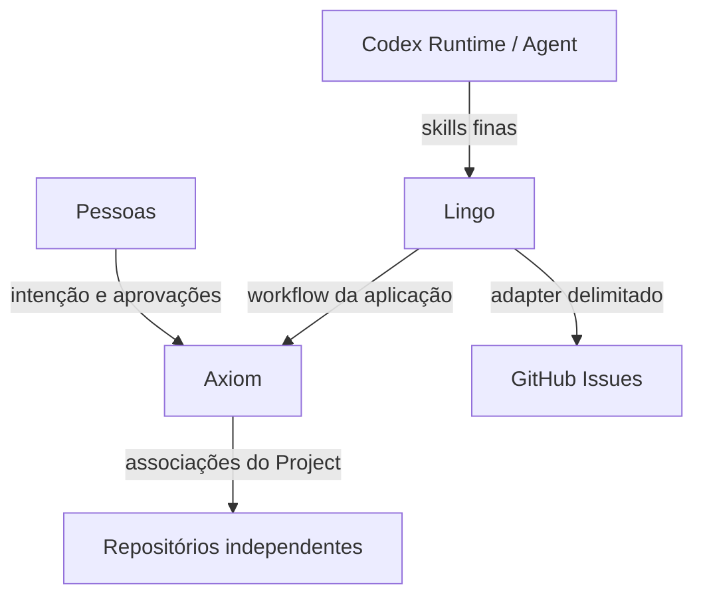

<p align="right">
  <a href="../README.md">English</a> | <strong>Português (Brasil)</strong>
</p>

<p align="center">
  
</p>

<h1 align="center">Axiom</h1>

<p align="center"><strong>Mantenha intenção, decisões, código e evidências conectados.</strong></p>

<p align="center">
  <a href="../LICENSE"></a>
  <a href="../go.mod"></a>
  <a href="https://github.com/rgomids/axiom/commits/main/"></a>
  <a href="https://github.com/rgomids/axiom/stargazers"></a>
</p>

Axiom é um control plane de desenvolvimento que mantém intenção de software,
arquitetura, implementação, validação e evidências operacionais conectadas no
trabalho entre pessoas e IA.

## Por que Axiom?

- **A intenção se perde.** Specifications preservam resultados, restrições e
  critérios de aceite antes da implementação.
- **O contexto se fragmenta.** Um Project pode relacionar repositórios
  independentes sem tratar um deles como o projeto inteiro.
- **As decisões se afastam do código.** Plans e decisões de arquitetura
  fornecem referências duráveis para pessoas e agentes.
- **Declarações de conclusão carecem de provas.** Validação e Evidence tornam os
  resultados inspecionáveis e reproduzíveis.

Spec-Driven Development conecta a razão de uma mudança à implementação e às
evidências de aceite.

## Primeiros passos

Usar o Axiom não exige clone, toolchain Go nem build. Para trabalhar no próprio
Axiom, consulte [Desenvolvimento do Axiom](#desenvolvimento-do-axiom).

### 1. Instale

No **Linux ou macOS**:

```bash
curl -fsSL https://raw.githubusercontent.com/rgomids/axiom/main/scripts/install.sh | sh
```

O instalador resolve a release estável mais recente, baixa o archive do seu
host, verifica o checksum SHA-256 antes de extrair qualquer coisa e instala o
`axiom` em `$HOME/.local/bin`. Ele nunca usa `sudo`, não edita perfis de shell,
não instala Runtimes e não toca em credenciais.

Hosts POSIX suportados: macOS em arm64 e Linux em amd64 ou arm64. A versão do
sistema operacional não é um filtro de instalação. Outros hosts são recusados
antes de qualquer download. O instalador precisa de `curl`,
`tar`, `bash`, `awk`, `grep`, `mktemp` e `sha256sum` ou `shasum`.

Se ele exibir um `path_notice`, coloque o diretório do binário no `PATH`:

```bash
export PATH="$HOME/.local/bin:$PATH"
```

Para instalar uma release exata, use `--version`:

```bash
curl -fsSL https://raw.githubusercontent.com/rgomids/axiom/main/scripts/install.sh | sh -s -- --version v0.1.0
```

No **Windows 10 (1809+) ou Windows 11, amd64**, use PowerShell 5.1 ou superior
de 64 bits. Não é necessário WSL, Bash, Go nem executar como administrador:

```powershell
Invoke-RestMethod https://raw.githubusercontent.com/rgomids/axiom/main/scripts/install.ps1 | Invoke-Expression
$env:PATH = "$env:LOCALAPPDATA\Axiom\bin;$env:PATH"
```

Para instalar uma release Windows exata, use um comando PowerShell:

```powershell
& ([scriptblock]::Create((Invoke-RestMethod https://raw.githubusercontent.com/rgomids/axiom/main/scripts/install.ps1))) -Version v0.1.0
```

Se precisar inspecionar ou reter o bootstrap antes de executá-lo, baixe-o
primeiro:

```powershell
Invoke-WebRequest https://raw.githubusercontent.com/rgomids/axiom/main/scripts/install.ps1 -OutFile install-axiom.ps1
.\install-axiom.ps1
```

O instalador verifica o checksum da release Windows e instala `axiom.exe` em
`%LOCALAPPDATA%\Axiom\bin`, com recibo em `%LOCALAPPDATA%\Axiom\install`.
O comando de `PATH` acima vale só para o terminal atual; o instalador não altera
perfis nem o `PATH` persistente. Use `-Version` com uma tag publicada exata,
ou `-BinDir` e `-ReceiptDir` para escolher diretórios locais absolutos.
Executá-lo novamente atualiza uma instalação pertencente ao Axiom; binários
desconhecidos ou modificados são preservados. Feche processos Axiom antes do
upgrade. Releases antigas sem artefato Windows não podem ser instaladas nele.

O armazenamento deve ser NTFS local. Caminhos de rede, junctions/reparse points
e diretórios acessíveis a outras contas não confiáveis são recusados. O estado
local fica em `%LOCALAPPDATA%\Axiom\state`; as skills dos Runtimes continuam nas
raízes do usuário descritas abaixo. Políticas de execução do PowerShell e de
controle de aplicativos da organização continuam valendo, sem bypass.
Consulte a [referência de instalação Windows](commands.md#windows-native-installation).

### 2. Verifique

```bash
axiom version
axiom help
```

`axiom version` informa a versão e a revisão instaladas; `axiom help` lista os
comandos disponíveis.

### 3. Execute o first-run

```bash
axiom first-run
```

O `first-run` procura os Runtimes suportados pelos executáveis no seu `PATH` e
instala ou atualiza as skills globais de usuário do Axiom para cada um
encontrado. Pode ser executado de novo com segurança. Quando nenhum Runtime é
encontrado, ele informa isso e termina com sucesso; instale o Runtime por conta
própria, garanta que ele esteja no `PATH` e execute o `first-run` novamente. Ele
nunca instala um Runtime, não faz login, não lê nem altera credenciais e não
infere um Project.

| Runtime | Detectado por | Skills instaladas em |
|---|---|---|
| Codex | `codex` no `PATH` | `$HOME/.agents/skills` |
| Claude | `claude` no `PATH` | `<CLAUDE_CONFIG_DIR ou ~/.claude>/skills` |

Inspecione uma integração com `axiom runtime codex status` ou
`axiom runtime claude status`.

### 4. Skills disponíveis

Depois do `first-run`, estas skills ficam disponíveis em cada Runtime
configurado:

| Skill | Use para |
|---|---|
| `axiom-project-configure` | Configurar um Project e suas associações locais de Repository. |
| `axiom-project-list` | Listar Projects configurados a partir de qualquer diretório. |
| `axiom-project-show` | Inspecionar ou resolver um Project configurado a partir de qualquer diretório. |
| `axiom-work-item-create` | Criar ou selecionar um Work Item baseado no GitHub. |
| `axiom-work-item-run` | Iniciar ou retomar o workflow delimitado de entrega de um Work Item. |
| `axiom-work-item-status` | Inspecionar o status do workflow e a Evidence de um Work Item. |

Invoque-as pelo nome:

```text
Codex:  $axiom-project-configure
Claude: /axiom-project-configure
```

Cada skill chama a CLI `axiom`, que mantém a validação e a authority sobre toda
mudança local ou externa.

### 5. Primeiro fluxo

```text
instalar o Axiom → axiom version → axiom first-run
  → configurar um Project → inspecionar o Project
  → criar um Work Item → iniciar e acompanhar seu workflow
```

O mesmo caminho pela CLI. `project configure` e `work-item create` são guiados:
pedem os valores que faltam, mostram um preview exato da mudança e não gravam
nada até você responder `yes`.

```bash
# Configure um Project: slug, nome, Repository chave=path-absoluto, provider
axiom project configure

# Liste os Projects configurados a partir de qualquer diretório
axiom project list

# Inspecione-o a partir de qualquer diretório
axiom project show --selector my-project

# Crie um Work Item como GitHub Issue (usa sua sessão autenticada do gh CLI)
axiom work-item create --project my-project --repository main \
  --provider-repository owner/repository

# Inicie o workflow da Issue #123 e confira seu status
axiom workflow start --project my-project --repository main --number 123
axiom workflow status --project my-project --repository main --number 123
```

Substitua `my-project`, `main`, `owner/repository` e `123` pelos seus valores.
GitHub Issues é hoje o único Work Item provider; o Axiom usa a sessão existente
do [GitHub CLI](https://cli.github.com/) e nunca armazena essa credencial.

### 6. Próximos passos

- [Referência de comandos](commands.md): todos os comandos, incluindo
  [first-run](commands.md#first-run-and-runtime-integrations),
  [opções de instalação](commands.md#install-a-published-release-s9t39),
  [Projects](commands.md#configure-a-project),
  [Work Items](commands.md#github-work-items) e o
  [workflow](commands.md#execute-the-bounded-workflow).
- [Visão geral da arquitetura](architecture/README.md) e
  [modelo conceitual](architecture/conceptual-model.md).
- [Specifications](specifications/README.md) para escopo detalhado e estado de
  aceite.
- [Roadmap](product/roadmap.md) para a direção do produto.
- [Desenvolvimento do Axiom](#desenvolvimento-do-axiom) para compilar, testar ou
  contribuir.

## Como o Axiom funciona


```mermaid
flowchart LR
    I["Intent"] --> S["Specification"]
    S --> P["Decisions<br/>e Plan"]
    P --> X["Implementation"]
    X --> V["Validation<br/>e Review"]
    V --> E["Evidence<br/>e Reconciliation"]
    E -. informa nova intenção .-> I
```

A implementação ocorre por Executions delimitadas. Aprovações humanas
controlam escolhas materiais. Evidence apoia revisão e aceite sem substituir o
julgamento humano.

## Estado do projeto

Axiom está em desenvolvimento ativo. Este repositório oferece atualmente:

- um harness Codex-first com policies, skills, templates e validação
  determinística;
- uma implementação Go testada para regras de Project, estado portátil e local,
  instalação do Codex Runtime, GitHub Work Items e um workflow Lingo persistente
  e delimitado;
- contratos canônicos de conclusão e proveniência, detail artifacts limitados e
  fundamentos fail-closed para publicação e recuperação local;
- Specifications, decisões de arquitetura e Evidence de implementação
  versionadas.

As limitações atuais incluem duas integrações de Runtime suportadas (Codex e
Claude, configuradas por `axiom first-run`), um Work Item provider (GitHub
Issues) e um workflow sequencial executado por um único agente. O
[roadmap](product/roadmap.md) descreve a direção. O
[índice de Specifications](specifications/README.md) é responsável pelo
estado detalhado de escopo, aprovação, implementação e aceite.

## Conceitos centrais

| Conceito | Significado |
|---|---|
| [Project](decisions/0001-project-is-not-repository.md) | Limite lógico de projeto, distinto de Repository, que pode associar vários repositórios independentes. |
| [Specification](specifications/README.md) | Comportamento desejado, restrições, não objetivos e evidências de aceite. |
| [Architecture / ADR](decisions/README.md) | Limites do sistema e decisões duráveis com justificativas e trade-offs. |
| [Execution](architecture/conceptual-model.md#execution-and-proof) | Tentativa delimitada sob intenção e aprovações conhecidas. |
| [Evidence](architecture/conceptual-model.md#execution-and-proof) | Observação inspecionável que sustenta uma afirmação, como teste, resultado de comando, diff ou revisão. |
| [Authority](product/constitution.md) | Limites explícitos de permissão e aprovação; uma proposta não concede authority. |
| [Agent / Runtime](architecture/conceptual-model.md#actors-and-external-boundaries) | Um Agent participa do trabalho; um Runtime fornece seu ambiente e capacidades de execução. |
| [Lingo](decisions/0003-lingo-as-axiom-local-control-plane.md) | Control plane executável local do Axiom. |

## Arquitetura

Axiom separa intenção de produto e regras de domínio das ferramentas de execução
e providers externos. Lingo conduz workflows locais enquanto adapters de Runtime
e Provider permanecem na borda.


```mermaid
flowchart TB
    H["Pessoas"] -->|intenção e aprovações| A["Axiom"]
    R["Codex Runtime / Agent"] -->|skills finas| L["Lingo"]
    L -->|workflow da aplicação| A
    A -->|associações do Project| G["Repositórios independentes"]
    L -->|adapter delimitado| P["GitHub Issues"]
```

Consulte a [visão geral da arquitetura](architecture/README.md), o
[modelo conceitual](architecture/conceptual-model.md) e os
[limites de providers](architecture/provider-boundaries.md).

## Documentação

| Tema | Comece aqui |
|---|---|
| Uso do Axiom | [Primeiros passos](#primeiros-passos) · [Referência de comandos](commands.md) |
| Produto | [Product Foundation](product/foundation.md) · [Roadmap](product/roadmap.md) |
| Governança | [Governança de documentação](documentation.md) · [Constitution](product/constitution.md) |
| Arquitetura | [Visão geral](architecture/README.md) · [ADRs](decisions/README.md) |
| Entrega | [Specifications e Evidence](specifications/README.md) |
| Pesquisa | [Índice de pesquisa](research/README.md) |
| Desenvolvimento | [Desenvolvimento do Axiom](#desenvolvimento-do-axiom) · [Setup de desenvolvimento](development/getting-started.md) · [Comandos](commands.md) · [Fluxo de desenvolvimento e release](../CONTRIBUTING.md#development-flow) |
| Comunidade | [Contribuição](../CONTRIBUTING.md) · [Código de Conduta](../CODE_OF_CONDUCT.md) · [Suporte](../SUPPORT.md) |
| Segurança | [Política de segurança](../SECURITY.md) · [Segurança do repositório](security/repository-security.md) |
| Histórico | [Changelog](../CHANGELOG.md) |

O [discovery no Notion](https://app.notion.com/p/3b4e01f22626810791b4f9d016ab5979)
fornece contexto de discovery de produto e pesquisa. Artefatos versionados do
repositório são responsáveis por contratos técnicos, decisões e Evidence de
implementação. Discovery não implica aprovação.

## Desenvolvimento do Axiom

Esta seção é para trabalhar no próprio Axiom; ela não é necessária para usá-lo.
Requisitos: Git, Bash, utilitários POSIX padrão e Go 1.26 ou posterior. O
primeiro comando Go pode baixar a dependência fixada em `go.mod`.

```bash
git clone https://github.com/rgomids/axiom.git
cd axiom
./scripts/install-axiom.sh
export PATH="$HOME/.local/bin:$PATH"
axiom version
axiom first-run
./scripts/validate-repository.sh .
go test ./...
```

`./scripts/install-axiom.sh` instala um build de desenvolvimento a partir do
checkout e nunca edita perfis de shell. Consulte o
[guia Getting Started de desenvolvimento](development/getting-started.md) para
configuração e a [referência de comandos](commands.md) para validação, build,
archives e fluxos de dogfooding.

## Estrutura do repositório

```text
.agents/   Harness Codex: contexto, policies, skills e templates
docs/      Produto, arquitetura, specifications, decisões e pesquisa
internal/  Implementação Go e testes
scripts/   Ferramentas de repositório, segurança, release e validação
site/      Landing page pública publicada no GitHub Pages
```

## Site

A landing page pública é publicada a partir de `site/` em
<https://rgomids.github.io/axiom/> pelo `.github/workflows/deploy-landpage.yml`,
que envia esse diretório sem alterações a cada push na `main`.

Para trabalhar nela localmente:

```bash
python3 -m http.server 8000 --directory site
```

Depois abra <http://localhost:8000/>. Os assets de identidade são carregados da
localização canônica em `docs/assets/` por URLs raw absolutas, então nunca são
copiados para `site/`.

## Como contribuir

Leia [CONTRIBUTING.md](../CONTRIBUTING.md) e o
[Código de Conduta](../CODE_OF_CONDUCT.md). Use os formulários de Issue e o template
de Pull Request do repositório, siga o escopo aprovado, mantenha mudanças
pequenas, inclua validação reproduzível e reconcilie a documentação afetada.
Mudanças materiais exigem aprovação humana explícita.

## Segurança

Relate suspeitas de vulnerabilidade de forma privada por
[SECURITY.md](../SECURITY.md).

## Licença

Axiom é licenciado sob Apache License 2.0. Consulte [LICENSE](../LICENSE).
