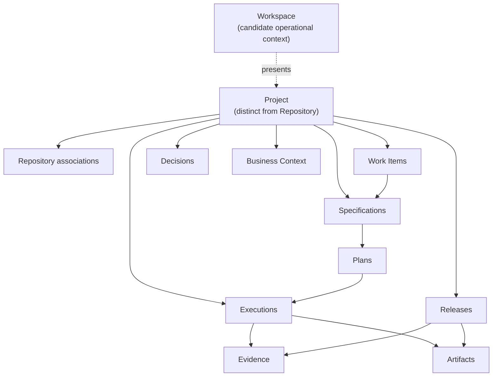
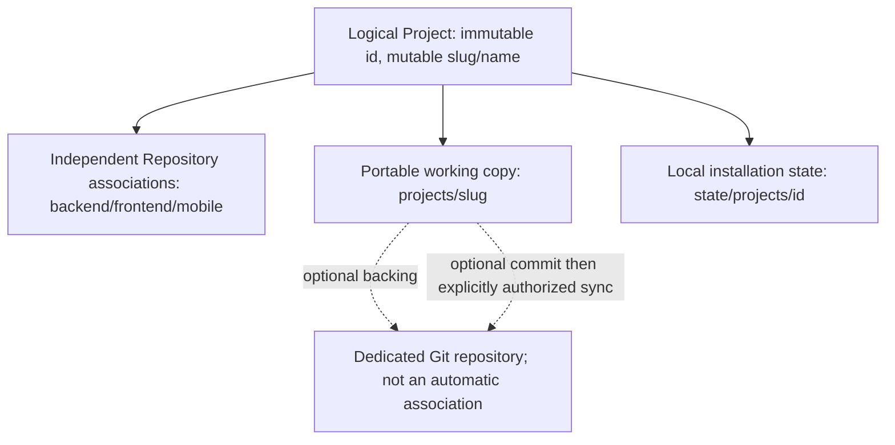
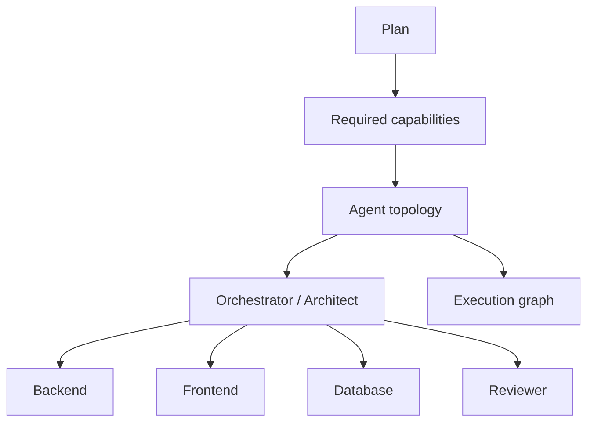
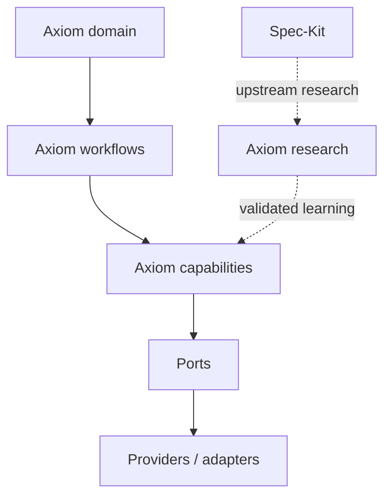

# Axiom Conceptual Model

## Status and scope

This is an initial domain-language baseline, not a data model, API, schema or persistence decision. Terms marked **accepted** may guide specifications. Terms marked **candidate** remain subject to clarification. **Supporting**, **boundary**, and **configuration** classify a concept's role; they do not imply that its representation is approved.

## Classification map

| Concept | Deliberate classification | Current standing |
|---|---|---|
| Project | accepted distinction; candidate operational context and ownership boundary | `Project != Repository` is accepted; primary persistence, ownership and aggregate boundaries remain open. |
| Repository | accepted | Independent version-controlled delivery boundary associated with a Project. |
| Work Item | candidate | Provider-neutral work intent; not a provider record. |
| Specification, Plan, Decision, Evidence | accepted concepts | Representations and some lifecycles remain open. |
| Execution, Release, Business Context | candidate | Required direction; schemas and ownership remain open. |
| Artifact, Agent | supporting | Assist core concepts without replacing them. |
| Provider, Capability, Runtime, Transport | boundary | Protect Axiom domain contracts from external products and execution mechanisms. |
| Integration, Agent Profile, Model Profile | configuration | Select or bind behavior inside approved boundaries; not domain ownership. |
| Agent Planner, Orchestrator | candidate | Future executable capabilities for Lingo; detailed contracts remain subject to Specification. |

The Axiom/Lingo execution boundary is accepted by
[ADR-0003](../decisions/0003-lingo-as-axiom-local-control-plane.md). Its detailed
contracts and implementation remain subject to Specifications and later decisions.

The initial tree `Workspace -> Project -> repositories/work/specifications/decisions/executions` is not accepted as an aggregate hierarchy. It mixes an operational view with ownership. Current model:



Workspace may present many Projects, but presentation does not yet imply persistence or ownership.

## Core boundaries

### Workspace — candidate

- **Responsibility:** provide an operational context across Projects, active work, integrations, policies and recent executions.
- **Relations:** may select or present multiple Projects and configured Integrations.
- **Lifecycle:** unknown; possible local session, persisted catalog, or synchronized view.
- **Not:** a synonym for filesystem directory, Git monorepo, organization or Project.
- **Open:** identity, persistence, ownership, portability and whether multiple Workspaces may reference one Project.

### Project — accepted distinction, candidate operational context and ownership boundary

- **Candidate responsibility:** act as a persistent operational context relating a product outcome with repositories, Work Items, Specifications, Decisions, Executions, Evidence, Business Context, Integrations, configuration and Releases.
- **Relations:** may associate one or more Repositories. Ownership of project-scoped work and knowledge is not yet decided.
- **Lifecycle:** candidate states are active, paused and archived; no state machine is approved.
- **Not:** a repository, directory, provider project, issue board, deployment environment, automatically the aggregate root, or owner of every related record.
- **Decided boundary:** [ADR-0004](../decisions/0004-portable-project-manifest.md) establishes versioned portable Project intent, currently `axiom.yaml`, distinct from local state. Specification 002 defines slice identity; its Plan documents the initial concrete schema.
- **Open:** nesting, ownership, aggregate boundary, cross-Project sharing and concrete synchronization protocols; broader metadata and local persistence contracts remain subject to specifications.

### Project identity, working copy and backing — accepted boundary

Later human Plan review on 2026-09-12 revised Specification 002 after its original
2026-09-11 approval; [H1–H8](../specifications/002-lingo-project-initialization/clarifications.md#subsequent-human-decisions--2026-09-12)
and extended [ADR-0004](../decisions/0004-portable-project-manifest.md) record authority.

- `id`: immutable canonical UUID v4; correlation and local-state address.
- `slug`: mutable installation-unique CLI name and default portable directory name;
  safe explicit rename/move preserves ID and local bindings.
- `name`: mutable nonunique presentation.

Logical `~/.axiom/projects/<slug>/` is portable/shared working copy, containing
manifest and optional supported context/documents/policies. Logical
`~/.axiom/state/projects/<id>/installation.json` is exclusively machine state;
native platform mapping remains in Specification/Plan. No config starts inside an
associated Repository. Local paths, credentials, observations and ephemeral state
never enter portable content; `formatVersion` stays separate from `schemaVersion`.



The [2026-09-14 human confirmation](../specifications/002-lingo-project-initialization/clarifications.md#latest-human-decision--2026-09-14)
retains this model. Minimal init creates identity/structure. Explicit update may
receive partial intent; Lingo loads current Project and domain materializes and
validates the complete proposed state. Application previews the required safe diff,
checks applicable authority/version/concurrency and persists only the complete valid
result with H10 logical atomicity; persistence mechanisms require Linux/macOS Evidence. No direct partial `axiom.yaml` mutation or validation bypass.
Changed init intent
still conflicts. AI proposes; Lingo validates; human/system authority approves;
deterministic persistence commits. Local update, optional Git commit and remote
sync remain separate under [H11](../specifications/002-lingo-project-initialization/clarifications.md#git-authority-approval--2026-09-14).
Local success depends on neither Git commit nor push; their failures never imply
rollback of confirmed Project mutation. `.git` creates no Repository association;
AI proposals grant no Git authority. Remote authority is explicit, automation
requires separate human-approved design, and symlink is not primary sync.
Git execution and concrete sync design remain future work, not current capability.

### Repository — accepted concept

- **Responsibility:** identify a version-controlled delivery boundary and its project role, local location and remote identity when available.
- **Relations:** belongs to or is referenced by a Project; may contribute Artifacts, Evidence and Release components.
- **Lifecycle:** discovered or attached, available or unavailable, detached; exact states remain unapproved.
- **Not:** the Project, a required submodule, or necessarily a local sibling directory.
- **Boundary answers:** repositories may use arbitrary validated paths and different source-control providers. Physical proximity is not a domain requirement. Whether one Repository may be shared by multiple Projects remains open.

## Work and knowledge

### Work Item — candidate

- **Responsibility:** represent an actionable unit of product or engineering intent with status, scope and traceability.
- **Relations:** belongs to a Project; may reference provider records, Specifications, Plans, Executions and Releases; may affect several Repositories.
- **Lifecycle:** proposed `captured -> ready -> active -> blocked -> completed|cancelled`, subject to specification.
- **Not:** automatically a Jira issue, Linear issue, GitHub Issue, implementation task or chat message.
- **Open:** Axiom-owned identity versus provider reference, synchronization semantics, hierarchy and status mapping.

### Specification — accepted concept

- **Responsibility:** state what outcome and behavior are required, including constraints, non-goals and acceptance evidence, without prematurely fixing implementation.
- **Relations:** refines intent or a Work Item; constrains Plans, Decisions, Executions and validation.
- **Lifecycle:** candidate `draft -> clarified -> approved -> implemented -> superseded|retired`.
- **Not:** an implementation Plan, task list, ADR or generated prompt.
- **Open:** approval authority, versioning granularity and whether one Specification may span Projects.

### Plan — accepted concept

- **Responsibility:** describe how an approved Specification will be realized and validated across boundaries.
- **Relations:** implements one or more Specifications; identifies Decisions, tasks, Repositories, tests, observability, rollout and rollback.
- **Lifecycle:** candidate `draft -> reviewed -> approved -> executing -> completed|superseded`.
- **Not:** desired product behavior, raw chain-of-thought or proof that work occurred.
- **Open:** whether Plan is a distinct artifact for every change and how task providers map to it.

### Implementation — activity, not currently a domain entity

- **Responsibility:** realize an approved Specification according to a Plan, producing repository changes and other Artifacts.
- **Relations:** is performed through one or more Executions and validated by Evidence; may affect several Repositories.
- **Lifecycle:** governed by the related Plan and Executions; no independent state model is justified yet.
- **Not:** a substitute for Specification, Plan, Execution or Evidence.
- **Open:** whether future orchestration needs an independently identified implementation record.

Current relationship:

```text
Work Item -> Specification -> Plan -> Implementation activity
                                      -> Execution(s) -> Evidence
```

### Business Context — candidate

- **Responsibility:** preserve durable glossary, domain language, acronyms, conventions, business rules, product constraints and architectural conventions relevant to a Project.
- **Relations:** informs Specifications, Plans, Agent Profiles, context construction and validation.
- **Not:** chat memory, a final schema, a model prompt, or authority that overrides approved Decisions.
- **Open:** representation, ownership, versioning, scoping and validation.

### Decision — accepted concept

- **Responsibility:** record an explicit choice, accountable status, evidence, alternatives, trade-offs and revisit conditions.
- **Relations:** may constrain a Project, Specification, Plan, Repository or Execution. An ADR is the durable architecture subtype.
- **Lifecycle:** `proposed -> accepted|rejected -> superseded` where applicable.
- **Not:** an assumption, hypothesis, configuration value or undocumented model preference.
- **Open:** approval roles and thresholds outside architecture.

| Term | Meaning | Needs approval? | Typical durability |
|---|---|---|---|
| Decision | Choice among alternatives with consequences. | Yes, proportional to impact. | Durable. |
| Assumption | Temporary premise used to progress safely. | No, but must be visible. | Until verified or invalidated. |
| Hypothesis | Testable claim awaiting evidence. | Adoption does. | Through evaluation. |
| Configuration | Selected operational value within an already-approved design. | According to policy/risk. | Environment or project scoped. |

## Execution and proof

### Execution — candidate

- **Responsibility:** record one bounded attempt by a human or Agent to perform an activity under known intent, context, policies and approvals, including its place in an orchestration graph.
- **Relations:** belongs to a Project and usually a Work Item, Specification or Plan; may reference parent and child Executions, role, Agent Profile, Runtime, Model Profile, required capabilities, affected Repositories, inputs, outputs, Evidence and Artifacts.
- **Lifecycle:** candidate `prepared -> authorized -> running -> succeeded|failed|blocked|cancelled`.
- **Not:** a full chat transcript, agent definition, task, or automatic proof of correctness.
- **Minimum durable record candidate:** stable identity, actor, purpose, source references, timestamps, status, affected targets, approvals/waivers, validation summary, output references and blockers.
- **Open:** graph and event schemas, dependency semantics, concurrency, cancellation, retention, privacy/redaction, replay semantics and whether prepared-but-not-run activity counts as Execution.

### Evidence — accepted concept, open representation

- **Responsibility:** support a claim with reproducible or inspectable observation.
- **Relations:** produced or collected by an Execution; supports acceptance, Decisions and Releases.
- **Lifecycle:** collected, verified or invalidated, retained or expired; policy undefined.
- **Not:** a claim without source, an invented status, raw reasoning, or necessarily a copied log.
- **Examples:** command plus exit status, test report, content hash, diff reference, approval, review finding, external record reference.
- **Open:** storage, integrity, sensitivity classification, expiry and portability.

### Artifact — supporting concept

- **Responsibility:** identify a durable input or output such as a specification, plan, manifest, package, report or release note.
- **Relations:** may be consumed or produced by Executions and grouped in Releases.
- **Lifecycle:** draft, validated, published, superseded or removed as defined by its artifact type.
- **Not:** a universal untyped blob that replaces domain concepts.
- **Open:** common metadata needed across artifact types.

### Release — candidate

- **Responsibility:** represent an intentional delivery composed of identified artifact and repository versions plus validation evidence.
- **Relations:** belongs to a Project; may span multiple Repository revisions and reference Work Items, Executions and Evidence.
- **Lifecycle:** candidate `planned -> candidate -> approved -> released -> observed|rolled-back`.
- **Not:** necessarily one Git tag, deployment, package or repository release.
- **Open:** atomicity across repositories, authority, environment mapping and rollback semantics.

## Actors and external boundaries

### Agent — supporting concept

- **Responsibility:** describe an AI-assisted actor profile or runtime participant with purpose, capabilities, policies and approval boundaries.
- **Relations:** may perform Executions through a Runtime and consume an Agent Profile, Blueprint or rendered harness.
- **Lifecycle:** defined, validated, enabled, disabled, versioned; exact model open.
- **Not:** the model provider, a human, a Work Item or an Execution.
- **Open:** identity, versioning, runtime portability, specialization and accountability mapping.

### Agent Profile — configuration concept

- **Responsibility:** configure a role, required capabilities, policies, approval boundaries, and reasoning/context requirements without selecting a concrete model in the domain.
- **Relations:** may guide Agent Planning and be referenced by an Execution; resolves through a Runtime and Model Profile.
- **Not:** an Agent instance, concrete model, runtime adapter, or guarantee that a capability is available.
- **Open:** schema, inheritance, versioning and Project/runtime override rules.

### Model Profile — configuration concept

- **Responsibility:** map user-selected execution classes such as orchestrator, worker or lightweight work to models available in a selected Runtime.
- **Relations:** belongs to Project/runtime configuration and may be referenced by an Agent Profile or Execution.
- **Not:** a Role, a hardcoded global model catalog, or a domain rule tying one role to one model.
- **Open:** discovery, validation, fallback, cost and context-window representation.

### Agent Planner — candidate capability

- **Responsibility:** derive required capabilities, candidate roles, runtime/model constraints and execution topology from an approved Plan.
- **Relations:** consumes a Plan and available capabilities; proposes Agent Profiles and an Execution graph for authorization.
- **Not:** a fixed `frontend + backend = full-stack` rule, model selector alone, or permission to execute.
- **Open:** deterministic versus model-assisted rules, risk/cost optimization, override and approval points.

Candidate roles include architect, backend engineer, frontend engineer,
full-stack engineer, database engineer, QA engineer, security reviewer, code
reviewer and documentation agent. These are capability roles, not concrete
models. The planner may select separate frontend/backend roles or a full-stack
role based on scope, dependencies, risk, parallelism, cost and complexity. SQL
alone does not imply a database specialist.



### Orchestrator — candidate capability

- **Responsibility:** coordinate authorized Executions, observe progress, resolve dependencies, consolidate results, request decisions, enforce Plan boundaries, collect Evidence and reconcile final state.
- **Relations:** conducts an Execution graph and observes child Executions; does not replace them.
- **Not:** the Project owner, an automatic architect role, a source of product truth, or the Plan itself.
- **Open:** identity, failure/retry/cancellation semantics, delegation authority, concurrency and human escalation.

### Provider — boundary concept

- **Responsibility:** name an external system offering capabilities such as source control, tracking, documentation or agent execution.
- **Relations:** offers Capabilities and is bound through an Integration; a runtime adapter may reach it through a Transport.
- **Not:** a Capability, Integration, Transport, core domain owner, or reason to force a universal interface.
- **Open:** initial capability contracts and source-of-truth rules.

### Capability — boundary concept

- **Responsibility:** name a provider-neutral operation or property required by a workflow, such as `work-item.read`, `documentation.write` or `repository.read`.
- **Relations:** required by Plans/workflows and offered by Providers, Runtimes or configured Integrations; participates in negotiation before Execution.
- **Not:** a Provider product, transport protocol, permission grant, or implementation interface by itself.
- **Open:** vocabulary, versioning, composition, constraints and negotiation result model.

### Integration — candidate configuration concept

- **Responsibility:** bind a Project or Workspace to a Provider with configuration, capability scope and trust/permission policy.
- **Relations:** supplies Provider capabilities to workflows and Executions through a selected Transport and credential reference.
- **Lifecycle:** configured, verified, degraded, disabled or removed; exact states open.
- **Not:** a Provider, Capability, Transport, MCP server, credential value or domain entity by default.
- **Open:** scope, credential references, Transport selection, health, capability negotiation, portability and persistence.

### Runtime — boundary concept

- **Responsibility:** identify an execution environment and expose available models and capabilities through a runtime adapter.
- **Relations:** hosts or invokes Agents and Executions; resolves Model Profiles and may satisfy provider/integration capabilities.
- **Not:** an Agent role, concrete model, Project owner, or Axiom domain.
- **Examples:** Codex, Claude, Kiro and future execution environments.
- **Open:** discovery, lifecycle, adapter contract, capability reporting and failure mapping.

### Transport — boundary concept

- **Responsibility:** identify the infrastructure mechanism an adapter uses to reach a Provider or runtime capability.
- **Relations:** selected by an Integration or adapter after domain capability requirements are known.
- **Not:** an Integration, Provider, Capability or domain concept. In particular, `Integration != MCP`.
- **Examples:** MCP, native API, CLI, HTTP and future mechanisms.
- **Open:** selection, fallback, observability, lifecycle and security policy.

## Configuration and portability boundary

[ADR-0004](../decisions/0004-portable-project-manifest.md), accepted during human
review of the Specification 002 Plan, establishes a versioned Portable Project
Manifest, currently `axiom.yaml`, separating shared intent from machine-local state. Portable configuration may reference repositories,
Providers, required capabilities, Integrations, Model Profiles, policies and
credential identifiers. It must not contain secret values, absolute
machine-specific paths, runtime process identifiers, caches or temporary state.

Credential configuration stores references only. Environment variables,
operating-system credential stores and runtime-managed credentials are possible
future sources; none is selected. The initial schema is documented in the
[Specification 002 Plan](../specifications/002-lingo-project-initialization/plan.md#2-portable-manifest-contract).
Global persistence/ownership and concrete sync protocols remain open; internal local
installation storage is a slice-level Plan detail.

An Axiom Project must not belong to Codex, Claude, Kiro or another Runtime.
Runtime-specific overrides may exist, but changing Runtime must not require
reconstructing the domain definition of the Project.

Provider trade-offs and abstraction thresholds are detailed in [Provider Boundaries](provider-boundaries.md).

The accepted executable relationship among Axiom, Lingo, Runtime adapters,
Agent Planning and orchestration is recorded in
[ADR-0003](../decisions/0003-lingo-as-axiom-local-control-plane.md). Detailed
contracts remain subject to Specification.

## Strategic upstream boundary

[ADR-0002](../decisions/0002-axiom-speckit-relationship.md) establishes that
Axiom owns its SDD harness, domain, and lifecycle. Spec-Kit is observed through
research as a strategic upstream reference; it is not a required layer between
Axiom workflows and ports/providers, and it does not replace any Axiom domain
concept.



Any future Spec-Kit adapter, import/export contract, or compatibility guarantee
requires a concrete need and a separate approved decision. The planned
[Spec-Kit Upstream Watch](../research/spec-kit-strategic-upstream.md) is a
research process, not an implemented architectural component.

## Traceability invariant

Where a stage applies, Axiom must be able to navigate references without reconstructing them from chat:

```text
intent / Work Item
-> Specification
-> Decision and Plan
-> Agent Planning when needed
-> Execution graph
-> Evidence and Artifact
-> Reconciliation
-> Release
```
