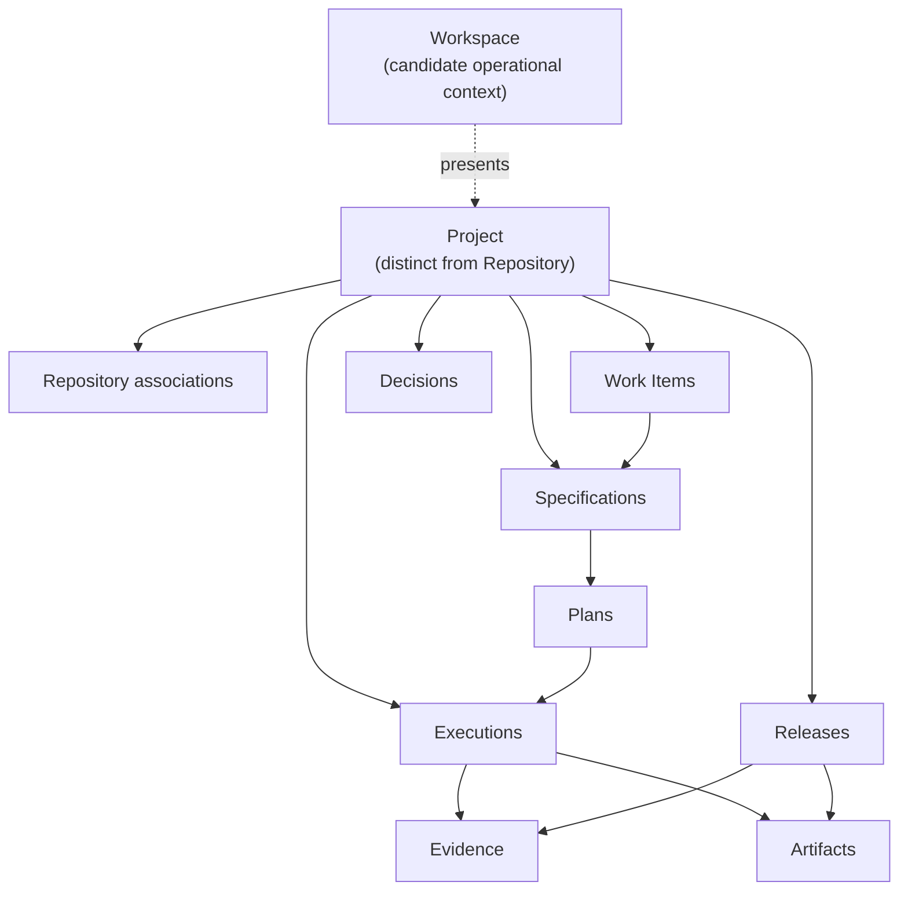
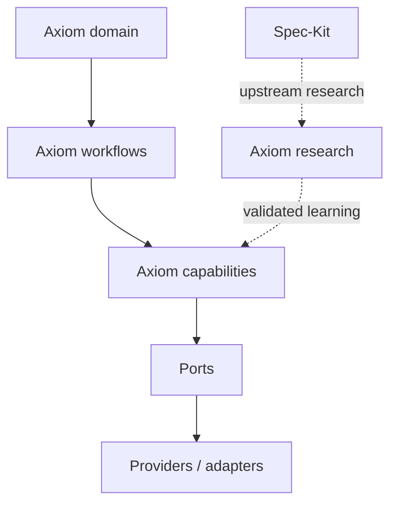

# Axiom Conceptual Model

## Status and scope

This is an initial domain-language baseline, not a data model, API, schema or persistence decision. Terms marked **accepted** may guide specifications. Terms marked **candidate** remain subject to clarification.

The initial tree `Workspace -> Project -> repositories/work/specifications/decisions/executions` is not accepted as an aggregate hierarchy. It mixes an operational view with ownership. Current model:



Workspace may present many Projects, but presentation does not yet imply persistence or ownership.

## Core boundaries

### Workspace — candidate

- **Responsibility:** provide an operational context across Projects, active work, integrations, policies and recent executions.
- **Relations:** may select or present multiple Projects and configured Integrations.
- **Lifecycle:** unknown; possible local session, persisted catalog, or synchronized view.
- **Not:** a synonym for filesystem directory, Git monorepo, organization or Project.
- **Open:** identity, persistence, ownership, portability and whether multiple Workspaces may reference one Project.

### Project — accepted distinction, candidate ownership boundary

- **Candidate responsibility:** relate a product outcome with repositories, Work Items, Specifications, Decisions, Executions, Evidence and Releases.
- **Relations:** may associate one or more Repositories. Ownership of project-scoped work and knowledge is not yet decided.
- **Lifecycle:** candidate states are active, paused and archived; no state machine is approved.
- **Not:** a repository, directory, provider project, issue board, deployment environment, or approved primary aggregate.
- **Open:** canonical identity, metadata format, nesting, source of truth and cross-Project sharing.

### Repository — accepted concept

- **Responsibility:** identify a version-controlled delivery boundary and its project role, local location and remote identity when available.
- **Relations:** belongs to or is referenced by a Project; may contribute Artifacts, Evidence and Release components.
- **Lifecycle:** discovered or attached, available or unavailable, detached; exact states remain unapproved.
- **Not:** the Project, a required submodule, or necessarily a local sibling directory.
- **Boundary answers:** repositories may use arbitrary validated paths and different source-control providers. Physical proximity is not a domain requirement. Whether one Repository may be shared by multiple Projects remains open.

## Work and knowledge

### Work Item — candidate

- **Responsibility:** represent an actionable unit of product or engineering intent with status, scope and traceability.
- **Relations:** belongs to a Project; may reference provider records, Specifications, Plans, Executions and Releases; may affect several Repositories.
- **Lifecycle:** proposed `captured -> ready -> active -> blocked -> completed|cancelled`, subject to specification.
- **Not:** automatically a Jira issue, Linear issue, GitHub Issue, implementation task or chat message.
- **Open:** Axiom-owned identity versus provider reference, synchronization semantics, hierarchy and status mapping.

### Specification — accepted concept

- **Responsibility:** state what outcome and behavior are required, including constraints, non-goals and acceptance evidence, without prematurely fixing implementation.
- **Relations:** refines intent or a Work Item; constrains Plans, Decisions, Executions and validation.
- **Lifecycle:** candidate `draft -> clarified -> approved -> implemented -> superseded|retired`.
- **Not:** an implementation Plan, task list, ADR or generated prompt.
- **Open:** approval authority, versioning granularity and whether one Specification may span Projects.

### Plan — accepted concept

- **Responsibility:** describe how an approved Specification will be realized and validated across boundaries.
- **Relations:** implements one or more Specifications; identifies Decisions, tasks, Repositories, tests, observability, rollout and rollback.
- **Lifecycle:** candidate `draft -> reviewed -> approved -> executing -> completed|superseded`.
- **Not:** desired product behavior, raw chain-of-thought or proof that work occurred.
- **Open:** whether Plan is a distinct artifact for every change and how task providers map to it.

### Implementation — activity, not currently a domain entity

- **Responsibility:** realize an approved Specification according to a Plan, producing repository changes and other Artifacts.
- **Relations:** is performed through one or more Executions and validated by Evidence; may affect several Repositories.
- **Lifecycle:** governed by the related Plan and Executions; no independent state model is justified yet.
- **Not:** a substitute for Specification, Plan, Execution or Evidence.
- **Open:** whether future orchestration needs an independently identified implementation record.

Current relationship:

```text
Work Item -> Specification -> Plan -> Implementation activity
                                      -> Execution(s) -> Evidence
```

### Decision — accepted concept

- **Responsibility:** record an explicit choice, accountable status, evidence, alternatives, trade-offs and revisit conditions.
- **Relations:** may constrain a Project, Specification, Plan, Repository or Execution. An ADR is the durable architecture subtype.
- **Lifecycle:** `proposed -> accepted|rejected -> superseded` where applicable.
- **Not:** an assumption, hypothesis, configuration value or undocumented model preference.
- **Open:** approval roles and thresholds outside architecture.

| Term | Meaning | Needs approval? | Typical durability |
|---|---|---|---|
| Decision | Choice among alternatives with consequences. | Yes, proportional to impact. | Durable. |
| Assumption | Temporary premise used to progress safely. | No, but must be visible. | Until verified or invalidated. |
| Hypothesis | Testable claim awaiting evidence. | Adoption does. | Through evaluation. |
| Configuration | Selected operational value within an already-approved design. | According to policy/risk. | Environment or project scoped. |

## Execution and proof

### Execution — candidate

- **Responsibility:** record one bounded attempt by a human or agent to perform an activity under known intent, context, policies and approvals.
- **Relations:** belongs to a Project and usually a Work Item, Specification or Plan; names actor/Agent, Provider capabilities, affected Repositories, produced Evidence and Artifacts.
- **Lifecycle:** candidate `prepared -> authorized -> running -> succeeded|failed|blocked|cancelled`.
- **Not:** a full chat transcript, agent definition, task, or automatic proof of correctness.
- **Minimum durable record candidate:** stable identity, actor, purpose, source references, timestamps, status, affected targets, approvals/waivers, validation summary, output references and blockers.
- **Open:** event schema, retention, privacy/redaction, replay semantics and whether prepared-but-not-run activity counts as Execution.

### Evidence — accepted concept, open representation

- **Responsibility:** support a claim with reproducible or inspectable observation.
- **Relations:** produced or collected by an Execution; supports acceptance, Decisions and Releases.
- **Lifecycle:** collected, verified or invalidated, retained or expired; policy undefined.
- **Not:** a claim without source, an invented status, raw reasoning, or necessarily a copied log.
- **Examples:** command plus exit status, test report, content hash, diff reference, approval, review finding, external record reference.
- **Open:** storage, integrity, sensitivity classification, expiry and portability.

### Artifact — supporting concept

- **Responsibility:** identify a durable input or output such as a specification, plan, manifest, package, report or release note.
- **Relations:** may be consumed or produced by Executions and grouped in Releases.
- **Lifecycle:** draft, validated, published, superseded or removed as defined by its artifact type.
- **Not:** a universal untyped blob that replaces domain concepts.
- **Open:** common metadata needed across artifact types.

### Release — candidate

- **Responsibility:** represent an intentional delivery composed of identified artifact and repository versions plus validation evidence.
- **Relations:** belongs to a Project; may span multiple Repository revisions and reference Work Items, Executions and Evidence.
- **Lifecycle:** candidate `planned -> candidate -> approved -> released -> observed|rolled-back`.
- **Not:** necessarily one Git tag, deployment, package or repository release.
- **Open:** atomicity across repositories, authority, environment mapping and rollback semantics.

## Actors and external boundaries

### Agent — supporting concept

- **Responsibility:** describe an AI-assisted actor profile or runtime participant with purpose, capabilities, policies and approval boundaries.
- **Relations:** may perform Executions through a Provider and consume a Blueprint or rendered harness.
- **Lifecycle:** defined, validated, enabled, disabled, versioned; exact model open.
- **Not:** the model provider, a human, a Work Item or an Execution.
- **Open:** identity, versioning, runtime portability and accountability mapping.

### Provider — boundary concept

- **Responsibility:** name an external system offering capabilities such as source control, tracking, documentation or agent execution.
- **Relations:** reached through an Integration when an application workflow needs its capabilities.
- **Not:** a core domain owner or a reason to force a universal interface.
- **Open:** initial capability contracts and source-of-truth rules.

### Integration — candidate configuration concept

- **Responsibility:** bind a Project or Workspace to a Provider with configuration, capability scope and trust/permission policy.
- **Relations:** supplies provider capabilities to workflows and Executions.
- **Lifecycle:** configured, verified, degraded, disabled or removed; exact states open.
- **Not:** a Provider implementation, credential value or domain entity by default.
- **Open:** scope, credential references, health, portability and persistence.

Provider trade-offs and abstraction thresholds are detailed in [Provider Boundaries](provider-boundaries.md).

## Strategic upstream boundary

[ADR-0002](../decisions/0002-axiom-speckit-relationship.md) establishes that
Axiom owns its SDD harness, domain, and lifecycle. Spec-Kit is observed through
research as a strategic upstream reference; it is not a required layer between
Axiom workflows and ports/providers, and it does not replace any Axiom domain
concept.



Any future Spec-Kit adapter, import/export contract, or compatibility guarantee
requires a concrete need and a separate approved decision. The planned
[Spec-Kit Upstream Watch](../research/spec-kit-strategic-upstream.md) is a
research process, not an implemented architectural component.

## Traceability invariant

Where a stage applies, Axiom must be able to navigate references without reconstructing them from chat:

```text
intent / Work Item
-> Specification
-> Decision and Plan
-> Execution
-> Evidence and Artifact
-> Release
```

Absence of a stage must be explicit, not inferred from a missing link.
