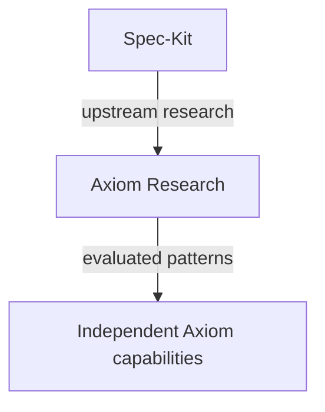

# ADR-0002 — Axiom Relationship with GitHub Spec-Kit

## Status

Accepted on 2026-09-10 after human review of Scenario 001, Scenario 002, and
the Scenario 002 methodology correction.

## Context

Axiom and GitHub Spec-Kit overlap in intent-first development, constitution,
specification, clarification, planning, tasks, implementation, and validation.
Spec-Kit also demonstrates useful patterns for bounded clarification,
requirements checklists, cross-artifact analysis, convergence, traceability,
workflow decomposition, extensions, presets, workflow composition, agent
integration, and context management.

Axiom's target domain is broader than the evaluated Spec-Kit feature flow. Its
authoritative concepts are Workspace, Project, Repository, Work Item,
Specification, Plan, Decision, Execution, Evidence, Artifact, Agent, Provider,
Integration, and Release. No upstream concept automatically replaces an Axiom
concept.

Scenario 001 compared complete documentation-only SDD workflows. Spec-Kit
provided stronger standardized artifacts, cross-artifact analysis, and
convergence, while Axiom was leaner and aligned directly with its own domain.
Spec-Kit's analysis caught an unsupported identifier-allocation inference that
Axiom's self-review missed.

Scenario 002 compared current Axiom, an experimental Axiom-native capability,
and a confined Spec-Kit adapter over five frozen semantic inconsistencies. The
Axiom-native experiment detected 4/5 seeded findings; the adapter detected 3/5.
The adapter lost Decision semantics at its input boundary, consumed more
context and runtime, added integration and upgrade responsibilities, and
created impedance for Project distinct from Repository and future
multi-repository workflows. The methodology correction established that
unexpected findings were not automatically false positives; original model
outputs and frozen evidence were not changed.

Durable evidence: [Axiom and GitHub Spec-Kit Evaluation](../research/axiom-speckit-evaluation.md).
The temporary versioned experiment was retired after human review and
consolidation of its discovery conclusions; this does not change the decision
or its approval history.

## Decision

**Axiom will maintain an independent SDD harness, domain model, and lifecycle,
informed by Spec-Kit.**

Spec-Kit is a strategic upstream research reference, not an architectural or
runtime dependency. Axiom may adopt patterns demonstrated by Spec-Kit only
after validating that they solve an Axiom problem. Resulting capabilities will
be specified and implemented as Axiom-native behavior unless a future,
independently approved decision establishes a narrower integration.

This relationship follows:



The learning path is:

```text
Spec-Kit evolves
-> Axiom observes
-> assess relevance
-> research
-> test whether it solves an Axiom problem
-> experiment when necessary
-> ADR when architecturally relevant
-> Axiom-native implementation
```

Spec-Kit changes are never incorporated automatically.

### Domain ownership

Axiom owns its domain. When Axiom requirements differ from Spec-Kit, deliberate
divergence is allowed and is not, by itself, incompatibility or technical debt.
This is especially relevant to Project distinct from Repository,
multi-repository Projects, Decision, Execution, Evidence, Providers,
Integrations, Release, cross-repository orchestration, durable knowledge, and
observability.

### No runtime or compatibility commitment

This decision establishes no:

- Spec-Kit runtime dependency or required adapter;
- architectural dependency on Spec-Kit;
- behavioral compatibility guarantee;
- equivalence between Axiom and Spec-Kit specifications, plans, or tasks;
- compatibility guarantee for `.specify/`, `spec.md`, `plan.md`, `tasks.md`,
  templates, or any other upstream format;
- automatic import, export, migration, or upgrade path.

Future import/export or adapters require a concrete need, specification,
evidence, and their own approval.

### Strategic upstream watch

A future **Spec-Kit Upstream Watch** should periodically, approximately weekly,
compare the last evaluated upstream state with the current upstream state. It
should consider releases, documentation, workflows, commands, extensions,
presets, agent integrations, templates, architecture, and concepts; record
irrelevant changes; and route relevant changes through research, experiment,
and ADR review when warranted.

The watch is **Planned**, not implemented. This ADR chooses no GitHub Actions,
cron, agent runtime, Lingo component, provider, storage, model, or report
format.

## Alternatives considered

### A — Direct dependency

Immediate reuse of mature upstream capabilities, with the highest coupling to
upstream runtime, layout, commands, templates, versions, and upgrades. It does
not solve Axiom's broader domain needs and would make later divergence harder.

### B — Encapsulation/orchestration

Reuse selected capabilities behind an Axiom surface. Scenario 002 demonstrated
translation loss, lower seeded recall, greater context/runtime cost, mutable
adapter state, and additional compatibility, failure, cleanup, and migration
responsibilities. It remains possible only for a future bounded need with its
own evidence and approval.

### C — Conceptual compatibility

The experiments used this label for the leading hypothesis. It preserved Axiom
authority and enabled learning from Spec-Kit, but “compatibility” could imply a
future behavioral or file-format promise. The accepted decision retains the
learning benefit while explicitly removing that promise.

### D — Reference only

Maximum independence, but a passive relationship risks missing useful upstream
developments. The accepted decision adds deliberate strategic observation
without coupling Axiom to Spec-Kit.

## Consequences

### Positive

- Axiom retains architectural independence and lower coupling.
- No mandatory translation layer or upstream runtime is required.
- Axiom can represent its domain directly and evolve multi-repository behavior.
- Decision, Execution, and Evidence may evolve independently.
- Useful upstream innovations can be absorbed selectively after validation.
- Runtime and vendor coupling are reduced.

### Negative / trade-offs

- Axiom owns implementation and maintenance of its SDD capabilities.
- Axiom must actively monitor upstream developments.
- Useful Spec-Kit improvements do not arrive automatically.
- Patterns may require independent experimentation and implementation.
- Divergence must be deliberate and documented.

## Explicit non-goals

This ADR does not establish or authorize:

- a Spec-Kit runtime dependency or production adapter;
- file, `.specify/`, template, or behavioral compatibility;
- automatic migration;
- Lingo architecture or implementation;
- implementation of the Spec-Kit Upstream Watch;
- implementation of the next Axiom-native SDD harness.

The later Lingo control-plane proposal is intentionally governed by
[ADR-0003](0003-lingo-as-axiom-local-control-plane.md), not by this decision.

## Revisit when

- users demonstrate a concrete interoperability need that cannot be met by an
  Axiom-native capability at acceptable cost;
- a bounded adapter demonstrates materially better validated outcomes after
  preserving Axiom domain semantics;
- Axiom's independent SDD implementation cost or quality becomes unacceptable;
- a material upstream change invalidates assumptions behind this decision.

Reconsideration requires new evidence and does not create an automatic
compatibility or dependency commitment.
