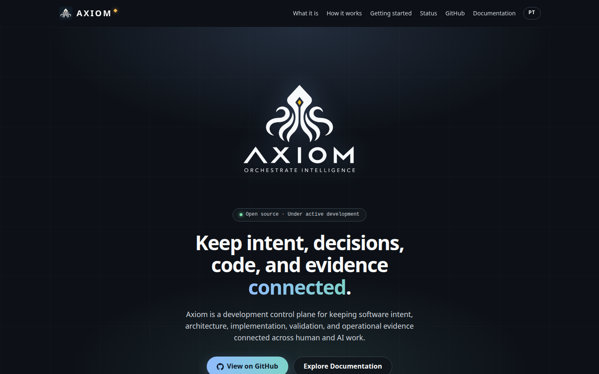
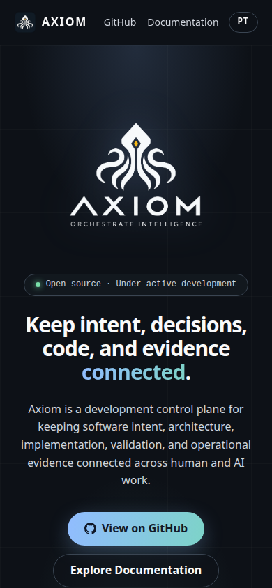
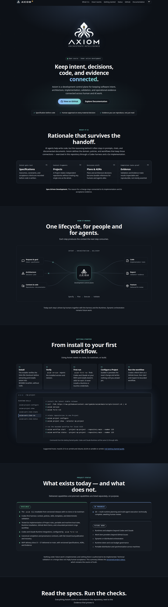

# Landing page — Acceptance Evidence

## Authority and status — 2026-10-01

- Scope: [Issue #86](https://github.com/rgomids/axiom/issues/86) — bootstrap
  public landing page.
- Parallel product surface. It changes no domain contract, Specification, ADR or
  MVP delivery slice, and it advances no slice state.
- Baseline: `main` at `2182b3e` (release 0.2.1,
  [PR #156](https://github.com/rgomids/axiom/pull/156)).
- Delivery branch: `docs/86_added_landing_page`.
- **Implementation: Completed against the amended #86 Definition of Done.
  Evidence: Produced. Human acceptance: Pending. Production deployment:
  observable only after merge — see Limitations.**

Checks, review, commit or merge do not provide human acceptance.

## Decisions reflected in this delivery

These maintainer decisions refine #86 and are what the validator enforces:

1. **Dark is the only theme.** There is no light palette, no theme switch, no
   `prefers-color-scheme` branch and no stored palette preference.
2. **Graphite devtool direction — 2026-10-01.** The maintainer replaced the
   deep-sea direction (navy surfaces and scroll-driven side tentacles) with a
   graphite canvas (`#0D1117`), a blue-to-teal accent and a centred hero. Layout
   and density follow simple devtool landing pages (strong hero, one primary and
   one secondary CTA, few sections); no other project's identity, copy or assets
   are reused. The octopus survives only as the Axiom logo itself.
3. **Motion only in the flow diagram — 2026-10-02.** *How it works* shows the
   flow diagram adapted from the maintainer's `axiom-diagrama/` prototype: three
   inputs, the Axiom core and three deliveries, with two rings pulsing around
   the core (CSS `flow-radiate`) and a signal travelling each wire
   (`diagram.js`). The maintainer chose subtle motion over a static diagram and
   asked for no pause button. Under `prefers-reduced-motion` the rings and the
   signals stop and only the wires remain. Everything else on the page is
   static: depth comes from radial light and a faint grid.
4. **English/Portuguese switch.** The page is authored in English and carries the
   Portuguese version inline (`data-pt`, `data-pt-html`). The language is the only
   stored preference (`axiom-lang`).
5. **Content follows `main`.** The tagline and the description come from the
   versioned README. *Getting started* summarises README *Getting Started* steps
   1–5 and its terminal shows only commands documented there; the window wraps
   long lines so it always fits the screen. The status section mirrors the
   README and the Specifications index: S1–S7 delivered, S8 ready for human
   review, Codex and Claude Runtime integrations available. The diagram core is
   labelled *Development control plane*, the README's term, rather than the
   prototype's "agent manager", because multi-agent execution (S8) still awaits
   human review.
7. **Page structure — 2026-10-02.** Hero → *What it is* → *How it works* (flow
   diagram) → *Getting started* → *Project status* → closing CTA. The header's
   section links follow that order. The facts band (S1–S7, 2 Runtimes, 6 steps)
   and the "for the people deciding / for the agents executing" panels were
   removed at the maintainer's request.
6. **Axiom DS alignment without runtime coupling.** Text, action, focus and
   status colours, the Inter type stack, the 12–48 px type scale, the spacing
   scale, the 6/8 px radii and the 160 ms motion token use the Axiom DS dark
   semantic values (`rgomids/axiom-ds`, `packages/tokens`, commit `ded417f`),
   written as local CSS custom properties. No DS package, framework or build
   step is consumed. Gold (`brand-gold #EDB351`) is used only as brand signature:
   the diamond beside the header wordmark and the gold detail in the logos;
   status uses success, action and muted roles.

Landing-specific exceptions, kept local and marked `landing` in `styles.css`:
the `#0D1117` page canvas and `#12171E` band (deeper than DS `surface.canvas`),
the teal gradient end, display sizes above 48 px for the hero and section
titles, 16 px panel radii and pills, and the monospace stack for eyebrows and
code, and the flow diagram's frame, rings and signals. They are not proposed as
reusable DS primitives.

The diagram's six icons are Lucide (`message-square`, `network`, `folder-git-2`,
`file-code-2`, `file-chart-column`, `package-check`), inlined as SVG with the
Lucide ISC notice at the end of `index.html`. None is in Lucide's
Feather-derived list, so the MIT notice does not apply. The prototype's
embedded logo and the 444 KB `lucide.min.js` are not used; the core shows the
canonical `axiom-logo-white.png`.

### Definition of Done amendments — 2026-10-01

The maintainer decided on 2026-10-01 and 2026-10-02 that decisions 1–3 supersede the
conflicting visual items of #86 and that this delivery completes #86.

| #86 item | Status |
| --- | --- |
| Matrix/terminal-inspired visual identity | Superseded by decision 2 |
| Deep Sea direction; deep navy/blue primary palette | Superseded by decision 2 (graphite canvas, blue accent) |
| Dark mode is the only landing-page theme | Satisfied (decision 1) |
| Light mode can be toggled explicitly | Superseded by decision 1 |
| Amber/gold logo signature preserved selectively | Satisfied (decision 6) |
| Reusable primitives aligned with Axiom DS without framework coupling | Satisfied at token level (decision 6) |
| Reusable decisions reconciled into Axiom DS or documented as landing-specific | Documented as landing-specific above; nothing is proposed back to the DS |

The Issue body still describes the Deep Sea direction. It should be edited to
quote decision 2 so the Issue and this Evidence agree; that edit does not change
the delivered page.

## What is published

`site/` is the whole published surface: `index.html`, `styles.css`, `lang.js`,
`diagram.js`. `ocean.js` was retired with the tentacles. `.github/workflows/deploy-landpage.yml`
uploads that directory verbatim; it assembles nothing and copies nothing into it.

## Canonical asset reuse

`docs/assets/` remains the only versioned location of the identity assets. The
page consumes them through the absolute raw URLs of those canonical files:

```text
https://raw.githubusercontent.com/rgomids/axiom/main/docs/assets/axiom-logo-github.png     header mark
https://raw.githubusercontent.com/rgomids/axiom/main/docs/assets/axiom-logo-white.png      hero logo, flow diagram core
https://raw.githubusercontent.com/rgomids/axiom/main/docs/assets/axiom-logo-black.png      Open Graph, Twitter Card
https://raw.githubusercontent.com/rgomids/axiom/main/docs/assets/axiom-logo-app-black.png  favicon, Apple Touch icon
```

The header uses the rounded app tile at the maintainer's request; on `main` it is
byte-identical to `docs/assets/axiom-logo-github.png` at `d5f7822`. A GitHub
`blob` URL renders an HTML page, so the raw URL is used instead. The white mark is
transparent and keeps its gold detail on the graphite canvas. No `blob` URL is
used for an image, no relative path crosses the published boundary, and no copy of
any asset exists under `site/`.

## Reproducible checks

### Landing page validation

```bash
AXIOM_LANDING_PAGE_REMOTE=1 ./scripts/validate-landing-page.sh .
```

```text
PASS: site/ contains every file the Pages artifact publishes
PASS: no retired landing page file is published
PASS: canonical identity assets exist under docs/assets/
PASS: no canonical asset is duplicated inside site/
PASS: no residual landing_page/ reference in the repository
PASS: site/ loads no image through a GitHub blob URL
PASS: site/ references no identity asset through a relative path
PASS: favicon, Apple Touch icon, Open Graph, Twitter, header and hero use canonical raw URLs
PASS: declared image dimensions match the canonical assets in docs/assets/
PASS: canonical URL, Open Graph and Twitter metadata are present
PASS: dark is the only theme: no OS branch, no stored preference, no toggle
PASS: every text token reaches WCAG AA contrast on every background and surface token
PASS: motion is confined to the flow diagram and off under reduced motion
PASS: no retired background effect: the background is static light only
PASS: every visible string has an English and a Portuguese version
PASS: README.md documents the public URL and the local development command
PASS: every published file answers over http://localhost:58387
PASS: every canonical asset URL answers successfully
PASS: landing page validation passed
```

The local serving check binds a free ephemeral port so it stays deterministic when
port 8000 is taken. The remote asset check needs network and runs only with
`AXIOM_LANDING_PAGE_REMOTE=1`. The residual `landing_page` search covers
versioned files only; untracked files in a working copy are not published.

### Repository and Go validation

```bash
./scripts/validate-repository.sh .
go vet ./...
go build ./...
go mod verify
go test ./...
```

```text
PASS: sensitive-file checks passed (directory)
PASS: Codex agent package structure looks valid
PASS: agent-package validator behavior is valid
PASS: Claude bootstrap check behavior is valid (20 cases)
PASS: sensitive-file checker behavior is valid
PASS: sensitive-file checks passed (worktree)
PASS: repository bootstrap validation passed
go vet: no findings
go build: no output
all modules verified
```

`go test ./...` passes 17 packages and fails 5 on the maintainer workstation:
`cmd/lingo`, `internal/codexruntime`, `internal/install`, `internal/local` and
`internal/runtimebootstrap`. The same packages fail on a clean worktree of
`origin/main` at `2182b3e`, and this branch changes no Go source
(`git diff --stat origin/main...HEAD -- '*.go'` is empty). The failures are
environmental and pre-existing; the CI `go test` run on the pull request is the
authoritative result.

### Reference hygiene

```bash
git grep -n "landing_page" -- . ':!scripts/validate-landing-page.sh' \
  ':!docs/product/evidence-landing-page.md' \
  ':!docs/specifications/004-mvp-v1-baseline/evidence-s3.md'
grep -RE 'github\.com/rgomids/axiom/blob/[^"]*\.(png|jpe?g|gif|svg|webp|ico)' site
grep -RE 'src="(\.\.?/|assets/)' site
grep -R "raw.githubusercontent.com/rgomids/axiom/main/docs/assets" site
```

The first three produce no output. The fourth matches seven canonical references
in `site/index.html`: `og:image`, `twitter:image`, `icon`, `apple-touch-icon`, and
the header, hero and diagram core ``. `evidence-s3.md` is excluded because it
quotes a historical stash message verbatim; editing an accepted record to satisfy
a lint would falsify it. The only `blob` URL in `site/` is the footer link to
`LICENSE`, a document a reader opens, not an asset the browser loads.

### Links and public URL

```bash
grep -oE 'href="https?://[^"]+"' site/index.html | cut -d'"' -f2 | sort -u \
  | while read -r u; do printf '%s  %s\n' "$(curl -s -o /dev/null -w '%{http_code}' -L "$u")" "$u"; done
```

```text
200  https://github.com/rgomids/axiom
200  https://github.com/rgomids/axiom/blob/main/LICENSE
200  https://github.com/rgomids/axiom#documentation
200  https://github.com/rgomids/axiom#project-status
200  https://raw.githubusercontent.com/rgomids/axiom/main/docs/assets/axiom-logo-app-black.png
404  https://rgomids.github.io/axiom/
```

`## Documentation` and `## Project status` exist in `README.md`, so both anchors
resolve. The public URL answers `404` until the first deployment; see Limitations.

### Browser behaviour

A same-origin probe page drives `index.html` in headless Chrome and prints what it
observes. To reproduce, copy `site/` to a scratch directory, add the probe below
as `probe.html`, serve it, and dump the DOM:

```bash
python3 -m http.server 8766 --bind 127.0.0.1 --directory <scratch>/site &
google-chrome --headless --disable-gpu --virtual-time-budget=30000 \
  --dump-dom http://127.0.0.1:8766/probe.html
google-chrome --headless --disable-gpu --force-prefers-reduced-motion \
  --virtual-time-budget=30000 --dump-dom http://127.0.0.1:8766/probe.html
```

<details>
<summary><code>probe.html</code></summary>

```html
<!doctype html><meta charset="utf-8"><title>probe</title>
<pre id="out"></pre>
<script>
var out = [];
function log(s) { out.push(s); document.getElementById('out').textContent = out.join('\n'); }
function frame(width, height) {
  return new Promise(function (resolve) {
    var f = document.createElement('iframe');
    f.style.width = width + 'px'; f.style.height = height + 'px';
    f.onload = function () { setTimeout(function () { resolve(f); }, 1500); };
    f.src = 'index.html';
    document.body.appendChild(f);
  });
}
(async function () {
  localStorage.clear();
  var f = await frame(1440, 900), w = f.contentWindow, d = f.contentDocument;
  var h1 = function () { return d.querySelector('h1').textContent.slice(0, 40); };
  log('first visit   lang=' + d.documentElement.lang + ' toggle=' + d.getElementById('lang-toggle').textContent + ' h1="' + h1() + '"');
  d.getElementById('lang-toggle').click();
  log('after click   lang=' + d.documentElement.lang + ' toggle=' + d.getElementById('lang-toggle').textContent + ' stored=' + localStorage.getItem('axiom-lang') + ' h1="' + h1() + '"');
  f.remove(); f = await frame(1440, 900); w = f.contentWindow; d = f.contentDocument;
  log('after reload  lang=' + d.documentElement.lang + ' toggle=' + d.getElementById('lang-toggle').textContent + ' h1="' + h1() + '"');
  d.getElementById('lang-toggle').click();
  log('second click  lang=' + d.documentElement.lang + ' stored=' + localStorage.getItem('axiom-lang'));
  log('storage keys  ' + Object.keys(localStorage).join(','));
  var imgs = d.querySelectorAll('img');
  for (var i = 0; i < imgs.length; i++) log('img ' + (imgs[i].complete && imgs[i].naturalWidth ? 'OK ' : 'BROKEN ') + imgs[i].naturalWidth + 'x' + imgs[i].naturalHeight + ' ' + imgs[i].className + ' ' + imgs[i].src.split('/').pop());
  log('body background ' + w.getComputedStyle(d.body).backgroundColor);
  log('running animations ' + d.getAnimations().length + ' (' + d.getAnimations().map(function (x) { return x.animationName; }).join(',') + ')');
  var nav = Array.prototype.map.call(d.querySelectorAll('.nav-section'), function (l) { return l.getAttribute('href'); });
  var page = Array.prototype.map.call(d.querySelectorAll('main section[id]'), function (x) { return '#' + x.id; }).filter(function (id) { return nav.indexOf(id) >= 0; });
  log('nav order     ' + nav.join(' ') + (nav.join() === page.join() ? '  = page order' : '  != page order ' + page.join(' ')));
  var dotsShown = Array.prototype.filter.call(d.querySelectorAll('.flow-dot'), function (c) { return c.style.opacity === '1'; }).length;
  log('flow wires=' + d.querySelectorAll('.flow-wire').length + ' signals-visible=' + dotsShown);
  log('overflow@1440 ' + (d.documentElement.scrollWidth > d.documentElement.clientWidth));
  f.remove(); f = await frame(390, 844); d = f.contentDocument;
  log('overflow@390  ' + (d.documentElement.scrollWidth > d.documentElement.clientWidth) +
      ' section-links=' + f.contentWindow.getComputedStyle(d.querySelector('.nav-section')).display +
      ' brand-name=' + f.contentWindow.getComputedStyle(d.querySelector('.brand-name')).display);
  log('DONE');
})();
</script>
```

</details>

Default run:

```text
first visit   lang=en toggle=PT h1="Keep intent, decisions, code, and eviden"
after click   lang=pt-BR toggle=EN stored=pt h1="Mantenha intenção, decisões, código e ev"
after reload  lang=pt-BR toggle=EN h1="Mantenha intenção, decisões, código e ev"
second click  lang=en stored=en
storage keys  axiom-lang
img OK 1254x1254 brand-mark axiom-logo-github.png
img OK 1254x1254 hero-logo axiom-logo-white.png
img OK 1254x1254 flow-logo axiom-logo-white.png
body background rgb(13, 17, 23)
running animations 7 (,,,,,flow-radiate,flow-radiate)
nav order     #what #how #start #status  = page order
flow wires=6 signals-visible=1
overflow@1440 false
overflow@390  false section-links=none brand-name=block
DONE
```

With `--force-prefers-reduced-motion`:

```text
running animations 0 ()
flow wires=6 signals-visible=0
```

What this shows:

- **Assets:** every `` loads from its canonical raw URL, and its natural size
  matches the declared `width`/`height`. No asset is broken.
- **Theme:** the page renders the graphite palette with nothing stored. The only
  key ever written is `axiom-lang`.
- **Language:** the choice survives a reload and switches back.
- **Motion:** the only named animations are the two `flow-radiate` rings; the
  other running entries are short opacity transitions on the diagram signals.
  Under reduced motion nothing runs and no signal is visible; the six wires stay.
- **Header order:** the section links (`#what #how #start #status`) appear in
  the same order as the sections on the page.
- **Layout:** no horizontal overflow at 1440 px or 390 px. At 390 px the section
  links are hidden and the diagram stacks vertically; the *Getting started*
  window and its code fit the viewport at both widths (measured with
  `scrollWidth <= clientWidth`), wrapping long commands on small screens.

Screenshots, captured with headless Chrome against the locally served `site/`
and stored next to this Evidence (not published by the Pages workflow):

```bash
google-chrome --headless --hide-scrollbars --window-size=1440,900  --virtual-time-budget=20000 --screenshot=desktop-hero.png http://127.0.0.1:8000/
google-chrome --headless --hide-scrollbars --window-size=1440,5000 --virtual-time-budget=20000 --screenshot=full.png         http://127.0.0.1:8000/
google-chrome --headless --hide-scrollbars --window-size=390,844   --virtual-time-budget=20000 --screenshot=mobile-hero.png  http://127.0.0.1:8000/
```

The full page was trimmed and scaled to 50 %; metadata was stripped.





<details>
<summary>Full page, desktop</summary>



</details>

### Supply chain

`.github/workflows/deploy-landpage.yml` holds `pages: write` and
`id-token: write`, so every Action is pinned to an immutable commit SHA,
following `.github/workflows/ci.yml`. Each pin was compared with the official tag:

```bash
git ls-remote https://github.com/actions/<action> 'refs/tags/<tag>' 'refs/tags/<tag>^{}'
```

```text
actions/checkout@v4               11d5960a326750d5838078e36cf38b85af677262  MATCH
actions/configure-pages@v5        983d7736d9b0ae728b81ab479565c72886d7745b  MATCH
actions/upload-pages-artifact@v3  56afc609e74202658d3ffba0e8f6dda462b719fa  MATCH
actions/deploy-pages@v4           d6db90164ac5ed86f2b6aed7e0febac5b3c0c03e  MATCH
```

The workflow uploads `./site` unchanged and copies no logo into it.

## Expected deployment

- Artifact: the contents of `site/`, uploaded by `actions/upload-pages-artifact`
  and deployed by `actions/deploy-pages` in the `github-pages` environment, under
  the `pages` concurrency group with `cancel-in-progress: false`.
- Trigger: push to `main` touching `site/**` or the workflow, or
  `workflow_dispatch`.
- Public URL: <https://rgomids.github.io/axiom/>, also the page's
  `<link rel="canonical">`, documented in [README](../../README.md#website) and
  [README.pt-BR](../README.pt-BR.md#site).

## Limitations

- **#86 Issue text not yet synchronized.** Decision 2 supersedes the Deep Sea
  direction the Issue still describes (see
  [Definition of Done amendments](#definition-of-done-amendments--2026-10-01)).
- **Deployment is observable only after merge.** The workflow triggers on `main`,
  and GitHub Pages must be enabled with *GitHub Actions* as its source. The Pages
  run, the served artifact and the live URL must be confirmed after merge.
- **Assets resolve against `main`.** The raw URLs pin the `main` branch. A renamed
  or moved asset would break the page; the validator fails closed if the canonical
  files or references stop matching.
- **Status is a snapshot.** The status section mirrors `main` as of the baseline.
  It must be updated with the README when slice state changes; the page links the
  versioned status as the source of truth.
- **Axiom DS values are copied, not consumed.** The DS packages are private and
  unpublished, and its compiled CSS defaults to the light theme, so the dark
  semantic values are written as local custom properties. A DS token change is
  not picked up automatically.
- The Open Graph and Twitter image is the 1 MB `axiom-logo-black.png`; an
  optimised derivative would be a new canonical asset decision, not a copy under
  `site/`.
- How social platforms crop or cache the Open Graph and Twitter images is outside
  this Evidence.
- Headless Chrome only: no cross-browser or real-device matrix, and no Lighthouse
  score. #86 asks for reasonable performance, accessibility and SEO, not a
  threshold.
- The Portuguese copy has had no native review beyond the author's. It is the
  page's own copy, not a translation of an approved Specification.
