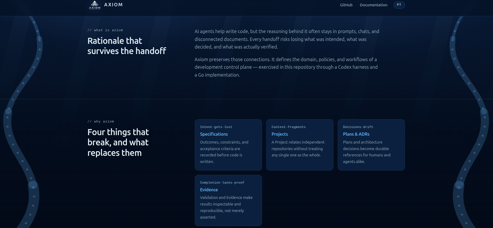
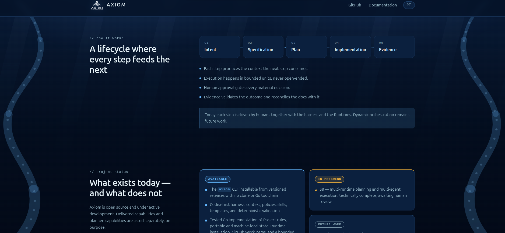

# Landing page — Acceptance Evidence

## Authority and status — 2026-10-01

- Scope: [Issue #86](https://github.com/rgomids/axiom/issues/86) — bootstrap
  public landing page.
- Parallel product surface. It changes no domain contract, Specification, ADR or
  MVP delivery slice, and it advances no slice state.
- Baseline: `main` at `2182b3e` (release 0.2.1,
  [PR #156](https://github.com/rgomids/axiom/pull/156)).
- Delivery branch: `docs/86_added_landing_page`.
- **Implementation: Completed against the amended #86 Definition of Done.
  Evidence: Produced. Human acceptance: Pending. Production deployment:
  observable only after merge — see Limitations.**

Checks, review, commit or merge do not provide human acceptance.

## Decisions reflected in this delivery

These maintainer decisions refine #86 and are what the validator enforces:

1. **Dark is the only theme.** There is no light palette, no theme switch, no
   `prefers-color-scheme` branch and no stored palette preference.
2. **Deep-sea direction instead of Matrix green.** Deep-blue surfaces, a blue
   accent, and two side tentacles behind the content.
3. **No animation.** Nothing moves on its own. Depth is suggested by static light
   shafts that fade with depth and by an abyss overlay that darkens as the reader
   scrolls. The tentacles slide in with the scroll position; under
   `prefers-reduced-motion` they stay in place.
4. **English/Portuguese switch.** The page is authored in English and carries the
   Portuguese version inline (`data-pt`, `data-pt-html`). The language is the only
   stored preference (`axiom-lang`).
5. **Project status follows `main`.** The status section mirrors the versioned
   README and Specifications index: S1–S7 delivered, S8 technically complete and
   awaiting human review, Codex and Claude Runtime integrations available.

Decisions 1 and 2 replace three #86 Definition of Done items: *Visual identity
follows the Matrix/terminal-inspired Axiom direction*, *Dark mode is the
default* (now the only mode), and *Light mode can be toggled explicitly*.
Decision 3 stays within #86, which allows lightweight animation but does not
require it.

### Definition of Done amendment — 2026-10-01

The maintainer decided on 2026-10-01 that decisions 1–3 supersede those
#86 items and that this delivery completes #86. Against the amended Definition
of Done:

| #86 item | Status |
| --- | --- |
| Matrix/terminal-inspired visual identity | Superseded by decision 2 (deep-sea direction) |
| Dark mode is the default | Satisfied: dark is the only theme (decision 1) |
| Light mode can be toggled explicitly | Superseded by decision 1 (no light theme) |

The Issue body still lists the original items. It should be edited to quote this
amendment so the Issue and this Evidence agree; that edit does not change the
delivered page.

## What is published

`site/` is the whole published surface: `index.html`, `styles.css`, `ocean.js`,
`lang.js`. `.github/workflows/deploy-landpage.yml` uploads that directory
verbatim; it assembles nothing and copies nothing into it.

## Canonical asset reuse

`docs/assets/` remains the only versioned location of the identity assets. The
page consumes them through the absolute raw URLs of those canonical files:

```text
https://raw.githubusercontent.com/rgomids/axiom/main/docs/assets/axiom-logo-white.png      header mark
https://raw.githubusercontent.com/rgomids/axiom/main/docs/assets/axiom-logo-black.png      hero, Open Graph, Twitter Card
https://raw.githubusercontent.com/rgomids/axiom/main/docs/assets/axiom-logo-app-black.png  favicon, Apple Touch icon
```

The white mark is transparent, so the header needs no blend mode. The hero uses
the dark, glowing artwork that matches the deep-sea page. The app icon is opaque,
so it survives any background a browser or launcher composites it on. No `blob`
URL is used for an image, no relative path crosses the published boundary, and
no copy of any asset exists under `site/`.

## Reproducible checks

### Landing page validation

```bash
AXIOM_LANDING_PAGE_REMOTE=1 ./scripts/validate-landing-page.sh .
```

```text
PASS: site/ contains every file the Pages artifact publishes
PASS: no retired landing page file is published
PASS: canonical identity assets exist under docs/assets/
PASS: no canonical asset is duplicated inside site/
PASS: no residual landing_page/ reference in the repository
PASS: site/ loads no image through a GitHub blob URL
PASS: site/ references no identity asset through a relative path
PASS: favicon, Apple Touch icon, Open Graph, Twitter, header and hero use canonical raw URLs
PASS: declared image dimensions match the canonical assets in docs/assets/
PASS: canonical URL, Open Graph and Twitter metadata are present
PASS: dark is the only theme: no OS branch, no stored preference, no toggle
PASS: every text token reaches WCAG AA contrast on every background and surface token
PASS: no animation: no keyframes, no script-driven motion, reduced motion honoured
PASS: the background is the two tentacles, revealed by scrolling
PASS: every visible string has an English and a Portuguese version
PASS: README.md documents the public URL and the local development command
PASS: every published file answers over http://localhost:45907
PASS: every canonical asset URL answers successfully
PASS: landing page validation passed
```

The local serving check binds a free ephemeral port so it stays deterministic when
port 8000 is taken. The remote asset check needs network and runs only with
`AXIOM_LANDING_PAGE_REMOTE=1`. The residual `landing_page` search covers
versioned files only; untracked files in a working copy are not published.

### Repository and Go validation

```bash
./scripts/validate-repository.sh .
go vet ./...
go build ./...
go mod verify
go test ./...
```

```text
PASS: sensitive-file checks passed (directory)
PASS: Codex agent package structure looks valid
PASS: agent-package validator behavior is valid
PASS: Claude bootstrap check behavior is valid (20 cases)
PASS: sensitive-file checker behavior is valid
PASS: sensitive-file checks passed (worktree)
PASS: repository bootstrap validation passed
go vet: no findings
go build: no output
all modules verified
```

`go test ./...` passes 17 packages and fails 5 on the maintainer workstation:
`cmd/lingo`, `internal/codexruntime`, `internal/install`, `internal/local` and
`internal/runtimebootstrap`. The same packages fail on a clean worktree of
`origin/main` at `2182b3e`, and this branch changes no Go source
(`git diff --stat origin/main...HEAD -- '*.go'` is empty). The failures are
environmental and pre-existing; the CI `go test` run on the pull request is the
authoritative result.

### Reference hygiene

```bash
git grep -n "landing_page" -- . ':!scripts/validate-landing-page.sh' \
  ':!docs/product/evidence-landing-page.md' \
  ':!docs/specifications/004-mvp-v1-baseline/evidence-s3.md'
grep -RE 'github\.com/rgomids/axiom/blob/[^"]*\.(png|jpe?g|gif|svg|webp|ico)' site
grep -RE 'src="(\.\.?/|assets/)' site
grep -R "raw.githubusercontent.com/rgomids/axiom/main/docs/assets" site
```

The first three produce no output. The fourth lists the six canonical references
in `site/index.html`: `og:image`, `twitter:image`, `icon`, `apple-touch-icon`, the
header `` and the hero ``. `evidence-s3.md` is excluded because it
quotes a historical stash message verbatim; editing an accepted record to satisfy
a lint would falsify it. The only `blob` URL in `site/` is the footer link to
`LICENSE`, a document a reader opens, not an asset the browser loads.

### Links and public URL

```bash
grep -oE 'href="https?://[^"]+"' site/index.html | cut -d'"' -f2 | sort -u \
  | while read -r u; do printf '%s  %s\n' "$(curl -s -o /dev/null -w '%{http_code}' -L "$u")" "$u"; done
```

```text
200  https://github.com/rgomids/axiom
200  https://github.com/rgomids/axiom/blob/main/LICENSE
200  https://github.com/rgomids/axiom#documentation
200  https://github.com/rgomids/axiom#project-status
200  https://raw.githubusercontent.com/rgomids/axiom/main/docs/assets/axiom-logo-app-black.png
404  https://rgomids.github.io/axiom/
```

`## Documentation` and `## Project status` exist in `README.md`, so both anchors
resolve. The public URL answers `404` until the first deployment; see Limitations.

### Browser behaviour

A same-origin probe page drives `index.html` in headless Chrome and prints what it
observes. To reproduce, copy `site/` to a scratch directory, add the probe below
as `probe.html`, serve it, and dump the DOM:

```bash
python3 -m http.server 8766 --bind 127.0.0.1 --directory <scratch>/site &
google-chrome --headless --disable-gpu --virtual-time-budget=30000 \
  --dump-dom http://127.0.0.1:8766/probe.html
google-chrome --headless --disable-gpu --force-prefers-reduced-motion \
  --virtual-time-budget=30000 --dump-dom http://127.0.0.1:8766/probe.html
```

<details>
<summary><code>probe.html</code></summary>

```html
<!doctype html><meta charset="utf-8"><title>probe</title>
<pre id="out"></pre>
<script>
var out = [];
function log(s) { out.push(s); document.getElementById('out').textContent = out.join('\n'); }
function frame(width, height) {
  return new Promise(function (resolve) {
    var f = document.createElement('iframe');
    f.style.width = width + 'px'; f.style.height = height + 'px';
    f.onload = function () { setTimeout(function () { resolve(f); }, 1500); };
    f.src = 'index.html';
    document.body.appendChild(f);
  });
}
function wait(ms) { return new Promise(function (r) { setTimeout(r, ms); }); }
(async function () {
  localStorage.clear();
  var f = await frame(1440, 900), w = f.contentWindow, d = f.contentDocument;
  var h1 = function () { return d.querySelector('h1').textContent.slice(0, 40); };
  log('first visit   lang=' + d.documentElement.lang + ' toggle=' + d.getElementById('lang-toggle').textContent + ' h1="' + h1() + '"');
  d.getElementById('lang-toggle').click();
  log('after click   lang=' + d.documentElement.lang + ' toggle=' + d.getElementById('lang-toggle').textContent + ' stored=' + localStorage.getItem('axiom-lang') + ' h1="' + h1() + '"');
  f.remove(); f = await frame(1440, 900); w = f.contentWindow; d = f.contentDocument;
  log('after reload  lang=' + d.documentElement.lang + ' toggle=' + d.getElementById('lang-toggle').textContent + ' h1="' + h1() + '"');
  d.getElementById('lang-toggle').click();
  log('second click  lang=' + d.documentElement.lang + ' stored=' + localStorage.getItem('axiom-lang'));
  log('storage keys  ' + Object.keys(localStorage).join(','));
  var imgs = d.querySelectorAll('img');
  for (var i = 0; i < imgs.length; i++) log('img ' + (imgs[i].complete && imgs[i].naturalWidth ? 'OK ' : 'BROKEN ') + imgs[i].naturalWidth + 'x' + imgs[i].naturalHeight + ' ' + imgs[i].src.split('/').pop());
  log('body background ' + w.getComputedStyle(d.body).backgroundColor);
  log('running animations ' + d.getAnimations().length);
  var left = d.querySelector('.tentacle-left'), bd = d.querySelector('.backdrop');
  for (var y of [0, 260, 900]) {
    w.scrollTo({ top: y, behavior: 'instant' }); await wait(1000);
    log('scrollY=' + Math.round(w.scrollY) + ' reveal=' + d.documentElement.style.getPropertyValue('--tentacle-reveal') +
        ' tentacle=' + w.getComputedStyle(left).transform + ' abyss=' + w.getComputedStyle(bd, '::after').opacity);
  }
  log('overflow@1440 ' + (d.documentElement.scrollWidth > d.documentElement.clientWidth));
  f.remove(); f = await frame(390, 844); d = f.contentDocument;
  log('overflow@390  ' + (d.documentElement.scrollWidth > d.documentElement.clientWidth) +
      ' brand-name=' + f.contentWindow.getComputedStyle(d.querySelector('.brand-name')).display);
  log('DONE');
})();
</script>
```

</details>

Default run:

```text
first visit   lang=en toggle=PT h1="Keep intent, decisions, code, and eviden"
after click   lang=pt-BR toggle=EN stored=pt h1="Mantenha intenção, decisões, código e ev"
after reload  lang=pt-BR toggle=EN h1="Mantenha intenção, decisões, código e ev"
second click  lang=en stored=en
storage keys  axiom-lang
img OK 1254x1254 axiom-logo-white.png
img OK 1536x1024 axiom-logo-black.png
body background rgb(4, 17, 38)
running animations 0
scrollY=0 reveal=0.000 tentacle=matrix(1, 0, 0, 1, -249.693, 0) abyss=0
scrollY=260 reveal=0.438 tentacle=matrix(1, 0, 0, 1, -140.327, 0) abyss=0.438
scrollY=900 reveal=1.000 tentacle=matrix(1, 0, 0, 1, 0, 0) abyss=1
overflow@1440 false
overflow@390  false brand-name=none
DONE
```

What this shows:

- **Assets:** both `` load from their canonical raw URLs, and their natural
  sizes match the declared `width`/`height`. No asset is broken.
- **Theme:** the page renders the dark palette with nothing stored. The only key
  ever written is `axiom-lang`.
- **Language:** the choice survives a reload and switches back.
- **Motion:** `document.getAnimations()` is empty. The tentacles and the abyss
  overlay track the scroll position and saturate at 1.
- **Layout:** no horizontal overflow at 1440 px or 390 px. At 390 px the header
  shows the mark only, so the word "Axiom" never collides with the navigation.

With `--force-prefers-reduced-motion`, the tentacle `transform` is `none` at
scroll positions 0, 260 and 900: the tentacles stay in place instead of sliding
in. The `--tentacle-reveal` values in that run depend on headless frame timing,
so they are not recorded as a result.

Viewports were also inspected visually:

```bash
google-chrome --headless --hide-scrollbars --window-size=1440,900 --screenshot=desktop.png http://127.0.0.1:8000/
google-chrome --headless --hide-scrollbars --window-size=390,844  --screenshot=mobile.png  http://127.0.0.1:8000/
```

Both render the hero, readable copy and both CTAs. At 390 px the hero stacks, the
CTAs become full width, and the tentacles narrow and fade. On desktop the status
section keeps *Available* on the left with *In progress* and *Future work* stacked
on the right.

#### Maintainer screenshots — 2026-10-01

Captured by the maintainer in Chrome at a 1876 px wide desktop viewport, serving
`site/` locally. The browser toolbar was cropped out and metadata stripped; the
page content is unedited. They are review Evidence only and are not published by
the Pages workflow.






### Supply chain

`.github/workflows/deploy-landpage.yml` holds `pages: write` and
`id-token: write`, so every Action is pinned to an immutable commit SHA,
following `.github/workflows/ci.yml`. Each pin was compared with the official tag:

```bash
git ls-remote https://github.com/actions/<action> 'refs/tags/<tag>' 'refs/tags/<tag>^{}'
```

```text
actions/checkout@v4               11d5960a326750d5838078e36cf38b85af677262  MATCH
actions/configure-pages@v5        983d7736d9b0ae728b81ab479565c72886d7745b  MATCH
actions/upload-pages-artifact@v3  56afc609e74202658d3ffba0e8f6dda462b719fa  MATCH
actions/deploy-pages@v4           d6db90164ac5ed86f2b6aed7e0febac5b3c0c03e  MATCH
```

The workflow uploads `./site` unchanged and copies no logo into it.

## Expected deployment

- Artifact: the contents of `site/`, uploaded by `actions/upload-pages-artifact`
  and deployed by `actions/deploy-pages` in the `github-pages` environment, under
  the `pages` concurrency group with `cancel-in-progress: false`.
- Trigger: push to `main` touching `site/**` or the workflow, or
  `workflow_dispatch`.
- Public URL: <https://rgomids.github.io/axiom/>, also the page's
  `<link rel="canonical">`, documented in [README](../../README.md#website) and
  [README.pt-BR](../README.pt-BR.md#site).

## Limitations

- **#86 Issue text not yet synchronized.** The 2026-10-01 amendment (see
  [Definition of Done amendment](#definition-of-done-amendment--2026-10-01))
  supersedes the Matrix-green and light-mode items, but the Issue body still
  lists them until it is edited.
- **Deployment is observable only after merge.** The workflow triggers on `main`,
  and GitHub Pages must be enabled with *GitHub Actions* as its source. The Pages
  run, the served artifact and the live URL must be confirmed after merge.
- **Assets resolve against `main`.** The raw URLs pin the `main` branch, so the
  refreshed `axiom-logo-black.png` in this branch appears on the page only after
  merge. A renamed or moved asset would break the page; the validator fails
  closed if the canonical files or references stop matching.
- **Status is a snapshot.** The status section mirrors `main` as of the baseline.
  It must be updated with the README when slice state changes; the page links the
  versioned status as the source of truth.
- The hero artwork is a 1 MB PNG served from `raw.githubusercontent.com`. An
  optimised derivative would be a new canonical asset decision, not a copy under
  `site/`.
- How social platforms crop or cache the Open Graph and Twitter images is outside
  this Evidence.
- Headless Chrome only: no cross-browser or real-device matrix, and no Lighthouse
  score. #86 asks for reasonable performance, accessibility and SEO, not a
  threshold.
- The Portuguese copy has had no native review beyond the author's. It is the
  page's own copy, not a translation of an approved Specification.
