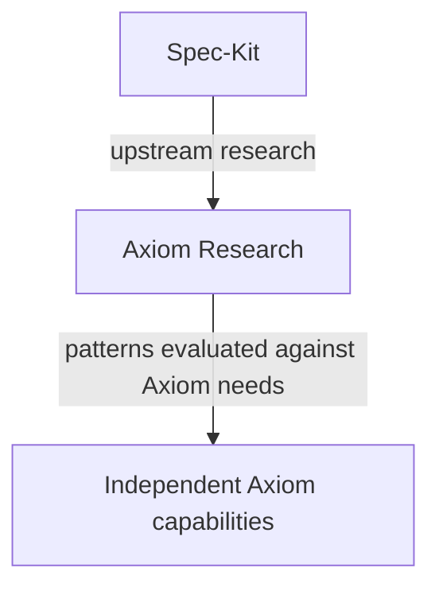
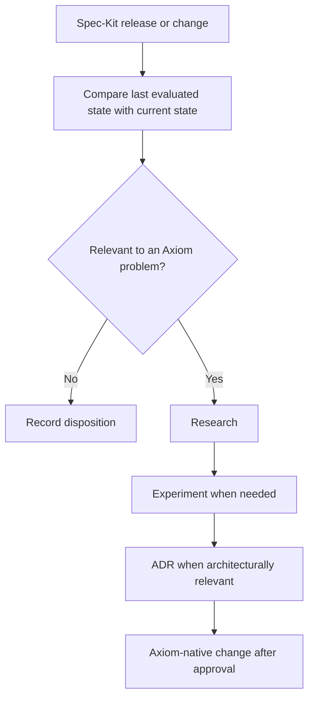

# Spec-Kit Strategic Upstream Reference

## Status

**Planned operational direction.** No monitoring automation is implemented or
authorized by this document.

## Register

| Field | Value |
|---|---|
| Upstream | Spec-Kit |
| Repository | <https://github.com/github/spec-kit> |
| Role | Strategic upstream research reference |
| Runtime dependency | None |
| Architectural dependency | None |
| Compatibility guarantee | None |
| Monitoring | Planned |
| Intended evaluation cadence | Approximately weekly |

Specific versions belong only to historical experiment evidence. Axiom does not
fix an upstream Spec-Kit version as a domain or runtime requirement.

## Relationship

Axiom learns from patterns, not implementations by default. Candidate patterns
include bounded clarification, requirements checklists, cross-artifact
analysis, analyze/converge, traceability, coverage validation, workflow
decomposition, extensions, presets, workflow composition, agent integration,
and context management.

The governing question is: **Does this solve an Axiom problem?** The objective
is not to reproduce each new Spec-Kit feature.

## Planned Spec-Kit Upstream Watch

### Objective

Systematically identify upstream changes that may improve Axiom without making
Spec-Kit part of Axiom's runtime, domain, file formats, or architecture.

### Responsibility

The future watch process will compare upstream states, classify relevance,
preserve a traceable research record, and route architecturally relevant
findings to an ADR. It will not adopt changes automatically.

### Evaluation flow

Relevance review should cover releases, documentation, workflows, commands,
extensions, presets, agent integrations, templates, architecture, and concepts.
It compares the last evaluated upstream state with the current state rather
than relying only on major-version detection.

### Criteria

- the change addresses a stated Axiom problem or validated gap;
- effects on Axiom domain semantics are explicit;
- coupling, context/runtime cost, security, maintenance, and reversibility are
  assessed;
- experiments are used when evidence cannot be established by inspection;
- architectural consequences are decided through an ADR;
- any implementation remains Axiom-native unless separately approved.

## Deferred design choices

This document intentionally does not choose GitHub Actions, cron, agent runtime,
Lingo, provider, storage, model, or final report format. Those choices belong to
a future specification for **Design Spec-Kit Upstream Watch**.

The separate next product activity is **Design the first Axiom-native SDD
harness evolution**. Candidate phases such as intake, specify, clarify, plan,
tasks, implement, review, analyze, converge, and reconcile are inputs to that
future specification, not an approved workflow.

## Decision and evidence

- [ADR-0002](../decisions/0002-axiom-speckit-relationship.md) establishes the
  accepted relationship.
- [Axiom and GitHub Spec-Kit Evaluation](axiom-speckit-evaluation.md) preserves
  the research path and measured evidence.
- [`experiments/speckit-evaluation/`](../../experiments/speckit-evaluation/)
  preserves Scenario 001 and Scenario 002 reproducibility evidence.
