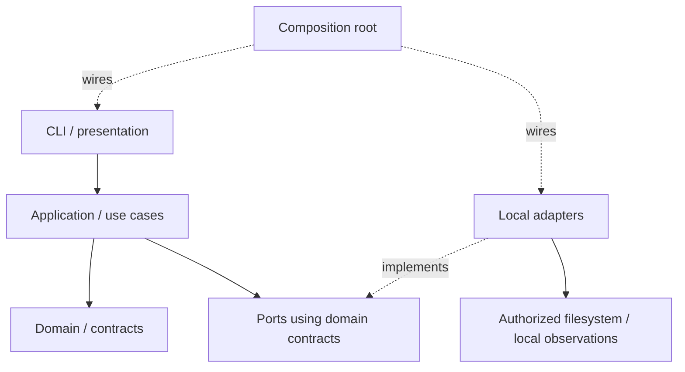

# Plan — Specification 002: Lingo Project Initialization

## Status, authority and scope

**Plan ready for human review** — 2026-09-11. Proposed technical plan; not approved.

Baseline: `main` at `374c643`, after PR #3 merged. The approved
[Specification](spec.md) and [Q1–Q6](clarifications.md) close intake → specify →
clarify. This change advances only to Plan. Tasks and Implementation require
explicit human approval of this Plan and authorization to advance.
All components, formats, tests and commands described below are future work;
no executable Lingo, parser, filesystem implementation or application test exists
as a result of this document.

Read in full: Specification, clarifications, [ADR-0001](../../decisions/0001-project-is-not-repository.md),
[ADR-0002](../../decisions/0002-axiom-speckit-relationship.md),
[ADR-0003](../../decisions/0003-lingo-as-axiom-local-control-plane.md),
[conceptual model](../../architecture/conceptual-model.md),
[Constitution](../../product/constitution.md), and [roadmap](../../product/roadmap.md).
Also applied [repository instructions](../../../AGENTS.md),
[SDD harness](../../../.agents/skills/axiom-sdd/SKILL.md),
[architecture policy](../../../.agents/policies/architecture.md),
[quality policy](../../../.agents/policies/quality.md),
[security policy](../../../.agents/policies/security.md),
[documentation policy](../../../.agents/policies/documentation.md),
[Provider boundaries](../../architecture/provider-boundaries.md), and
[harness boundaries](../../agent-harness.md).

Only Axiom repository is affected. The proposed implementation language remains
Go; this change adds no Go files, module, dependency, CLI framework, parser
library, adapter, storage engine, migration, new CI or `tasks.md`.
No Provider implementation, external Integration, Runtime execution, clone/fetch,
credential store, Windows implementation, Work Item, model selection, complete
capability negotiation, orchestration, fork semantics or semantic Provider
repository resolution belongs to this slice.

## 1. Architecture and minimal organization

The first slice establishes a portable Project, then reopens and installs it
without network or AI. Lingo presents and executes Axiom contracts; it does not
own or redefine Project identity. Project is not Repository or Runtime, Role is
not Model, Provider is not Transport, Integration is not MCP.

Conceptual flow is CLI → application → domain/contracts → ports → adapters.
Source dependencies point inward: domain imports neither ports nor adapters;
application owns the ports it consumes; adapters implement them. The arrow from
ports to adapters describes dispatch, not an import from domain into infrastructure.
This is a C4 component-level view inside one local Lingo process, not a deployment
or global Axiom module decision.

Proposed paths only; create them in later authorized implementation as needed:

| Proposed location | Layer and responsibility | Excluded responsibility |
|---|---|---|
| `cmd/lingo/` | Composition root: assemble dependencies, enter presentation, return process status | Validation or persistence rules |
| `internal/project/` | Domain: Project ID/name, Repository associations, optional declarations, reference integrity, syntactic matching, portable equivalence, typed issues | YAML, OS paths, I/O, vendor catalogs, ownership hierarchy |
| `internal/projectapp/` | Application: create, validate, reopen, install, replace binding; confirmation and recovery orchestration; consumer-owned ports | CLI flags, raw OS errors, external setup |
| `internal/manifest/` | Adapter: strict YAML decode/encode, wire DTO to domain mapping, safe parser diagnostics | Domain rules embedded in parser types |
| `internal/local/` | Adapters: authorized file access, atomic publication, local record storage, OS root discovery, checkout and executable observations | Provider/Runtime execution or secret retrieval |
| `internal/cli/` | Presentation: guided collection, correction, preview, cancellation, safe result rendering | A second validator, implicit defaults from accounts, force overwrite |
| Colocated tests and `testdata/` | Unit fixtures and future local integration/black-box cases | Production data or persistent service dependencies |

Keep files cohesive within these packages, not one package/interface per noun.
Split `local` only if implementation evidence reveals separate maintenance needs.
No generic repository CRUD, dependency-injection framework, event bus, plugin SDK,
Workspace catalog or global persistence abstraction.

Minimum boundary contracts, expressed here as responsibilities rather than APIs:

| Port / seam | Input → output and consumer |
|---|---|
| Manifest codec | Bytes → parsed portable definition + safe issues; validated definition → canonical bytes; application consumes |
| Portable store | Explicit authorized target + expected observation + validated bytes → created/no-op/conflict/recovery result; no unrestricted path-write interface |
| Local installation store | Project ID + expected record revision + proposed local snapshot → atomic result; separate from portable store |
| Local observations | Explicit checkout/executable/reference paths → read-only facts or safe failure; no command execution method |
| Identity and attempt metadata | New UUID v4 only when creation is necessary; injectable entropy/clock for repeatable tests |
| Optional text inspection | Untrusted text → sanitized warning categories or unavailable/failed; no authority to rewrite or certify configuration |

Use small consumer-owned interfaces where I/O/fault substitution is required.
Pure functions need no interfaces. Presentation provides entered values and explicit
confirmation tied to a preview; application rechecks that preview before any write.

## 2. Portable manifest contract

Proposed initial token: integer `schemaVersion: 1`. Support exactly integer `1`;
missing, null, string `"1"`, malformed or other versions fail. There is no implied
backward/forward compatibility, numeric proximity rule, migration or down-conversion.
Publish this table with future implementation. A later incompatible change requires
explicit version policy and human review, not silent acceptance under version 1.

The Specification selected conceptual fields; the following names and encodings
make them implementable for this slice, subject to Plan approval. They do not
establish Axiom-wide schemas or lifecycle states.

| Field | Proposed version 1 shape and validation |
|---|---|
| `schemaVersion` | Required integer `1` |
| `project` | Required closed mapping: `id` UUID v4, `name` nonblank string |
| `repositories` | Required nonempty sequence of closed mappings: `key` nonblank Project-scoped string, optional `remote` locator string; no local path |
| `runtime` | Optional `unconfigured` scalar or closed mapping with required opaque `id` |
| `providers` | Optional `unconfigured` scalar or sequence, possibly empty, of closed `{key, id}` mappings; both nonblank; no category cardinality/default |
| `integrations` | Optional `unconfigured` scalar or sequence of declarations: required `key`, optional `providerRef`, `capabilities` string list, `transport`, `credentialRef`; no operational binding implied |
| `modelProfiles` | Optional `unconfigured` scalar or sequence: `key` and either `state: unconfigured`, or both `runtimeRef` and opaque `model`; configured reference must match selected Runtime |
| `businessContext` | Optional `unconfigured` scalar or closed mapping: optional `text`, optional `documents` list of contained relative document paths; text may include purpose/glossary/rules without ontology |
| `credentialReferences` | Optional `unconfigured` scalar or sequence: required logical `key`, optional logical `sourceHint`; no value/path field |
| `policies` | Optional `unconfigured` scalar or list of contained relative document references; never overrides governing security |

For an Integration, `transport` is an optional closed mapping with required
opaque `id` and optional logical `reference`. A transport binding requires
`providerRef`; a declaration with only `key`/requested capabilities is permitted
and reported missing a binding. References, when supplied, must resolve within
this definition: `providerRef` to Provider key, `credentialRef` to credential key,
`runtimeRef` to selected Runtime ID. No implicit Provider selection, Transport,
credential reference, Model Profile class or Role mapping. A configured object
cannot use empty strings in place of required values. Optional omission,
`unconfigured`, and empty collections are valid where listed; explicit null is
not a substitute for these forms. Duplicate declaration keys fail within their
collection. Opaque identifiers receive structural validation, not catalog lookup.

Parsing pipeline, before either portable or local writes:

1. Read one regular `axiom.yaml` from the explicit source through safe access.
   No parent search, alternate manifests or split-configuration loading.
2. Parse one YAML document into a node representation. Reject additional documents,
   non-string mapping keys, duplicate keys at every depth, aliases/anchors, merge
   keys and custom tags. The restricted subset prevents hidden field injection;
   context/policy references are documents, not recursively parsed manifests.
3. Check version with strict scalar typing, then apply closed field sets recursively.
   Unknown fields fail even inside optional declarations. No coercion or extension bag.
4. Convert DTOs into domain values, check required values, UUID variant/version,
   associations, references and forbidden structures. Collect independent issues
   where safe; syntax errors may stop further semantic checks.
5. Check relative document containment/existence/readability and safe text warnings.
   Absolute paths, `..` components and executable/environment interpolation in
   reference fields fail. Ordinary text remains data, never evaluated.
6. Return portable validity, separate local gaps and warnings. Never include raw
   parser excerpts or rejected scalar values in diagnostics.

Select a maintained parser only during authorized implementation, after proving
node-level duplicate detection and this subset against fixtures. No library is
adopted here. Parser resource bounds (bytes, depth, node count) must be explicit,
testable and reported as safe validation limits; size-limit values are tunable
implementation details, not a new product requirement.

Canonical output has stable field order, stable keyed-collection ordering, UTF-8
and final newline. Preserve case and content of opaque IDs and text; no lowercasing
of names, model IDs or Repository paths. Sort unordered declarations by key; retain
user text/document ordering where meaningful. Optional forms remain represented
as supplied; equivalence compares validated normalized values, not YAML formatting.
Creation with equal values and the same ID gives equal canonical bytes.
Reopen/install never serialize back over the source, including comments/formatting.

UUID is allocated once after inspecting the target and establishing that creation
is needed. Retry of entered fields retains that UUID in the in-memory draft.
Recognized target supplies the existing ID for no-op comparison; supplied different
ID conflicts. Explicit portable rename/edit/copy/Runtime change preserves ID and
triggers validation on reopen. This slice has no ID reassignment or update command.

## 3. Local state and discovery

Choose `LINGO_STATE_ROOT` as the explicit development/test override. Precedence:
nonempty override → platform native application-state directory. Reject relative,
empty explicitly set or unsafe override; never fall back after an invalid override.
Linux default: `$XDG_STATE_HOME/lingo` when absolute and set, otherwise
`$HOME/.local/state/lingo`. macOS default: `$HOME/Library/Application Support/Lingo`.
OS location discovery belongs to `local`, not domain. Unsupported OS gives a clear
local-install diagnostic; portable domain validation remains OS-independent.
Windows support can add discovery/permissions adapters later without changing YAML.

The resolved root appears in the write preview. Consent covers both the portable
target, when creating, and listed local destinations when installing. An environment
override changes discovery, not authority. Reject overlap between local state and
portable definition tree, including canonical aliases; do not place local state in
its versioned artifact directory. No state path derives directly from unchecked
Repository keys or user names.

Proposed internal layout: `<root>/projects/<validated-uuid>/installation.json`.
One small versioned local record per ID, not a database or Workspace registry.
JSON is an internal encoding choice, replaceable behind the store port; it is not
another portable manifest. Record unknown format versions fail safely without
migration or deletion. UUID is a lookup/correlation key, not an aggregate decision.

Record only ID, canonical configuration source location, manifest byte digest,
referenced-document digests, local revision, Repository-key binding observations,
credential-reference metadata, Runtime path/observations and attempt metadata.
Digest revision covers the validated manifest and contained documents in stable
path order. Use a cryptographic content digest for change detection, not identity,
authenticity or secret scanning. Never record credential values or text bodies.

Credential binding metadata may name an environment variable or an external store
item/reference. Do not read the variable value, call a store, prompt for a secret,
or claim authentication. Accept logical source hints for environment, macOS
Keychain, Windows Credential Manager, Secret Service/libsecret and runtime-managed
sources without installing or selecting any store; unsupported/unbound sources
remain unresolved, including Windows hints on MVP hosts.

Directories and lock/staging containers are owner-only; files owner read/write.
Validate existing ownership, modes and effective ACLs; do not broaden access or
silently chmod unrelated existing directories. Refuse unsafe roots. Apply the same
rules to override roots, local records, logs and temporary data; `.gitignore` is
not the boundary. Verify actual permissions after creation before sensitive local
metadata is written. Separate portable DTO serialization makes local fields
unrepresentable in emitted `axiom.yaml`.

## 4. Use cases and observations

| Flow | Deterministic orchestration | Environmental boundary / result |
|---|---|---|
| Create (J1/J2) | Inspect target first; reuse recognized ID or allocate new UUID; collect required/optional fields; preserve unrelated draft values on correction; validate; preview; confirm; persist portable; optionally install local state | Target inspection, entropy, contained files, permissions and commit outcomes; cancellation before commit leaves no durable Project |
| Validate | Strict decode, version, domain/reference/security checks; stable issues | File reads and optional scanning are observations, not network validation |
| Persist | Compare expected target and preview; publish complete definition without replacement | Atomic filesystem operations and durability checks; actual commit status determines result |
| Reopen (J4) | Explicit source; parse and validate; match local record by ID/revision; return portable validity separately | Missing/stale paths are reobserved; opening alone does not mutate portable or local state |
| Install on another machine (J3) | Read supplied manifest/documents; validate first; collect missing bindings; preview and confirm local record; reuse equivalent record | Native/override root, arbitrary checkout paths and unsupported sources; success may include unresolved gaps; portable hashes unchanged |
| Resolve/relocate binding | Compare association keys and observed metadata; require explicit confirmation for replacement/source relocation; revalidate before local commit | Missing checkout is unresolved; remote mismatch or duplicate checkout blocks that binding pending human resolution; no remote rewrite |
| Observe Runtime | Selected ID plus explicit local executable path → three-state observation with basis | Presence-only file metadata; never launch executable, shell, discovery command or model request |

A conflicting proposed binding is never persisted as valid. Other entered values
remain in the draft. Human may correct it or explicitly leave that association
unresolved, then confirm installation with gaps. Same Project ID at another source
requires relocation confirmation even when bytes match. Changed content at the
same source invalidates stale observations and is revalidated; no new ID allocated.

Runtime observations are exactly `available`, `unavailable`, `unverified`.
`available` means an explicit path resolved to a regular executable accessible
under a supported safe presence check. `unavailable` means a supported check
observed missing/non-executable target. No selection, no path, unsupported check,
or inability to establish a reliable result means `unverified`. Basis distinguishes
these cases; permission uncertainty is not proof of absence. Store selected Runtime
ID, safe reason code, observed facts and observation time locally; never output file
contents. Reobserve instead of treating old observations as current. Model Profiles
that no longer reference the selected Runtime need author correction; never remap
models. Runtime failure is a gap/warning, not invalid portable Project or failed
installation. There is no capability, model or workflow readiness inference.

Proposed presentation keeps `lingo project init` and `lingo project install <source>`
as names for human review, with reopen/validate exposed as guided actions before
freezing further commands. No flag framework or numeric exit-code API selected.
Noninteractive missing required input fails promptly. Input collection and CLI
rendering cannot bypass application validation or confirmation.

## 5. Repository matching

Domain owns association-key uniqueness and locator normalization; application
combines these with read-only checkout observations from `local`.

Safe initial normalization: parse explicit URI locators, lowercase scheme and DNS
host only, preserve path case, user segment, port, escaping, trailing slash and
`.git` suffix. Do not strip suffixes, decode paths, remove default ports or translate
SSH shorthand into HTTPS. For SSH shorthand preserve user/path and normalize only
an unambiguous DNS host. Invalid/ambiguous syntax is diagnosed, not guessed.
Reject credential-bearing URL user-info; conventional SSH user without a password
is an account locator, not embedded credential material. No URL is fetched.

Equal keys or equal normalized locators fail portable validation. Different scheme
locators remain distinct: `git@github.com:org/repo.git` and
`https://github.com/org/repo.git` are not identity equivalents. A conservative
same-host/path candidate may be flagged as suspected alias; report human resolution
rather than silently coalesce or reject as a proven duplicate. Human can correct
associations or explicitly retain distinct ones; confirmation does not establish
semantic identity. No claim to detect every alias offline.

Checkout observation resolves symlinks safely for reading, verifies directory and
version-control metadata, and records canonical directory/file identity. Two keys
pointing to the same checkout conflict even via symlinks. Independent worktrees are
not automatically one checkout merely because they share object storage. Compare
observed configured remotes using the same syntactic rules; absent or multiple
candidate remotes remain unresolved, mismatch blocks the binding. Remote reachability
is always `not checked` here. Metadata reads must not run Git, hooks, filters,
credential helpers or recursively interpret executable configuration. Unsupported
metadata layout yields unresolved evidence, never a guessed valid Repository.

Future tests cover exact matches, host case, case-sensitive paths, `.git`/slash/
port/encoding differences, SSH/HTTPS pairs, local-only and two-provider cases,
symlink aliases, separate worktrees, multiple remotes, stale paths and explicit
relocation. Network-call count must remain zero.

## 6. Persistence, concurrency and recovery

### Authorized filesystem model

Each write receives a capability for the explicitly confirmed directory object,
expected identity and allowed relative names, not a general string path. Protect
portable destination and local state as separate authorized roots. No lexical
prefix test or `realpath`-then-write sequence is sufficient.

Resolve existing ancestors without following symlinks for writes; validate types,
ownership and permissions. Bind operations to opened directory handles and perform
child lookup/create/rename relative to those handles with no-follow semantics.
Reject traversal, absolute child paths, symlink/reparse redirection, unexpected
mount transitions, special files and hard-linked mutable target files. User-supplied
names/keys never become unchecked path components. Read-only checkout symlinks
confer no write capability.

A held directory handle alone does not prevent an ancestor being moved outside
the authorized destination. Establish stable trusted ancestry as a write
precondition: no competing actor may rename authorized ancestors during the
transaction. Refuse a shared/writable ancestry where platform guarantees cannot
establish this. Recheck identities before publication to detect changes, but do
not treat rechecks as the security primitive that closes a race. Platform-specific
implementation must demonstrate confinement under the supported threat model;
if native primitives/permissions cannot guarantee it, return a security failure
before writes rather than degrade to path-based operations. Privileged or same-user
processes able to revoke those protections cannot be defended by a path check;
such environments must not receive a claim of protected persistence.

Contained document reads use the same anchored resolution principle and reject
symlink escapes; no interpolation or fetch. Authorized write handles never originate
from imported document content. Security tests must race ancestor replacement and
rename as well as final-leaf symlink swaps, including staging, cleanup and recovery.

### Transaction protocol

1. Inspect target read-only before ID generation and before draft confirmation.
   Missing or empty target may be created; recognized equivalent Project is no-op;
   unknown nonempty target, changed intent, different ID or ambiguous definition
   conflicts. Recheck expected observations under the transaction guard.
2. After validation/confirmation, acquire a bounded exclusive transaction guard for
   the authorized target (and separately for the local Project record). Contention
   returns concurrent-mutation diagnostics, not indefinite waiting. Locks coordinate
   Lingo writers; confinement and exclusive publication must also protect against
   noncooperating writers. Do not lock by manifest pathname after it can be replaced.
3. Stage complete validated portable output in a private attempt-owned container on
   the same filesystem inside the authorized boundary. Sync bytes and directory
   metadata as required for that filesystem. Record attempt ownership so cleanup
   cannot mistake user files for temporary output. Referenced documents are read
   inputs already supplied by the author; no import/copy engine. Missing documents
   fail validation before commit.
4. Publish `axiom.yaml` with an atomic create-if-absent/no-replace primitive. Never
   use overwriting rename for portable creation. Existing empty destination races
   must fail or observe equivalent committed output, not erase concurrent content.
   The adapter must validate its namespace guard against unrelated file insertion;
   where exclusion cannot be established, fail safely. Recheck input revision
   before commit; never bless a mixed read of changing documents.
5. Successful publication is the portable commit point. Complete directory sync
   and verify outcome. Interruption/uncertain sync reports actual observed commit
   with durability uncertainty if necessary, not an invented rollback or success.
   Only a fully validated manifest with no incomplete transaction is opened normally.
6. Install a separate local record using the same protected staging, exclusive
   guard and expected-revision check. Replacement is allowed only for this recognized
   record after explicit local update/relocation confirmation. Atomic replace under
   the guard compares the record read for preview; changed revision conflicts.
   No transaction spanning portable and local roots is promised.

Filesystem primitives are an adapter obligation, not a new portable format.
Local filesystems supporting tested atomic publication, durability and permission
semantics are required for writes. Unsupported/network filesystem semantics produce
a clear safe failure. Selection of concrete Go/OS calls must be proven on both
Linux and macOS during implementation; no dependency or syscall wrapper is added now.

### Failure matrix

| Failure / retry point | Required outcome |
|---|---|
| Cancel before confirmed commit | No durable Project; release guard and remove only owned staging |
| Validation/version/security failure | No portable or local writes |
| Disk full, permission denial, short write before publication | Existing data unchanged; safe failure; owned staging cleanup or recovery guidance |
| Another writer changes target/record | Conflict; conflicting definitions cannot both claim success |
| Portable committed, local installation fails | Preserve valid portable output; report local installation incomplete; retry reuses ID and bytes |
| Interrupted attempt or unknown leftovers | Normal open blocked with explicit recovery result; inspect under guard; never recursively delete unknown content |
| Manifest committed but attempt marker remains | Validate committed bytes/identity against owned attempt; report recoverable committed state; explicit recovery finalizes only known metadata |
| Outcome cannot be established | Recovery-required failure; preserve evidence and files; no automatic replacement |
| Equivalent init/install retry | No rewrite, ID allocation, timestamp refresh or duplicate registration; return existing result after read-only revalidation |

A lock's apparent age or PID is not sufficient to delete it. Recovery distinguishes
active owner, provably ended attempt, unknown files and committed output. Cleanup
uses anchored handles and identity checks for attempt-owned objects only. A new
attempt rereads actual state. No automatic rollback deletes a successfully created
Project; local record failure preserves previous complete record. If portable bytes
change during install, abort local publication and revalidate; a later source edit
makes the recorded digest stale on next open rather than silently trusted.

## 7. Error and Evidence model

Issues carry stable category/code, safe field path or declaration index, remedy
and severity. Sort by validation phase, field path, code and stable index; never by
map iteration, goroutine order or raw OS error string. Do not echo unvalidated keys,
paths, URLs, parser excerpts or credentials. OS errors map to stable reasons; paths
in user-facing previews must be sanitized. Volatile attempt IDs/time are separate
from deterministic result fields.

| Category | Examples / response |
|---|---|
| `invalid_manifest` | Syntax/type/required/reference errors; correct named safe field; no writes |
| `unsupported_schema` | Missing/malformed version distinguished from unsupported token; obtain supported definition; no conversion |
| `duplicate_field`, `unknown_field` | Exact safe location; remove duplicate/unknown declaration; no writes |
| `repository_conflict` | Duplicate key/locator or unresolved alias decision; correct or explicitly resolve ambiguity |
| `local_binding_conflict` | Duplicate checkout, mismatch or source relocation; rebind explicitly; never alter Git metadata |
| `filesystem_security` | Traversal, symlink, unsafe ancestry/ACL or unsupported protection; choose safe authorized destination |
| `concurrent_mutation` | Expected snapshot changed or guard busy; reread and retry after review |
| `runtime_unavailable`, `runtime_unverified` | Warning with observable basis; valid Project/install may succeed with gaps |
| `persist_failure`, `local_install_failure`, `recovery_required` | Safe stage and known commit state; preserve existing data; explicit recovery instructions |

Top-level outcomes: success, success with unresolved dependencies, validation
error, conflict, cancelled, persistence/local-install failure. Failure/cancellation
returns non-success process status; success-with-gaps is distinguishable in output
without implying readiness. Numeric codes await command design. Unresolved sources,
missing Capabilities and scanner warnings are separate structured issues, not extra
Runtime states or a new Project lifecycle.

Events use `start`, `success`, `warning`, `error`, operation correlation and safe
result fields. Evidence is local: sanitized check basis, digest comparisons,
operation outcome, test command/exit status and platform. No raw input, text bodies,
secret values, portable event history or Execution engine. Logs are not mandatory
side effects of read-only/no-op operations; optional local logs need their own
explicit destination and permissions within the write summary.

## 8. Security traceability

| Requirement | Future implementation control | Required future regression Evidence |
|---|---|---|
| SEC-001 | Closed DTOs and reference-only fields; deterministic rejection of credential-value structures, credential-bearing URL user-info and known sensitive query parameter names; no environment/store expansion; sanitized diagnostics at every layer | Structural rejection before writes; sentinel values absent from stdout/stderr, records, staged files, logs and Evidence; zero secret-source reads |
| SEC-002 | Ports expose only authorized local I/O and observation; no external command/network/Provider setup surface; untrusted text never executed | Black-box filesystem snapshots of Git/Runtime/MCP/external config; denied network/process/secret-read spies; no hooks |
| SEC-003 | Anchored directory operations, trusted ancestry precondition, no-follow/exclusive publication, restricted relative references; separate read-only bindings | Traversal, leaf/ancestor symlink swap, ancestor rename, hard-link and TOCTOU fault matrix; unauthorized destinations unchanged |
| SEC-004 | Expected revisions, exclusive transaction guard, no-replace portable publish, atomic recognized local record replacement, owned-only cleanup and explicit recovery | Conflicting writers cannot both succeed; unknown files survive; committed/partial outcomes classified correctly |
| SEC-005 | Native/override root separation, owner-only metadata/staging/ACL validation, DTO exclusion by construction | Linux/macOS permission checks, overlapping-root rejection, portable snapshots free of local state; sanitized public fixtures |

The URL sensitive-parameter policy is a deterministic, versioned list with fixture
coverage (for example token/password/API-key/signature parameter families), separate
from text heuristics. Logical references are identifiers, not key-value payloads;
no arbitrary source configuration bag. Structural controls reject forbidden shapes
regardless of whether their values resemble real credentials.

Free text, context and documents may contain unrecognizable secrets. Optional local
heuristic inspection reports findings/unavailable/failure as safe warnings, never
as proof of absence or structural invalidity solely due to scanner unavailability.
Show warnings before confirmation and request author sanitization of findings;
do not copy suspected values into diagnostics. No external scanner service or
scanner dependency is selected. Deterministic rejection, best-effort scanning and
human review are distinct controls; none promises absolute secret detection.

## 9. Test strategy and AC traceability

All tests below are planned, not executed Lingo Evidence. Begin each implemented
behavior with failing tests when practical; test observable invariants rather than
private method structure. Use synthetic data, controlled directories and injected
entropy/clock/observations. Unit/application tests require no external services.
Filesystem integration must also exercise real OS primitives, not just mocks.

| AC | Component | Planned tests | Evidence to retain |
|---|---|---|---|
| AC-01 | Domain, codec, create/reopen, CLI | Unit required/optional matrix; use-case correction/confirmation; black-box minimal round trip with generated v4 UUID | Unit and functional reports; safe manifest digest and reopened identity |
| AC-02 | Matching, checkout observer, install | Normalization table; two-provider/local-only cases; SSH/HTTPS human ambiguity; two-machine isolated install | Case results, relationships and zero network calls |
| AC-03 | Local store/discovery, install/reopen | Native Linux/macOS roots in isolated accounts plus override roots; unrelated checkouts; missing credentials/checkouts | OS/version and before/after portable hashes; binding snapshots with sanitized paths |
| AC-04 | Identity/equivalence, stores, binding replacement | Init/install no-op; rename/copy/Runtime edit preserves UUID; changed intent/ID; duplicate key/remote/checkout; confirmed relocation | Stable bytes, write/entropy counts, conflict matrix and no fork allocation |
| AC-05 | Optional contracts, Runtime observation | Reference matrix; present/absent/non-executable/uncertain executable; J2 black-box; profile incompatibility | Basis and three-state golden results; no readiness claims or process launches |
| AC-06 | Codec/domain validation | Golden valid/invalid YAML; all-depth unknown/duplicate keys, schema types/versions, alias/merge/tags, dangling references | Diagnostics snapshots and zero-write assertions |
| AC-07 | Application and safe stores | Cancellation at each phase; short write/disk-full/read-only/permissions; crash before/after each commit; local failure; competing processes | Fault table, exit status, preserved file hashes and recoverable-state results |
| AC-08 | Structural guards, safe reporting, optional scanner | Synthetic prohibited structures/URL parameters; unavailable/failed/finding scanner; no credential-source reads | Sentinel non-leak assertions over every output and file, warning snapshots |
| AC-09 | Root discovery and safe filesystem | Traversal, absolute ref, symlink/hard-link/ancestor races; read-only binding aliases; ACLs and unsafe override; cleanup/recovery attacks | Both OS results, outside-tree hashes and protected operation/failure outcomes |
| AC-10 | All application I/O boundaries, CLI | Isolated black-box init/install; unexpected process/network calls fail test; repository hooks configured but never executed | Side-effect ledger and unchanged external configuration snapshots |
| AC-11 | Wizard/application, context codec | Skip/omit/unconfigured context; untrusted text; independent field correction; closed stdin/non-TTY missing input | Prompt/output goldens, bounded completion and retained draft assertions |
| AC-12 | Result classification/rendering | Repeated identical observations; randomized map order; valid-with-gaps versus record-write failure; no-op write counts | Stable diagnostic goldens excluding entropy/attempt metadata; classification matrix |

Failure tests inject faults at named boundaries and use barriers for races, not
sleep-based timing alone. Include two independent writer processes, identical and
conflicting intents, local-record compare-and-swap conflict, cancellation after
publication and stale-recovery ownership. Add adversarial filesystem tests around
every write/cleanup phase, not just initial validation. Run on Linux and macOS;
one platform passing never implies the other. Do not weaken tests when elevated
privileges bypass permission failures; use controlled unprivileged accounts or
report those cases unverified.

Golden fixtures suit canonical manifests and safe deterministic diagnostics. Keep
OS paths/timestamps outside stable fields; fixtures contain placeholders only.
Black-box tests invoke the eventual CLI with controlled stdin and inspect outcomes
without importing internals. Application tests use fake ports to prove write order,
no-op, no secret reads and partial-install reporting. Real filesystem tests verify
atomicity/confinement behind those ports. Existing Bash harness checks prove none
of AC-01–AC-12; future delivery must attach component → test → command/result → AC
Evidence, including skipped cases, platform limits and security review findings.

## 10. Incremental implementation sequence

This is sequencing inside a Plan, not Tasks, assignments or implementation approval.
Each stage yields a thin testable behavior; the final CLI completes end-to-end use.
No intermediate milestone may claim the entire Specification is implemented.

| Stage | Objective and dependency | Expected future Evidence | Risk / exit condition |
|---|---|---|---|
| 1. Contracts/domain | Minimal Project, optional declarations, issues, equivalence and matching; approved Plan prerequisite | Required-field/identity/reference/matching unit matrix | Avoid global ownership and optional-field expansion |
| 2. Strict manifest | Version 1 DTO, node validation and canonical codec; stage 1 | AC-06 goldens, structural secret rejection, bounded-parser cases | Parser behavior/library must satisfy strictness before adoption |
| 3. Protected persistence primitive | Prove confinement, no-replace publication and expected local revision semantics with synthetic bytes; stage 1 boundary contracts | Linux/macOS race/fault/ACL/concurrency evidence | Highest-risk primitive first; unsupported guarantee fails closed |
| 4. Create use case | Draft, target-first identity, correction/preview/confirmation and portable commit; stages 1–3 | Minimal create/reopen through application, cancellation/no-op/failure evidence | No durable writes before validated confirmation |
| 5. Reopen | Explicit source, byte-preserving parse, stale revision detection; stages 2–4 | Edit/copy/identity/conflict and interrupted-state results | Never make init an update command |
| 6. Local install/bindings | OS roots, local record, read-only checkout matching, explicit relocation; stages 3–5 | Two-machine/native/override tests, unchanged portable hashes, partial local failure | Do not hide gaps or turn metadata reads into Git execution |
| 7. Runtime observations | Presence-only facts and separate gaps; stages 1, 6 | Three-state basis matrix, zero launches, profile mismatch evidence | No capability/model/workflow readiness inference |
| 8. CLI presentation | Thin guided actions and safe reports over tested use cases; stages 4–7 | J1–J5 black-box flows, missing-input timeout, stable diagnostics | Command/exit-code review; no duplicate business logic |
| 9. Reconciliation | Full AC/security coverage, docs and supported-platform statement; stages 1–8 | AC-01–12 matrix, regressions, sanitized test reports and human review | Missing required platform/security evidence prevents completion |

Placing the filesystem proof before wiring creation reduces late discovery of
unsafe commit assumptions. During authorized implementation, rollout is local and
incremental; no daemon, CI deployment or automatic harness migration. Release only
after all required AC/security Evidence and human review. Rollback of a binary
must preserve portable definitions and local records; unsupported formats are
reported, never automatically downgraded or deleted. No data migration is planned.
Update README, commands and changelog when executable behavior actually arrives.

## 11. Decision review, risks and constitution check

| Plan choice | Alternatives / trade-offs / reconsideration |
|---|---|
| Cohesive internal packages and consumer-owned ports | Fewer packages mixes I/O and rules; framework/layer-per-type adds cost. Proposed structure is internal, reversible and slice-scoped |
| Version integer 1 and closed optional shapes | Free-form maps ease extension but defeat strict typo/security checks. Public compatibility becomes harder after first release; review now under Q2/FR-015 |
| Native local root plus `LINGO_STATE_ROOT`; small per-ID record | Uniform home path conflicts with Q3; database/catalog adds unneeded technology/ownership. Layout is local implementation detail, not global persistence choice |
| Anchored protected operations, no-replace portable creation, independent local commit | Path check plus rename cannot satisfy SEC-003/004; cross-root transaction adds complexity. Proposed controls implement existing invariants; fail closed where guarantees cannot be established |
| Metadata-only Runtime and Repository observation | Commands/network broaden authority and change approved scope. Limited observations deliberately retain explicit unresolved results |

No new blocking cross-cutting architectural choice identified. ADR-0001–0003 stay
Accepted and unchanged. Initial schema, override and filesystem strategy were
explicitly delegated to Plan by clarifications; their review occurs through this
Plan, without promoting them to global decisions.

**Human decision required** applies if implementation evidence requires a durable
cross-cutting choice beyond those boundaries: for example a global persistence
engine, changed trust boundary or public compatibility commitment. Stop affected
work and present decision, options, recommendation and trade-offs; do not create
or accept an ADR automatically. For storage, options would include retaining this
slice-local file store versus adopting a shared engine; recommendation remains the
slice-local store until a multi-feature requirement justifies coupling, migration
and operational cost. No such expansion is required to approve this Plan.

Primary risks: proving concurrent filesystem confinement/durability on both OSes;
parser strictness and diagnostics without leaks; public version-1 shape compatibility;
local metadata layout limitations; conservative matching leaving human ambiguity;
and best-effort scanning missing secrets. Mitigations are explicit preconditions,
fail-closed adapters, unit/fault/black-box Evidence, human schema review and honest
gap/warning reporting. No executable safety or acceptance guarantee is claimed now.

Constitution check: I–II consume approved intent and stop at Plan; III–IV retain
Specification/ADR links, proposed decisions and future Evidence without invented
results; V–VI use deterministic rules, explicit authority and security tests;
VII limits packages/state to validated workflows; VIII keeps Project distinct from
Repository without assigning aggregate or Workspace ownership. No waiver or
conflict with accepted ADRs identified. Spec-Kit remains strategic upstream only.

## 12. Documentation validation and review gate

Only this Plan plus lifecycle/discovery references and changelog are changed.
Specification and clarification approval history remain untouched. Current validation
uses the existing repository scripts and a local Markdown/link/traceability check;
results are recorded after execution below. Application acceptance remains unverified.

Human review should accept or revise schema shapes, local layout/override, safety
preconditions, sequence and AC coverage. This change ends at
**Specification 002 → Plan**. Do not create Tasks or begin Implementation without
explicit human approval.

Executed on 2026-09-11 from repository root:

- `./scripts/validate-repository.sh .` — passed: harness/package structure,
  both existing regression suites, sensitive-file scan and whitespace validation.
- `./scripts/check-sensitive-files.sh .` — passed for tracked/unignored worktree files.
- `bash -n scripts/*.sh` — passed.
- `git diff --check`, `git diff --cached --check` and
  `./scripts/check-sensitive-files.sh --staged .` — passed; staged content reviewed.
- Local Python Markdown/link/traceability check — passed for five changed Markdown
  documents and 40 relative links; balanced fences/table rows and complete
  AC-01–AC-12 / SEC-001–SEC-005 matrix entries. This is a structural check, not
  rendered Markdown or external URL validation.
- Dedicated `gitleaks`, `markdownlint`, `markdownlint-cli2`, `lychee` and `shellcheck`
  executables unavailable. Dedicated secret/lint/link-scanner coverage remains
  unverified; no dependency installed.
- Semantic review against Specification, Q1–Q6, ADRs and Constitution found no
  blocking scope or contract conflict. Diff restricted to five Markdown files;
  no Tasks, implementation, dependencies or ADR changes.
