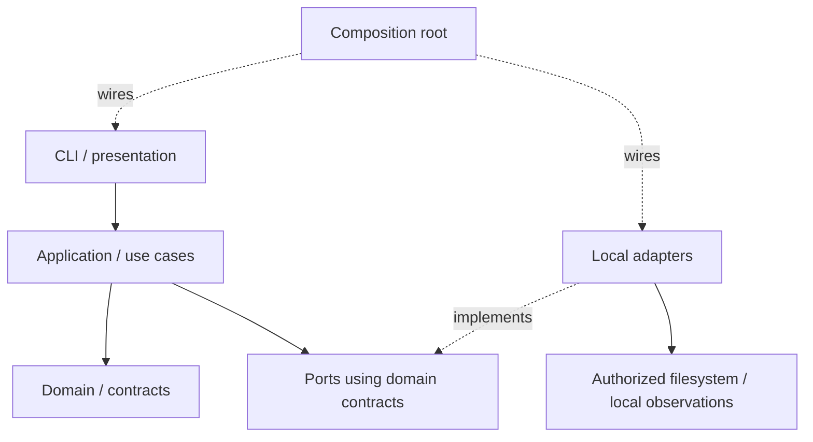

# Plan — Specification 002: Lingo Project Initialization

## Proposed Issue #94 policy-reference reconciliation — 2026-09-24

Specification 004's proposed Work Item metadata policy reuses the existing
`policies` list of contained relative document references. The closed
`schemaVersion: 1` field table below does not change, so existing readers continue
to accept/reject the same `axiom.yaml` structures and no manifest migration exists.

After ordinary v1 manifest/reference/containment validation, a policy-owning
workflow may recognize a referenced document by its own exact kind and validate a
separately versioned closed schema. That document is not recursively parsed as a
Project manifest and cannot override Project identity, security, local workflow
truth, Provider authority, or the portable/local boundary. Unsupported versions,
unknown fields, duplicate recognized policy kinds, and malformed values fail the
dependent operation before prompts or effects. Unrecognized policy documents
remain untrusted data and grant no behavior or authority.

This clarification is proposed with Issue #94 and requires human approval before
T28 implementation. It preserves ADR-0004; adding structured fields directly to
`axiom.yaml` would instead require an explicit manifest-version decision and
cross-Specification schema evolution.

## HD-3 filesystem threat-model reconciliation — 2026-09-20

Human-approved Specification 004 HD-3 narrows the proof boundary consumed by this
existing Plan. [H13](clarifications.md#bounded-local-filesystem-threat-model--2026-09-20)
and [ADR-0005](../../decisions/0005-bounded-local-filesystem-threat-model.md)
preserve exact target confinement, traversal and supported link/replacement
protection, Axiom process concurrency, deterministic injected fault stages,
logical old-or-new publication, fail-closed uncertainty, guided recovery,
restrictive local metadata, and truthful commit outcomes.

This Plan no longer implies guarantees against malicious same-UID arbitrary
interleavings, physical power loss, or physical-media durability. Future Evidence
must state supported OS/filesystem assumptions and distinguish controlled
interleavings/injected faults from those exclusions. No concrete mechanism changes:
syscalls, lock/staging layout, filenames, packages, and exact fault matrix remain
implementation choices under the reconciled contract. This edit reconciles the
existing approved Specification 002 Plan; it does not create or authorize the
Specification 004 Plan, Tasks, implementation, or release.

## Historical POC implementation status — 2026-09-18

The approved Plan remains the contract. POC issues #16–#18 merged the minimal
CLI and portable/local lifecycle described in the
[historical Specification status](spec.md#historical-poc-delivery-status--2026-09-18). One-file
filesystem hardening and black-box Evidence for #19–#20 are in progress;
dogfooding for #21 is recorded. macOS/Linux runtime checks passed in draft PR #29,
while full fault/race proof and human acceptance
remain pending. Earlier T04-only gates below are dated history, not the current
implementation status. This revision formally reconciles the verification
scope: the POC may use a repository workflow solely for reproducible
verification/acceptance Evidence on Linux and macOS. Product/platform CI and
release automation remain outside the slice. This clarification does not expand
the product or persistence contracts, create a permanent architecture commitment,
or imply human Acceptance.

## T04 single local revision reconciliation — 2026-09-16

Human decision [H12](clarifications.md#single-local-revision-decision--2026-09-16) adopts **Option B — single revision model**:
local format v1 contains no persisted `localRevision`. Existing
`projectapp.LocalRevision`, derived from exact observed record bytes, remains the
sole local-record revision; `portableRevision` remains independent portable
snapshot metadata. T02 contracts are unchanged. The affected contract below is
reconciled under this explicit authority; prior dated approvals remain history.

**T04: Ready for human re-review, not Accepted. T05–T21: Not started.**
Implementation and [Evidence](evidence-t04.md) remain limited to T04. No merge,
filesystem persistence or advance to T05 is authorized.

## T04 implementation authorization and review gate — 2026-09-16

**Specification: Approved · Plan: Approved · Tasks: Approved · Implementation: Authorized (T04 only).**

Human authorization covers only **T04 — Strict local installation record codec**.
[PR #8](https://github.com/rgomids/axiom/pull/8) merged T03 into `main` on
2026-09-16 at 15:00:21 UTC. Verified baseline:
`1de3b02d97818138c32f6b2a07555cfe1ffd4a9b`.
[T04 Evidence](evidence-t04.md) records implementation SHA, closed local format,
codec/static-boundary checks and unproven filesystem properties.

**T01: Accepted / merged. T02: Accepted / merged. T03: Accepted / merged.
T04: Ready for human implementation review. T05–T21: Not started.**
T04 merge grants no T05 authority. No self-approval or merge is authorized.
Approved contract bodies, Task definitions and ADRs remain unchanged. Earlier
entries below preserve history and are superseded only as lifecycle status.

## Historical T03 implementation authorization and review gate — 2026-09-15

**Specification: Approved · Plan: Approved · Tasks: Approved · Implementation: Authorized (T03 only).**

[PR #7](https://github.com/rgomids/axiom/pull/7) merged into `main` on
2026-09-15 at 03:37:48 UTC. Baseline:
`378338cc0af79eaaec8b17e3cada44629515c043`. Explicit human authorization covers
only **T03 — Strict manifest decoding and canonical encoding**.
[T03 Evidence](evidence-t03.md) records the exact implementation SHA, parser
experiment, tests, resource limits and exclusions.

**T01: Accepted / merged. T02: Accepted / merged.
T03: Ready for human implementation review. T04–T21: Not started.**
T03 merge grants no T04 authority. No self-approval or merge is authorized.
Approved H1–H11, schemas, Task definitions and ADRs remain unchanged; prior entries
below are historical and superseded only as lifecycle status.

## Historical T02 implementation authorization and review gate — 2026-09-14

**Specification: Approved · Plan: Approved · Tasks: Approved · Implementation: Authorized (T02 only).**

GitHub confirms [PR #6](https://github.com/rgomids/axiom/pull/6) merged into `main`
on 2026-09-14 at 19:58:54 UTC. Updated `main` baseline:
`ffc9af9b7158de62f94671472c9ddedf36439802`. T01 is incorporated at that revision.
The subsequent explicit human request authorizes only **T02 — Consumer-owned ports,
authority and outcomes**. [T02 Evidence](evidence-t02.md) records implementation,
exact delivery SHA, contract tests and limitations.

**T01: Accepted / merged. T02: Ready for human implementation review.
T03–T21: Not started.** No merge or next-Task authority follows from this delivery.
H1–H11, approved task definitions, Plan contracts and ADRs remain unchanged.
Earlier lifecycle entries below are historical; this entry supersedes status only.

## Historical T01 implementation authorization — 2026-09-14

**Specification: Approved · Plan: Approved · Tasks: Approved · Implementation: Authorized (T01 only).**

Human confirmed [PR #5](https://github.com/rgomids/axiom/pull/5) reviewed and merged,
with `main` at `f70c7e5e762c408db3093753e6dabbc74d65f035` as the implementation baseline.
Explicit authorization covers only **T01 — Project values and complete-state invariants**.
H1–H11, approved task definitions, Plan contracts and Accepted ADRs remain unchanged.
[T01 Evidence](evidence-t01.md) records delivered domain behavior and reproducible checks.
**T01: Ready for human implementation review. T02–T21: Not started.**
No advance to another delivery unit, self-approval or merge is authorized.
Earlier lifecycle entries below are dated historical evidence, superseded only as status.

## Historical status, authority and scope before PR #5 approval

**Plan: Approved · Tasks: In review · Implementation: Not authorized** — 2026-09-14.

PR #4 was approved and merged at `b85657ff23dcfc40fbd9ea05b7a3876959b3554e`.
The subsequent explicit human request authorizes [Tasks](tasks.md) only.
**Ready for human Tasks review.** Human Tasks approval and explicit Implementation
authorization remain required. Sections 1–11 are the approved technical baseline;
“proposed” wording records how those details entered Plan review, not an open
choice to redefine approved contracts. Mechanisms explicitly left to Implementation
remain unselected. Dated reconciliation/gate statements below record the pre-merge
history and are superseded only as lifecycle status by this entry. H1–H11 and
accepted decisions are unchanged.

### Historical Plan reconciliation before approval

**Plan reconciled after human review; ready for final human Plan review** — 2026-09-14.
The decisions below and subsequent H1–H11 are human-approved; final Plan approval
and authorization to advance remain pending.

Human review of [PR #4](https://github.com/rgomids/axiom/pull/4) approved:

1. A versioned Portable Project Manifest, recorded in Accepted
   [ADR-0004](../../decisions/0004-portable-project-manifest.md).
2. Distinct absent, `unconfigured` and empty-collection intent where each field
   permits those forms; normalization, round-trip and FR-012 retain the distinction.
3. Internal local records use explicit `formatVersion: 1`, separately from the
   portable `schemaVersion`; unknown formats fail safely without migration.

These decisions arose during Plan review, after Specification/clarification
approval. The later reconciliation request materially revised the Specification;
[H1–H8](clarifications.md#subsequent-human-decisions--2026-09-12) explicitly reopen
and reconcile it, preserving the original 2026-09-11 approval as history. This Plan
consumes the revised Specification; it cannot override it or approve itself.

Latest authority: [2026-09-14 human Git Authority decision](https://github.com/rgomids/axiom/pull/4#issuecomment-5665679754).
[H11](clarifications.md#git-authority-approval--2026-09-14) approves the Git Authority
boundary. H9 partial intent/complete-state validation and H10 logical atomicity
remain intact; no persistence technique is selected. Project mental model,
init/update, logical atomicity and Git Authority are approved; final human Plan
review and explicit authorization to advance remain pending.
Reconciliation input head: PR #4 at `0393ef1`; base/merge-base `main` at `374c643`.
The published PR body records the resulting current head and validation scope.

Historical 2026-09-12 baseline: PR #4 at `bbe2e71`; `main` at `374c643`, after PR #3 merged. Original [Specification](spec.md) approval closed intake → specify → clarify.
That baseline was inspected for the previous revision. Subsequent
2026-09-12 human decisions reopen affected contracts as H1–H8; this change
reconciles Specification → Clarifications → Plan only. Tasks and Implementation require
explicit human approval of this Plan and authorization to advance.
All components, formats, tests and commands described below are future work;
no executable Lingo, parser, filesystem implementation or application test exists
as a result of this document.

Read in full: Specification, clarifications, [ADR-0001](../../decisions/0001-project-is-not-repository.md),
[ADR-0002](../../decisions/0002-axiom-speckit-relationship.md),
[ADR-0003](../../decisions/0003-lingo-as-axiom-local-control-plane.md),
[conceptual model](../../architecture/conceptual-model.md),
[Constitution](../../product/constitution.md), and [roadmap](../../product/roadmap.md).
Also applied [repository instructions](../../../AGENTS.md),
[SDD harness](../../../.agents/skills/axiom-sdd/SKILL.md),
[architecture policy](../../../.agents/policies/architecture.md),
[quality policy](../../../.agents/policies/quality.md),
[security policy](../../../.agents/policies/security.md),
[documentation policy](../../../.agents/policies/documentation.md),
[Provider boundaries](../../architecture/provider-boundaries.md), and
[harness boundaries](../../agent-harness.md).

Only Axiom repository is affected. The proposed implementation language remains
Go; this change adds no Go files, module, dependency, CLI framework, parser
library, adapter, storage engine, migration, product/platform CI or `tasks.md`.
No Provider implementation, external Integration, Runtime execution, clone/fetch,
credential store, Windows implementation, Work Item, model selection, complete
capability negotiation, orchestration, fork semantics or semantic Provider
repository resolution belongs to this slice.

## 1. Architecture and minimal organization

The first slice establishes a minimal portable Project, explicitly updates it,
then reopens and installs it
without network or AI. Lingo presents and executes Axiom contracts; it does not
own or redefine Project identity. Project is not Repository or Runtime, Role is
not Model, Runtime is not Model, Provider is not Transport, Integration is not MCP.



Conceptual flow is CLI → application → domain/contracts → ports → adapters.
Source dependencies point inward: domain imports neither ports nor adapters;
application owns the ports it consumes; adapters implement them. The arrow from
ports to adapters describes dispatch, not an import from domain into infrastructure.
This is a C4 component-level view inside one local Lingo process, not a deployment
or global Axiom module decision.

Proposed paths only; create them in later authorized implementation as needed:

| Proposed location | Layer and responsibility | Excluded responsibility |
|---|---|---|
| `cmd/lingo/` | Composition root: assemble dependencies, enter presentation, return process status | Validation or persistence rules |
| `internal/project/` | Domain: Project ID/slug/name, Repository associations, optional declarations, reference integrity, syntactic matching, portable equivalence, typed issues | YAML, OS paths, I/O, vendor catalogs, ownership hierarchy |
| `internal/projectapp/` | Application: create, update, rename slug, validate, reopen, install, replace binding; confirmation and recovery orchestration; consumer-owned ports | CLI flags, raw OS errors, external setup |
| `internal/manifest/` | Adapter: strict YAML decode/encode, wire DTO to domain mapping, safe parser diagnostics | Domain rules embedded in parser types |
| `internal/local/` | Adapters: authorized file access, atomic publication, local record storage, OS root discovery, checkout and executable observations | Provider/Runtime execution or secret retrieval |
| `internal/cli/` | Presentation: guided collection, correction, preview, cancellation, safe result rendering | A second validator, implicit defaults from accounts, force overwrite |
| Colocated tests and `testdata/` | Unit fixtures and future local integration/black-box cases | Production data or persistent service dependencies |

Keep files cohesive within these packages, not one package/interface per noun.
Split `local` only if implementation evidence reveals separate maintenance needs.
No generic repository CRUD, dependency-injection framework, event bus, plugin SDK,
Workspace catalog or global persistence abstraction.

Minimum boundary contracts, expressed here as responsibilities rather than APIs:

| Port / seam | Input → output and consumer |
|---|---|
| Manifest codec | Bytes → parsed portable definition + safe issues; validated definition → canonical bytes; application consumes |
| Portable store | Authorized old/new destinations + expected revision + validated artifact set → atomic create/update/move/no-op/conflict/recovery result; no unrestricted path-write interface |
| Local installation store | Project ID + expected exact-byte record revision (external observation, H12/§3) + proposed local snapshot → atomic result; separate from portable store |
| Local observations | Explicit checkout/executable/reference paths → read-only facts or safe failure; no command execution method |
| Identity and attempt metadata | New UUID v4 only when creation is necessary; injectable entropy/clock for repeatable tests |
| Optional text inspection | Untrusted text → sanitized warning categories or unavailable/failed; no authority to rewrite or certify configuration |

Use small consumer-owned interfaces where I/O/fault substitution is required.
Pure functions need no interfaces. Presentation provides entered values and explicit
confirmation tied to a preview; application rechecks that preview before any write.

## 2. Portable manifest contract

[ADR-0004](../../decisions/0004-portable-project-manifest.md) establishes the
durable versioned Portable Project Manifest, currently represented by `axiom.yaml`.
The concrete initial schema is documented in this section under the approved
Specification; it remains subject to final Plan review, not frozen globally by the ADR.

Proposed initial token: integer `schemaVersion: 1`. Support exactly integer `1`;
missing, null, string `"1"`, malformed or other versions fail. There is no implied
backward/forward compatibility, numeric proximity rule, migration or down-conversion.
Publish this table with future implementation. A later incompatible change requires
explicit version policy and human review, not silent acceptance under version 1.

The Specification selected conceptual fields; the following names and encodings
make them implementable for this slice, subject to Plan approval. They do not
establish Axiom-wide schemas or lifecycle states.

| Field | Proposed version 1 shape and validation |
|---|---|
| `schemaVersion` | Required integer `1` |
| `project` | Required closed mapping: `id` UUID v4, `slug` matching full `[a-z0-9]+(-[a-z0-9]+)*`, `name` nonblank string |
| `repositories` | Optional sequence, possibly empty, of closed mappings: `key` nonblank Project-scoped string, optional `remote` locator string; no local path |
| `runtime` | Optional `unconfigured` scalar or closed mapping with required opaque `id` |
| `providers` | Optional `unconfigured` scalar or sequence, possibly empty, of closed `{key, id}` mappings; both nonblank; no category cardinality/default |
| `integrations` | Optional `unconfigured` scalar or sequence of declarations: required `key`, optional `providerRef`, `capabilities` string list, `transport`, `credentialRef`; no operational binding implied |
| `modelProfiles` | Optional `unconfigured` scalar or sequence: `key` and either `state: unconfigured`, or both `runtimeRef` and opaque `model`; configured reference must match selected Runtime |
| `businessContext` | Optional `unconfigured` scalar or closed mapping: optional `text`, optional `documents` list of contained relative document paths; text may include purpose/glossary/rules without ontology |
| `credentialReferences` | Optional `unconfigured` scalar or sequence: required logical `key`, optional logical `sourceHint`; no value/path field |
| `policies` | Optional `unconfigured` scalar or list of contained relative document references; never overrides governing security |

For an Integration, `transport` is an optional closed mapping with required
opaque `id` and optional logical `reference`. A transport binding requires
`providerRef`; a declaration with only `key`/requested capabilities is permitted
and reported missing a binding. References, when supplied, must resolve within
this definition: `providerRef` to Provider key, `credentialRef` to credential key,
`runtimeRef` to selected Runtime ID. No implicit Provider selection, Transport,
credential reference, Model Profile class or Role mapping. A configured object
cannot use empty strings in place of required values. Optional omission,
`unconfigured`, and empty collections are valid where listed; explicit null is
not a substitute for these forms. Duplicate declaration keys fail within their
collection. Opaque identifiers receive structural validation, not catalog lookup.

### Declaration-state semantics (resolved by human review)

- **absent:** the concept was not declared in the manifest.
- **`unconfigured`:** the concept was explicitly declared but has no configuration
  or binding yet, only where the field contract accepts this declaration state.
- **empty collection `[]`:** the concept was explicitly configured as a collection
  that currently has no members.

The normalized model retains presence and the permitted declaration form at every
field below. Canonicalization must not silently collapse one state into another.
Semantic equivalence and FR-012 reexecution do not equate these states by default:
with the same ID and otherwise equal content, changing `providers` from absent to
`unconfigured` or `[]` is changed intent and init conflicts without writes. Repeating
any one unchanged form is a no-op. Explicit update may make these changes after full proposed-state validation, safe
diff and authority checks (FR-018). External author edits are revalidated on reopen
(FR-014); they cannot confer Lingo authority or silently rebind a changed ID.

A semantic decode → normalize → encode → decode round-trip preserves represented
intent, including nested optional presence and empty lists. YAML formatting is not
semantic intent; reopen/install still preserve source bytes exactly. Shared local
observations such as Runtime `unverified` do not erase distinct portable declarations.

| Version 1 field(s) | Absent permitted? | `unconfigured` permitted? | Empty collection `[]` permitted? |
|---|---|---|---|
| `schemaVersion`, `project`, `project.id`, `project.slug`, `project.name` | No | No declaration state | No |
| `repositories` | Yes | No declaration state | Yes; distinct from absence |
| `repositories[].key` | No within an association | No declaration state | No |
| `repositories[].remote` | Yes | No declaration state | No |
| `runtime` | Yes | Yes, scalar | No; configured form requires `id` |
| `runtime.id` | No within configured Runtime | No declaration state | No |
| `providers`, `integrations`, `modelProfiles`, `credentialReferences`, `policies` | Yes | Yes, scalar | Yes; three distinct states |
| `providers[].key`, `providers[].id`, `integrations[].key`, `modelProfiles[].key`, `credentialReferences[].key` | No within each declaration | No declaration state | No |
| `integrations[].providerRef`, `integrations[].credentialRef` | Yes; `providerRef` required with Transport | No declaration state | No |
| `integrations[].capabilities` | Yes | No declaration state | Yes; distinct from absence |
| `integrations[].transport` | Yes | No declaration state | No; present mapping requires `id` |
| `integrations[].transport.id` | No within Transport | No declaration state | No |
| `integrations[].transport.reference`, `credentialReferences[].sourceHint` | Yes | No declaration state | No |
| `modelProfiles[].state` | Yes for configured profile | Yes, exact scalar; excludes `runtimeRef` and `model` | No |
| `modelProfiles[].runtimeRef`, `modelProfiles[].model` | Only when `state: unconfigured` | No declaration state | No |
| `businessContext` | Yes | Yes, scalar | No; closed mapping may be `{}` |
| `businessContext.text` | Yes | No declaration state | No; a string, including empty text, retains presence |
| `businessContext.documents` | Yes | No declaration state | Yes; distinct from absence |

Collection members must satisfy the shapes above: no null, empty mapping or
`unconfigured` member substitutes for a required object, identifier or document path.
The word `unconfigured` in an opaque identifier/text is ordinary string data, not
an extra state. An Integration with only its required `key` is a declared object
missing a binding; do not synthesize a `state` field or global Integration lifecycle.
`businessContext: {}` is a declared mapping with no members, distinct from absence,
`unconfigured` and `{documents: []}`; do not insert omitted text/documents defaults.
No field admits explicit null. Only the documented scalar unions and profile
`state` admit the declaration state; the rule adds no global `unconfigured` value.

Parsing pipeline, before either portable or local writes:

1. Read one regular `axiom.yaml` from the explicit source through safe access.
   No parent search, alternate manifests or split-configuration loading.
2. Parse one YAML document into a node representation. Reject additional documents,
   non-string mapping keys, duplicate keys at every depth, aliases/anchors, merge
   keys and custom tags. The restricted subset prevents hidden field injection;
   context/policy references are documents, not recursively parsed manifests.
3. Check version with strict scalar typing, then apply closed field sets recursively.
   Unknown fields fail even inside optional declarations. No coercion or extension bag.
4. Convert DTOs into domain values, check required values, UUID variant/version,
   associations, references and forbidden structures. Collect independent issues
   where safe; syntax errors may stop further semantic checks.
5. Check relative document containment/existence/readability and safe text warnings.
   Absolute paths, `..` components and executable/environment interpolation in
   reference fields fail. Ordinary text remains data, never evaluated.
6. Return portable validity, separate local gaps and warnings. Never include raw
   parser excerpts or rejected scalar values in diagnostics.

Select a maintained parser only during authorized implementation, after proving
node-level duplicate detection and this subset against fixtures. No library is
adopted here. Parser resource bounds (bytes, depth, node count) must be explicit,
testable and reported as safe validation limits; size-limit values are tunable
implementation details, not a new product requirement.

Canonical output has stable field order, stable keyed-collection ordering, UTF-8
and final newline. Preserve case and content of opaque IDs and text; no lowercasing
of names, model IDs or Repository paths. Sort unordered declarations by key; retain
user text/document ordering where meaningful. Optional forms remain represented
as supplied; equivalence compares validated normalized values including the
field-specific declaration states above, not YAML formatting.
Creation/update with equal values and the same ID gives equal canonical bytes.
Reopen/install never serialize back over the source, including comments/formatting.

UUID is allocated once after inspecting the target and establishing that creation
is needed. Retry of entered fields retains that UUID in the in-memory draft.
Recognized target supplies the existing ID for no-op comparison; supplied different
ID conflicts. Explicit portable rename/edit/copy/Runtime change preserves ID and
triggers validation on reopen. This slice has explicit update (FR-018), but no ID reassignment.

## 3. Local state and discovery

### Portable working copy and local state roots

Logical per-user Axiom root follows H1:

```text
~/.axiom/projects/<slug>/axiom.yaml
~/.axiom/projects/<slug>/context/
~/.axiom/projects/<slug>/policies/
~/.axiom/state/projects/<project-id>/installation.json
```

Default portable root is `~/.axiom/projects`; it remains shared/versionable content,
not private machine state. A proposed `LINGO_PROJECTS_ROOT` override permits isolated
tests using the same validation/authority rules. Its precedence is nonempty
absolute override → default home path; explicitly empty, relative or unsafe roots
fail without fallback, as with the state override. Validate slug before lookup or path
construction; reject invalid grammar without silent normalization. Resolve roots in
OS adapters, never domain. Refuse portable creation inside any known associated
checkout; no Repository receives implicit configuration-location authority. Future
association updates must also reject placing the working copy inside that checkout.

The logical `state/` role maps to Q3's existing native state directories below;
`~/.axiom/state` is conceptual, not a replacement for native platform policy.
Portable and state roots must remain disjoint under canonical/anchored resolution.
Root overrides never change content classification or authorize writes by themselves.
`context/` and `policies/` may start empty; no documents are required before init.
Only supported artifacts enter the portable working copy. Git backing metadata is a
future distribution concern, never a place for machine bindings or Execution state.

Installation-wide slug resolution spans the managed portable root and registered
local source records; no unchecked concatenation or Workspace ownership is implied.
Inspect existing entries read-only; ambiguous/invalid records fail safely instead of
assuming slug availability. One ID at another source needs explicit relocation;
one slug for different IDs needs explicit resolution. Keep slug availability checks
and publication under a shared namespace guard so concurrent init/install/rename
cannot claim the same slug. This is slice-local coordination, not a new database.

### Native state mapping and internal record

Choose `LINGO_STATE_ROOT` as the explicit development/test override. Precedence:
nonempty override → platform native application-state directory. Reject relative,
empty explicitly set or unsafe override; never fall back after an invalid override.
Linux default: `$XDG_STATE_HOME/lingo` when absolute and set, otherwise
`$HOME/.local/state/lingo`. macOS default: `$HOME/Library/Application Support/Lingo`.
OS location discovery belongs to `local`, not domain. Unsupported OS gives a clear
local-install diagnostic; portable domain validation remains OS-independent.
Windows support can add discovery/permissions adapters later without changing YAML.

The resolved root appears in the write preview. Consent covers both the portable
target, when creating, and listed local destinations when installing. An environment
override changes discovery, not authority. Reject overlap between local state and
portable definition tree, including canonical aliases; do not place local state in
its versioned artifact directory. No state path derives directly from unchecked
Repository keys or user names.

Proposed internal layout: `<state-root>/projects/<project-id>/installation.json`,
where Project ID is the validated UUID and state root is resolved as above.
One small versioned local record per ID, not a database or Workspace registry.
JSON is an internal encoding choice, replaceable behind the store port; it is not
another portable manifest and is not part of Project identity. The Local Installation
Store encapsulates its format and validates it before interpreting/reusing bindings
or replacing a record. UUID is a lookup/correlation key, not an aggregate decision.

Every record requires the top-level member `"formatVersion": 1` (integer), alongside
the metadata below. `axiom.yaml` / `schemaVersion` versions Axiom's portable Project
contract; `installation.json` / `formatVersion` versions Lingo's internal local
state. Never use `schemaVersion` for this local record or emit `formatVersion` in
portable configuration. This internal format choice needs no ADR at this stage.

A missing version, malformed JSON, duplicate version member, null, boolean, string
`"1"`, non-integer version, or unknown integer version fails safely before local
writes or binding reuse. A record using only `schemaVersion` has a missing
`formatVersion`; it is not a legacy format to infer or convert. Preserve the record
and portable files; report local-state failure separately from portable validity.
A missing record is a new-install case; an existing unversioned record is an error.
No automatic migration, fallback overwrite, downgrade or deletion in this slice.

Record only formatVersion, ID, observed slug (lookup metadata, never identity),
canonical configuration source location, manifest byte digest,
referenced-document digests, portable snapshot revision, Repository-key binding observations,
credential-reference metadata, Runtime path/observations and attempt metadata.
Digest revision covers the validated manifest and contained documents in stable
path order. Use a cryptographic content digest for change detection, not identity,
authenticity or secret scanning. Never record credential values or text bodies.

[H12](clarifications.md#single-local-revision-decision--2026-09-16) resolves the
previous “local revision” inventory entry: local format v1 has **no persisted
`localRevision` field**. The sole local-record revision is T02's unchanged
`projectapp.LocalRevision`, computed by `ObserveLocalRevision(record)` over exact
observed serialized bytes, including formatting. It is returned separately from
decoded metadata. No field is excluded from that hash, and no hash or second label
is embedded in its own input. `portableRevision` remains the independent recorded
digest of the validated portable snapshot.

Existing records containing the removed field fail closed as unknown-field input;
no compatibility inference, migration, rewrite or deletion. Missing records retain
`MissingLocalRevision`; malformed existing records yield failure and no reusable
record/revision. A future store must recheck exact observed bytes under its approved
commit protection, observe new encoded bytes after mutation and preserve bytes on
no-op; it allocates/increments no persisted revision. This documents T07 obligations,
not its implementation. T02's content-revision semantics remain unchanged.

Credential binding metadata may name an environment variable or an external store
item/reference. Do not read the variable value, call a store, prompt for a secret,
or claim authentication. Accept logical source hints for environment, macOS
Keychain, Windows Credential Manager, Secret Service/libsecret and runtime-managed
sources without installing or selecting any store; unsupported/unbound sources
remain unresolved, including Windows hints on MVP hosts.

Directories, including any chosen lock/staging containers, are owner-only; files owner read/write.
Validate existing ownership, modes and effective ACLs; do not broaden access or
silently chmod unrelated existing directories. Refuse unsafe roots. Apply the same
rules to override roots, local records, logs and temporary data; `.gitignore` is
not the boundary. Verify actual permissions after creation before sensitive local
metadata is written. Separate portable DTO serialization makes local fields
unrepresentable in emitted `axiom.yaml`.

## 4. Use cases and observations

| Flow | Deterministic orchestration | Environmental boundary / result |
|---|---|---|
| Create (J1/J2) | Inspect target first; reuse recognized ID or allocate new UUID; collect required/optional fields; preserve unrelated draft values on correction; validate; preview; confirm; persist portable; optionally install local state | Target inspection, entropy, contained files, permissions and commit outcomes; cancellation before commit leaves no durable Project |
| Validate | Strict decode, version, domain/reference/security checks; stable issues | File reads and optional scanning are observations, not network validation |
| Persist | Compare expected revision and preview; create without replacement or atomically replace recognized Project through explicit update | Logical Project atomicity and durability evidence; adapter selects operations; actual commit status determines result |
| Reopen (J4) | Validated slug or explicit source; parse and validate; match local record by ID/revision; return portable validity separately | Missing/stale paths are reobserved; opening alone does not mutate portable or local state |
| Install on another machine (J3) | Read supplied manifest/documents; validate first; collect missing bindings; preview and confirm local record; reuse equivalent record | Native/override root, arbitrary checkout paths and unsupported sources; success may include unresolved gaps; portable hashes unchanged |
| Resolve/relocate binding | Compare association keys and observed metadata; require explicit confirmation for replacement/source relocation; revalidate before local commit | Missing checkout is unresolved; remote mismatch or duplicate checkout blocks that binding pending human resolution; no remote rewrite |
| Observe Runtime | Selected ID plus explicit local executable path → three-state observation with basis | Presence-only file metadata; never launch executable, shell, discovery command or model request |
| Update (J6) | Resolve slug; load current artifact snapshot and immutable ID; accept partial intent; domain materializes complete proposed state from current snapshot plus intent; validate all invariants and applicable versions; preview safe diff; verify authority bound to revision/write set; atomic commit | Includes Repository add/remove/change, name/slug, Runtime, Providers, Integrations, profiles, context/documents, policies and credential references; affected observations become stale, unrelated bindings remain |
| Rename slug (J6) | Same logical update contract plus old/new slug collision protection and safe location change; mechanism remains an adapter choice | Same UUID and ID-addressed state; no stale old-slug alias accepted silently; preserve prior state on pre-commit failure |

### Partial command intent and complete Project state (H9)

Input completeness and state completeness are separate contracts. A command may
supply only the requested change; callers need not resubmit the entire Project.
Application loads the current recognized snapshot and revision. Domain applies
the explicit intent to produce a complete proposed Project state, then validates
all invariants against that state, including retained fields and cross-references.
Application enforces applicable version, authority, expected-revision and filesystem
requirements, presents the safe diff required by FR-018, then passes only the
complete valid artifact set to persistence. No direct partial `axiom.yaml` mutation
or domain/application validation bypass is allowed. A patch is input, never the
persisted Project or a shortcut to validating only changed fields.

For example, a name-only intent retains UUID, slug, associations and declaration
forms in the complete proposed state. A Repository removal that leaves a retained
reference dangling must fail complete-state validation before any write. Changing
a field from absent to `unconfigured` or `[]` remains explicit field-specific intent;
omission from a patch is not implicitly removal or an empty declaration. Exact
patch syntax and operation encoding remain unselected; no JSON/YAML merge-patch
standard is adopted by this decision. Init retains FR-012 create/no-op/conflict.

Optional future AI enters only through draft/intent input. It may interpret
intent and explain consequences; it cannot call filesystem persistence directly or
provide its own approval. Application validates schema, identity, references, path
safety, authority and expected revision regardless of caller. Preview is sanitized
(field/action and approved destinations; never raw secrets or rejected payloads).
Missing/revoked authority or changed preview requires a new review, not reuse of
stale consent. System authority must be explicit and scoped; no implicit elevation.

Documents supplied in an update are draft inputs, safely read and validated against
the complete proposed artifact set, then staged with the manifest. Removed
associations/references invalidate only affected local bindings/observations after
portable commit. A local-record failure cannot restore old portable intent or claim
current observations; report it and recover continuity by immutable ID.

A conflicting proposed binding is never persisted as valid. Other entered values
remain in the draft. Human may correct it or explicitly leave that association
unresolved, then confirm installation with gaps. Same Project ID at another source
requires relocation confirmation even when bytes match. Changed content at the
same source invalidates stale observations and is revalidated; no new ID allocated.

Runtime observations are exactly `available`, `unavailable`, `unverified`.
`available` means an explicit path resolved to a regular executable accessible
under a supported safe presence check. `unavailable` means a supported check
observed missing/non-executable target. No selection, no path, unsupported check,
or inability to establish a reliable result means `unverified`. Basis distinguishes
these cases; permission uncertainty is not proof of absence. Store selected Runtime
ID, safe reason code, observed facts and observation time locally; never output file
contents. Reobserve instead of treating old observations as current. Model Profiles
that no longer reference the selected Runtime need author correction; never remap
models. Runtime failure is a gap/warning, not invalid portable Project or failed
installation. There is no capability, model or workflow readiness inference.

Proposed presentation keeps `lingo project init` and `lingo project install <source>`
and `lingo project update <slug>` as names for human review, with reopen/validate exposed as guided actions before
freezing further commands. No flag framework or numeric exit-code API selected.
Noninteractive missing required input fails promptly. Input collection and CLI
rendering cannot bypass application validation or confirmation.

### Optional Git distribution compatibility boundary (FR-020–021)

Illustrative future commands: `lingo project export <slug> --origin <origin>` and
`lingo project sync <slug>`. No Git commands, adapter or backing schema are added.
A future export may initialize backing Git inside the portable working copy,
configure the supplied origin, commit/publish and record explicit backing setup.
That backing is independent of the `repositories` association collection and cannot
create a Repository association by inference. Symlinks are not the sync model.

Approved Git Authority boundary (H11):

```text
Project mutation
      ↓
optional local Git commit
      ↓
optional explicitly authorized remote sync/push
```

Each operation has separate authority and outcome. Project mutation implies no
Git; local success depends on neither Git commit nor remote push. Later commit or
push failure cannot undo or falsely report rollback of confirmed local Project
mutation. Init/update/install/validate and local Git commit never imply remote
publication. AI may propose operations but receives no implicit local/remote Git
authority. A `.git` in the working copy creates no Repository association.
Machine-local installation state, credentials, bindings, observations and other
non-portable state never enter the portable Git backing.

No implicit network mutation, hooks, credential-helper changes, remote creation,
branch rewrite, force push, merge/rebase or other Git effects are authorized by
this Plan. Current application/black-box boundaries must deny Git/network effects;
AC-18's actual Git execution Evidence belongs to later authorized delivery.

Concrete Git backing schema/metadata, branch strategy, merge/rebase, conflict
resolution, sync protocol, transport, credential helpers, hooks, metadata
preservation, dirty-tree handling, recovery protocol, autoPush implementation and
remote-authority representation remain future design/implementation obligations.
None is selected by this boundary approval; appropriate Evidence and authorized
scope are required before delivery. Any autoPush/equivalent automation requires
explicit authority and separate human-approved design.

## 5. Repository matching

Domain owns association-key uniqueness and locator normalization; application
combines these with read-only checkout observations from `local`.

Safe initial normalization: parse explicit URI locators, lowercase scheme and DNS
host only, preserve path case, user segment, port, escaping, trailing slash and
`.git` suffix. Do not strip suffixes, decode paths, remove default ports or translate
SSH shorthand into HTTPS. For SSH shorthand preserve user/path and normalize only
an unambiguous DNS host. Invalid/ambiguous syntax is diagnosed, not guessed.
Reject credential-bearing URL user-info; conventional SSH user without a password
is an account locator, not embedded credential material. No URL is fetched.

Equal keys or equal normalized locators fail portable validation. Different scheme
locators remain distinct: `git@github.com:org/repo.git` and
`https://github.com/org/repo.git` are not identity equivalents. A conservative
same-host/path candidate may be flagged as suspected alias; report human resolution
rather than silently coalesce or reject as a proven duplicate. Human can correct
associations or explicitly retain distinct ones; confirmation does not establish
semantic identity. No claim to detect every alias offline.

Checkout observation resolves symlinks safely for reading, verifies directory and
version-control metadata, and records canonical directory/file identity. Two keys
pointing to the same checkout conflict even via symlinks. Independent worktrees are
not automatically one checkout merely because they share object storage. Compare
observed configured remotes using the same syntactic rules; absent or multiple
candidate remotes remain unresolved, mismatch blocks the binding. Remote reachability
is always `not checked` here. Metadata reads must not run Git, hooks, filters,
credential helpers or recursively interpret executable configuration. Unsupported
metadata layout yields unresolved evidence, never a guessed valid Repository.

Future tests cover exact matches, host case, case-sensitive paths, `.git`/slash/
port/encoding differences, SSH/HTTPS pairs, local-only and two-provider cases,
symlink aliases, separate worktrees, multiple remotes, stale paths and explicit
relocation. Network-call count must remain zero.

## 6. Persistence, concurrency and recovery

### Authorized filesystem model

Each write receives a capability for the explicitly confirmed directory object,
expected identity and allowed relative names, not a general string path. Protect
portable destination and local state as separate authorized roots. No lexical
prefix test or `realpath`-then-write sequence is sufficient.

Confinement must hold through reads, writes, cleanup and recovery for the supported
threats, including pre-existing and controlled ancestor/leaf replacement, symlink,
hard-link and object-identity changes at declared inspection and commit boundaries.
Reject traversal, redirection outside authorized roots and unsafe target types;
user names and imported documents confer no filesystem authority. Lexical prefix
checks or a `realpath`-then-write check alone cannot establish this property.

Directory handles, relative no-follow operations, ownership/permission checks and
protected ancestry are candidate controls, not approved syscall requirements.
A held handle alone does not establish every supported property. The adapter must
define its supported filesystem assumptions and prove confinement on declared
Linux/macOS combinations. If a required property cannot be established, fail
safely before mutation. Under H13/ADR-0005, the proof does not cover a malicious
same-UID actor performing arbitrary hostile interleavings outside the declared
boundaries; this exclusion cannot be described as a solved risk.

### Logical commit and recovery contract (H10)

1. Inspect target/slug read-only. Equivalent init returns no-op; changed intent
   conflicts and directs to explicit update. Update loads current state and keeps ID.
2. Materialize and validate the complete proposed manifest/document state against
   the expected revision. Preview safe edits and old/new locations; authority covers
   that revision and write set. No direct partial manifest mutation or validation bypass.
3. Never expose a partially updated Project as valid. Before the logical commit
   point, the previous complete valid Project remains authoritative; failures
   preserve it. After successful commit, the complete new valid Project becomes
   authoritative. This is logical atomicity, not a required simultaneous physical
   switch of multiple files or directories.
4. Protect slug collisions and concurrent init/install/update/rename operations;
   conflicting writers cannot both succeed. Slug rename and manifest/document
   updates preserve immutable UUID and ID-addressed local-state continuity.
5. The adapter must define and prove its commit point, reader validity checks,
   software-visible retention/acknowledgment semantics, failure classification and
   recovery behavior within H13. After commit, report
   actual committed state, including uncertainty or incomplete local reconciliation;
   never falsely claim rollback. If validity or outcome cannot be established,
   report recovery required instead of presenting partial state as a valid Project.
   No physical power-loss or physical-media durability guarantee is implied.
6. Reconcile local metadata separately by ID and expected exact-byte local revision
   returned outside the record (H12/§3); preserve bindings and credential references,
   update source/slug/portable snapshot revision and invalidate
   affected observations. Local failure after portable commit cannot undo that
   commit. No cross-root filesystem transaction is required by this contract.
7. Cleanup only provably owned temporary objects after establishing commit state.
   Preserve unknown files and Git metadata; unsupported trees fail safely before
   writes. Git-backed updates require later approved preservation/authority design.

### Implementation options and required Evidence

The persistence adapter may choose staging/snapshots, ordered locks or other
coordination, protected rename/publication, recovery metadata, or another mechanism
that satisfies the contract. Same-filesystem staging, disjoint private staging
areas, lock acquisition order, syscall sequences and a multi-file transaction
engine are **not approved architectural decisions or mandatory techniques**.
If used, local coordination/recovery metadata stays outside portable content;
cleanup requires ownership evidence and must not interfere with active writers.

During authorized implementation, document the chosen protocol and provide unit,
Linux/macOS integration and black-box Evidence for confinement, collisions,
concurrency, manifest/document validity, slug rename, identity/local continuity,
pre-commit failure preservation and post-commit recovery/reporting. Deterministically
inject incomplete-write, pre-publication, publication, post-publication/
pre-acknowledgment and cleanup failures around the chosen commit point; coordinate
controlled readers/writers with barriers. A
protocol must never accept a mixed Project state as valid. Unsupported filesystem
or cross-filesystem behavior must fail safely unless equivalent guarantees are
proven. Physical power loss, physical-media durability and malicious same-UID
arbitrary interleavings are excluded from proof. No specific Go/OS call, layout,
lock protocol or engine is selected here.

### Failure matrix

| Failure / retry point | Required outcome |
|---|---|
| Cancel before confirmed commit | No durable Project; release any acquired coordination and remove only owned temporary artifacts |
| Validation/version/security failure | No portable or local writes |
| Disk full, permission denial, short write before publication | Existing data unchanged; safe failure; owned temporary-artifact cleanup or recovery guidance |
| Invalid/missing/unknown local record format | No local writes or binding reuse; preserve existing record and portable files; report local-state failure without invalidating portable intent |
| Slug collision or rename destination changes | Conflict before commit; preserve old portable location, UUID and ID-addressed state |
| Update fails before publication | Prior manifest/documents/location intact; clean only owned temporary artifacts; no new ID |
| Rename committed, local metadata fails | Report committed new location with incomplete local reconciliation; recover by verified ID/revision, preserving bindings |
| Another writer changes target/record | Conflict; conflicting definitions cannot both claim success |
| Portable committed, local installation fails | Preserve valid portable output; report local installation incomplete; retry reuses ID and bytes |
| Interrupted attempt or unknown leftovers | Normal open blocked with explicit recovery result; inspect with proven concurrency protection; never recursively delete unknown content |
| Project committed but chosen recovery metadata remains | Validate committed bytes/identity against owned attempt; report recoverable committed state; explicit recovery finalizes only known metadata |
| Outcome cannot be established | Recovery-required failure; preserve evidence and files; no automatic replacement |
| Equivalent init/install retry | No rewrite, ID allocation, timestamp refresh or duplicate registration; return existing result after read-only revalidation |

If locks are chosen, apparent age or PID is not sufficient to delete them. Recovery distinguishes
active owner, provably ended attempt, unknown files and committed output. Cleanup
must prove confinement and identity for attempt-owned objects only; concrete controls are adapter choices. A new
attempt rereads actual state. No automatic rollback deletes a successfully created
Project; local record failure preserves previous complete record. If portable bytes
change during install, abort local publication and revalidate; a later source edit
makes the recorded digest stale on next open rather than silently trusted.

## 7. Error and Evidence model

Issues carry stable category/code, safe field path or declaration index, remedy
and severity. Sort by validation phase, field path, code and stable index; never by
map iteration, goroutine order or raw OS error string. Do not echo unvalidated keys,
paths, URLs, parser excerpts or credentials. OS errors map to stable reasons; paths
in user-facing previews must be sanitized. Volatile attempt IDs/time are separate
from deterministic result fields.

| Category | Examples / response |
|---|---|
| `invalid_manifest` | Syntax/type/required/reference errors; correct named safe field; no writes |
| `unsupported_schema` | Missing/malformed version distinguished from unsupported token; obtain supported definition; no conversion |
| `invalid_local_state`, `unsupported_local_format` | Missing/malformed local version versus unknown integer; preserve record; no migration or binding reuse; separate from portable schema errors |
| `duplicate_field`, `unknown_field` | Exact safe location; remove duplicate/unknown declaration; no writes |
| `repository_conflict` | Duplicate key/locator or unresolved alias decision; correct or explicitly resolve ambiguity |
| `local_binding_conflict` | Duplicate checkout, mismatch or source relocation; rebind explicitly; never alter Git metadata |
| `filesystem_security` | Traversal, symlink, unsafe ancestry/ACL or unsupported protection; choose safe authorized destination |
| `concurrent_mutation` | Expected snapshot changed or guard busy; reread and retry after review |
| `runtime_unavailable`, `runtime_unverified` | Warning with observable basis; valid Project/install may succeed with gaps |
| `persist_failure`, `local_install_failure`, `recovery_required` | Safe stage and known commit state; preserve existing data; explicit recovery instructions |

Top-level outcomes: success, success with unresolved dependencies, validation
error, conflict, cancelled, persistence/local-install failure. Failure/cancellation
returns non-success process status; success-with-gaps is distinguishable in output
without implying readiness. Numeric codes await command design. Unresolved sources,
missing Capabilities and scanner warnings are separate structured issues, not extra
Runtime states or a new Project lifecycle.

Events use `start`, `success`, `warning`, `error`, operation correlation and safe
result fields. Evidence is local: sanitized check basis, digest comparisons,
operation outcome, test command/exit status and platform. No raw input, text bodies,
secret values, portable event history or Execution engine. Logs are not mandatory
side effects of read-only/no-op operations; optional local logs need their own
explicit destination and permissions within the write summary.

## 8. Security traceability

| Requirement | Future implementation control | Required future regression Evidence |
|---|---|---|
| SEC-001 | Closed DTOs and reference-only fields; deterministic rejection of credential-value structures, credential-bearing URL user-info and known sensitive query parameter names; no environment/store expansion; sanitized diagnostics at every layer | Structural rejection before writes; sentinel values absent from stdout/stderr, records, staged files, logs and Evidence; zero secret-source reads |
| SEC-002 | Init/install/update ports expose only authorized local I/O and observation; draft AI carries no authority; future Git commit/push separate; no external command/network/Provider setup surface; untrusted text never executed | Black-box filesystem snapshots of Git/Runtime/MCP/external config; denied network/process/secret-read spies; no hooks |
| SEC-003 | Exact authorized roots/objects, contained references, object-identity validation, supported no-follow/no-replace protections and process concurrency; separate read-only bindings; fail closed when assumptions fail | Invalid slug, collision, slug rename/move, traversal, pre-existing and controlled leaf/ancestor symlink/hard-link/replacement cases at declared boundaries; unauthorized destinations unchanged; excluded arbitrary same-UID interleavings labeled unsupported |
| SEC-004 | Expected revisions, collision/concurrency protection, logical Project atomicity, safe local record replacement, owned-only cleanup and explicit recovery; adapter-selected mechanisms | Update rollback, state continuity after rename, concurrent update/rename; conflicting writers cannot both succeed; unknown files survive; committed/partial outcomes classified correctly |
| SEC-005 | Portable working copy/native state/override separation, restrictive owned metadata and any chosen staging; ownership/type/link/ACL validation at supported boundaries; complete artifact exclusion by construction | Linux/macOS permission/ACL checks, overlapping-root rejection, portable snapshots free of local state, sanitized public fixtures; no physical power-loss/media or arbitrary same-UID ACL-mutation claim |

The URL sensitive-parameter policy is a deterministic, versioned list with fixture
coverage (for example token/password/API-key/signature parameter families), separate
from text heuristics. Logical references are identifiers, not key-value payloads;
no arbitrary source configuration bag. Structural controls reject forbidden shapes
regardless of whether their values resemble real credentials.

Free text, context and documents may contain unrecognizable secrets. Optional local
heuristic inspection reports findings/unavailable/failure as safe warnings, never
as proof of absence or structural invalidity solely due to scanner unavailability.
Show warnings before confirmation and request author sanitization of findings;
do not copy suspected values into diagnostics. No external scanner service or
scanner dependency is selected. Deterministic rejection, best-effort scanning and
human review are distinct controls; none promises absolute secret detection.

## 9. Test strategy and AC traceability

All tests below are planned, not executed Lingo Evidence. Begin each implemented
behavior with failing tests when practical; test observable invariants rather than
private method structure. Use synthetic data, controlled directories and injected
entropy/clock/observations. Unit/application tests require no external services.
Filesystem integration must also exercise real OS primitives, not just mocks.

| AC | Component | Planned tests | Evidence to retain |
|---|---|---|---|
| AC-01 | Domain, codec, create/reopen, CLI | Unit required/optional matrix; use-case correction/confirmation; black-box minimal round trip with generated v4 UUID | Unit and functional reports; safe manifest digest and reopened identity |
| AC-02 | Matching, checkout observer, install | Normalization table; two-provider/local-only cases; SSH/HTTPS human ambiguity; two-machine isolated install | Case results, relationships and zero network calls |
| AC-03 | Local store/discovery, install/reopen | Native Linux/macOS roots in isolated accounts plus override roots; unrelated checkouts; missing credentials/checkouts | OS/version and before/after portable hashes; binding snapshots with sanitized paths |
| AC-04 | Identity/equivalence, stores, binding replacement | Init/install no-op for each permitted declaration state; pairwise absent/unconfigured/empty changes conflict under FR-012; nested presence changes; rename/copy/Runtime edit preserves UUID; changed intent/ID; duplicate key/remote/checkout; confirmed relocation | Stable bytes, write/entropy counts, conflict matrix and no fork allocation |
| AC-05 | Optional contracts, Runtime observation | Field-specific absent/unconfigured/empty and reference matrix; reject forbidden state forms; present/absent/non-executable/uncertain executable; J2 black-box; profile incompatibility | Basis and three-state golden results; no readiness claims or process launches |
| AC-06 | Codec/domain validation and local store | Declaration-state semantic round trips; local formatVersion missing/malformed/unknown and schemaVersion-only records (AC-03/AC-07 support); Golden valid/invalid YAML; all-depth unknown/duplicate keys, schema types/versions, alias/merge/tags, dangling references | Diagnostics snapshots and zero-write assertions |
| AC-07 | Application and safe stores | Cancellation; short write/space-quota/read-only/permissions; deterministic faults at incomplete-write, pre-publication, publication, post-publication/pre-acknowledgment and cleanup; local failure; competing Axiom processes | Fault-stage/commit-status table, exit status, preserved hashes, recovery results and explicit excluded physical-event boundary |
| AC-08 | Structural guards, safe reporting, optional scanner | Synthetic prohibited structures/URL parameters; unavailable/failed/finding scanner; no credential-source reads | Sentinel non-leak assertions over every output and file, warning snapshots |
| AC-09 | Root discovery and safe filesystem | Traversal, absolute ref, pre-existing/controlled symlink, hard-link and ancestor/leaf replacement cases at declared boundaries; read-only binding aliases; ACLs and unsafe override; cleanup/recovery attacks | Both OS results, outside-tree hashes, protected operation/failure outcomes, supported assumptions and explicit same-UID adversary exclusion |
| AC-10 | All application I/O boundaries, CLI | Isolated black-box init/install; unexpected process/network calls fail test; repository hooks configured but never executed | Side-effect ledger and unchanged external configuration snapshots |
| AC-11 | Wizard/application, context codec | Skip/omit/unconfigured context; untrusted text; independent field correction; closed stdin/non-TTY missing input | Prompt/output goldens, bounded completion and retained draft assertions |
| AC-12 | Result classification/rendering | Repeated identical observations for each declaration state; distinguish changed intent despite equal Runtime observations; local-format failure versus portable validity; randomized map order; valid-with-gaps versus record-write failure; no-op write counts | Stable diagnostic goldens excluding entropy/attempt metadata; classification matrix |
| AC-13 | Slug domain, namespace resolution and stores | Unit valid/invalid grammar; collision across IDs in init/install; two-process slug reservation | Zero writes/entropy on rejected slug; unchanged occupied directory |
| AC-14 | Update/rename, portable and local stores | Name nonuniqueness; successful directory move; ID/binding continuity; collision and supported symlink/replacement/TOCTOU fault cases | Before/after UUID, paths, document hashes, same installation record key and declared H13 boundary |
| AC-15 | Domain materialization, update application, draft boundary, CLI | Partial name-only intent retains untouched fields/UUID/declaration forms; partial remove leaves retained dangling reference and fails; complete proposed state checked even when changed fields alone are valid; persistence never receives a patch; minimal init then add document/Repository; safe preview; missing/stale authority or unsupported version; changed init conflict versus valid update | Unit matrix, controlled store integration asserting complete valid artifact set or zero writes, and J6 black-box reports; denied-write spies and sanitized diff |
| AC-16 | Logical commit, collision/concurrency protection and recovery | Deterministic Linux/macOS faults around adapter-defined commit; concurrent Axiom readers never accept mixed state; conflicting update/update and rename/update processes; local failure after portable commit | Pre-commit prior-state hashes, one winning revision, committed-state recovery, binding continuity and explicit no physical power-loss/media durability claim |
| AC-17 | Artifact validation and root separation | Full portable-tree forbidden-state cases, disjoint roots, home working copy classification and future export set | Portable snapshots omit all local state; allowlist rejection evidence |
| AC-18 | Application authority and future Git boundary | Init/update/install/validate Git/network denial spies; future `.git` creates no association; portable-only backing; AI authority denial; independent Project/commit/push outcomes, no false rollback; separately approved automation | Current-slice denied side effects; later Git delivery must provide boundary/functional evidence before release |

Failure tests inject faults at named boundaries and use barriers for controlled
process races, not sleep-based timing alone. Include two independent Axiom writer
processes, identical and conflicting intents, local-record compare-and-swap
conflict, cancellation after publication and stale-recovery ownership. Add
supported adversarial filesystem cases around every write/cleanup phase, not just
initial validation. Run on Linux and macOS;
one platform passing never implies the other. Do not weaken tests when elevated
privileges bypass permission failures; use controlled unprivileged accounts or
report those cases unverified. Record malicious same-UID arbitrary interleavings,
physical power loss and media durability as excluded, never passed or solved.

Golden fixtures suit canonical manifests and safe deterministic diagnostics. Keep
OS paths/timestamps outside stable fields; fixtures contain placeholders only.
Black-box tests invoke the eventual CLI with controlled stdin and inspect outcomes
without importing internals. Application tests use fake ports to prove write order,
no-op, no secret reads and partial-install reporting. Real filesystem tests verify
atomicity/confinement behind those ports. Existing Bash harness checks prove none
of AC-01–AC-18; future delivery must attach component → test → command/result → AC
Evidence, including skipped cases, platform limits and security review findings.

## 10. Incremental implementation sequence

This is sequencing inside a Plan, not Tasks, assignments or implementation approval.
Each stage yields a thin testable behavior; the final CLI completes end-to-end use.
No intermediate milestone may claim the entire Specification is implemented.
This sequence covers local creation/update/install; future Git execution is excluded.
AC-18 splits current denied-side-effect/boundary proof from later Git delivery proof.

| Stage | Objective and dependency | Expected future Evidence | Risk / exit condition |
|---|---|---|---|
| 1. Contracts/domain | Minimal Project, optional declarations, issues, equivalence and matching; approved Plan prerequisite | Required-field/identity/slug/reference/matching unit matrix | Avoid global ownership and optional-field expansion |
| 2. Strict manifest | Version 1 DTO, node validation and canonical codec; stage 1 | AC-06 goldens, structural secret rejection, bounded-parser cases | Parser behavior/library must satisfy strictness before adoption |
| 3. Protected persistence primitive | Prove confinement, no-replace publication and expected local revision semantics with synthetic bytes; stage 1 boundary contracts | Linux/macOS race/fault/ACL/concurrency evidence | Highest-risk primitive first; unsupported guarantee fails closed |
| 4. Create use case | Draft, target-first identity, correction/preview/confirmation and portable commit; stages 1–3 | Minimal create/reopen through application, cancellation/no-op/failure evidence | No durable writes before validated confirmation |
| 5. Update and reopen | Explicit update/diff/authority, document updates, slug rename and byte-preserving reopen; stages 2–4 | Update/rollback/rename/concurrency/continuity and interrupted-state results | Never make init an update command |
| 6. Local install/bindings | OS roots, local record, read-only checkout matching, explicit relocation; stages 3–5 | Two-machine/native/override tests, unchanged portable hashes, partial local failure | Do not hide gaps or turn metadata reads into Git execution |
| 7. Runtime observations | Presence-only facts and separate gaps; stages 1, 6 | Three-state basis matrix, zero launches, profile mismatch evidence | No capability/model/workflow readiness inference |
| 8. CLI presentation | Thin guided actions and safe reports over tested use cases; stages 4–7 | J1–J6 black-box flows, missing-input timeout, stable diagnostics | Command/exit-code review; no duplicate business logic |
| 9. Reconciliation | Full AC/security coverage, docs and supported-platform statement; stages 1–8 | AC-01–18 matrix, regressions, sanitized test reports and human review | Missing required platform/security evidence prevents completion |

Placing the filesystem proof before wiring creation reduces late discovery of
unsafe commit assumptions. During authorized implementation, rollout is local and
incremental; no daemon, CI deployment or automatic harness migration. Release only
after all required AC/security Evidence and human review. Rollback of a binary
must preserve portable definitions and local records; unsupported formats are
reported, never automatically downgraded or deleted. No data migration is planned.
Update README, commands and changelog when executable behavior actually arrives.

## 11. Decision review, risks and constitution check

| Plan choice | Alternatives / trade-offs / reconsideration |
|---|---|
| Cohesive internal packages and consumer-owned ports | Fewer packages mixes I/O and rules; framework/layer-per-type adds cost. Proposed structure is internal, reversible and slice-scoped |
| Versioned Portable Project Manifest (Accepted ADR-0004) | Human Plan review resolved portable intent as a durable Axiom contract consumed by Lingo; current axiom.yaml representation and initial schema detail stay distinct; incompatible evolution requires explicit versioning |
| Distinct declaration states (resolved by human review) | Collapsing absence/unconfigured/empty would lose author intent and cause false no-ops; field-specific normalization/round-trip and pairwise tests retain distinctions |
| Version integer 1 and closed optional shapes | Free-form maps ease extension but defeat strict typo/security checks. Public compatibility becomes harder after first release; review now under Q2/FR-015 |
| Native local root plus `LINGO_STATE_ROOT`; small per-ID record | Logical projects/state roles retain Q3 native state mapping; portable home working copy remains shareable. Database/catalog adds unneeded technology/ownership. Explicit internal `formatVersion: 1` is resolved by human review; fail closed without migration. Physical state layout remains an internal detail; durable portable/local separation and ID continuity are recorded in extended ADR-0004 |
| Logical atomicity and confinement; adapter-selected persistence controls | Path check plus rename cannot satisfy SEC-003/004; cross-root transaction adds complexity. H10 approves invariants only; staging, locks and syscalls remain implementation options requiring Linux/macOS Evidence; fail closed where guarantees cannot be established |
| Metadata-only Runtime and Repository observation | Commands/network broaden authority and change approved scope. Limited observations deliberately retain explicit unresolved results |

Human Plan review identified and resolved the durable Portable Project Manifest
choice in Accepted [ADR-0004](../../decisions/0004-portable-project-manifest.md).
ADR-0001–0003 remain Accepted and unchanged. The initial schema details, override
and filesystem strategy remain slice-scoped Plan details. The local `formatVersion`
and distinct declaration semantics are resolved here, without separate ADRs.
H1–H11 extend ADR-0004 naturally: identity ergonomics, portable working copy,
incremental mutation and optional backing are aspects of shared intent versus local
installation, not new aggregate ownership or a sync-engine choice. H13 and
ADR-0005 later define the bounded filesystem proof boundary without selecting an
engine or mechanism. The existing Specification 002 Plan and Tasks are approved;
that status does not authorize unstarted implementation or Specification 004 Plan work.

**Human decision required** applies if implementation evidence requires a durable
cross-cutting choice beyond those boundaries: for example a global persistence
engine, changed trust boundary or compatibility expansion beyond ADR-0004. Stop affected
work and present decision, options, recommendation and trade-offs; do not create
or accept an ADR automatically. For storage, options would include retaining this
slice-local file store versus adopting a shared engine; recommendation remains the
slice-local store until a multi-feature requirement justifies coupling, migration
and operational cost. No such expansion is required to approve this Plan.

Primary risks: proving bounded concurrent filesystem confinement and truthful
software-visible commit/recovery semantics on declared OS/filesystem combinations;
parser strictness and diagnostics without leaks; public version-1 shape compatibility;
local metadata layout limitations and unsupported local formats;
proving logical atomicity for manifest/document updates and slug moves, pre-commit preservation and post-commit continuity; accidental loss
of declaration intent during normalization; conservative matching leaving human ambiguity;
and best-effort scanning missing secrets. Mitigations are explicit preconditions,
fail-closed adapters, unit/fault/black-box Evidence, human schema review and honest
gap/warning reporting. No executable safety or acceptance guarantee is claimed now.
Physical power-loss/media durability and malicious same-UID arbitrary interleavings
remain unsupported under H13/ADR-0005, not silently mitigated.

Constitution check: I–II consume approved intent and stop at Plan; III–IV retain
Specification/ADR links, Accepted ADR-0004 from human Plan review, remaining
proposed technical details and future Evidence without invented results; V–VI use deterministic rules, explicit authority and security tests;
VII limits packages/state to validated workflows; VIII keeps Project distinct from
Repository without assigning aggregate or Workspace ownership. No waiver or
conflict with accepted ADRs identified. Spec-Kit remains strategic upstream only.

## 12. Documentation validation and review gate

The following dated entries preserve pre-merge review and validation history.
Current consolidated lifecycle is recorded in the
[Specification index](../README.md#002--lingo-project-initialization).

Specification, Clarifications, Plan, Tasks, ADR-0005 and directly affected
references are reconciled to H13. Original approval and prior validation remain
historical; this revision does not claim old checks validate new contracts. No
Specification 004 Plan/Tasks, application code, adapter, dependency, CI, migration
or runtime integration is introduced.

H10 approves the Project model and init/update contract, including logical
atomicity, slug rename and local continuity. H11 approves the Git Authority
boundary. H13 approves the bounded threat model. Concrete protected filesystem
protocol remains an implementation proof obligation;
Git metadata schema, transport, merge/conflict engine and automation remain outside
this Plan's execution scope. Remaining implementation still requires explicit
authority; this reconciliation is prepared for human review.

### Remaining review concerns and deferred design

- **Approved:** Project mental model; init/update contract; logical Project
  atomicity (H10); Git Authority boundary (H11); bounded filesystem threat model
  (H13/ADR-0005). No resolved approval is reopened.
- **Current authority:** Specification 002 Plan/Tasks are approved but remaining
  delivery is not authorized by H13. Specification 004 Plan remains blocked until
  this reconciliation is merged and approved.
- **Future Evidence:** persistence adapter chooses concrete mechanisms within H10;
  bounded Linux/macOS confinement, supported link/replacement cases, collision,
  process concurrency, deterministic faults, logical atomicity and recovery proof
  remain mandatory. No staging, locks, syscalls or multi-file engine selected;
  excluded H13 threats are reported unsupported, never passed.
- **Deferred Git design:** concrete backing schema/metadata, branches, merge/rebase,
  conflict resolution, sync protocol, transport, credential helpers, hooks,
  metadata preservation, dirty-tree handling, recovery protocol, autoPush and
  concrete remote-authority representation require later authorized scope/design
  and appropriate Evidence. They are not unresolved architectural decisions for
  this Specification or permission to implement. Authority scope/revocation/retry
  mechanics must respect the approved boundary; no mechanism is selected here.

No material blocker or contradiction was identified in the H13 reconciliation.
**Ready for human reconciliation/ADR review.**

### Current H11 documentation validation — 2026-09-14

- Reconciliation input head `0393ef1`; base/merge-base `374c643`. Full PR scope:
  13 Markdown files; this reconciliation changes 10 existing Markdown files.
- `./scripts/validate-repository.sh .` passed, including package validation, both
  Bash regression suites and worktree sensitive-file scanning. Individual
  `bash -n` checks passed for all five root scripts; environment-ignore rules passed.
- Temporary documentation checks passed: 13 PR files, 102 relative links/anchors,
  balanced fences/tables, unique complete FR-001–021 / SEC-001–005 / AC-01–18
  definitions and AC/SEC Plan references. H1–H10 decision rows, original history,
  H10 logical commit/adapter Evidence section and AC-16 remain unchanged.
- Worktree, full-PR and staged whitespace checks and staged sensitive-file scan
  passed; staged paths/content reviewed. Full PR contains only Markdown: no Tasks,
  code, dependencies, CI, Implementation or frozen-experiment changes.
- Self-review against H1–H11 covered specification, architecture, security and
  Evidence/traceability. No material blocker, contradiction or finding remains.
  Only final human Plan approval and explicit authorization to advance are pending.
- gitleaks, markdownlint, markdownlint-cli2, lychee and shellcheck unavailable;
  dedicated coverage remains unverified. No dependencies installed. Lingo tests,
  Linux/macOS persistence Evidence and future authorized Git Evidence remain
  delivery obligations; documentation/harness checks do not prove those behaviors.

### Prior H10 documentation validation — 2026-09-14 (historical)

- Repository validator, both Bash regression suites, worktree/staged sensitive-file
  scans, individual root-script syntax checks and diff whitespace checks passed.
- Temporary documentation checks cover five Markdown files, relative links/anchors,
  fences/tables, complete FR/SEC/AC definitions, AC/SEC Plan references and H10
  authority. H1–H8 and original clarification history remain byte-for-byte unchanged.
- Diff review confirms logical atomicity, adapter choice, Linux/macOS Evidence
  obligations and remaining Git Authority review. Only the four requested documents
  and CHANGELOG changed; README/commands need no operational update.
- gitleaks, markdownlint, markdownlint-cli2, lychee and shellcheck are unavailable;
  dedicated coverage remains unverified. No dependencies installed. Lingo/platform
  tests remain future Evidence; current checks prove documentation/harness hygiene.

### Prior H9 documentation validation — 2026-09-14 (historical)

- Repository validation passed via `./scripts/validate-repository.sh .`, including
  package checks, both Bash regression suites, worktree sensitive-file scan and
  whitespace validation. Individual `bash -n` checks passed for `scripts/*.sh`.
- Temporary Python documentation checks passed over 13 changed Markdown files:
  97 relative links/anchors, balanced fences/table columns, unique complete
  FR-001–FR-021 / SEC-001–SEC-005 / AC-01–AC-18 definitions and Plan traceability.
  H9 authority links and complete-state/no-bypass wording were checked. Original
  H1–H8 and Q1–Q6 clarification body and earlier validation evidence are unchanged.
- Semantic review aligned Specification, Clarifications, Plan, ADR-0004 and
  conceptual model; supporting indexes now reference H9. Stale ADR-0003 Proposed
  references and a nonexistent architecture routing path were corrected from the
  existing Accepted ADR, without changing ADR-0001–0003. No blocking reconciliation
  finding remains; review concerns above stay explicit rather than implicitly decided.
- Staged paths/content, `git diff --check`, `git diff --cached --check` and
  `./scripts/check-sensitive-files.sh --staged .` were checked before commit.
  Changes contain documentation only; no Tasks, code, dependencies, CI or frozen
  experiment artifacts changed.
- `gitleaks`, `markdownlint`, `markdownlint-cli2`, `lychee` and `shellcheck` are
  unavailable. Dedicated secret/lint/external-link checks remain unverified; no
  global dependency installed. Lingo unit/integration/functional and Linux/macOS
  filesystem evidence remains planned, not executed acceptance. Frozen experiment
  tests were not rerun because this reconciliation does not affect them.

### Historical documentation validation — 2026-09-12

Executed from repository root for this reconciliation:

- `./scripts/validate-repository.sh .` passed: package validation, both Bash
  regression suites, sensitive-file scan and whitespace checks.
- Individual `bash -n` checks for every `scripts/*.sh` passed.
- `git diff --check`, `git diff --cached --check` and
  `./scripts/check-sensitive-files.sh --staged .` passed; staged paths/content
  matched the reviewed diff.
- Temporary Python documentation check passed: exactly 10 changed Markdown files,
  85 relative links/anchors, balanced fences/table columns, complete unique
  FR-001–FR-021, SEC-001–SEC-005 and AC-01–AC-18 definitions/matrices; original
  clarification body unchanged; no Tasks/code/CI/frozen-experiment changes.
- Manual semantic/diff review covered H1–H8 across Specification, Clarifications,
  Plan, ADR-0004, conceptual model and lifecycle references. No blocker, critical,
  major or minor reconciliation finding remains.
- **Note:** `gitleaks`, `markdownlint`, `markdownlint-cli2`, `lychee` and `shellcheck`
  unavailable; dedicated secret/lint/external-link checks remain unverified.
  No dependency installed. Existing scans and public-content review found no secrets.
- **Note:** Lingo ACs and platform atomicity/confinement evidence remain unexecuted
  future obligations. No Markdown rendering or executable acceptance claimed.

These checks provide documentation/repository Evidence only, not Lingo acceptance.

**Historical gate before PR #5 approval — 2026-09-14:** Plan: Approved. [Tasks](tasks.md): In review.
Implementation: Not authorized. **Ready for human Tasks review.**
