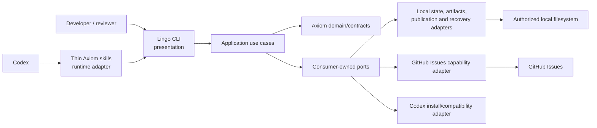

# Plan — Specification 004: Usable MVP v1 Baseline

## 1. Status, authority and source baseline

**Plan: Approved — human approval recorded on 2026-09-20.**

### Issue #94 amendment approval — 2026-09-24

The original Plan approval remains historical. Human review on 2026-09-24
explicitly approved the S6 placement, T26–T29 decomposition,
gate-to-lifecycle projection/flag contract, recovery inspection, and metadata-policy
boundary. This satisfies the amendment review gate. Implementation remains
separately gated; approval, merge, Issue state, or tracker edits do not by themselves
authorize T26–T29 or any successor Slice.

**Issue #94 amendment: Approved — human approval recorded on 2026-09-24. S6 implementation is not yet authorized.**

This Plan describes how to realize the behavior approved in
[Specification 004](spec.md). It was explicitly approved by the human reviewer in
PR #71 on 2026-09-20 together with ADR-0007 and ADR-0008. The next authorized SDD
phase is Tasks only. Implementation, migration, Provider mutation, release, and
final MVP acceptance remain unauthorized. No `tasks.md` is created by this change.

Planning baseline: `main` at `9537cdca08686c45a8dc32f292e571e08be78031`,
including merged PR #70 and explicit human acceptance of
[ADR-0005](../../decisions/0005-bounded-local-filesystem-threat-model.md),
[ADR-0006](../../decisions/0006-machine-local-detail-artifacts.md), and
[Specification 002 H13](../002-lingo-project-initialization/clarifications.md#bounded-local-filesystem-threat-model--2026-09-20).
The former HD-3 planning gate is therefore resolved.

This Plan was requested after PR #70 completed that gate. That request is process
context for PR #71, not a separate GitHub approval artifact. PR #71 is the durable
place for the human to review this Plan and the architectural proposals discovered
during its review. No approval is inferred from the request, branch, checks, or
merge state.

Canonical inputs:

- Specification 004 and HD-1–HD-4;
- Specification 002, H1–H13, its approved Plan, and its partial implementation;
- Accepted ADR-0001–ADR-0006;
- the conceptual model, Provider boundaries, Constitution, roadmap, and current
  repository implementation/Evidence.

Plan review identified two durable cross-cutting choices that are not already
accepted:

- [ADR-0007](../../decisions/0007-local-publication-and-recovery-protocol.md)
  proposes the shared local publication/recovery protocol;
- [ADR-0008](../../decisions/0008-minimal-machine-local-execution-record.md)
  proposes the bounded machine-local Execution record.

Both were explicitly **Accepted on 2026-09-20** in PR #71 together with approval
of this Plan. They are outputs of Plan review, not retroactive canonical inputs.
Their acceptance clears the architecture gate for the authorized Tasks phase.

The accepted POC is historical Evidence and an implementation baseline. Its
commands, status values, schemas, storage layouts, and adapters are not v1
contracts unless this Plan selects them. Future traceability is:

```text
Specification 004 + accepted Decisions
-> this Plan
-> future Tasks
-> bounded implementation units
-> reproducible Evidence
-> explicit human RC acceptance or rejection
```

The approved amendment starts from `main` at
`f086c2fbbb43b730d42c42574dd5fc37215da365`, after delivered S4 and S5. It
reconciles only the remaining DAG and affected contracts. S4/S5 implementation,
Evidence, task identities, and historical stage observations remain unchanged.

## 2. Technical goals and non-goals

### Goals

- deliver one installable local MVP for Codex, Lingo, and GitHub Issues;
- preserve one deterministic application contract across CLI and Runtime skills;
- make Project setup, Work Item intent, workflow state, Provider projection,
  completion, artifacts, provenance, recovery, and upgrade observable end to end;
- make the Work Item a durable lifecycle anchor with deterministic gate-derived stages,
  orthogonal flags, bounded history, recovery signals, and Project-resolved
  Work Item/Pull Request metadata;
- make local publication safe under ADR-0005's bounded threat model;
- make detail artifacts durable, bounded, reference-aware, and machine-local
  under ADR-0006;
- retain exact authority, revision, Provider-effect, and human-acceptance gates;
- produce clean-environment Evidence sufficient for a human release decision.

### Non-goals

Specification 004 non-goals remain unchanged. In particular, this Plan does not
add Windows, package managers, automatic update, signing/notarization, multiple
Runtimes, multiple Work Item Providers, multi-agent orchestration, cloud state,
remote locks, generic Provider CRUD, raw chat Evidence, automatic POC migration,
or physical durability guarantees.

The amendment also excludes arbitrary user-defined workflows, a generic custom-
field/metadata engine, sophisticated GitHub Projects automation, Provider-owned
acceptance, automatic local-Execution reconstruction, and broad multi-Provider
metadata implementation.

The following are explicitly unsupported, not solved risks:

- malicious same-UID arbitrary hostile interleavings outside declared boundaries;
- physical power-loss guarantees;
- physical-media durability or recovery from lying/failing storage hardware.

## 3. Architecture and component boundaries

The executable direction remains:

```text
CLI / Codex Runtime skill
-> application use cases
-> domain values and contracts
-> consumer-owned ports
-> local, GitHub, Codex, filesystem, and release adapters
```

This C4 component view is sufficient because it exposes the relevant ownership
and dependency boundaries without fixing code-level trivia:



Source dependencies point inward. Runtime skills and CLI presentation parse,
collect missing input, and render; they do not classify outcomes or own workflow,
authority, provenance, artifact, persistence, or recovery rules. GitHub implements
the first Work Item capability; it is not a domain dependency. Transport remains
an adapter detail and is not synonymous with Integration.

Planned cohesive package evolution:

| Location | Responsibility | Boundary |
|---|---|---|
| `internal/completion` | Canonical statuses, result, references, next action, detail reference | No rendering, filesystem, or Provider calls |
| `internal/provenance` | One product/version/revision/source-state model | Build observation only; no surface-specific policy |
| `internal/project`, `internal/projectapp`, `internal/manifest` | Existing Project rules, complete proposals, authority, portable codec | Preserve Specification 002 contracts |
| `internal/workitem` | Intent/draft/use cases, provider-neutral lifecycle and metadata-policy intentions, and Work Item capability ports | No GitHub fields, formatting, or transport |
| `internal/githubissues` | GitHub issue/PR lookup and mutation, lifecycle/flag labels, metadata effects, bounded comments, response validation | No workflow authority or local truth |
| `internal/workflow` | Detailed sequential gates, minimal local Execution record, deterministic Work Item lifecycle projection, prerequisites, projection/recovery intent | No Runtime or Provider transport |
| `internal/detailartifact` | Metadata, retention/reference rules, lookup and cleanup use cases | No portable publication |
| `internal/local` | Versioned stores, anchored filesystem protocol, locks, recovery and OS roots | No domain policy invention |
| `internal/codexruntime` | Thin skill content, installation ownership and compatibility | No duplicated application behavior |
| `internal/install` | Release receipt, binary/skill upgrade plan and compatibility inspection | No automatic network/update authority |
| `internal/cli`, `cmd/lingo` | Strict selectors, guided input, human/JSON rendering, composition | No parallel business contract |

Existing packages should be evolved, not wrapped by a universal framework. A
second Provider or Runtime is required before generalizing adapter registration.

Under accepted
[ADR-0008](../../decisions/0008-minimal-machine-local-execution-record.md), the
MVP uses a minimal, versioned, machine-local Execution record only for the
specified sequential workflow: opaque Execution ID, Project ID, Repository key,
Work Item reference, Runtime ID, workflow version, current stage, state revision,
bounded transition records, timestamps, provenance, artifact/Evidence references,
and terminal state. The ADR owns identity, authority, lifecycle, and cross-boundary
meaning. Exact field names, encoding, path, indexes, and package types remain
implementation details. This does not settle the broad Execution model or create
an `operation-attempt` entity. Pre-Execution commands use only ADR-0006's opaque
local correlation ID.

## 4. Delivery slices and dependency ordering

Future Tasks should preserve these vertical slices. Each slice includes domain,
application, adapter, presentation, tests, and Evidence needed for its observable
behavior; Tasks must not be split merely by layer.

| Slice | Observable outcome | Depends on | Exit Evidence |
|---|---|---|---|
| S1 — Result, provenance and protected local substrate | `lingo version` and representative commands emit canonical results/provenance; a forced detailed result publishes and resolves one valid artifact | Approved Plan | Unit contract matrix; local artifact integration; CLI black-box |
| S2 — Install, first run and Project setup | Clean supported host installs checksummed Lingo/Codex skills, enters explicit setup, and publishes portable/local Project state after review | S1; Specification 002 contracts | Native-platform install, setup, idempotency and separation Evidence |
| S3 — Intent to GitHub Work Item | Intent becomes reviewed structured draft; authorized create/select persists exact GitHub reference; denial/cancel has zero Provider effects | S2 | Fake-adapter side-effect ledger and bounded real GitHub observation |
| S4 — Workflow truth and Provider projection | One local Execution advances sequential gates and reconciles one GitHub stage marker plus idempotent transition comments | S3 | Transition/replay/concurrency matrix and real projection observation |
| S5 — Codex selector path and completion convergence | Fully specified skill runs without avoidable questions; CLI/skill meanings and all terminal statuses match | S4 | Host-contract tests and CLI/Runtime semantic-equivalence matrix |
| S6 — Durable Work Item lifecycle and metadata governance | One Work Item exposes a provider-neutral lifecycle projection derived from canonical gates/facts, orthogonal flags, bounded history, safe recovery signals, and resolved Work Item/PR metadata | S5 | Gate/fact derivation and flag matrix, exactly-one-stage projection, history replay, recovery inspection, metadata-resolution matrix |
| S7 — Recovery, cleanup and upgrade | Operator can inspect/recover recognized interrupted state, safely clean eligible artifacts, detect POC state, and perform supported owned upgrade | S1–S6 | Fault matrix, cleanup/reference tests, compatibility and upgrade black-box |
| S8 — Release candidate acceptance | Isolated clean environments complete install through Evidence/completion and representative failure/upgrade paths | all prior | Versioned RC report; human decision remains pending |

S1 selects shared semantics early because every later surface consumes them. S2–S5
then deliver user-visible journeys rather than disconnected infrastructure. New S6
uses S4 workflow/projection truth and S5 selector convergence before recovery
hardening depends on its durable signals. S7 closes destructive/recovery paths
only after their reference owners exist. S8 does not compensate for missing slice
Evidence.

With human approval recorded on 2026-09-24, tracker reconciliation is required:

- Issue #94 becomes the S6 Slice tracker for T26–T29;
- Issue #80 is retitled/relabelled from S6 to S7 without changing T16–T22 scope;
- Issue #81 is retitled/relabelled from S7 to S8 without changing T23–T25 scope;
- tracker #15 changes its roadmap and sequence to S1–S8 while preserving delivered
  S4/S5 history and keeping final acceptance human-only.

Approval records the S6/S7/S8 placement only. Tracker reconciliation after merge
does not authorize T26–T29 implementation; S6 implementation remains separately
gated.

## 5. Project setup strategy

Extend the existing Project lifecycle rather than inventing another setup model.
`project configure` may become the v1 guided/non-interactive setup surface; exact
help spelling remains a presentation detail, but these inputs and effects are
normative for implementation:

1. accept an explicit Project selector/new slug and Project name;
2. accept zero or more Repository declarations and independent machine-local
   absolute bindings keyed by validated Repository key;
3. accept an explicit Work Item Provider declaration/capability request for the
   intended workflow; `github` is supported, absent/other remains explicit;
4. reuse supplied valid values and ask only for missing/materially ambiguous data;
5. load current state and materialize one complete proposed Project plus local
   installation proposal;
6. show separate portable and machine-local diffs, exact destinations, expected
   revisions, and unresolved capabilities;
7. bind confirmation to proposal digest, revisions, destinations, and effects;
8. revalidate immediately before publication and publish through §10.

CWD is never a selector. Multiple Repositories need no common parent, Provider,
or submodule relationship. Equivalent rerun is read-only/no-op. Identity, slug,
source, binding, capability, or expected-revision conflicts fail explicitly.
A portable-valid Project without a supported Work Item capability remains valid
but cannot start the MVP Work Item workflow.

Portable `axiom.yaml` continues to carry Project identity, Repository keys and
Provider/capability declarations. Absolute paths, credential bindings, observations,
workflow state, Executions, Evidence, and detail artifacts remain local.

## 6. Work Item and Provider strategy

The application consumes a workflow-specific `WorkItemCapability`, not universal
Provider CRUD. Required operations are prepare draft, create, read/select, inspect
projection, and apply an authorized projection plan. GitHub-specific issue body,
labels, comments, authentication, CLI/API transport, rate limits, and response
validation remain in `internal/githubissues`.

Intent capture uses a provider-neutral draft with: problem, desired outcome,
context, scope, constraints, non-goals, and acceptance expectations. Each field
records supplied versus Axiom-authored content so provenance never claims unchanged
user text. The interview asks only for missing facts that change those sections.
Draft ordering and rendering are deterministic and bounded.

Create/update is two-phase even when one interactive command conducts both phases:

1. prepare and display complete normalized draft plus target Provider/repository;
2. issue a preview digest and exact external-effect set;
3. collect explicit authority bound to that preview;
4. revalidate target and authority;
5. mutate Provider once;
6. validate returned identity/state and persist the local link;
7. return `success`, or `partial` with confirmed Provider reference when local
   persistence fails after confirmed mutation.

Cancellation, missing/stale authority, invalid response, unavailable authentication,
and rate limiting never trigger an alternative Provider. Retryable failures name
the safe retry boundary; after an ambiguous or confirmed create, retry first reads
or reconciles by stored/draft correlation instead of blindly creating again.

## 7. Workflow state and Provider projection

Local versioned workflow/Execution state remains authoritative. The S4 detailed
gate list remains historical and executable:

```text
intake -> specification -> clarification -> plan -> tasks
-> implementation -> review -> evidence -> reconciliation -> completion
```

Clarification may record a passed/no-material-question outcome without a separate
artifact. Each transition uses expected workflow revision, current stage, outcome,
artifact/Evidence references, authority requirements, provenance, and next action.
Only one process can commit a transition from a revision. Resume rereads state and
does not infer success from an interrupted command.

The Issue #94 amendment adds one provider-neutral, read-only Work Item lifecycle
projection over the same revisioned local workflow authority:

```text
intake -> specifying -> specified -> planning -> planned
-> implementing -> implemented -> reviewing -> reviewed -> accepted
```

It is a human-visible summary, not a second Execution state machine or persisted
stage field. Derivation uses this total mapping:

| Current canonical gate/status | Revisioned additional fact | Derived stage |
|---|---|---|
| `intake` | none | `intake` |
| `specification` or `clarification` | valid preceding history | `specifying` |
| `plan` | no planning authority yet | `specified` |
| `plan` with planning authority, or `tasks` | explicit planning authority; `tasks` also has Plan transition/reference | `planning` |
| `implementation` | no implementation authority yet | `planned` |
| `implementation` | exact implementation scope and authority | `implementing` |
| `review` | review-start fact absent | `implemented` |
| `review` with review-start fact, or `evidence` or `reconciliation` | explicit review-start fact; later gates retain preceding review/Evidence facts | `reviewing` |
| `completion`, active or terminal, without human acceptance | completed review, Evidence, reconciliation, and blocking-finding disposition | `reviewed` |
| terminally completed `completion` | explicit human acceptance of the bounded outcome | `accepted` |

Planning authority, exact implementation authority, review start, and human
acceptance are bounded, revisioned local facts with scope/reference/digest and
provenance. They are not Provider observations. Absence at the deliberate
`specified`, `planned`, and `implemented` boundaries selects that earlier stage;
absence or contradiction after the corresponding boundary is an inconsistent
Execution and returns `recovery_required`. No best-effort stage is projected.

`review`, `evidence`, and `reconciliation` all derive `reviewing` until
reconciliation passes into `completion`; only then is `reviewed` derived.
Technical completion does not create `accepted`. The acceptance fact may be
recorded only against a terminally completed Execution and does not alter its gate.

This preserves ADR-0008 without amendment: Execution identity, one sequential gate
set, transition lineage, revision authority, terminal semantics, and Provider
non-authority are unchanged. The new function reads facts ADR-0008 already permits
in revisioned transitions/terminal truth. Persisting an independent lifecycle
field or transition history would instead change lifecycle semantics and requires
a new architecture decision before implementation.

GitHub projection uses these amended adapter conventions:

- exactly one current lifecycle label from the closed set defined by
  Specification 004 (`axiom:stage:intake` through `axiom:stage:accepted`);
- zero or more independent flags: `axiom:blocked`, `axiom:needs-decision`,
  `axiom:needs-approval`, and `axiom:recovery-required`;
- transition comments contain stage, outcome, bounded references, provenance, and
  next action where applicable;
- each Axiom comment includes a non-rendered namespaced projection key derived from
  Execution ID plus the canonical Execution revision used for derivation;
- local state records intended and confirmed projection keys/effects;
- reconciliation reads current labels/flags/comments, removes only positively
  identified obsolete Axiom markers, preserves non-Axiom labels/content, and
  posts no semantic duplicate.

A valid blocked snapshot retains its derived lifecycle stage and independently
projects `axiom:blocked`; the blocker is not a lifecycle inconsistency. If the
blocker applies to the next canonical gate transition, the operation is denied
before mutation: the gate does not advance, no authority is inferred, and the
current snapshot continues to determine both stage and flags. Only stale,
incompatible, contradictory, unknown, insufficient, out-of-order, or
scope-mismatched local truth returns `recovery_required`.

Projection is a separately authorized post-commit effect. A local transition never
waits for GitHub to become authoritative. Provider failure returns `partial` or
`retryable_failure` according to confirmed effects; it never advances or rewinds
local truth. Provider state cannot close a local gate. Reconciliation from stale
local revision or ambiguous Provider response fails closed.

Zero, multiple, unknown, or contradictory `axiom:stage:*` observations are drift,
not transition authority. Drift blocks only Provider reconciliation; a valid local
gate transition remains governed exclusively by local facts and authority.
Reconciliation may replace a positively identified
legacy S4 label only under a reviewed exact effect plan; unknown namespaced labels
are preserved and produce `recovery_required`. This permits future delivery
without rewriting S4 Evidence or mutating historical Provider observations during
this amendment.

Comments reuse the existing 16 KiB hard bound and at most 16 transition references.
They summarize the material transition and link stable Specification, Plan/Tasks,
PR, Evidence, artifact, next-action, or blocker references. They never embed dense
documents, raw logs, chat, or unrestricted model output.

### Missing-local-state reconciliation

Read-only inspection gathers Provider lifecycle/flag/comment facts, Repository
artifact identities/digests, and any available canonical/prior/staged local
records. It returns one of three plans:

1. current local truth plus an idempotent Provider reconciliation preview;
2. an ADR-0007 recovery plan selecting one completely validated local generation,
   requiring fresh exact recovery authority; or
3. `recovery_required`, preserved observations, and the smallest human decision
   needed when evidence is missing, contradictory, or insufficient.

Provider plus Repository state never synthesizes an Execution, lifecycle stage,
transition, or acceptance. Recovery does not relax ADR-0007 readers or ADR-0008
identity/authority.

### Project metadata policy

Project portable intent may declare bounded required/default metadata intentions
for Work Item create/update and Pull Request preparation/review by referencing a
contained policy document through Specification 002's existing `policies` field.
No new `axiom.yaml` field is added: `schemaVersion: 1` remains closed, and no
migration or implicit compatibility is introduced. The application
asks a policy resolver for provider-neutral outcomes such as resolved, optional,
required-but-missing, or unsupported capability. The GitHub adapter alone maps
those intentions to concrete labels, assignee, milestone, supported Project/status,
and Pull Request labels/assignee/review metadata.

The MVP intention vocabulary is closed:

| Provider-neutral intention | Surface | GitHub adapter mapping |
|---|---|---|
| `classification` | Work Item and Pull Request | configured labels |
| `owner` | Work Item and Pull Request | assignee resolved through Project Provider identity binding |
| `delivery_target` | Work Item | milestone |
| `tracking_state` | Work Item | configured GitHub Project/status when capability exists |
| `reviewers` | Pull Request | requested reviewers resolved through Project Provider identity bindings |

Lifecycle stage and auxiliary flags are workflow projection, not metadata-policy
inputs. The referenced document is a distinct strict portable contract with:

- integer `policyVersion: 1` and exact `kind: work-item-metadata`;
- optional closed `workItem` mapping limited to `classification`, `owner`,
  `delivery_target`, and `tracking_state`;
- optional closed `pullRequest` mapping limited to `classification`, `owner`, and
  `reviewers`;
- each intention encoded as a closed mapping with required `requirement`
  (`required` or `optional`) and optional bounded provider-neutral `default` or
  logical reference; `reviewers` alone may be a bounded list;
- exactly one referenced document of this `kind`; duplicates, unknown fields,
  malformed types, or missing/malformed/unsupported versions fail metadata-policy
  resolution before prompts or Provider effects.

The document is not another Project manifest and cannot redefine identity,
workflow, security, authority, Provider bindings, or local observations. Arbitrary
policy documents remain untrusted data. Specification 002 base manifest validation
still validates the contained reference; T28 additionally validates this recognized
policy kind before use. No automatic migration or down-conversion exists.
Observations, provider IDs, credentials, concrete GitHub field names, identity
bindings, and effect ledgers remain machine-local or adapter-owned.

Resolution order is deterministic: explicit operation input, applicable Project
policy, already validated Work Item/PR context, then one prompt only for each
still-missing mandatory value. Preview lists exact target, observation, resolved
source, ordered effects, unsupported optional intentions, and digest. Mutation
retains the existing separate exact Provider authority and reinspection rules.
No arbitrary custom-field schema or universal Provider metadata API is introduced.

## 8. Runtime invocation strategy

Keep five Codex skills as thin adapters, evolving their contents only when the
corresponding Lingo operation exists. The validated v1 selector vocabulary is:

| Selector | Accepted meaning |
|---|---|
| `project` | exact Project UUID or installation-unique slug |
| `repository` | exact Project-scoped Repository key |
| `work-item` | exact locally linked provider reference, rendered for GitHub as `github:<owner>/<repo>#<number>` |
| operation inputs | operation-specific known keys only |

Skills accept supplied selectors, ask only for missing or ambiguous values, then
pass explicit flags to Lingo. They never substitute CWD, infer a Git remote as
Project identity, or silently choose GitHub. Unknown, duplicate, or conflicting
keys are passed to deterministic validation and fail before action. Fully supplied
inputs require no selector round trip.

The direct CLI and Runtime path call the same operation-shaped application use
case. Skill output is a rendering of the canonical completion result, not a second
status model. Skill-set compatibility is a versioned manifest/digest checked by
Lingo and the installer; user-modified/unowned skill content is never overwritten.

## 9. Canonical completion result and detail artifacts

### Completion

`internal/completion.Result` contains exactly the semantic fields approved by the
Specification: `status`, `result`, `references`, `next`, `details`, and
`provenance`. Status is one of `success`, `failure`, `validation_failure`,
`denied_authority`, `partial`, `interrupted`, or `retryable_failure`. Application
use cases classify it. CLI, JSON, skills, GitHub comments, and Markdown renderers
may change syntax only.

Confirmed effects are accumulated before classification. Rendering or artifact
failure after a confirmed domain/Provider effect cannot erase that effect or claim
rollback. Routine success/no-op and compact validation/authority outcomes create no
artifact unless a workflow/Evidence gate requires one.

### Machine-local artifact boundary

Use one root under the resolved Lingo state root:

```text
<state-root>/artifacts/v1/
├── objects/<first-two-id-chars>/<artifact-id>/metadata.json
├── objects/<first-two-id-chars>/<artifact-id>/details.md
└── cleanup/<cleanup-record-id>.json
```

The root is Axiom-owned machine-local state. It is disjoint from portable Project
working copies, associated Repositories, installation records, and credential
stores. `LINGO_STATE_ROOT` remains the explicit isolated-test override; the same
security rules apply.

Artifact ID is an immutable random UUID v4. Filename and path are display/storage
details, never lookup authority. Lookup accepts exact artifact ID, opens through
the artifact store, validates metadata/content/digest, and returns a stable local
reference such as `artifact:<uuid>`; it never accepts arbitrary paths.

Closed `metadata.json` format version 1 records: artifact ID; optional Execution
ID; original pre-Execution local correlation ID when applicable; created time;
canonical provenance; safe Project/Repository/Work Item/Provider/source references;
category/outcome; retention class; content byte length; SHA-256 digest; live
reference summaries; optional superseding artifact; and cleanup state. Adding an
Execution reference later preserves artifact identity and original correlation.

No benchmark or production-volume Evidence currently supports an exact threshold.
The following values are therefore **initial bounded MVP defaults/guardrails**,
selected to make resource behavior testable and fail closed. Dogfooding and RC
Evidence must measure observed sizes/counts and recommend retention or limit
adjustment. Values may change in a later reviewed Plan/release without changing
artifact identity, Evidence-reference meaning, or ADR-0006 ownership invariants.

| Boundary | Initial value | Kind | Objective and controlled risk | Cost / validation obligation |
|---|---:|---|---|---|
| Markdown content per artifact | 1 MiB | Hard per-object guardrail | Bound memory/disk use and prevent one diagnostic from becoming an unbounded log container | Large diagnosis must be safely summarized or split into separately identified artifacts; dogfood real reports and record truncation/split behavior |
| Metadata per artifact | 64 KiB | Hard schema guardrail | Bound decode/allocation and prevent references/provenance from becoming a payload channel | Limits reference fan-out; implementation must reject rather than silently drop required metadata |
| Sanitized captured output included per artifact | 256 KiB | Hard capture guardrail | Bound untrusted external output before durable publication and reduce sensitive-data exposure | May omit useful tail/context; any truncation must be explicit and preserve the source/result classification |
| Live artifacts per state root | 10,000 | Hard initial capacity guardrail | Bound lookup/reference scans and inode/object growth | Heavy users may exhaust count before bytes; no eviction is implicit and dogfood must measure scan/lookup cost |
| Aggregate artifact content per state root | 1 GiB | Hard initial capacity guardrail | Bound local storage consumption independently of object count | Workflows can block detail creation at capacity; cleanup remains separately authorized and reference-aware |
| Cleanup record | 64 KiB per record | Hard audit guardrail | Keep cleanup explanation bounded and prevent removed payload from being copied into audit state | Large cleanup must be batched with complete identities/digests; no removed identity may be silently omitted |
| Confirmed cleanup-record retention | 90 days | Default policy | Preserve a bounded audit window for operator review without retaining deleted payload indefinitely | More metadata remains local; dogfood must assess usefulness and volume before release |

Capacity exhaustion never triggers deletion or changes a confirmed primary effect.
It appears in the completion contract as follows:

- before any requested effect, inability to create a required artifact is `failure`;
- after a confirmed primary effect, required artifact/reference failure is `partial`
  and lists the confirmed effect plus safe next action;
- when details are optional and the requested primary effect is complete, the
  primary status remains truthful and the bounded result states that optional
  details were unavailable;
- input/schema bounds detected before action are `validation_failure`;
- ambiguous capacity or reference state fails closed and preserves content for
  review.

Retention classes and policy:

| Class | Required retention | Policy kind and rationale | Cleanup eligibility / cost |
|---|---|---|---|
| `active` | While workflow/Execution/recovery/review dependency is active | Hard reference invariant; protects continuation and current review rather than using age as authority | Only after authoritative terminal resolution and explicit reclassification; may retain indefinitely while work remains active |
| `evidence` | While any retained Evidence references identity+digest | Hard reference invariant plus initial 365-day post-retirement default; preserves a review/audit window after explicit reference retirement | 365 days after every Evidence reference is explicitly retired; storage cost persists after retirement and duration needs dogfood/review Evidence |
| `diagnostic` | Initial 30-day default after creation or supersession | Default policy for bounded troubleshooting context with no live dependency | Eligible only with no live references; short window may reduce late diagnosis and must be validated through dogfooding |
| `preserved_review` | While ownership, validity, or reference state is uncertain | Hard fail-closed invariant; age cannot establish deletion authority | Never age-eligible; operator must resolve/reclassify, accepting possible capacity pressure |

Cleanup is always an explicit, previewed, separately authorized command. It locks
and revalidates exact identity, ownership, type, links, digest, references, and
eligibility before removal. Any uncertain owner/reference/lock state moves or keeps
the item in `preserved_review`; unknown content is untouched. Cleanup removes exact
owned objects only, never recursively assumes ownership of the broad root.

Artifact publication stages a private sibling directory, writes and validates both
files, then publishes the complete directory with no replacement. Incomplete
content is never returned as a usable reference. An artifact supports Evidence only
when an Evidence record states a claim and references artifact ID, digest, source,
observation, and verification context.

## 10. Persistence, filesystem, concurrency and recovery

### Supported release matrix and assumptions

Versioned support research was refreshed on 2026-09-20 from official sources:

- Apple lists [macOS 27 Golden Gate 27.0 as the latest macOS](https://support.apple.com/en-ie/109033)
  and its [compatibility list](https://support.apple.com/en-us/127455) supports
  Apple-silicon Macs only. Therefore macOS 27 has no supported `amd64` target.
- Canonical lists [Ubuntu 26.04 LTS](https://ubuntu.com/about/release-cycle) as
  the current LTS, released April 2026, with vendor support for `amd64`, `armhf`,
  `arm64`, `s390x`, `riscv64`, and `ppc64el-p9`. The MVP selects only `amd64` and
  `arm64`, the candidate Linux binary targets in HD-1; other Ubuntu architectures
  remain outside MVP scope until required and evidenced.
- Apple documents [APFS as the default Mac filesystem](https://support.apple.com/guide/disk-utility/file-system-formats-dsku19ed921c/22.7/mac/27)
  and case-sensitive APFS as a distinct format. Ubuntu documents an ext4-capable
  local platform; the official Ubuntu
  [`rename`/`renameat2` reference](https://manpages.ubuntu.com/manpages/jammy/man2/rename.2.html)
  requires source/target on the same mounted filesystem and records
  filesystem-specific no-replace support.

The v1 supported release target and reproducible initial acceptance baseline are
exactly:

| Supported release / acceptance baseline | Product architecture | Supported local filesystem for acceptance | Rationale |
|---|---|---|---|
| macOS 27 / macOS 27.0 | `arm64` | local APFS, default case-insensitive format | Latest stable macOS major and current 27.0 release; Apple supports only Apple silicon, so no `amd64` binary is claimed |
| Ubuntu 26.04 LTS / Ubuntu 26.04 LTS | `amd64` | local ext4 | Latest Ubuntu LTS; primary x86-64 Linux binary target selected by HD-1 |
| Ubuntu 26.04 LTS / Ubuntu 26.04 LTS | `arm64` | local ext4 | Latest Ubuntu LTS; ARM64 Linux target selected by HD-1 and required to avoid architecture-by-cross-compile claims |

Every Evidence record includes the exact OS point version, build/kernel, image,
architecture, and filesystem observation. A later macOS 27 maintenance release or
Ubuntu 26.04 point release requires the applicable native compatibility rerun before
the release claim expands; `27` or `26.04 LTS` is not a floating unrecorded runner.

Every row requires native execution Evidence; cross-compilation alone is
insufficient. Other distributions, OS versions, architectures, case-sensitive APFS,
network mounts, FUSE, overlay/union filesystems, removable media, and
cross-filesystem publication are unsupported for v1 unless later added with
equivalent Evidence.

Relevant filesystem restrictions become acceptance preconditions, not broader
guarantees: staging and canonical targets share one mounted local filesystem;
case behavior is detected and must match the row; APFS shared-container free space
is re-observed rather than treated as reserved capacity; ext4 no-replace/rename
support is probed or established for the target; and Ubuntu 26.04's documented
[POSIX ACL inheritance limitation with `mkdir -p`](https://documentation.ubuntu.com/release-notes/26.04/changes-since-previous-interim/)
means implementation cannot rely on inherited ACLs and must explicitly set and
revalidate final ownership/mode/ACL state.

Supported product targets remain separate from currently automated CI:

| Target | Current GitHub-hosted availability on 2026-09-20 | Evidence consequence |
|---|---|---|
| macOS 27.0 `arm64` | [`xcode-27`](https://github.com/actions/runner-images/blob/main/images/macos/xcode-27-arm64-Readme.md) runs macOS 27.0/arm64 as a public-preview image | Exact native automation is available, but the repository does not use it yet and preview capacity/support is not GA. RC Evidence must record the exact image/environment and a rerun/backstop path. |
| Ubuntu 26.04 LTS `amd64` | [`ubuntu-26.04`](https://github.com/actions/runner-images/issues/14226) exists as public preview | Exact native automation is available; preview availability/SLA limitations and the exact image must be recorded. |
| Ubuntu 26.04 LTS `arm64` | [`ubuntu-26.04-arm`](https://github.com/actions/runner-images/issues/14226) exists as public preview | Exact native architecture automation is available with the same preview limitations. |

GitHub documents that `-latest` can lag the vendor's latest OS and lists current
[runner labels and architectures](https://docs.github.com/en/actions/how-tos/write-workflows/choose-where-workflows-run/choose-the-runner-for-a-job).
The repository's current `macos-15`/`ubuntu-24.04` workflow remains historical POC
verification only and cannot claim MVP matrix Evidence. No workflow is changed by
this Plan. Future exact-target runs may use the preview labels above, explicit
self-hosted/native environments, or later GA labels; missing exact target Evidence
remains an explicit release blocker rather than a reason to weaken product support.

Assumptions: intended local user owns managed roots; required regular-file,
directory-handle, identity, link-count, rename, restrictive mode/ACL, and advisory
process-lock semantics are available; staging and canonical target share one local
filesystem; clocks are not used for concurrency authority. Failure to establish an
assumption returns validation failure or `recovery_required` before mutation.

### Publication protocol mapping

[ADR-0007](../../decisions/0007-local-publication-and-recovery-protocol.md)
owns the accepted architectural invariants: shared logical states, deterministic
coordination order, private preparation, protected publication, bounded recovery
state, one commit point, prior/new generations, fail-closed readers, and owned-only
cleanup.

Under accepted ADR-0007, implementation planning maps it
behind narrow ports as follows. Syscalls, filenames, lock backend, record encoding,
and Go libraries remain Task/implementation choices validated by native Evidence:

1. validate explicit root/object authority; open anchored roots without following
   unchecked names; validate ownership, type, mode/ACL, link count, and ancestry;
2. acquire kernel-backed advisory locks in fixed order: managed-root namespace,
   Project ID, then object ID; never infer stale ownership from PID or age;
3. read and strictly decode canonical state; reject unknown/ambiguous leftovers;
4. compare exact expected byte/content revision and exact preview/effect set;
5. create a random owner-only sibling staging object on the same filesystem and a
   bounded operation marker identifying allowed objects and protocol stage;
6. write complete bounded bytes, handle short writes, sync to surface reported I/O
   errors, reread, digest, decode, and revalidate permissions/identity/links;
7. recheck cancellation, authority, expected revisions, target identity, and locks;
8. publish create with protected no-replace rename, single-file update with protected
   atomic replacement, and multi-file Project/rename with a journaled directory
   sequence under the namespace lock; readers seeing a marker never accept mixed
   state and return deterministic `recovery_required`;
9. define commit as successful publication of the complete canonical new object;
   reread canonical identity/revision before acknowledgment;
10. record confirmed commit, release locks, then clean only positively owned staging,
    prior-generation, and marker objects.

For proposed journaled multi-file publication, the prior complete directory is retained as
an identified prior generation before final publication. Before commit it remains
the recoverable authority; after commit the new complete generation is authority.
Crash/uncertainty blocks ordinary readers rather than exposing either partial tree.
Recovery selects prior/new only from validated marker, revisions, identity, and
complete content; ambiguity requires operator review.

Expected revisions are mandatory for update, transition, projection bookkeeping,
artifact metadata/reference mutation, cleanup, recovery, and upgrade receipt
replacement. Authority binds operation, targets, expected revisions, preview digest,
and effect set. A changed observation yields `denied_authority`/stale authority;
the caller must reread and review. No implicit retry repeats external mutation.

### Deterministic fault stages and truth

| Stage | Injection examples | Required result |
|---|---|---|
| F0 after lock/before staging | cancellation, permission change | no write; prior authority |
| F1 staging/write | short write, zero progress, `ENOSPC`, `EDQUOT`, permission denial | prior authority; owned incomplete stage cleaned or recognized |
| F2 after write/before validation | corrupt/truncated stage, unsafe mode/link | no publication; fail closed |
| F3 after validation/before publication | interruption, stale revision, target replacement | prior authority; conflict/denied authority |
| F4 prior-generation preservation | rename/sync/identity error | prior generation remains recoverable; `recovery_required` if normal location uncertain |
| F5 publication | collision, rename failure, controlled replacement | old or new complete state only; never mixed canonical state |
| F6 post-publication/pre-acknowledgment | interruption, canonical reread failure | committed if confirmed; otherwise `recovery_required`, never claimed rollback |
| F7 acknowledged/post-secondary effect | local/Provider/artifact/projection failure | committed primary effect plus truthful `partial`/next action |
| F8 cleanup | permission/link/identity change | canonical commit preserved; unknown/unsafe leftovers preserved for review |

Tests use barriers and injected syscalls/errors, not timing sleeps. Pre-commit
failure preserves prior authority. Confirmed post-commit effects remain committed.
`recovery_required` is a deterministic local category rendered through the
canonical terminal status appropriate to the operation; it never means automatic
rollback or permission to delete.

### Recovery

Read-only inspection lists marker, canonical/prior/stage identities, revisions,
protocol stage, ownership, and safe proposed action. Mutating recovery requires
fresh exact authority and repeats confinement/lock/reference checks. Recognized
pre-commit state may restore the validated prior generation; recognized committed
state may finalize metadata/cleanup; unknown or contradictory state is preserved
and requires operator review. Recovery never recursively deletes a root.

## 11. Provenance

`internal/provenance` builds one immutable value per process from release build
metadata: product exactly `Axiom`; semantic release version or `development`;
embedded short revision or `unavailable`; source state `clean`, `dirty`, or
`unknown`. Release builds must be clean and revision-bound. Development builds may
be dirty but must say so.

Every supported Axiom-authored surface consumes that value: CLI/JSON, Codex skill
result, GitHub issue framing and transition comments, generated Markdown/detail
artifacts, Evidence records, and generated source/text. Renderers cannot invent or
hardcode version rules. Axiom framing is marked separately from unchanged user text.
Checksums provide artifact integrity only; they do not claim signing, attestation,
or independent publisher authenticity.

## 12. Installation, upgrade and compatibility

### Distribution and first run

Publish versioned release archives and `SHA256SUMS` through GitHub Releases for
all three supported targets.
Each archive contains `lingo`, license/notices, release metadata, and the compatible
Codex skill-set manifest. The documented install path downloads or accepts an exact
version, verifies the published checksum before execution/publication, and installs
to an explicit absolute user-owned binary directory. GitHub Releases is the initial
distribution adapter; it is not a domain dependency or signing claim, and changing
the distribution adapter does not change domain or local-state contracts.

Source installation remains for contributors and produces development provenance;
it is not the clean binary acceptance path. Installer never edits shell profiles.
First run reports version, PATH guidance, Codex compatibility, state compatibility,
and explicit `project configure` next action; it never configures CWD.

Closed installation receipt v1 records destination, binary checksum, release
version/revision/source state, target OS/architecture, skill-set version/digests,
and installation time. Owned equivalent reinstall is no-op. Missing receipt,
checksum mismatch, symlink, unexpected type, foreign content, unsafe ownership, or
unsupported platform is refused without replacement.

### Upgrade ordering

1. inspect platform, current receipt/binary/skills/state, free space, ownership,
   schema compatibility, and recovery markers read-only;
2. show exact source/target versions, roots, checksums, backups, and effects;
3. require authority bound to preview and observed receipt/state revisions;
4. stage and verify new binary and complete skill set;
5. publish the binary, re-read its checksum, publish the receipt as a separate
   confirmed effect, then publish skill files using their expected digests; there
   is no cross-root transaction, and any later failure is reported `partial` with
   the exact confirmed binary/receipt/skill state;
6. run compatibility verification; no v1 state migration is expected for clean v1;
7. report each confirmed effect. Mixed confirmed binary/skill outcome is `partial`
   with a resumable safe action, not silent rollback.

No automatic update, downgrade, or lossy conversion exists. A future mutating state
migration must satisfy FR-027/FR-028 and requires a separately approved bounded
compatibility decision when it includes POC in-place migration.

### Clean v1 and historical POC

Clean v1 is the only supported compatibility baseline. A read-only compatibility
inspector classifies absent v1, valid v1, recognized POC, malformed, unsupported
older, and unsupported newer state. Current POC signatures include owned receipt,
Project installation, Work Item, workflow, and skill formats/paths known at the
merged POC revision. Recognition requires a complete positive signature; uncertainty
is not treated as absence.

Recognized POC state is preserved. Supported action is:

1. inspect and list exact roots/content categories without secrets;
2. create an explicitly authorized, restrictive, digest-manifested backup at an
   empty target when local preservation is requested;
3. export validated portable Project content only to an explicit empty target;
4. install v1 into a separate clean state root and explicitly reconfigure local
   bindings, Provider references, and workflow as applicable;
5. verify new v1 state before any later, separately authorized cleanup.

There is no in-place POC migration, automatic deletion, or promise that POC
workflow/Execution history becomes v1 state. Unknown/newer data fails closed.

## 13. Release and clean-environment acceptance

RC is an identified candidate version/revision with immutable checksums and a
declared support matrix. For each OS/architecture row, an isolated account or VM
with no Axiom roots executes published instructions only:

```text
install -> version/provenance -> Codex compatibility -> first run
-> Project setup -> Intent draft -> authorized GitHub Work Item
-> workflow + projection -> Evidence/details -> completion
-> reinstall/upgrade -> recovery/cleanup checks
```

The run exercises direct CLI and Codex entrypoints, all terminal statuses,
authority denial, invalid selectors, interruption/resume, retryable Provider
failure, confirmed Provider effect plus local failure, filesystem
`recovery_required`, POC detection/export-reconfigure guidance, and upgrade.

Controlled fakes prove deterministic failure and non-effects. At least one bounded
real Codex discovery/invocation and one explicitly authorized real GitHub journey
are required before final acceptance. Evidence records candidate identity,
environment, commands, exit codes, hashes/references, side effects, exclusions,
unexecuted cases, and limitations. Automation prepares the report; only a human
accepts or rejects the RC.

## 14. Security model

- exact mutation authority and least privilege at every local/external boundary;
- structural secret rejection plus bounded sanitization; scanners are additional
  Evidence, never proof of absence;
- no credential values in portable/local state, output, logs, artifacts, comments,
  backups, or Evidence;
- untrusted Intent, Provider content, documents, paths, and generated text remain
  data and cannot change workflow or tool authority;
- Provider commands/API responses are bounded, time-limited, strictly parsed, and
  mapped to stable safe categories;
- no shell interpolation, hooks, implicit Git/network mutation, or permission
  expansion;
- restrictive ownership/modes and supported ACL/link checks apply to state,
  staging, recovery, receipts, artifacts, backups, and test overrides;
- portable export is allowlisted by construction; local data is not excluded only
  by `.gitignore`;
- unsupported filesystem or ownership semantics fail closed.

ADR-0005 defines the adversary/durability boundary. ADR-0006 defines artifact
ownership and cleanup. Neither permits unsupported guarantees to be reported as
passed.

## 15. Testing and future Evidence strategy

All Evidence below is planned, not executed by this Plan.

| Level | Planned proof |
|---|---|
| Unit | draft completeness, selectors, workflow transitions, status classification, provenance, retention/eligibility, schema/version rules, sanitization, Provider projection plans |
| Application integration | fake ports prove authority/revision ordering, no-op, partial-effect truth, no duplicate Provider mutation, artifact/Evidence references, upgrade ordering |
| Adapter integration | strict GitHub responses, label/comment reconciliation, local codecs, receipts, skill ownership, artifact lookup/cleanup, POC detection |
| Filesystem Linux/macOS | APFS/ext4 confinement, permissions/ACLs, traversal, symlink/hard-link/replacement, collisions, old/new readers, supported rename/publication/recovery |
| Deterministic fault injection | F0–F8 with short writes, ENOSPC/EDQUOT, permission, interruption, rename/sync/cleanup errors and post-commit failures |
| Concurrency | two independent processes, stale authority, create/update/rename/recovery/cleanup races, one winning revision, no mixed reader |
| Functional black-box | CLI and installed Codex skills from unrelated CWD; guided and complete inputs; human/JSON semantic equivalence; side-effect ledger |
| Security | sentinel non-leak checks, denied process/network/secret reads, unsafe ownership/link/ACL cases, bounded input/output, public-sensitive-file scan |
| Clean dogfood | native release archive on every support row plus bounded real Codex/GitHub observation |
| Work Item lifecycle | ten-stage gate/fact derivation matrix, orthogonal-flag matrix, exactly-one-stage drift cases, bounded-comment replay, missing-local-state reconciliation, and Work Item/PR metadata policy resolution |

Retained Evidence maps claim -> source version -> command/test -> exit/result ->
artifact/reference/digest -> environment -> limitation. It excludes raw chat and
secrets. Race-enabled Go tests, vet, build, module verification, repository
validation, documentation links, sensitive-file checks, and diff checks complement
behavioral tests; none substitutes for native filesystem or real bounded integration.

## 16. Traceability — FR, SEC and AC to Plan

Specification 004 defines FR and AC identifiers but no separate `SEC-*` series.
Security traceability therefore includes its normative security clauses plus the
inherited Specification 002 SEC-001–SEC-005 boundary used by Project persistence.

### Functional requirements

| Requirement | Plan coverage |
|---|---|
| FR-001 | §5 explicit selectors; no CWD |
| FR-002 | §5 missing-only guided/non-interactive setup |
| FR-003 | §5 portable/local split |
| FR-004 | §5 preview-bound authority |
| FR-005 | §5 independent multi-Repository inputs |
| FR-006 | §5 explicit capability; no GitHub fallback |
| FR-007 | §5 deterministic no-op/conflict/revision handling |
| FR-008 | §6 Intent-first draft |
| FR-009 | §6 bounded missing-fact interview |
| FR-010 | §6 structured provider-neutral draft |
| FR-011 | §6 two-phase Provider mutation gate |
| FR-012 | §3/§6 capability port and GitHub adapter |
| FR-013 | §7 authoritative local workflow; ADR-0008 Execution authority |
| FR-014 | §7 exactly one namespaced GitHub stage label |
| FR-015 | §7 transition comment contract |
| FR-016 | §7 truthful failed/interrupted/partial projection |
| FR-017 | §7 idempotent projection reconciliation |
| FR-018 | §8 direct known selectors |
| FR-019 | §8 missing-only Runtime questions |
| FR-020 | §8 strict unknown/duplicate/conflicting inputs |
| FR-021 | §3/§8 thin delegation to same use cases |
| FR-022 | §10 old/new complete canonical publication; ADR-0007 protocol |
| FR-023 | §9/§10 pre/post-commit truth |
| FR-024 | §10 anchored exact-target confinement |
| FR-025 | §10 deterministic guided recovery; ADR-0007 reader/recovery contract |
| FR-026 | §10/§12 explicit closed format compatibility |
| FR-027 | §12 migration preview contract; no POC migration selected |
| FR-028 | §12 authorized backup/rollback boundary |
| FR-029 | §12 no silent downgrade/conversion |
| FR-030 | §5/§12 portable/local migration exclusion |
| FR-031 | §12 checksummed published binary path |
| FR-032 | §10/§12 platform/prerequisite failures and next actions |
| FR-033 | §9/§12 ownership/lifecycle categories |
| FR-034 | §12 owned idempotent reinstall/refusal |
| FR-035 | §5/§12 explicit first-run setup |
| FR-036 | §8/§12 detectable binary/skill compatibility |
| FR-037 | §12 preflight, staged upgrade and partial truth |
| FR-038 | §7 durable Work Item references and bounded operational anchor |
| FR-039 | §7 deterministic canonical-gate/fact derivation and exact GitHub mapping |
| FR-040 | §7 unchanged canonical transition checks plus read-only fail-closed derivation |
| FR-041 | §7 orthogonal local conditions and GitHub auxiliary flags |
| FR-042 | §7 bounded idempotent reference-first lifecycle comments |
| FR-043 | §7 missing-local-state inspection and ADR-0007 recovery boundary |
| FR-044 | §7 deterministic Project metadata policy and adapter-owned fields |

### Security requirements

| Requirement | Plan coverage |
|---|---|
| Specification 004 security/NFR clauses | §9 limits/sanitization, §10 ownership/confinement, §14 security controls, §15 Evidence |
| SEC-001 | §6/§9/§14 secret exclusion and non-leak tests |
| SEC-002 | §5–§8 explicit authority; denied external/Git/process effects |
| SEC-003 | §10 anchored roots, links, identity, locks, supported race boundary; ADR-0005 plus ADR-0007 |
| SEC-004 | §10 revisions, old/new publication, owned-only cleanup/recovery; ADR-0007 |
| SEC-005 | §9/§10 restrictive local metadata and portable exclusion |

### Acceptance criteria

| Acceptance | Plan coverage and future Evidence |
|---|---|
| AC-01 | S2/§12 clean install, provenance, Codex check |
| AC-02 | §5/§12 first run without CWD identity |
| AC-03 | §5 guided/non-interactive equivalence |
| AC-04 | §5 multi-Repository portable/local preview |
| AC-05 | §5 missing/unsupported capability block |
| AC-06 | §6 bounded Intent-to-GitHub flow |
| AC-07 | §6 supplied-field reuse and zero-effect denial/cancel |
| AC-08 | §7 one marker and idempotent comments |
| AC-09 | §7 interruption/resume/projection truth |
| AC-10 | §8 full selector path without question |
| AC-11 | §8 strict input failure/no CWD fallback |
| AC-12 | §9/§15 seven-status CLI/Runtime matrix |
| AC-13 | §9 summary versus one referenced detail artifact |
| AC-14 | §9 sanitized/bounded/addressable/correlated local artifact |
| AC-15 | §11 cross-surface provenance states |
| AC-16 | §6/§11 user-content authorship separation |
| AC-17 | §10 F0–F8 old/new/recovery matrix; ADR-0007 |
| AC-18 | §12 version/POC detection and export-reconfigure path |
| AC-19 | §12 owned idempotent install/upgrade and conflict refusal |
| AC-20 | §6/§9 confirmed Provider effect plus local failure `partial` |
| AC-21 | §13 complete clean CLI/Runtime RC journey |
| AC-22 | §13 denial, interruption, retry, recovery, upgrade cases |
| AC-23 | §13/§15 versioned sanitized Evidence report |
| AC-24 | §1/§13 separate human Specification/RC decisions |
| AC-25 | S6/§7 lifecycle enum and exact GitHub label mapping |
| AC-26 | S6/§7 valid lifecycle derivation plus blocked/unauthorized transition denial versus stale/skipped/contradictory snapshot matrix |
| AC-27 | S6/§7 exactly-one-stage plus orthogonal flags and foreign-content preservation |
| AC-28 | S6/§7 bounded history and replay convergence |
| AC-29 | S6/§7 explicit human-only `accepted` gate |
| AC-30 | S6/§7 missing-local-state recovery plan or `recovery_required` |
| AC-31 | S6/§7 metadata resolution, missing-only prompts, and GitHub adapter isolation |

No Specification 004 requirement is deferred beyond its own declared non-goals.
In-place POC migration remains conditionally deferred by HD-4 and would require a
new explicit decision; this Plan implements detection, preservation, backup/export,
and reconfiguration instead.

## 17. Risks, trade-offs and deferred decisions

| Risk/trade-off | Plan response |
|---|---|
| Filesystem proof differs across APFS/ext4 and architectures | narrow matrix; native Evidence; unsupported combinations fail closed |
| Journaled multi-file publication may reduce availability during recovery | readers return `recovery_required` instead of accepting mixed state |
| Append-only GitHub comments cannot be transactionally rolled back | stable projection keys, read-before-retry, confirmed-effect `partial` truth |
| Local artifact volume/privacy | hard quotas, sanitization, purpose retention, explicit reference-aware cleanup |
| GitHub Releases/checksums share one publication channel | integrity is claimed; signing/authenticity is not; future trust expansion needs human decision |
| Closed v1 schemas increase evolution cost | explicit versions, fail-closed readers, no silent migration |
| Three binary targets increase release cost | each row blocks release if native Evidence is unavailable; no untested target claim |
| POC and v1 roots may be ambiguous | positive signature required; uncertainty preserved for review |
| Provider has zero/multiple/manual lifecycle labels | treat as drift; preserve unknown content; require exact reconciliation or human decision |
| Detailed Execution gates and derived lifecycle stages diverge | total deterministic mapping; inconsistent local facts return `recovery_required`; never infer from Provider |
| Metadata policy grows into a universal schema | MVP operation-specific intentions/capabilities only; GitHub fields remain adapter-owned |

Deferred without blocking this Plan: second Runtime/Provider, portable artifact
publication, generic Execution graph, broader Evidence schema, package managers,
automatic update, signing/notarization, remote collaboration, Git synchronization,
and in-place POC migration.

Architecture assessment found two new durable choices:

| Candidate | Assessment |
|---|---|
| Shared local publication/recovery protocol | Cross-cutting, durable, and expensive to change after persisted state ships. Accepted separately in ADR-0007 by explicit human decision in PR #71. |
| Minimal machine-local Execution record | Crosses workflow, resume, Provider projection, completion, artifacts/Evidence, and compatibility. Cohesion differs from filesystem publication, so it is accepted separately in ADR-0008 by explicit human decision in PR #71. |
| OS/architecture support matrix | Concrete release scope required by HD-1 and reproducibly versioned here. It is reassessed per release and does not define a permanent platform architecture; no ADR. |
| Artifact quotas and retention durations | Initial operational defaults/guardrails explicitly delegated to Plan by ADR-0006, measurable and revisable without changing identity/ownership contracts; no ADR. |
| Artifact layout/metadata and installation receipt schema | Versioned local adapter formats implementing already approved ownership/compatibility requirements. Exact paths, field names and encoding remain replaceable behind closed readers/migration gates; no separate ADR unless identity or lifecycle changes. |
| Package/component map | Planning decomposition with inward dependencies and consumer-owned ports, not a published API or permanent module topology; no ADR. |
| GitHub label/comment spelling and GitHub Releases adapter | First-adapter conventions within the approved MVP, replaceable behind Provider/distribution boundaries and carrying no broad compatibility/authenticity promise; no ADR at this stage. |
| Work Item lifecycle projection, flags, bounded history and metadata policy | Extends the already approved local-authority/Provider-projection contract. Lifecycle is derived from the existing gates/facts, so Execution identity, gate semantics, source-of-truth ownership, data ownership and recovery semantics do not change; ADR-0008 remains valid without alteration and no new ADR is needed. Reassess if implementation requires another workflow authority, an independently persisted lifecycle, portable Execution, Provider-owned gates, or a generic custom-field schema. |

If implementation or Plan review requires a different release trust topology,
storage engine, broad Execution schema, automatic cleanup, portable artifact
exchange, or in-place migration, stop with **Human decision required**: state
problem, options, recommendation, trade-offs, reversibility, and future impact.
Do not accept an ADR automatically.

## 18. Constitution and ADR compliance

- Intent and accepted behavior remain in Specification 004; this Plan does not
  redefine them.
- Specification -> Decisions -> Plan -> future Tasks/Evidence links remain durable.
- Deterministic schemas, revisions, statuses, projections, retention, and tests
  precede model judgment.
- Explicit authority, least privilege, observability, existing-data preservation,
  and human release acceptance remain separate.
- Vertical slices remain small and do not introduce speculative universal APIs.
- ADR-0001 preserves Project != Repository and independent Repository paths.
- ADR-0002 keeps Spec-Kit research-only.
- ADR-0003 preserves Axiom != Lingo and thin Runtime skills.
- ADR-0004 preserves portable intent, complete-state mutation, and local separation.
- ADR-0005 defines supported filesystem proof and explicit exclusions.
- ADR-0006 defines artifact ownership, correlation, Evidence relation, retention,
  and cleanup without an operation-attempt entity.
- ADR-0007 and ADR-0008 are Accepted by explicit human decision in PR #71 and
  form part of this approved Plan's architectural baseline.
- Role != Model, Execution != Agent, Provider != Transport, Integration != MCP,
  Skill != workflow truth, Evidence != chat, and Provider projection != workflow
  truth remain intact.

No constitutional conflict or ADR contradiction was identified.

## 19. Approval record

Human approval recorded in PR #71 confirms:

- exact support matrix and filesystem assumptions;
- ADR-0007 local publication/recovery invariants and their Plan mapping;
- ADR-0008 minimal Execution identity, authority, lifecycle, and scope;
- component/package boundaries;
- vertical slice order;
- GitHub label/comment projection conventions;
- canonical result and provenance contracts;
- artifact layout, limits, retention, and cleanup policy;
- publication/fault/recovery protocol;
- clean-v1/POC compatibility and upgrade path;
- FR/SEC/AC traceability and planned Evidence.

Approval of this Plan authorizes the **Tasks phase only**. It does not approve the
future Tasks artifact, start implementation, authorize Provider mutation/release,
or grant final MVP acceptance. Implementation remains gated by explicit approval
of the Tasks artifact and its own authority.

The explicit auditable human decision is recorded in PR #71 on 2026-09-20.

**Plan: Approved — human approval recorded on 2026-09-20.**
