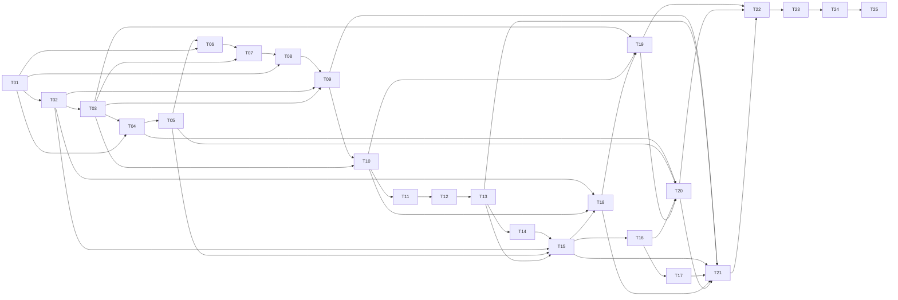

# Tasks — Specification 004: Usable MVP v1 Baseline

## Status and authority

**Tasks: Approved — human approval recorded on 2026-09-20.**

**S1 Implementation: Delivered on `main` through PR #83. This is technical delivery, not an inferred human MVP acceptance.**

**S2 Implementation: Delivered on `main` through PR #84 with reproducible S2 Evidence. This is technical delivery, not inferred human MVP acceptance.**

**S3 Implementation: Delivered on `main` through PR #85 with deterministic Evidence and one bounded real-provider observation. Human acceptance is not inferred.**

**S4 Implementation: T10–T13 implementation, deterministic Evidence, and the mandatory bounded real-provider projection observation are technically complete in the delivery branch. Human acceptance is not inferred.**

**S5–S7 Implementation: Not authorized.**

Approved artifact: `main` at `c7f756209c608ff1f1a88947dcc425d07daaa831`, merge
of [PR #72](https://github.com/rgomids/axiom/pull/72). Human approval in PR #72
accepted the corrected final DAG of 25 Tasks as reconciled with the approved
[Plan](plan.md) and concluded the Tasks phase. It does not authorize T01 or any
other Task, start implementation, grant local or external mutation authority,
publish an installer/release, or make the final MVP acceptance decision.

A subsequent explicit human decision authorized T01 implementation. On 2026-09-21,
T01 was explicitly accepted and merged in PR #74. The same human decision moved
normal MVP delivery governance to the approved S1–S7 Slice boundary: T01–T25
remain the internal decomposition, while an authorized Slice may progress through
its approved Tasks without a new Task-by-Task human authorization unless a
separate human-decision gate is triggered.

Authority chain:

```text
Specification 004 — Approved
-> ADR-0001..ADR-0008 — Accepted
-> Plan — Approved
-> Tasks — Approved
-> S1 Implementation — Delivered on main through PR #83
   -> T01 — Accepted / merged in PR #74
   -> T02–T03 — Merged in PR #83 with reproducible S1 Evidence
-> S2 Implementation — Delivered on main through PR #84
   -> T04–T07 — Merged with reproducible S2 Evidence
-> S3 Implementation — Delivered on main through PR #85
   -> T08 — Implementation and deterministic Evidence complete
   -> T09 — Implementation, deterministic tests, and bounded real-provider observation complete
   -> Human acceptance — Not inferred
-> S4 Implementation — Technical implementation and Evidence complete in branch
   -> T10–T13 — Application, store, adapter, CLI, black-box and dogfood checks complete
   -> Real-provider projection observation — Complete under exact per-run authority
   -> Human acceptance — Not inferred
-> S5–S7 Implementation — Not authorized
```

The accepted POC and current Go packages are implementation inputs and historical
Evidence, not the v1 contract. Existing behavior may be reused only where it
satisfies the approved Specification, Plan, ADRs, and the Task-specific Evidence
below. Within an authorized Slice, completion or acceptance of one Task does not
require a new human authorization for the next approved Task. Explicit human
gates remain required for new/changed Specification scope, durable architectural
decisions, material authority/side-effect changes, destructive or external
mutation boundaries called out by the approved Tasks, prerelease/release
publication, required real-provider acceptance runs, and final MVP acceptance.

## Shared delivery rules

Every Task is a vertical delivery unit: it includes the smallest necessary domain,
application, adapter, presentation, tests, and Evidence changes for its observable
outcome. Package names in the Plan describe likely impact, not permission to split
work by technical layer or freeze a public API.

All Tasks inherit these constraints. Evidence is proportional to risk: ordinary
bounded implementation may rely on tests, CI, and PR evidence; stronger
reproducible Evidence remains required where a Task crosses security,
filesystem/recovery, Provider/external mutation, native-platform,
migration/upgrade, or RC boundaries.

All Tasks inherit these constraints:

- `Project != Repository`, `Axiom != Lingo`, `Execution != Agent`,
  `Provider != Transport`, `Integration != MCP`, `Skill != workflow truth`, and
  `Evidence != raw chat history`.
- Runtime skills remain thin. CLI and Runtime surfaces consume the same
  application result and never own separate workflow, authority, persistence,
  recovery, provenance, or status rules.
- Local mutation requires exact authority bound to target, expected revision,
  preview digest, and effect set. External Provider mutation requires separate
  exact authority. Stale observation invalidates authority.
- Confirmed effects remain confirmed. Pre-commit failure preserves prior
  authority; post-commit secondary failure is truthful `partial` or another
  applicable canonical status, never invented rollback.
- Mutable Axiom-owned local state follows ADR-0007: one logical protocol,
  deterministic coordination, private preparation, protected publication, one
  logical commit point, prior/new complete generations, fail-closed readers,
  owned-only cleanup, and `recovery_required` on uncertainty.
- The implementation may choose syscalls, lock libraries, filenames/layouts,
  Go packages, journal encoding, and bounded retry details during the authorized
  Task. Those mechanisms are not architectural contracts and must be justified by
  Evidence on the supported native targets.
- ADR-0008 stays minimal: one opaque stable Execution ID, machine-local authority,
  explicit Project/Repository/Work Item/Runtime references, versioned workflow,
  expected revisions, bounded transitions, terminal truth, Provider projection
  correlation, and artifact/Evidence references. No generic Execution graph,
  scheduler, multi-agent model, or general event platform.
- Tests use deterministic fault seams and process barriers. Sleeps may enforce a
  bounded timeout but are not the primary race oracle.
- Secret values, raw chat, unrestricted reasoning, and unbounded external output
  never enter state, output, logs, artifacts, Provider content, backups, or
  Evidence. Synthetic sentinels prove rejection and non-leak behavior.
- Windows, package managers, automatic update, signing/notarization, remote
  collaboration/synchronization, general multi-Runtime/Provider support, and
  in-place historical POC migration remain outside this Specification.

## Requirement labels used by this artifact

Specification 004 has numbered FR and AC identifiers but expresses security and
NFR clauses as normative lists. The labels below are traceability aliases only;
they do not add requirements or change approved text.

| Alias | Existing normative clause |
|---|---|
| MVP-SEC-01 | Exact authority and least privilege at every local/external boundary |
| MVP-SEC-02 | Structural secret rejection, bounded sanitization, and no credential leakage |
| MVP-SEC-03 | Untrusted Intent, Provider content, paths, documents, and generated text remain data |
| MVP-SEC-04 | Bounded/time-limited Provider execution and strict response validation |
| MVP-SEC-05 | No shell interpolation, hooks, implicit Git/network mutation, or permission expansion |
| MVP-SEC-06 | Restrictive ownership/modes plus supported ACL/link checks for every managed root/object |
| MVP-SEC-07 | Portable export allowlisted by construction; local state never excluded only by ignore rules |
| MVP-SEC-08 | Unsupported filesystem/ownership semantics fail closed |
| MVP-SEC-09 | Safe explicit reference-aware cleanup; no automatic deletion for capacity recovery |
| MVP-NFR-01 | Deterministic equivalent input/state outcomes except declared time/identity fields |
| MVP-NFR-02 | Bounded, scannable user summaries |
| MVP-NFR-03 | Bounded file I/O and captured external output |
| MVP-NFR-04 | Restrictive local-state/artifact permissions and unsafe-condition rejection |
| MVP-NFR-05 | Reproducibility without maintainer-local state |
| MVP-NFR-06 | Correlation across result, artifact, Evidence, state, and Provider without secrets |
| MVP-NFR-07 | Native Evidence on macOS 27/arm64/APFS, Ubuntu 26.04/amd64/ext4, and Ubuntu 26.04/arm64/ext4 where applicable |

Inherited `SEC-001`–`SEC-005` retain their definitions in Specification 002.

## Dependency DAG

The table is the authoritative DAG. Dependencies are completion prerequisites;
every Task also requires a future explicit implementation authorization. Stable
IDs do not imply permission to execute in numeric order.

| Task | Slice | Observable delivery unit | Depends on |
|---|---|---|---|
| T01 | S1 | Canonical completion and provenance | None |
| T02 | S1 | Durable bounded detail artifact create/read | T01 |
| T03 | S1 | Shared protected publication and fail-closed reading | T02 |
| T04 | S2 | Checksummed release archive and owned installation | T01, T03 |
| T05 | S2 | Codex skill-set compatibility and first run | T04 |
| T06 | S2 | Guided/non-interactive Project setup preview | T01, T05 |
| T07 | S2 | Authorized Project setup publication | T03, T06 |
| T08 | S3 | Intent interview and structured Work Item draft | T01, T07 |
| T09 | S3 | Authorized GitHub Work Item create/select and linkage | T02, T03, T08 |
| T10 | S4 | Minimal Execution start, status, and resume authority | T03, T09 |
| T11 | S4 | Sequential workflow transition truth | T10 |
| T12 | S4 | Idempotent GitHub stage/comment projection | T11 |
| T13 | S4 | Workflow interruption, concurrency, and projection convergence | T12 |
| T14 | S5 | Strict CLI selector path | T13 |
| T15 | S5 | Thin Codex selector path and completion convergence | T02, T05, T13, T14 |
| T16 | S6 | Compatibility inspection and historical POC classification | T15 |
| T17 | S6 | Authorized POC backup/export/reconfigure path | T16 |
| T18 | S6 | Reference-aware artifact cleanup and capacity recovery | T02, T10, T15 |
| T19 | S6 | Guided local recovery | T03, T10, T18 |
| T20 | S6 | Owned install upgrade and resumable partial state | T04, T05, T16, T19 |
| T21 | S6 | Cross-slice security and bounded-I/O regression | T09, T13, T15, T17, T18, T20 |
| T22 | S6 | Exact-target native filesystem/install/upgrade Evidence | T19, T20, T21 |
| T23 | S7 | Identified RC archives and authorized prerelease publication | T22 |
| T24 | S7 | Clean-environment CLI/Codex/GitHub acceptance matrix | T23 |
| T25 | S7 | Versioned RC Evidence, documentation reconciliation, and human gate | T24 |

The critical path is `T01 -> T02 -> T03 -> T04 -> T05 -> T06 -> T07 -> T08
-> T09 -> T10 -> T11 -> T12 -> T13 -> T14 -> T15`, followed by S6 convergence
and S7. This preserves the approved slice order `S1 -> S2 -> S3 -> S4 -> S5 ->
S6 -> S7`: every S5 Task waits for S4 closure, and every S6 Task waits directly
or transitively for S5 closure. Limited parallelism exists only after those slice
gates: T16 and T18 may advance independently after T15; security preparation may
be distributed among owning Tasks, but T21 cannot close before every listed
boundary is observable.



## Task definitions

### T01 — Canonical completion and provenance

- **Objective:** `lingo version` and representative no-effect commands expose one bounded semantic result with truthful build provenance in human and JSON forms.
- **Slice:** S1 — Result, provenance and protected local substrate.
- **Dependencies:** None.
- **Requirements:** FR-023; AC-12, AC-15; MVP-NFR-01, MVP-NFR-02, MVP-NFR-06.
- **ADRs / decisions:** ADR-0003; HD-1. Preserve application-owned classification and Axiom-authored versus transported-user-text provenance.
- **Affected boundaries:** completion/provenance contracts, CLI/JSON renderers, build metadata, current POC status adapters.
- **Expected implementation:** Define the seven canonical terminal statuses and exact result fields; construct one immutable process provenance value; adapt `version` plus selected existing read-only operations without changing their domain effects.
- **Authority and side effects:** Read-only. Tests permit process execution of the built local binary only; no filesystem, Git, network, Provider, Runtime-install, or shell-profile mutation.
- **Explicit non-goals:** Detail-artifact storage, workflow redesign, release signing, Provider rendering, or declaring development builds to be releases.
- **Mandatory tests:** Unit status/effect classification matrix; released/development/dirty/unknown-revision provenance; human/JSON semantic equivalence; renderer failure after simulated confirmed effect; bounded output; transported-user sentinel attribution.
- **Expected Evidence:** Test command/exits, golden semantic matrix, exact build inputs, output byte counts, and static proof that renderers do not classify outcomes or hardcode versions.
- **Completion criteria:** All seven statuses and six result fields are stable and equivalent across initial surfaces; no confirmed effect can disappear during rendering.
- **Risks / gates:** Public status/field changes become compatibility-sensitive. Human review required before expanding the approved field set or changing status meaning.

### T02 — Durable bounded detail artifact create/read

**Implementation checkpoint:** complete in the S1 delivery branch; see
[S1 Evidence](evidence-s1.md). This records technical completion, not human
acceptance.

- **Objective:** A forced detailed result publishes exactly one valid machine-local Markdown artifact and resolves it by stable ID; routine compact success creates none.
- **Slice:** S1.
- **Dependencies:** T01.
- **Requirements:** FR-023, FR-033; AC-13, AC-14; MVP-SEC-02, MVP-SEC-06, MVP-SEC-09; MVP-NFR-02–MVP-NFR-04, MVP-NFR-06; SEC-001, SEC-005.
- **ADRs / decisions:** ADR-0005, ADR-0006, ADR-0007; HD-2, HD-3.
- **Affected boundaries:** detail-artifact ownership, metadata/content codec, local correlation, lookup, completion detail reference, Evidence reference seam.
- **Expected implementation:** Deliver create/read for the Plan's v1 artifact contract and initial limits: 1 MiB Markdown, 64 KiB metadata, 256 KiB captured output, 10,000 live objects, 1 GiB aggregate content. Enforce stable opaque identity, digest, restrictive publication, sanitization, retention class, and explicit capacity outcome without eviction.
- **Authority and side effects:** Artifact create authority covers one exact state root/object and expected capacity observation. Tests write only isolated roots. No portable/Repository writes, Provider calls, cleanup, or automatic deletion.
- **Failure / recovery:** Incomplete publication yields no usable reference. Required artifact failure before primary effect is `failure`; after confirmed primary effect is `partial`; optional-detail failure preserves truthful primary status. Ambiguous capacity/reference state fails closed.
- **Explicit non-goals:** Cleanup implementation, portable publication, automatic splitting policy as permanent architecture, operation-attempt entity, or treating every artifact as Evidence.
- **Mandatory tests:** Codec/metadata limits; sanitization/sentinel rejection; count/byte exhaustion; duplicate/collision; interruption at preparation/publication; restrictive mode/ACL/link/type; digest mismatch; lookup by ID only; no-artifact compact outcomes.
- **Expected Evidence:** Unit and local integration matrices with artifact IDs/digests/sizes, capacity ledgers, tree hashes, fault stages, permissions, and proof portable/Repository trees are unchanged.
- **Completion criteria:** Valid complete artifacts are addressable and correlated; invalid/incomplete/over-capacity state is never returned or auto-evicted; Plan defaults remain labeled initial guardrails.
- **Risks / gates:** Measured dogfood data may justify later reviewed limit changes; it cannot silently alter ADR-0006 ownership/retention invariants.

### T03 — Shared protected publication and fail-closed reading

**Implementation checkpoint:** complete in the S1 delivery branch; see
[S1 Evidence](evidence-s1.md). This records technical completion, not human
acceptance and not authority for S2.

- **Objective:** Existing Project, installation, Work Item, workflow, and artifact stores expose one consistent old-or-new commit truth and deterministic `recovery_required` behavior under supported faults.
- **Slice:** S1.
- **Dependencies:** T02.
- **Requirements:** FR-022–FR-026; AC-17; MVP-SEC-01, MVP-SEC-06, MVP-SEC-08; MVP-NFR-01, MVP-NFR-03, MVP-NFR-04; SEC-003–SEC-005.
- **ADRs / decisions:** ADR-0004–ADR-0007; HD-3.
- **Affected boundaries:** consumer-owned local-store ports, readers, publication coordination, revisions/authority, recovery metadata, existing POC adapters.
- **Expected implementation:** Select bounded platform mechanisms behind narrow ports; document one total coordination order; require expected revisions; prepare privately; validate complete bytes/identity/permissions/links; protect create/update; define commit; confirm canonical generation; retain bounded prior/new recovery facts; clean only positively owned protocol objects.
- **Authority and side effects:** Exact local mutation authority only. Tests permit isolated-root writes and controlled process termination. No external Provider/Git/Runtime mutation and no recursive root deletion.
- **Failure / recovery:** Exercise F0–F8. Pre-commit retains prior authority; confirmed post-commit remains committed; unknown/contradictory state is preserved; readers fail closed; cleanup failure never changes commit truth.
- **Explicit non-goals:** Architectural commitment to syscall, lock package, filename/layout, journal encoding, retry algorithm, database, physical power-loss durability, or malicious arbitrary same-UID interleaving defense.
- **Mandatory tests:** Unit protocol state/classification; adapter integration for create/update/multi-object publication; two-process barrier races; stale authority; short/zero writes; ENOSPC/EDQUOT; permission, collision, replacement, symlink/hard-link, rename/sync/cleanup faults; old/new reader matrix.
- **Expected Evidence:** Per-store F0–F8 table, commit point, revisions/digests, process exits, outside-root hashes, chosen-mechanism rationale, assumptions/exclusions, and native Evidence obligation carried to T22.
- **Completion criteria:** Every mutable v1 local store preserves ADR-0007 semantics; no reader accepts mixed/unknown state; mechanisms remain replaceable behind observable invariants.
- **Risks / gates:** If a selected mechanism changes authority, commit point, recovery meaning, or persisted cross-boundary identity, stop with **Human decision required**.

### T04 — Checksummed release archive and owned installation

**Implementation checkpoint:** complete in the S2 delivery branch; see
[S2 Evidence](evidence-s2.md). This records technical completion, not human
acceptance, release publication, T20 upgrade completion, or T22/T24 native Evidence.

- **Objective:** An exact-version archive installs an inspectable `lingo` plus receipt into an explicit user-owned destination after checksum verification; equivalent reinstall is a no-op and conflicts are preserved.
- **Slice:** S2 — Install, first run and Project setup.
- **Dependencies:** T01, T03.
- **Requirements:** FR-026, FR-031–FR-035; AC-01, AC-19; MVP-SEC-01, MVP-SEC-05, MVP-SEC-06, MVP-SEC-08; MVP-NFR-05, MVP-NFR-07; SEC-002–SEC-005.
- **ADRs / decisions:** ADR-0003, ADR-0005, ADR-0007; HD-1, HD-3, HD-4.
- **Affected boundaries:** release build metadata, target archives, checksums, installer, binary destination, closed installation receipt.
- **Expected implementation:** Build archives for macOS 27/arm64, Ubuntu 26.04/amd64, and Ubuntu 26.04/arm64; include binary, notices, release metadata, compatible skill manifest; verify exact checksum before publication; record closed receipt; refuse unsupported platform, unsafe destination, foreign/mismatched content, unsafe links/ownership/types.
- **Authority and side effects:** Exact local install authority bound to version, checksum, destination, receipt revision, and effect set. Allowed: owned binary/receipt publication. Forbidden: shell-profile edits, PATH mutation, network access not covered by selected exact-version source, package-manager changes, unowned replacement.
- **Failure / recovery:** Pre-publish failure leaves prior install. Confirmed binary with receipt failure is `partial` and reports exact state; uncertainty is recovery-required. No automatic rollback over unknown content.
- **Explicit non-goals:** GitHub Release publication, automatic update, package managers, signing/notarization, Windows, final RC claim.
- **Mandatory tests:** Archive manifest/checksum; clean install; equivalent reinstall; mismatch/foreign/symlink/hard-link/type/ownership/ACL/platform cases; receipt closed schema; interruption and F0–F8 applicable stages; version/provenance output.
- **Expected Evidence:** Build commands/exits, archive/entry digests, install side-effect ledger, receipt bytes/revision, no-op counts, conflict tree hashes, and target-specific Evidence deferred explicitly to T22/T24.
- **Completion criteria:** Exact supported archives install safely from clean roots with truthful version/provenance and no implicit environment mutation.
- **Risks / gates:** Distribution trust claims remain checksum integrity only. Broader trust topology requires **Human decision required**.

### T05 — Codex skill-set compatibility and first run

**Implementation checkpoint:** complete in the S2 delivery branch; see
[S2 Evidence](evidence-s2.md). The owned five-skill set and first-run compatibility
surface are implemented; broader Runtime evolution remains outside S2.

- **Objective:** First run reports binary/state/Codex compatibility and directs explicit Project setup; the complete owned five-skill set installs or upgrades without overwriting user-modified content.
- **Slice:** S2.
- **Dependencies:** T04.
- **Requirements:** FR-032–FR-036; AC-01, AC-02, AC-19; MVP-SEC-01, MVP-SEC-05, MVP-SEC-06; MVP-NFR-01, MVP-NFR-05.
- **ADRs / decisions:** ADR-0003, ADR-0007; HD-1.
- **Affected boundaries:** Codex Runtime adapter, skill-set manifest/digests, first-run CLI, install receipt references.
- **Expected implementation:** Version and verify the five thin hyphen-case skills; inspect exact ownership/digests; install the complete compatible set; refuse foreign/modified files; render PATH and `project configure` guidance without CWD inference or shell-profile mutation.
- **Authority and side effects:** Separate exact skill-install authority. Allowed: owned skill files/skill receipt. Forbidden: invoking Codex, editing runtime settings/profile, deleting unknown files, or configuring a Project.
- **Failure / recovery:** Partial skill publication reports installed/missing/conflicting digests and safe resume. Binary compatibility remains observable; no incompatible set is reported ready.
- **Explicit non-goals:** New Runtime, skill-owned business logic, automatic plugin/install permission expansion, or general Runtime discovery.
- **Mandatory tests:** Known/equivalent/older-owned/modified/foreign/missing skill matrices; binary-skill version mismatch; partial interruption; first-run clean/existing/incompatible state; thin-template/static command checks.
- **Expected Evidence:** Manifest and skill digests, ownership decisions, first-run human/JSON results, modified-file preservation hashes, and zero Project/Codex invocation ledger.
- **Completion criteria:** Compatibility is detectable, install is idempotent for owned content, and first run leads to explicit setup without ambient identity.
- **Risks / gates:** Host invocation syntax remains validated Codex contract; changing skill naming or adding another Runtime requires separate scope.

### T06 — Guided/non-interactive Project setup preview

**Implementation checkpoint:** complete in the S2 delivery branch; see
[S2 Evidence](evidence-s2.md). Preview remains read-only and does not derive
Project identity or capability from CWD or Git.

- **Objective:** Complete flags or a missing-only interview produce the same validated Project/local proposal and a separated safe preview before any write.
- **Slice:** S2.
- **Dependencies:** T01, T05.
- **Requirements:** FR-001–FR-007, FR-030, FR-035; AC-02–AC-05; MVP-SEC-01–MVP-SEC-03, MVP-SEC-07; MVP-NFR-01, MVP-NFR-02; SEC-001, SEC-002.
- **ADRs / decisions:** ADR-0001, ADR-0003, ADR-0004; HD-2.
- **Affected boundaries:** Project configuration use case, guided input, portable/local proposal, provider capability declaration, preview/authority request.
- **Expected implementation:** Accept explicit Project selector/new slug/name, zero or more Repository declarations and independent absolute bindings, and explicit Work Item capability. Reuse supplied values; ask only missing/materially ambiguous facts; materialize complete proposed state; show portable/local destinations, revisions, diffs, capabilities, effects, and preview digest.
- **Authority and side effects:** Preview is read-only. Tests deny filesystem writes, Provider/network/Git/process/secret reads. CWD and Git remotes never become identity or default capability.
- **Failure / recovery:** Invalid/unknown/conflicting input is `validation_failure`; cancellation/denial has zero effects; unsupported/missing capability remains explicit and blocks only the Work Item journey.
- **Explicit non-goals:** Publication, GitHub authentication, repository cloning, credential resolution, Runtime invocation, or universal Provider configuration.
- **Mandatory tests:** Guided/full-input equivalence; multi-Repository unrelated paths/providers; missing-only question counts; duplicate/conflicting selectors; absent/unsupported capability; cancellation; portable/local secret/path sentinel separation; unrelated CWD black-box.
- **Expected Evidence:** Proposal/diff goldens, prompt ledger, denied-side-effect ledger, stable issue order, and proof each input reaches existing domain/application validation rather than CLI rules.
- **Completion criteria:** One complete validated preview exists before mutation; the same facts yield equivalent application behavior regardless of input mode.
- **Risks / gates:** A new portable field or ownership meaning must follow ADR-0004 compatibility and human review.

### T07 — Authorized Project setup publication

**Implementation checkpoint:** complete in the S2 delivery branch; see
[S2 Evidence](evidence-s2.md). Portable and local publication remain separately
truthful; this does not authorize T08 or any other S3 work.

- **Objective:** Confirmed Project setup publishes complete portable intent and ID-addressed local bindings, then resolves from unrelated CWD; equivalent replay is a no-op.
- **Slice:** S2.
- **Dependencies:** T03, T06.
- **Requirements:** FR-001–FR-007, FR-022–FR-026, FR-030, FR-033, FR-035; AC-02–AC-05, AC-17; MVP-SEC-01, MVP-SEC-06–MVP-SEC-08; MVP-NFR-01, MVP-NFR-04–MVP-NFR-06; SEC-001–SEC-005.
- **ADRs / decisions:** ADR-0001, ADR-0003–ADR-0007; HD-2, HD-3.
- **Affected boundaries:** Project configure CLI/application, manifest and installation stores, native roots, resolver, shared publication protocol.
- **Expected implementation:** Bind authority to T06 preview/revisions/effects; revalidate and publish complete portable/local generations in truthful order; preserve independent Repository paths; resolve by UUID/slug; report capability readiness separately from portable validity.
- **Authority and side effects:** Allowed only exact portable/local objects. Forbidden: associated Repository writes, Git effects, Provider mutation, credential access, shell-profile edits, unknown cleanup.
- **Failure / recovery:** Stale authority/revision yields `denied_authority`; portable commit plus local failure is `partial` with recovery action; ambiguity is recovery-required; no false cross-root transaction or rollback.
- **Explicit non-goals:** Full Specification 002 remaining DAG, slug alias service, Git backing/sync, Provider connection, workflow start.
- **Mandatory tests:** Create/no-op/conflict; multi-Repository separation; concurrent setup; portable/local fault stages; source/binding replacement; unsafe roots/links/ownership; portable hashes on local failure; unrelated-CWD resolve.
- **Expected Evidence:** Application integration and CLI black-box commands/exits, revisions/digests, exact writes, no-op counts, outside-target hashes, process-race outcomes, and native obligation carried to T22.
- **Completion criteria:** Explicit setup is review-gated, idempotent, complete, separately truthful across roots, and immediately resolvable without CWD.
- **Risks / gates:** Cross-root effects remain separate commits. A proposal for implicit transactionality or repository ownership requires **Human decision required**.

### T08 — Intent interview and structured Work Item draft

**Implementation checkpoint:** complete in the S3 delivery branch; see
[S3 Evidence](evidence-s3.md). Preview remains read-only and binds the normalized
draft, target, effects, expected local revision, correlation, and provenance.

- **Objective:** Intent plus supplied facts becomes a bounded provider-neutral draft whose complete normalized form is reviewed before external mutation.
- **Slice:** S3 — Intent to GitHub Work Item.
- **Dependencies:** T01, T07.
- **Requirements:** FR-008–FR-012; AC-06, AC-07, AC-16; MVP-SEC-02, MVP-SEC-03; MVP-NFR-01–MVP-NFR-03.
- **ADRs / decisions:** ADR-0002, ADR-0003; preserve Provider capability boundary.
- **Affected boundaries:** Work Item draft values/use case, interview, GitHub renderer seam, provenance attribution, completion result.
- **Expected implementation:** Capture problem, desired outcome, context, scope, constraints, non-goals, and acceptance expectations; mark supplied versus Axiom-authored sections; ask only material missing questions; render deterministic bounded preview, target, effect set, and digest.
- **Authority and side effects:** Read-only. No GitHub/Provider mutation, local linkage write, network/process execution, or automatic Provider fallback.
- **Failure / recovery:** Incomplete/cancelled input returns actionable non-success with zero Provider effects; untrusted content remains escaped data; oversized input fails before rendering/mutation.
- **Explicit non-goals:** General Specification generator, universal Provider CRUD, autonomous scope decisions, or raw chat retention.
- **Mandatory tests:** Field completeness and question minimization; supplied-field reuse; deterministic ordering; injection/metacharacter payloads; secret/sanitization and bounds; authorship/provenance separation; unsupported capability.
- **Expected Evidence:** Unit/application transcript fixtures containing only synthetic data, question/effect ledger, normalized draft digest, output sizes, and zero-side-effect spies.
- **Completion criteria:** Reviewable structured draft is complete, bounded, provider-neutral, provenance-correct, and no mutation occurs.
- **Risks / gates:** Model-assisted text may propose content but cannot supply authority or bypass deterministic completeness/bounds.

### T09 — Authorized GitHub Work Item create/select and linkage

**Implementation checkpoint:** implementation, deterministic tests, and the
separately authorized bounded real GitHub observation are complete in the S3
delivery branch; see [S3 Evidence](evidence-s3.md). Issue #90 records the
historical observation. Current PR review corrections remain subject to human
review and do not imply human acceptance or authorize T10/S4+.

- **Objective:** Exact authority creates or selects one GitHub Issue, validates its identity/state, and persists one exact local Work Item reference; denial/cancel is zero-effect and confirmed external/local failure is truthful `partial`.
- **Slice:** S3.
- **Dependencies:** T02, T03, T08.
- **Requirements:** FR-008–FR-012, FR-017, FR-023; AC-06, AC-07, AC-16, AC-20; MVP-SEC-01–MVP-SEC-05; MVP-NFR-01–MVP-NFR-03, MVP-NFR-06; SEC-001, SEC-002, SEC-004.
- **ADRs / decisions:** ADR-0003, ADR-0006, ADR-0007; Provider != domain authority.
- **Affected boundaries:** workflow-specific WorkItemCapability port, GitHub Issues adapter, local link store, external-effect correlation, completion/artifact output.
- **Expected implementation:** Bind authority to complete draft/target/effects; durably fence the target before one bounded time-limited create; strictly validate response/reference/state; persist link with expected revision and provider/resource/external identity; after an ambiguous create, reconcile the persisted correlation without another mutation.
- **Authority and side effects:** Separate explicit GitHub mutation authority. Allowed: one reviewed Issue create/update effect and exact local linkage. Forbidden: repository/Git mutation, issue close, labels/comments, arbitrary command interpolation, blind create retry, credential persistence.
- **Failure / recovery:** Unauthenticated/rate-limited/unavailable maps to truthful effect knowledge; invalid response fails closed; confirmed create plus local failure is `partial` with Issue reference; ambiguous create persists across processes and permits reconciliation only until resolved.
- **Explicit non-goals:** Workflow projection, issue closure as acceptance, generic provider framework, second Provider.
- **Mandatory tests:** Fake-provider side-effect ledger; denial/cancel; strict responses; time/output bounds; shell metacharacters; rate-limit/transient/ambiguous cases; confirmed-effect/local-fault injection; duplicate prevention; one separately authorized bounded real GitHub observation.
- **Expected Evidence:** Unit/application/adapter results, exact sanitized commands or API requests, response validation, external/local effect ledger, Issue reference, local revision/digest, limitation and cleanup ownership.
- **Completion criteria:** One reviewed Intent reaches one truthful linked Work Item without duplicate mutation or GitHub leakage into application semantics.
- **Risks / gates:** Real GitHub mutation requires per-run human authority and public-safe content. Task completion never closes the Issue or implies human acceptance.

### T10 — Minimal Execution start, status, and resume authority

**Implementation checkpoint:** deterministic implementation complete in the S4
delivery branch; see [S4 Evidence](evidence-s4.md). This records technical
completion, not human acceptance.

- **Objective:** A linked Work Item starts one stable machine-local Execution and status/resume reads only committed local truth.
- **Slice:** S4 — Workflow truth and Provider projection.
- **Dependencies:** T03, T09.
- **Requirements:** FR-013, FR-016, FR-022–FR-026; AC-09; MVP-SEC-01, MVP-SEC-06, MVP-SEC-08; MVP-NFR-01, MVP-NFR-03, MVP-NFR-06; SEC-002–SEC-005.
- **ADRs / decisions:** ADR-0003, ADR-0005–ADR-0008.
- **Affected boundaries:** minimal Execution record/codec/store, workflow start/status/resume use cases, artifact/Evidence references, completion correlation.
- **Expected implementation:** Allocate opaque stable Execution ID; persist Project ID, optional Repository key, exact Work Item reference, Runtime ID, workflow/format version, stage, expected revision, bounded transitions, timestamps, provenance, references, terminal facts; refuse unsupported/malformed state.
- **Authority and side effects:** Exact local create/update authority. No Provider projection, external completion, portable/Repository write, or Runtime ownership. Resume cannot infer from chat or Provider metadata.
- **Failure / recovery:** Duplicate equivalent start returns existing lineage; conflicting scope/version fails; interrupted/uncertain publication is recovery-required; stale revision cannot resume/transition.
- **Explicit non-goals:** Generic Execution graph, Agent identity/plan, scheduler, child executions, unbounded event sourcing, POC in-place migration.
- **Mandatory tests:** Identity stability; closed codec/version/bounds; create/idempotent/conflict; stale revision; malformed/newer/older; interruption/resume; portable exclusion; artifact correlation without identity change.
- **Expected Evidence:** Unit/application/local-store tests, record revisions/digests, process exits, no-Provider ledger, and static check excluding graph/agent ownership concepts.
- **Completion criteria:** Start/status/resume use one stable, versioned, bounded local authority and cannot be reconstructed from external state.
- **Risks / gates:** Identity, authority, lifecycle, or cross-boundary semantic changes require **Human decision required**; encoding/path changes alone do not.

### T11 — Sequential workflow transition truth

**Implementation checkpoint:** deterministic implementation complete in the S4
delivery branch; see [S4 Evidence](evidence-s4.md). This records technical
completion, not human acceptance.

- **Objective:** One Execution advances only the approved sequential gate from an exact revision, records bounded outcome/references, and preserves truthful terminal state.
- **Slice:** S4.
- **Dependencies:** T10.
- **Requirements:** FR-013, FR-016, FR-022–FR-025; AC-09, AC-12; MVP-SEC-01, MVP-SEC-03; MVP-NFR-01–MVP-NFR-03, MVP-NFR-06; SEC-002, SEC-004, SEC-005.
- **ADRs / decisions:** ADR-0003, ADR-0006–ADR-0008.
- **Affected boundaries:** workflow transition application, Execution transition history, artifact/Evidence reference validation, completion classification.
- **Expected implementation:** Enforce intake through completion gate list; represent clarification pass without mandatory artifact; validate current stage, expected revision, bounded outcome, authority facts, provenance, references, next action; persist local transition before any projection.
- **Authority and side effects:** Local workflow-transition authority only. No GitHub label/comment/closure, Repository write, or Runtime inference. Referenced artifacts/Evidence are read/validated, not blindly trusted.
- **Failure / recovery:** Failed/interrupted transition does not advance; confirmed transition survives later rendering/artifact/projection failure; already-completed transition is idempotent or explicit conflict according to exact revision/effect identity.
- **Explicit non-goals:** DAG/multi-agent orchestration, automatic Plan/Task acceptance, Provider-owned gates, raw model transcript.
- **Mandatory tests:** Gate/transition table; wrong/skipped/duplicate/stale transitions; clarification no-artifact pass; bounded history/references; terminal status/effects; interrupted/resume; post-commit renderer/artifact failure.
- **Expected Evidence:** Unit/application matrices mapping each gate/revision/outcome to state digest, completion result, references, and denied external effects.
- **Completion criteria:** Local Execution is the sole transition truth and no failure or secondary effect advances/rewinds it incorrectly.
- **Risks / gates:** Changing gate semantics or adding graph behavior requires human-approved scope.

### T12 — Idempotent GitHub stage/comment projection

**Implementation checkpoint:** implementation, deterministic fake-Provider
Evidence, and the mandatory authorized real projection observation are complete
in the S4 delivery branch; see [S4 Evidence](evidence-s4.md). This records
technical completion, not human acceptance.

- **Objective:** Explicit authority reconciles one committed transition into exactly one `axiom:stage:<stage>` label and at most one semantically unique bounded transition comment.
- **Slice:** S4.
- **Dependencies:** T11.
- **Requirements:** FR-013–FR-017; AC-08, AC-09, AC-20; MVP-SEC-01–MVP-SEC-05; MVP-NFR-01–MVP-NFR-03, MVP-NFR-06; SEC-001, SEC-002, SEC-004.
- **ADRs / decisions:** ADR-0003, ADR-0006–ADR-0008.
- **Affected boundaries:** projection plan, GitHub label/comment adapter, projection keys/bookkeeping, completion/detail artifact.
- **Expected implementation:** Build projection from committed Execution revision; inspect current Provider state; remove only obsolete Axiom stage labels; preserve non-Axiom content; validate responses; post bounded provenance-marked comment with stage/outcome/references/next; persist intended/confirmed effects.
- **Authority and side effects:** Exact GitHub label/comment authority bound to Work Item, Execution revision, projection key, preview, and effects. Forbidden: Issue closure, non-Axiom label removal, local-stage mutation from Provider state, duplicate comment, blind retry.
- **Failure / recovery:** Provider error after local commit is `partial` or `retryable_failure` by confirmed effects; ambiguous response triggers read/reconcile; stale local revision is denied; Provider state never repairs local truth.
- **Explicit non-goals:** Provider as workflow source, generic status taxonomy, webhooks, bidirectional sync, second Provider.
- **Mandatory tests:** Projection-plan unit tests; fake GitHub label/comment ledger; stale/duplicate/replay/ambiguous/invalid response; non-Axiom preservation; confirmed comment plus bookkeeping failure; bounded output/injection; authorized real projection observation.
- **Expected Evidence:** Before/after Provider snapshots, projection keys, request/response validation, exact local revision, side-effect ledger, comment sizes/digests, and no-duplicate replay proof.
- **Completion criteria:** Reconciliation converges without advancing local truth or duplicating Axiom projection effects.
- **Risks / gates:** Append-only comments cannot roll back; Evidence must preserve confirmed effect and safe next action.

### T13 — Workflow interruption, concurrency, and projection convergence

**Implementation checkpoint:** deterministic concurrency, interruption, and
projection convergence implementation plus the real-provider observation
inherited from T12 are complete in the S4 delivery branch; see
[S4 Evidence](evidence-s4.md). Human acceptance is not inferred.

- **Objective:** Two processes, interruption, retry, and projection/local failures converge on one committed Execution revision and truthful Provider projection.
- **Slice:** S4.
- **Dependencies:** T12.
- **Requirements:** FR-013–FR-017, FR-022–FR-025; AC-08, AC-09, AC-17, AC-20; MVP-SEC-01, MVP-SEC-04, MVP-SEC-06, MVP-SEC-08; MVP-NFR-01, MVP-NFR-03, MVP-NFR-06; SEC-002–SEC-005.
- **ADRs / decisions:** ADR-0005, ADR-0007, ADR-0008; HD-3.
- **Affected boundaries:** Execution store, projection bookkeeping, GitHub adapter, completion classification, recovery observation.
- **Expected implementation:** Integrate transition and projection through separate commit/effect phases; add deterministic barriers/fault seams; preserve one winning revision, stable projection key, confirmed-effect ledger, and resumable reconciliation.
- **Authority and side effects:** Tests use fakes/isolated state by default. Any real Provider observation needs exact per-run authority. No sleep-based race proof, duplicate mutation, or automatic recovery cleanup.
- **Failure / recovery:** Cover interruption before/after local commit, before/after Provider effect, before bookkeeping, and during cleanup; ambiguity remains recovery-required or reconcile-first; local truth never follows a later Provider marker.
- **Explicit non-goals:** Distributed transaction, remote lock, exactly-once transport claim, malicious same-UID arbitrary interleavings.
- **Mandatory tests:** Two-process barrier races; stale authority; cancellation; F0–F8 relevant stages; Provider unavailable/rate-limited/invalid/ambiguous; confirmed Provider/local failure; replay after crash; no mixed reader.
- **Expected Evidence:** Deterministic stage table with revisions, process exits, Provider/local ledgers, state/artifact digests, retry boundary, and native obligation carried to T22.
- **Completion criteria:** All supported interruption/concurrency paths preserve one authoritative local revision and idempotent reconcilable projection.
- **Risks / gates:** Claims are bounded to supported local processes and Provider observation; no physical/distributed durability claim.

### T14 — Strict CLI selector path

- **Objective:** Fully specified CLI selectors reach the correct Project/Repository/Work Item/Execution without questions; partial input asks only missing/ambiguous values and invalid input never falls back to CWD.
- **Slice:** S5 — Codex selector path and completion convergence.
- **Dependencies:** T13.
- **Requirements:** FR-018–FR-021; AC-10, AC-11; MVP-SEC-03, MVP-SEC-05; MVP-NFR-01, MVP-NFR-02.
- **ADRs / decisions:** ADR-0001, ADR-0003, ADR-0008.
- **Affected boundaries:** CLI parsing, selector validation/resolution, guided input adapter, operation-shaped application dispatch.
- **Expected implementation:** Accept exact Project UUID/slug, Project-scoped Repository key, linked Work Item reference, and known operation inputs; reject unknown/duplicate/conflicting keys; reuse valid values; dispatch explicit selectors to existing use cases.
- **Authority and side effects:** Selector validation is read-only. Mutation commands still require their own exact authority; a valid selector grants none. No Git remote/CWD/provider fallback.
- **Failure / recovery:** Invalid/ambiguous/missing closed-mode input is deterministic `validation_failure`; no store/Provider/Runtime side effects occur before complete resolution.
- **Explicit non-goals:** General query language, global repository discovery, command alias compatibility promises, domain rules in presentation.
- **Mandatory tests:** Full/partial/ambiguous/unknown/duplicate/conflict matrix; unrelated CWD; slug/UUID equivalence; Repository scoping; Work Item exact reference; zero-question fully supplied path; denied-side-effect spies.
- **Expected Evidence:** Parser/application unit tests and CLI black-box commands/exits, prompt counts, resolved references, safe output, and zero-effect ledger.
- **Completion criteria:** CLI selection is strict, explicit, missing-only, and semantically identical to direct application invocation.
- **Risks / gates:** New selector meanings that collapse Project/Repository/Provider identities require review.

### T15 — Thin Codex selector path and completion convergence

- **Objective:** Installed Codex skills pass explicit selectors to Lingo and produce the same semantic result, provenance, detail reference, and all seven terminal statuses as direct CLI use.
- **Slice:** S5.
- **Dependencies:** T02, T05, T13, T14.
- **Requirements:** FR-018–FR-021, FR-036; AC-10–AC-16; MVP-SEC-02, MVP-SEC-03, MVP-SEC-05; MVP-NFR-01–MVP-NFR-03, MVP-NFR-05, MVP-NFR-06; SEC-001, SEC-002.
- **ADRs / decisions:** ADR-0003, ADR-0006, ADR-0008.
- **Affected boundaries:** five Codex skills, host argument adaptation, Lingo CLI/JSON, completion/detail/provenance renderers.
- **Expected implementation:** Evolve skills only for existing operations; accept/reuse selectors; ask missing-only host questions; pass explicit flags; render canonical result; reference artifacts without copying details or duplicating business rules.
- **Authority and side effects:** Skill text grants no authority. Tests may invoke installed skills in an isolated Codex environment; external GitHub mutations use fakes except separately authorized bounded observation in T24.
- **Failure / recovery:** Host/skill incompatibility fails before operation; invalid selectors never trigger fallback; interrupted/partial/retryable results preserve exact effects and next action.
- **Explicit non-goals:** Runtime-owned workflow, second Runtime, literal colon skill names, generic agent graph, automatic permission/config changes.
- **Mandatory tests:** Host contract discovery/invocation; fully supplied zero-question and partial missing-only; unknown/conflicting arguments; CLI/skill seven-status semantic matrix; detail lookup; provenance/authorship; incompatible skill set.
- **Expected Evidence:** Installed skill digests/version, real bounded Codex discovery/invocation, CLI/Runtime normalized-result comparison, prompts, exits, references, and limitations.
- **Completion criteria:** Skills are thin deterministic adapters and all observed semantics converge with CLI/application truth.
- **Risks / gates:** Real Codex invocation is required Evidence but cannot substitute for deterministic tests or grant Provider authority.

### T16 — Compatibility inspection and historical POC classification

- **Objective:** Read-only inspection distinguishes absent v1, valid v1, recognized POC, malformed, unsupported older, unsupported newer, and recovery-required state with actionable next steps.
- **Slice:** S6 — Recovery, cleanup and upgrade.
- **Dependencies:** T15.
- **Requirements:** FR-026–FR-030, FR-032, FR-036; AC-18, AC-19; MVP-SEC-02, MVP-SEC-06–MVP-SEC-08; MVP-NFR-01, MVP-NFR-03–MVP-NFR-05; SEC-001, SEC-003–SEC-005.
- **ADRs / decisions:** ADR-0004–ADR-0008; HD-4.
- **Affected boundaries:** compatibility inspector, v1/POC signatures, installation/Project/Work Item/workflow/skill readers, completion/detail output.
- **Expected implementation:** Define complete positive POC signatures from the merged historical revision; inspect exact roots/categories without secrets; validate closed versions and recovery markers; report separate clean-install/export/reconfigure/backup options.
- **Authority and side effects:** Strictly read-only. No overwrite, migration, backup, export, install, cleanup, or implicit treatment of uncertainty as absence.
- **Failure / recovery:** Partial or ambiguous signatures are preserved/review-required; malformed/newer/older remains distinct; recovery marker wins over ordinary read.
- **Explicit non-goals:** In-place POC migration, arbitrary historical compatibility, downgrade, generic N-1 support.
- **Mandatory tests:** Golden fixtures for every classification; partial/unknown/mixed POC-v1 roots; size/type/link/ownership/ACL faults; sentinel sanitization; zero-write tree hash.
- **Expected Evidence:** Classification matrix, observed format/signature facts, exact zero-write ledger, safe output/detail digest, and fixture provenance to historical POC revision.
- **Completion criteria:** No incompatible or uncertain state is overwritten or reported absent; each supported classification has a safe next action.
- **Risks / gates:** Any proposed in-place POC migration requires **Human decision required** and a separate compatibility/rollback decision.

### T17 — Authorized POC backup/export/reconfigure path

- **Objective:** Recognized POC state can be backed up locally, portable Project intent exported to an empty target, and clean v1 reconfiguration guided without deleting or migrating POC workflow/Execution history.
- **Slice:** S6.
- **Dependencies:** T16.
- **Requirements:** FR-027–FR-030; AC-18; MVP-SEC-01–MVP-SEC-03, MVP-SEC-06–MVP-SEC-09; MVP-NFR-03–MVP-NFR-06; SEC-001–SEC-005.
- **ADRs / decisions:** ADR-0004–ADR-0007; HD-4.
- **Affected boundaries:** backup manifest, portable export allowlist, clean-root reconfiguration guidance, artifact/completion/Evidence correlation.
- **Expected implementation:** Preview source/target/categories/digests/space/effects; require authority; write restrictive digest-manifested backup to empty target; export only validated portable content to separate empty target; verify; direct explicit clean v1 setup.
- **Authority and side effects:** Separate exact backup/export authorities. Allowed: new owned objects in explicit empty targets. Forbidden: source mutation/deletion, credential/local/workflow/Execution export into portable intent, in-place migration, overwrite, network/Provider/Git effects.
- **Failure / recovery:** Partial backup/export preserves source and reports exact complete objects; unsafe/occupied/cross-filesystem/uncertain target fails closed; retry uses expected revisions and owned manifests.
- **Explicit non-goals:** Automatic cleanup, generic migration engine, POC workflow conversion, downgrade.
- **Mandatory tests:** Allowlist; secret/local sentinel exclusion; empty-target/collision/traversal/link/ownership/ACL; ENOSPC/EDQUOT/interruption; digest manifest; stale authority; retry/no-op; post-export v1 validation.
- **Expected Evidence:** Preview/authority digest, source/target hashes, backup/export manifest, omitted categories, process exits, fault stage, permissions, and recovery action.
- **Completion criteria:** Recognized POC content is preserved and portable intent can seed explicit clean v1 reconfiguration without silent conversion.
- **Risks / gates:** Export is not migration and does not promise continuity of local Execution/Provider state.

### T18 — Reference-aware artifact cleanup and capacity recovery

- **Objective:** Operator previews and explicitly removes only eligible owned artifacts while active, Evidence-referenced, recovery-related, and uncertain content remains protected; capacity exhaustion never triggers eviction.
- **Slice:** S6.
- **Dependencies:** T02, T10, T15.
- **Requirements:** FR-023, FR-025, FR-033; AC-13, AC-14, AC-17; MVP-SEC-01, MVP-SEC-02, MVP-SEC-06, MVP-SEC-08, MVP-SEC-09; MVP-NFR-01, MVP-NFR-03, MVP-NFR-06; SEC-001, SEC-003–SEC-005.
- **ADRs / decisions:** ADR-0005–ADR-0008; HD-2, HD-3.
- **Affected boundaries:** retention/reference view, cleanup preview/authority, artifact store, cleanup record, Execution/Evidence references.
- **Expected implementation:** Enforce active/evidence/diagnostic/preserved_review classes and Plan defaults; calculate eligibility from authoritative references; lock/revalidate identity/type/link/digest/revision; remove exact objects; retain bounded 64 KiB cleanup records for initial 90-day policy; expose reclaimed capacity.
- **Authority and side effects:** Separate cleanup authority bound to exact artifact IDs/revisions/digests/effects. Forbidden: recursive broad-root deletion, age-only deletion, automatic eviction, live-reference removal, unknown-content mutation.
- **Failure / recovery:** Changed reference/identity/ownership/lock denies authority; partial removal reports exact removed/preserved identities; uncertain state becomes/remains preserved_review; cleanup-record failure cannot invent successful audit state.
- **Explicit non-goals:** Permanent architectural retention values, portable artifact cleanup, legal deletion guarantees, payload retention inside audit record.
- **Mandatory tests:** Eligibility matrix; active/Evidence/cross-artifact/recovery references; 30/365/90-day policy boundaries with fake clock; stale authority; race barriers; link/replacement/ACL; cleanup-record bound; capacity exhaustion before/after cleanup; no auto-delete.
- **Expected Evidence:** Preview and authorization, reference graph snapshot, removed/preserved IDs/digests, bytes/count reclaimed, cleanup record, outside-root hashes, and measured dogfood volume/lookup cost.
- **Completion criteria:** Cleanup is explicit, exact, reference-aware, auditable, and cannot convert uncertainty or pressure into deletion authority.
- **Risks / gates:** Dogfood recommendations may change defaults only through reviewed Plan/release reconciliation, not silently during implementation.

### T19 — Guided local recovery

- **Objective:** Read-only inspection explains interrupted publication; fresh authority restores/finalizes only a recognized complete generation while ambiguous/unknown state remains preserved for operator review.
- **Slice:** S6.
- **Dependencies:** T03, T10, T18.
- **Requirements:** FR-022–FR-029; AC-17, AC-18; MVP-SEC-01, MVP-SEC-06, MVP-SEC-08, MVP-SEC-09; MVP-NFR-01, MVP-NFR-03, MVP-NFR-04, MVP-NFR-06; SEC-002–SEC-005.
- **ADRs / decisions:** ADR-0004–ADR-0008; HD-3, HD-4.
- **Affected boundaries:** recovery inspector/plan, Project/local/Execution/artifact/receipt stores, completion/detail output.
- **Expected implementation:** List canonical/prior/stage/marker identities, revisions, protocol stage, ownership, references, and proposed safe action; bind fresh authority; reacquire coordination; recheck confinement/references; restore prior pre-commit or finalize committed generation; clean exact owned protocol objects.
- **Authority and side effects:** Inspection read-only. Mutation authority is separate per exact recovery plan. Forbidden: heuristic repair, recursive deletion, synthesizing mixed state, Provider/Git effect, stale-authority retry.
- **Failure / recovery:** Contradictory/unknown/corrupt state remains preserved_review/recovery-required; failed recovery reports actual authoritative generation and residual objects; confirmed commit is never rolled back by cleanup failure.
- **Explicit non-goals:** Automatic recovery, physical media repair, arbitrary historical migration, general backup restore engine.
- **Mandatory tests:** Every F0–F8 recognized state; corrupt/unknown/contradictory marker; stale authority; concurrent recovery/reader/writer with barriers; prior/new generation selection; ownership/link/ACL/replacement; cleanup fault.
- **Expected Evidence:** Before/plan/after recovery records, generations/revisions/digests, authority digest, process exits, preserved unknown IDs, and no outside-root mutation.
- **Completion criteria:** Recognized recovery is deterministic and bounded; ambiguity never yields success, deletion, or false rollback.
- **Risks / gates:** Recovery availability may be lower by design; weakening fail-closed readers requires **Human decision required**.

### T20 — Owned install upgrade and resumable partial state

- **Objective:** Exact-version upgrade previews and verifies binary, receipt, skills, state compatibility, space, and effects; authorized publication reports each confirmed effect and safely resumes mixed owned state.
- **Slice:** S6.
- **Dependencies:** T04, T05, T16, T19.
- **Requirements:** FR-026–FR-029, FR-031–FR-037; AC-18, AC-19; MVP-SEC-01, MVP-SEC-05, MVP-SEC-06, MVP-SEC-08; MVP-NFR-01, MVP-NFR-03–MVP-NFR-07; SEC-002–SEC-005.
- **ADRs / decisions:** ADR-0003–ADR-0007; HD-1, HD-3, HD-4.
- **Affected boundaries:** upgrade inspector/plan, binary/receipt/skill publication, compatibility verification, completion/detail/Evidence.
- **Expected implementation:** Follow Plan ordering: read-only preflight; exact preview/revisions/effects; authority; stage/verify complete target; publish/re-read binary; publish receipt; publish skill files; verify clean-v1 compatibility; resume from validated owned partial state.
- **Authority and side effects:** Exact local upgrade authority per root/effect. Allowed: owned binary/receipt/skill replacement. Forbidden: auto-update, downgrade/lossy conversion, shell-profile/package-manager changes, unowned replacement, POC in-place migration, network source substitution.
- **Failure / recovery:** No cross-root transaction claim. Binary/receipt/skill outcomes are individually confirmed; later failure is `partial` with safe resume; unknown/newer/malformed/recovery state blocks before mutation.
- **Explicit non-goals:** Public release publication, automatic rollback over confirmed effects, state schema migration absent separate decision, Windows.
- **Mandatory tests:** Preflight matrix; equivalent no-op; unsupported downgrade/newer/older/POC; stale authority; checksum/space/ownership/link conflict; interruption after each ordered effect; resume; incompatible skill set; final verification.
- **Expected Evidence:** Source/target versions and checksums, preview digest, effect-by-effect ledger, receipt/skill revisions, tree hashes, faults/exits, and native target Evidence carried to T22/T24.
- **Completion criteria:** Upgrade never silently leaves or reports an unusable mixed state; owned partial state is inspectable and resumable.
- **Risks / gates:** Any mutating persisted-state migration or new trust topology requires **Human decision required**.

### T21 — Cross-slice security and bounded-I/O regression

- **Objective:** Public-safe adversarial tests prove rejection/non-effects for secrets, untrusted data, traversal/link/replacement, Provider responses, command injection, and bounded inputs/outputs across delivered slices.
- **Slice:** S6.
- **Dependencies:** T09, T13, T15, T17, T18, T20.
- **Requirements:** FR-004, FR-011, FR-016, FR-020, FR-023–FR-025, FR-030, FR-032, FR-034; AC-07, AC-09, AC-11–AC-14, AC-16, AC-17, AC-20, AC-22, AC-23; MVP-SEC-01–MVP-SEC-09; MVP-NFR-01–MVP-NFR-06; SEC-001–SEC-005.
- **ADRs / decisions:** ADR-0001, ADR-0003–ADR-0008; HD-2–HD-4.
- **Affected boundaries:** all codecs, application authorities, filesystem adapters, CLI/skills, GitHub/command adapter, backup/export/cleanup/upgrade.
- **Expected implementation:** Consolidate reusable synthetic fixtures, denial spies, bounded buffers, deterministic fault hooks, process barriers, and public-safe side-effect ledgers without moving business rules into a test framework.
- **Authority and side effects:** Isolated roots and controlled fakes only. Real Provider/Runtime observations remain T24 and separately authorized. Attack strings are data, never executed. No actual secrets.
- **Failure / recovery:** Every rejected case records phase, status, zero/confirmed effects, and preserved state; scanner success is supplemental and never proof of absence.
- **Explicit non-goals:** Penetration-test claim, arbitrary same-UID defense, physical durability, production credentials, sleep-based race proof.
- **Mandatory tests:** Structural secret rejection/non-leak sentinels; sanitization/truncation; traversal/absolute/alias; symlink/hard-link/ancestor/leaf replacement; unsafe ownership/ACL/type; stale authority; shell metacharacters; strict/oversized/timeout Provider responses; confirmed external/local failure; interruption/recovery ambiguity; cleanup safety.
- **Expected Evidence:** Requirement-to-case matrix, commands/exits, denied/confirmed side-effect ledgers, before/after hashes, sentinel scan across outputs/files/Evidence, bounds, platform assumptions, and review findings.
- **Completion criteria:** Every security/NFR alias and inherited SEC requirement has executable owner Evidence; no unsupported claim is marked passed.
- **Risks / gates:** A blocker/critical/major finding must be fixed or explicitly waived before T22/T23.

### T22 — Exact-target native filesystem/install/upgrade Evidence

- **Objective:** Native runs prove applicable filesystem, concurrency, installation, cleanup, recovery, and upgrade behavior on every approved release row; missing row remains an explicit release blocker.
- **Slice:** S6.
- **Dependencies:** T19, T20, T21.
- **Requirements:** FR-022–FR-037; AC-01, AC-14, AC-17–AC-19, AC-22, AC-23; MVP-SEC-06, MVP-SEC-08, MVP-SEC-09; MVP-NFR-03–MVP-NFR-07; SEC-003–SEC-005.
- **ADRs / decisions:** ADR-0005–ADR-0007; HD-1, HD-3, HD-4.
- **Affected boundaries:** APFS/ext4 adapters, native roots, installer/upgrade, artifact/cleanup/recovery, Evidence capture.
- **Expected implementation:** Execute the same versioned suite on macOS 27/arm64/default case-insensitive APFS, Ubuntu 26.04/amd64/ext4, and Ubuntu 26.04/arm64/ext4; record exact point release/kernel/image/filesystem/primitives; preserve current macOS 15/Ubuntu 24.04 runs as historical only.
- **Authority and side effects:** Tests operate on isolated owned roots/accounts/VMs. No production state or Provider mutation. Workflow/CI changes require their own reviewed implementation scope; preview runner availability is never assumed sufficient.
- **Failure / recovery:** Unavailable or failing required row blocks completion; cross-compilation cannot substitute; unsupported filesystem/ownership semantics fail closed; test leftovers remain identified and safely cleanable.
- **Explicit non-goals:** Windows, other Linux distributions/architectures/filesystems, case-sensitive APFS, network/FUSE/overlay/removable storage, physical power-loss testing.
- **Mandatory tests:** T03 F0–F8; two-process barriers; traversal/link/replacement; ownership/mode/ACL; old/new readers; artifact capacity/cleanup; recovery; clean install/reinstall; ordered upgrade/partial resume on all three rows.
- **Expected Evidence:** Per-row immutable report with candidate revision, environment inventory, commands/exits, filesystem observations, fault/concurrency tables, hashes/references, limitations, unavailable cases, and sanitized artifacts.
- **Completion criteria:** All three exact rows have native passing Evidence for applicable claims; any missing evidence remains blocking, never downgraded to a documentation note.
- **Risks / gates:** Preview runner drift/capacity needs recorded backstop/rerun path. Platform expansion requires reviewed support/Evidence change.

### T23 — Identified RC archives and authorized prerelease publication

- **Objective:** One clean revision produces immutable checksummed RC archives for all supported targets and, with exact authority, publishes them plus `SHA256SUMS` and instructions as an identified GitHub prerelease candidate.
- **Slice:** S7 — Release candidate acceptance.
- **Dependencies:** T22.
- **Requirements:** FR-031–FR-037; AC-01, AC-19, AC-21, AC-23, AC-24; MVP-SEC-01, MVP-SEC-02, MVP-SEC-04–MVP-SEC-06; MVP-NFR-05–MVP-NFR-07.
- **ADRs / decisions:** ADR-0003, ADR-0005, ADR-0007; HD-1, HD-3.
- **Affected boundaries:** release build, archives/checksums/metadata, GitHub Releases distribution adapter, install documentation, RC identity.
- **Expected implementation:** Require clean revision-bound build; reproduce target manifests; verify internal skill compatibility; generate checksums; preview exact release/tag/assets/body/effects; publish once; read back asset identities/sizes/checksums.
- **Authority and side effects:** **Human gate before execution.** Exact GitHub prerelease/tag/asset mutation authority required. Allowed only named RC release assets/metadata. Forbidden: final stable release claim, overwrite/delete unrelated release/assets/tags, signing/authenticity claim, automatic latest pointer, Provider issues/workflow mutation.
- **Failure / recovery:** Confirmed tag/release/assets remain reported; later asset/metadata failure is `partial` with exact read-back and resume plan; ambiguous response reconciles before retry; local failure never invents remote rollback.
- **Explicit non-goals:** Human RC acceptance, stable release publication, package managers, signing/notarization, Windows, automatic update.
- **Mandatory tests:** Reproducible manifest/checksum validation; clean/dirty build; archive content/permissions; missing target refusal; fake release adapter failure/ambiguity/duplicate; authorized real read-back after publication.
- **Expected Evidence:** Revision/source state, build commands/exits, per-target archive and entry hashes, `SHA256SUMS`, release URL/asset IDs/read-back, effect ledger, limitations, and explicit candidate status.
- **Completion criteria:** The exact RC consumed by T24 is immutable, traceable, published through the approved adapter, and not represented as human-accepted/final.
- **Risks / gates:** Distribution authenticity remains unclaimed. Any signing or alternate trust topology requires **Human decision required**.

### T24 — Clean-environment CLI/Codex/GitHub acceptance matrix

- **Objective:** Each supported clean environment completes the published install-to-completion journey through direct CLI and Codex, including representative denial, failure, interruption, recovery, cleanup, and upgrade paths.
- **Slice:** S7.
- **Dependencies:** T23.
- **Requirements:** FR-001–FR-037; AC-01–AC-23; MVP-SEC-01–MVP-SEC-09; MVP-NFR-01–MVP-NFR-07; SEC-001–SEC-005; HD-1–HD-4.
- **ADRs / decisions:** ADR-0001–ADR-0008.
- **Affected boundaries:** published installer/archive, CLI, Codex skills, Project, Work Item, Execution/workflow, GitHub projection, completion/artifacts/Evidence, recovery/cleanup/upgrade.
- **Expected implementation:** From isolated accounts/VMs with no Axiom roots, follow published instructions only: install -> provenance/compatibility -> first run -> Project -> Intent -> authorized GitHub Work Item -> workflow/projection -> Evidence/details -> completion -> reinstall/upgrade -> recovery/cleanup checks.
- **Authority and side effects:** **Human gate before each real run.** Exact authority required for bounded GitHub Issue/label/comment effects and Codex invocation. Allowed effects and cleanup ownership listed before execution. Forbidden: closing work as human acceptance, unrelated repository/Git mutation, credential publication, release promotion.
- **Failure / recovery:** Exercise all seven statuses, invalid selectors, denial, interruption/resume, retryable Provider failure, confirmed Provider/local failure, recovery-required, capacity exhaustion, POC detection/export-reconfigure, and partial upgrade. Preserve external effects/references truthfully.
- **Explicit non-goals:** Automated human acceptance, broad provider/runtime coverage, production workload/load test, historical CI substitution.
- **Mandatory tests:** Full black-box journey on all three support rows; CLI/Runtime semantic matrix; real bounded Codex discovery/invocation; real bounded GitHub create/projection; controlled fake failure/non-effect cases; documentation replay.
- **Expected Evidence:** Candidate/environment identity, commands/exits, hashes/references, prompt counts, Provider/Codex observations, side-effect ledger, artifact/Evidence IDs/digests, platform facts, exclusions, unexecuted cases, and cleanup disposition.
- **Completion criteria:** Every AC-01–AC-23 has inspectable future Evidence on required scope/platforms; failures or unavailable rows block RC readiness.
- **Risks / gates:** Real credentials stay outside Evidence. Test success prepares review only and never fills AC-24's human decision.

### T25 — Versioned RC Evidence, documentation reconciliation, and human gate

- **Objective:** Publish a sanitized, auditable RC report and reconcile only delivered behavior, then stop for explicit human accept/reject decision.
- **Slice:** S7.
- **Dependencies:** T24.
- **Requirements:** FR-001–FR-037 Evidence closure; AC-21–AC-24; MVP-SEC-02; MVP-NFR-05–MVP-NFR-07; SEC-001, SEC-005; Constitution II–VI.
- **ADRs / decisions:** ADR-0001–ADR-0008; HD-1–HD-4.
- **Affected boundaries:** Specification Evidence/index, README, commands, architecture/operations docs, CHANGELOG, RC report, final human gate.
- **Expected implementation:** Map every claim to source revision, command/test, exit/result, artifact/reference/digest, environment, limitation, and review finding; include measured artifact sizes/counts and recommendation on initial limits/retention; reconcile docs to verified behavior only.
- **Authority and side effects:** Documentation/repository changes only until explicit human decision. Forbidden: self-acceptance, stable release promotion, issue closure as acceptance, new feature/ADR, retroactive Evidence rewrite.
- **Failure / recovery:** Missing/failed/unverified Evidence remains explicit and blocks recommendation; sensitive/publication uncertainty stops report publication; earlier Evidence remains preserved.
- **Explicit non-goals:** Implementation fixes bundled into reconciliation, automatic waivers, hiding limitations, claiming logs/chat/compilation alone as behavioral Evidence.
- **Mandatory tests:** Full FR/AC/security/NFR/ADR coverage audit; DAG/task Evidence links; documentation/status/link checks; repository/test/race/vet/build/module/security validations; public-data review; independent severity-based engineering/security review.
- **Expected Evidence:** Versioned RC report, complete matrices, exact validation commands/exits, diff and sensitive-file scans, open findings/limitations, and a clearly empty human decision field awaiting reviewer action.
- **Completion criteria:** Report is complete enough for a human to accept or reject; automation records no acceptance. Final state before decision remains `RC ready for human review`, not Released/Accepted.
- **Risks / gates:** **Human decision required:** accept RC, reject RC with findings, or request bounded remediation. Recommendation must state trade-offs and unresolved limitations without making the decision.

## Requirement ownership

T24 performs the end-to-end audit and T25 reconciles retained Evidence. The owners
below implement or verify each approved requirement; a table reference alone is
not completion Evidence.

### Functional requirements

| Requirement | Responsible Tasks |
|---|---|
| FR-001 | T06, T07, T14, T24 |
| FR-002 | T06, T24 |
| FR-003 | T06, T07, T17, T24 |
| FR-004 | T06, T07, T24 |
| FR-005 | T06, T07, T24 |
| FR-006 | T06, T07, T24 |
| FR-007 | T06, T07, T24 |
| FR-008 | T08, T09, T24 |
| FR-009 | T08, T24 |
| FR-010 | T08, T09, T24 |
| FR-011 | T08, T09, T21, T24 |
| FR-012 | T08, T09, T24 |
| FR-013 | T10–T13, T24 |
| FR-014 | T12, T13, T24 |
| FR-015 | T12, T24 |
| FR-016 | T01, T10–T13, T21, T24 |
| FR-017 | T09, T12, T13, T24 |
| FR-018 | T14, T15, T24 |
| FR-019 | T14, T15, T24 |
| FR-020 | T14, T15, T21, T24 |
| FR-021 | T14, T15, T24 |
| FR-022 | T03, T07, T10, T11, T13, T19, T22, T24 |
| FR-023 | T01–T03, T09, T11–T13, T18–T22, T24 |
| FR-024 | T03, T07, T17–T22, T24 |
| FR-025 | T03, T10, T13, T16, T19, T22, T24 |
| FR-026 | T03, T04, T10, T16, T20, T24 |
| FR-027 | T17, T20, T24 |
| FR-028 | T17, T20, T24 |
| FR-029 | T16, T17, T20, T24 |
| FR-030 | T06, T07, T17, T21, T24 |
| FR-031 | T04, T20, T23, T24 |
| FR-032 | T04, T05, T16, T20, T24 |
| FR-033 | T02, T04, T05, T07, T10, T18, T24 |
| FR-034 | T04, T05, T20, T24 |
| FR-035 | T04–T07, T24 |
| FR-036 | T05, T15, T16, T20, T24 |
| FR-037 | T20, T22, T24 |

### Acceptance criteria

| Acceptance | Responsible Tasks | Required future Evidence |
|---|---|---|
| AC-01 | T04, T05, T22–T24 | Native clean install, checksum, provenance, Codex compatibility |
| AC-02 | T05–T07, T24 | First-run/setup black-box from unrelated CWD |
| AC-03 | T06, T07, T24 | Guided/full-input normalized proposal and state equivalence |
| AC-04 | T06, T07, T24 | Multi-Repository portable/local preview and publication hashes |
| AC-05 | T06, T07, T24 | Missing/unsupported capability block with zero fallback |
| AC-06 | T08, T09, T24 | Intent interview, reviewed draft, authorized GitHub effect |
| AC-07 | T08, T09, T21, T24 | Supplied-field reuse and cancel/denial zero-effect ledger |
| AC-08 | T12, T13, T24 | One marker and idempotent comment reconciliation |
| AC-09 | T10–T13, T24 | Local/Provider interruption, resume, stale-revision truth |
| AC-10 | T14, T15, T24 | Fully specified zero-question CLI/Codex invocations |
| AC-11 | T14, T15, T21, T24 | Strict input rejection and no CWD fallback |
| AC-12 | T01, T11, T15, T24 | Seven-status CLI/Runtime semantic matrix |
| AC-13 | T02, T15, T18, T24 | Compact result versus one referenced artifact |
| AC-14 | T02, T18, T21, T22, T24 | Sanitized/bounded/addressable/correlated local artifact |
| AC-15 | T01, T15, T24 | Equivalent provenance on every supported surface/state |
| AC-16 | T08, T09, T15, T21, T24 | User/Axiom authorship separation |
| AC-17 | T03, T13, T19, T21, T22, T24 | F0–F8 old/new/recovery matrix and unknown preservation |
| AC-18 | T16, T17, T20, T22, T24 | Version/POC detection, backup/export/reconfigure, no overwrite |
| AC-19 | T04, T05, T20, T22, T24 | Owned install/reinstall/upgrade and conflict refusal |
| AC-20 | T09, T12, T13, T21, T24 | Confirmed Provider effect plus local failure `partial` |
| AC-21 | T23, T24, T25 | Complete exact-RC journey on all support rows |
| AC-22 | T20–T24 | Denial/interruption/retry/recovery/upgrade matrix |
| AC-23 | T21–T25 | Versioned sanitized Evidence with environment/limitations |
| AC-24 | T23–T25 | Automation prepares decision; explicit human accept/reject only |

### Security, NFR, human decisions, and ADRs

| Requirement / decision | Responsible Tasks |
|---|---|
| MVP-SEC-01 | T03–T24 where mutation occurs; audited by T21/T24 |
| MVP-SEC-02 | T02, T06, T08, T09, T16–T18, T21, T23–T25 |
| MVP-SEC-03 | T06, T08, T09, T11, T14, T15, T17, T21, T24 |
| MVP-SEC-04 | T09, T12, T13, T21, T23, T24 |
| MVP-SEC-05 | T04–T06, T09, T14, T15, T20, T21, T23, T24 |
| MVP-SEC-06 | T02–T07, T10, T13, T16–T24 |
| MVP-SEC-07 | T06, T07, T16, T17, T21, T24 |
| MVP-SEC-08 | T03, T04, T07, T10, T13, T16–T22, T24 |
| MVP-SEC-09 | T02, T17–T19, T21, T22, T24 |
| MVP-NFR-01 | T01–T24; audited by T21/T24 |
| MVP-NFR-02 | T01, T02, T06, T08, T14, T15, T24 |
| MVP-NFR-03 | T02–T05, T08–T25 where I/O occurs |
| MVP-NFR-04 | T02–T07, T10, T16–T22, T24 |
| MVP-NFR-05 | T04, T05, T07, T15–T17, T20, T22–T25 |
| MVP-NFR-06 | T01, T02, T07, T09–T13, T15, T18–T25 |
| MVP-NFR-07 | T04, T20, T22–T25 |
| SEC-001 | T02, T06, T08, T09, T16–T18, T21, T24, T25 |
| SEC-002 | T03–T07, T09–T15, T17–T21, T23, T24 |
| SEC-003 | T03, T04, T07, T10, T13, T16–T22, T24 |
| SEC-004 | T03, T07, T09–T13, T17–T22, T24 |
| SEC-005 | T02–T07, T10, T13, T16–T22, T24, T25 |
| HD-1 | T04, T05, T20, T22–T25 |
| HD-2 | T02, T06, T07, T10, T11, T15, T18, T21, T24, T25 |
| HD-3 | T02–T04, T07, T13, T17–T24 |
| HD-4 | T04, T16, T17, T20, T22–T25 |
| ADR-0001 | T06, T07, T14, T21, T24, T25 |
| ADR-0002 | T08, T24, T25 |
| ADR-0003 | T01, T04–T15, T20, T23–T25 |
| ADR-0004 | T03, T06, T07, T16, T17, T19–T21, T24, T25 |
| ADR-0005 | T02–T04, T07, T10, T13, T16–T24 |
| ADR-0006 | T02, T03, T09–T13, T15, T18, T19, T21, T24, T25 |
| ADR-0007 | T02–T05, T07, T09–T13, T17–T24 |
| ADR-0008 | T10–T15, T18, T19, T21, T24, T25 |

No FR, AC, approved security/NFR clause, inherited SEC requirement, HD decision,
or Accepted ADR is silently deferred. T25 is documentary closure, not the sole
owner of behavior. Windows and the declared Specification non-goals are excluded
by approved scope rather than omitted requirements.

## Human decisions and implementation-detail gates

No new durable cross-cutting decision was identified during decomposition. The
approved Plan and ADR-0001–ADR-0008 cover the required identity, authority,
ownership, workflow, publication, recovery, compatibility, and release boundaries.

Future Task implementation may choose reversible mechanisms such as syscalls,
lock library, local filenames/layout, journal encoding, Go package/interface shape,
and bounded retry implementation, provided Evidence proves the approved behavior.
Stop the affected work with **Human decision required** if implementation instead
requires a different release trust topology, storage engine, broad Execution
schema/graph, automatic cleanup, portable artifact exchange, in-place historical
migration, changed commit/authority semantics, or another durable expensive-to-
reverse choice. Record problem, options, recommendation, trade-offs,
reversibility, and future impact; do not create or accept an ADR automatically.

Task-specific external gates remain explicit:

- T09/T12 real GitHub observations require exact reviewed Provider authority.
- T15/T24 real Codex invocation requires isolated compatible Runtime state.
- T23 requires exact GitHub prerelease/tag/asset publication authority.
- T24 requires per-run Provider mutation authority and declared cleanup ownership.
- T25 stops before human RC acceptance/rejection and stable release promotion.

## Tasks-phase validation boundary

This artifact defines future implementation and Evidence obligations. Current
Tasks-phase validation can prove document structure, complete traceability, valid
dependencies, an acyclic DAG, status consistency, repository hygiene, and absence
of production-code changes. It cannot prove future APFS/ext4 behavior, GitHub or
Codex integrations, installer/upgrade correctness, security boundaries, or RC
acceptance. Those claims remain assigned to the Tasks above.

Tasks-phase validation on 2026-09-20 established:

- 25 unique complete Task definitions; exact table/body/Mermaid dependency
  equivalence; valid references; acyclic DAG; at least one Task in every slice
  S1–S7; and programmatic enforcement of the S4 -> S5 and S5 -> S6 gates;
- complete ownership for FR-001–FR-037, AC-01–AC-24, MVP security/NFR aliases,
  inherited SEC-001–SEC-005, HD-1–HD-4, and ADR-0001–ADR-0008;
- Markdown-only scope across the five authorized paths, valid relative links,
  balanced fences/tables, and no production-code or implementation change;
- passing repository validation, Go test/vet/build/module verification, whitespace
  checks, staged sensitive-file scan, and staged `gitleaks` scan.

These checks validate decomposition and repository hygiene only. All behavioral,
native-platform, Provider, Runtime, filesystem, security, and RC Evidence remains
future work under explicit Task authority.

**Tasks: Approved — human approval recorded on 2026-09-20.**

**S1 Implementation — Delivered on `main` through PR #83.**

**T01 — Accepted / merged in PR #74.**

**T02–T03 — Merged in PR #83 with reproducible S1 Evidence.**

**S2 Implementation — Delivered on `main` through PR #84 with reproducible S2 Evidence.**

**S3 Implementation — T08 and T09 implementation plus the bounded real-provider observation are technically complete in the delivery branch. Current PR review corrections remain subject to human review. Human acceptance is not inferred.**

**S4 Implementation — Technically complete in PR #91 with deterministic,
fake-Provider, and authorized real-provider Evidence. Human acceptance is not
inferred.**

**S5–S7 Implementation — Not authorized.**
